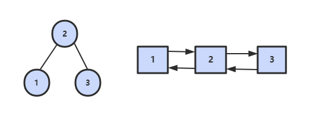

<!-- TOC -->

- [1.常用注意](#1常用注意)
    - [1） String s = String.valueOf(chars);//将字符数组转化为字符串（其他类型数组不可以）](#1-string-s--stringvalueofchars将字符数组转化为字符串其他类型数组不可以)
    - [2）char[] chars = str.toCharArray();//将字符串转化为字符数组](#2char-chars--strtochararray将字符串转化为字符数组)
    - [3） queue.offer(3); queue.poll(); queue.peek()](#3-queueoffer3-queuepoll-queuepeek)
    - [4) String[] s = str.split(" ");xstr.length() == 0;](#4-string-s--strsplit-xstrlength--0)
    - [5) likedlist.removeFirst() == likedlist.remove();linkedlist.removeLast();](#5-likedlistremovefirst--likedlistremovelinkedlistremovelast)
    - [6）private PriorityQueue<Integer> left = new PriorityQueue<>((o1, o2) -> o2 - o1);](#6private-priorityqueueinteger-left--new-priorityqueueo1-o2---o2---o1)
    - [7）Array.sort排序问题:要用Integer[]和Character[],不能用int[]和char[]](#7arraysort排序问题要用integer和character不能用int和char)
- [2. 实现 Singleton](#2-实现-singleton)
- [5. * 替换空格](#5--替换空格)
    - [题目描述](#题目描述)
    - [解题思路](#解题思路)
- [7. * 重建二叉树](#7--重建二叉树)
    - [题目描述](#题目描述-1)
    - [解题思路](#解题思路-1)
- [15. * 二进制中 1 的个数](#15--二进制中-1-的个数)
    - [题目描述](#题目描述-2)
        - [Integer.bitCount()](#integerbitcount)
- [16. *  数值的整数次方*******](#16---数值的整数次方)
    - [题目描述](#题目描述-3)
    - [解题思路](#解题思路-2)
- [22. * 链表中倒数第 K 个结点](#22--链表中倒数第-k-个结点)
    - [解题思路](#解题思路-3)
- [26. * 树的子结构](#26--树的子结构)
    - [题目描述](#题目描述-4)
    - [解题思路](#解题思路-4)
- [31. * 栈的压入、弹出序列 *******](#31--栈的压入弹出序列-)
    - [题目描述](#题目描述-5)
    - [解题思路](#解题思路-5)
- [33. * 二叉搜索树的后序遍历序列](#33--二叉搜索树的后序遍历序列)
    - [题目描述](#题目描述-6)
    - [解题思路](#解题思路-6)
- [36. * 二叉搜索树与双向链表](#36--二叉搜索树与双向链表)
    - [题目描述](#题目描述-7)
    - [解题思路](#解题思路-7)
- [34. 二叉树中和为某一值的路径](#34-二叉树中和为某一值的路径)
    - [题目描述](#题目描述-8)
    - [解题思路](#解题思路-8)
- [40. 最小的 K 个数](#40-最小的-k-个数)
    - [解题思路](#解题思路-9)
        - [快速选择算法【来源于快速排序算法】](#快速选择算法来源于快速排序算法)
        - [大小为 K 的最小堆](#大小为-k-的最小堆)
- [43. 从 1 到 n 整数中 1 出现的次数*****【未】](#43-从-1-到-n-整数中-1-出现的次数未)
    - [解题思路](#解题思路-10)
- [49. 丑数](#49-丑数)
    - [题目描述](#题目描述-9)
    - [解题思路](#解题思路-11)
- [53. * 数字在排序数组中出现的次数](#53--数字在排序数组中出现的次数)
    - [题目描述](#题目描述-10)
    - [解题思路](#解题思路-12)
- [56. 数组中只出现一次的数字](#56-数组中只出现一次的数字)
    - [题目描述](#题目描述-11)
    - [解题思路](#解题思路-13)
- [57.2 和为 S 的连续正数序列](#572-和为-s-的连续正数序列)
    - [题目描述](#题目描述-12)
    - [解题思路](#解题思路-14)
- [58.1 翻转单词顺序列](#581-翻转单词顺序列)
    - [题目描述](#题目描述-13)
    - [解题思路](#解题思路-15)
- [64. 求 1+2+3+...+n](#64-求-123n)
    - [题目描述](#题目描述-14)
    - [解题思路](#解题思路-16)
- [62. 圆圈中最后剩下的数【约瑟夫环】](#62-圆圈中最后剩下的数约瑟夫环)
    - [题目描述](#题目描述-15)
    - [解题思路](#解题思路-17)
- [65. 不用加减乘除做加法](#65-不用加减乘除做加法)
    - [题目描述](#题目描述-16)
    - [解题思路](#解题思路-18)
- [3. 数组中重复的数字](#3-数组中重复的数字)
    - [题目描述](#题目描述-17)
    - [解题思路](#解题思路-19)
- [66. 构建乘积数组](#66-构建乘积数组)
    - [题目描述](#题目描述-18)
    - [解题思路](#解题思路-20)
- [19. 正则表达式匹配](#19-正则表达式匹配)
    - [题目描述](#题目描述-19)
    - [解题思路](#解题思路-21)
- [20. 表示数值的字符串](#20-表示数值的字符串)
    - [题目描述](#题目描述-20)
    - [解题思路](#解题思路-22)
- [23. 链表中环的入口结点](#23-链表中环的入口结点)
    - [题目描述](#题目描述-21)
    - [解题思路](#解题思路-23)
- [18.2 删除链表中重复的结点](#182-删除链表中重复的结点)
    - [题目描述](#题目描述-22)
    - [解题描述](#解题描述)
- [32.3 * 按之字形顺序打印二叉树](#323--按之字形顺序打印二叉树)
    - [题目描述](#题目描述-23)
    - [解题思路](#解题思路-24)
- [41.1 数据流中的中位数](#411-数据流中的中位数)
    - [题目描述](#题目描述-24)
    - [解题思路](#解题思路-25)
- [59.*  滑动窗口的最大值](#59--滑动窗口的最大值)
    - [题目描述](#题目描述-25)
    - [解题思路](#解题思路-26)

<!-- /TOC -->
# 1.常用注意
## 1） String s = String.valueOf(chars);//将字符数组转化为字符串（其他类型数组不可以）
## 2）char[] chars = str.toCharArray();//将字符串转化为字符数组
## 3） queue.offer(3); queue.poll(); queue.peek()
## 4) String[] s = str.split(" ");xstr.length() == 0;
## 5) likedlist.removeFirst() == likedlist.remove();linkedlist.removeLast();
## 6）private PriorityQueue<Integer> left = new PriorityQueue<>((o1, o2) -> o2 - o1);
## 7）Array.sort排序问题:要用Integer[]和Character[],不能用int[]和char[]
```java
	Integer[] a = new Integer[10];
        for(int i =0 ;i<10 ;i++){
            a[i] =i;
        }
        Arrays.sort(a,(o1,o2)-> {
            return o2 - o1;
        });

        Arrays.sort(a,new Comparator<Integer>(){
            @Override
            public int compare(Integer o1, Integer o2) {
                return o2-o1;
            }
        });

        Character[] characters = new Character[10];
        for (int i=0; i<10; i++){
            characters[i] = 'a';
        }
        Arrays.sort(characters,((o1, o2) -> (""+o1+o2).compareTo(""+o2+o1));

    }
```


# 2. 实现 Singleton

[单例模式](https://github.com/CyC2018/Interview-Notebook/blob/master/notes/%E8%AE%BE%E8%AE%A1%E6%A8%A1%E5%BC%8F.md)


# 5. * 替换空格

[NowCoder](https://www.nowcoder.com/practice/4060ac7e3e404ad1a894ef3e17650423?tpId=13&tqId=11155&tPage=1&rp=1&ru=/ta/coding-interviews&qru=/ta/coding-interviews/question-ranking)

## 题目描述


将一个字符串中的空格替换成 "%20"。

```text
Input:
"We Are Happy"

Output:
"We%20Are%20Happy"
```

## 解题思路

在字符串尾部填充任意字符，使得字符串的长度等于替换之后的长度。因为一个空格要替换成三个字符（%20），因此当遍历到一个空格时，需要在尾部填充两个任意字符。

令 P1 指向字符串原来的末尾位置，P2 指向字符串现在的末尾位置。P1 和 P2 从后向前遍历，当 P1 遍历到一个空格时，就需要令 P2 指向的位置依次填充 02%（注意是逆序的），否则就填充上 P1 指向字符的值。

从后向前遍是为了在改变 P2 所指向的内容时，不会影响到 P1 遍历原来字符串的内容。

```java
public class Solution {
   public String replaceSpace(StringBuffer str) {
            int p1 = str.length()-1;
            for(int i=0; i<p1+1; i++){ //不能设置成i<str.length()
                if(str.charAt(i)==' '){
                   str.append("  ");
                }
            }

            int p2 = str.length()-1;

            while (p1>=0){
                char c = str.charAt(p1--);
                if( c == ' ' ){
                    str.setCharAt(p2--,'0');
                    str.setCharAt(p2--,'2');
                    str.setCharAt(p2--,'%');
                }else{
                    str.setCharAt(p2--,c);
                }

            }
            return str.toString();
        }

}
```
# 7. * 重建二叉树

[NowCoder](https://www.nowcoder.com/practice/8a19cbe657394eeaac2f6ea9b0f6fcf6?tpId=13&tqId=11157&tPage=1&rp=1&ru=/ta/coding-interviews&qru=/ta/coding-interviews/question-ranking)

## 题目描述

根据二叉树的前序遍历和中序遍历的结果，重建出该二叉树。假设输入的前序遍历和中序遍历的结果中都不含重复的数字。

```html
preorder = [3,9,20,15,7]
inorder =  [9,3,15,20,7]
```

<div align="center">  </div><br>

## 解题思路

前序遍历的第一个值为根节点的值，使用这个值将中序遍历结果分成两部分，左部分为树的左子树中序遍历结果，右部分为树的右子树中序遍历的结果。
* 实质就是，对先序遍历的每一个数，建立以其为根的子树
```java

public class Solution {
    int preIndex = 0;//先序数组pre的指针，对先序遍历的每个数字挨个挨个的建树
    public TreeNode reConstructBinaryTree(int [] pre,int [] in) {
        HashMap<Integer,Integer> map = new HashMap<>();
        for(int i=0; i<in.length; i++){
            map.put(in[i],i);
        }
        return process(pre,in,0,in.length-1,map);
    }

    private TreeNode process(int[] pre, int[] in, int left, int right, HashMap<Integer,Integer> map) {
        if(left>right){
            return null;
        }
        TreeNode root = new TreeNode(pre[preIndex]);
        int InIndex = map.get(pre[preIndex]);
        preIndex++;
        root.left = process(pre,in,left,InIndex-1,map);
        root.right = process(pre,in,InIndex+1,right,map);
        return root;
    }
}
```

```java

//繁杂，不建议使用
/**
 * Definition for binary tree
 * public class TreeNode {
 *     int val;
 *     TreeNode left;
 *     TreeNode right;
 *     TreeNode(int x) { val = x; }
 * }
 */
import java.util.HashMap;
import java.util.Map;

    public class Solution {
        private int preIndex = 0; 

        public TreeNode reConstructBinaryTree(int [] pre,int [] in) {
            if (pre == null || in==null || pre.length == 0 ){
                return null;
            }
            Map<Integer,Integer> mapValueToIndex = new HashMap<>();
            for (int i = 0; i<in.length; i++){  //把in数组放入map中，方便根据值来找其在in中的位置
                mapValueToIndex.put(in[i],i);
            }
            return construct(pre,in,mapValueToIndex);
        }

        private TreeNode construct(int[] pre,int[] in , Map<Integer,Integer> mapValueToIndex) {
            TreeNode head = new TreeNode(pre[preIndex]);
            preIndex++; 
            int left = mapValueToIndex.get(head.val) -1; //头结点前一个数的位置,从而得到前一个数
            int right = mapValueToIndex.get(head.val) +1; //头结点的后一个数的位置，从而得到后一个数
            mapValueToIndex.remove(head.val);//结点取出来后就从map中删除它，**位置不要放错了哈
            if ( left<0 || mapValueToIndex.get(in[left])== null){  //若head紧挨着的左边位置为空，则其左子树为空
                head.left=null;
            }else {
                head.left = construct(pre,in ,mapValueToIndex);
            }
            if (right>= in.length || mapValueToIndex.get(in[right]) == null){//若head紧挨着的右边边位置为空，则其右子树为空
                head.right=null;
            }else {
                head.right =  construct(pre,in,mapValueToIndex);
            }
            return head;
        }
    }

```

# 15. * 二进制中 1 的个数

[NowCoder](https://www.nowcoder.com/practice/8ee967e43c2c4ec193b040ea7fbb10b8?tpId=13&tqId=11164&tPage=1&rp=1&ru=/ta/coding-interviews&qru=/ta/coding-interviews/question-ranking)

## 题目描述

输入一个整数，输出该数二进制表示中 1 的个数。
* 【分析】：有两种方法
    * 1）.因为题目给出的是int类型，java中的int类型用32位表示，把这个数依次无符号右移（考虑到负数所以选择无符号右移）然后与1作与运算【即依次判断右移的每一位是不是1】。如果结果为1则count自增，代码如下：
```Java
public class Solution {
    public int NumberOf1(int n) {
        int count = 0;
        for(int i =0 ;i<32; i++){
            if(((n >>> i) & 1 ) == 1){
                count++; //
            }
        }
        return count;
    }
}
```
* 2）如果一个整数不为0，那么这个整数至少有一位是1。如果我们把这个整数减1，那么原来处在整数最右边的1就会变为0，原来在1后面的所有的0都会变成1(如果最右边的1后面还有0的话)。其余所有位将不会受到影响。也就是说，把一个整数减去1，再和原整数做与运算，会把该整数最右边一个1变成0.那么一个整数的二进制有多少个1，就可以进行多少次这样的操作。

```
n       : 10110100
n-1     : 10110011
n&(n-1) : 10110000
```

时间复杂度：O(M)，其中 M 表示 1 的个数。


```java
public class Solution {
    public int NumberOf1(int n) {
        int count = 0;
        while(n != 0){
            count++;
            n &=(n-1);
        }
        return count;
    }
}
```


### Integer.bitCount()

```java
public int NumberOf1(int n) {
    return Integer.bitCount(n);
}
```


# 16. *  数值的整数次方*******

[NowCoder](https://www.nowcoder.com/practice/1a834e5e3e1a4b7ba251417554e07c00?tpId=13&tqId=11165&tPage=1&rp=1&ru=/ta/coding-interviews&qru=/ta/coding-interviews/question-ranking)

## 题目描述

给定一个 double 类型的浮点数 base 和 int 类型的整数 exponent，求 base 的 exponent 次方。

## 解题思路
* 【分析】：要注意的问题：
    * 1 关于次幂的问题特殊的情况，比如次幂为负数，或者基数为0时等等复杂的情况
    * 2 机器中浮点数的比较是有误差的，因此double类型的比较，不能用简单的a==0来比较。一般的比较方式是，相减的差在一个很小的区间内，我们就认为是相等的。
```java
public class Solution {
   public double Power(double base, int exponent) throws Exception{
		 double mul=1.0;
		 /* 如果exponent = 0 输出1 */
	        if(exponent == 0)
	        {
	            return 1.00000;
	        }
	        /* 如果指数大于0 */
	        if(exponent > 0)
	        {
	            for(int index = 0; index < exponent; index++)//从0开始的
	            {
	                mul *= base;
	            }
	        }
	        else  //指数小于0
	        {
               /* 如果base = 0 扔出异常*/
	            if(base >= -0.000001 && base <= 0.000001){
	                throw new Exception("Error");
	            }
	            exponent = -exponent;
	            for(int index = 0; index < exponent; index++)
	            {
	                mul *= base;
	            }
	            mul = 1.0/mul;  //1.0
	        }
	        return mul;
	  }
}
```

# 22. * 链表中倒数第 K 个结点

[NowCoder](https://www.nowcoder.com/practice/529d3ae5a407492994ad2a246518148a?tpId=13&tqId=11167&tPage=1&rp=1&ru=/ta/coding-interviews&qru=/ta/coding-interviews/question-ranking)

## 解题思路

设链表的长度为 N。设两个指针 P1 和 P2 都指向head，先让 P2 移动到第 K 个节点，则 p1 就是从 p2 开始的倒数第 K 个结点。此时让 P1 和 P2 同时移动，可以知道当 P2 移动到链表结尾时，P1就是倒数第 K 个节点。

```java
/*
public class ListNode {
    int val;
    ListNode next = null;

    ListNode(int val) {
        this.val = val;
    }
}*/
public class Solution {
    public ListNode FindKthToTail(ListNode head,int k) {
        if(head == null || k <= 0){ //倒数第0个,或者链表为空，返回null
            return null;
        }
        ListNode p1 = head;
        ListNode p2 = head;
        for(int i=0; i<k-1 && p2!=null; i++){  //p2先走k-1步，则就和p1相差了k步
            p2 = p2.next;
        }
        if(p2 == null){  //说明上面结束是因为还没走那么多步数，链表已经走完，所以倒数第k个不存在
            return null;
        }
        while(p2.next != null){  //倒数第k个数存在
            p1 = p1.next;
            p2=p2.next;
        }
        return p1;  //当p2在末尾，p1就是倒数第k个结点
    }
}
```

# 26. * 树的子结构

[NowCoder](https://www.nowcoder.com/practice/6e196c44c7004d15b1610b9afca8bd88?tpId=13&tqId=11170&tPage=1&rp=1&ru=/ta/coding-interviews&qru=/ta/coding-interviews/question-ranking)

## 题目描述

输入两棵二叉树A，B，判断B是不是A的子结构。（ps：我们约定空树不是任意一个树的子结构）


## 解题思路
* A、B对应位置值相等才算B是A的子结构

```java
public class Solution {
    public boolean HasSubtree(TreeNode root1,TreeNode root2) {
        if(root1 == null || root2 == null){
            return false;
        }
        return isSubtree(root1,root2);
    }

    private boolean isSubtree(TreeNode root1, TreeNode root2) {
        if(root1 == null){
            return false;
        }
        return isEqual(root1,root2) || isSubtree(root1.left,root2)|| isSubtree(root1.right,root2);
    }

    private boolean isEqual(TreeNode root1, TreeNode root2) {
        if(root2 == null){
            return true;
        }
        if(root1 == null){
            return false;
        }
        if(root1.val != root2.val){
            return false;
        }
        return isEqual(root1.left,root2.left) && isEqual(root1.right,root2.right);
    }
}
```

# 31. * 栈的压入、弹出序列 *******

[NowCoder](https://www.nowcoder.com/practice/d77d11405cc7470d82554cb392585106?tpId=13&tqId=11174&tPage=1&rp=1&ru=/ta/coding-interviews&qru=/ta/coding-interviews/question-ranking)

## 题目描述

输入两个整数序列，第一个序列表示栈的压入顺序，请判断第二个序列是否为该栈的弹出顺序。假设压入栈的所有数字均不相等。

例如序列 1,2,3,4,5 是某栈的压入顺序，序列 4,5,3,2,1 是该压栈序列对应的一个弹出序列，但 4,3,5,1,2 就不可能是该压栈序列的弹出序列。

## 解题思路

* 【分析】：借用一个辅助的栈，遍历压栈顺序，先讲第一个放入栈中，这里是1，然后判断栈顶元素是不是出栈顺序的第一个元素，这里是4，很显然1≠4，所以我们继续压栈，直到相等以后开始出栈，出栈一个元素，则将出栈顺序向后移动一位，直到不相等，这样循环等压栈顺序遍历完成，如果辅助栈还不为空，说明弹出序列不是该栈的弹出顺序。
* 举例：栈顶元素与当前该出栈的元素不相等，则压入新的元素，直到全部压完

    * 入栈1,2,3,4,5

    * 出栈4,5,3,2,1

    * 首先1入辅助栈，此时栈顶1≠4，继续入栈2

    * 此时栈顶2≠4，继续入栈3

    * 此时栈顶3≠4，继续入栈4

    * 此时栈顶4＝4，出栈4，弹出序列向后一位，此时为5，,辅助栈里面是1,2,3

    * 此时栈顶3≠5，继续入栈5

    * 此时栈顶5=5，出栈5,弹出序列向后一位，此时为3，,辅助栈里面是1,2,3

    * ….

    * 依次执行，最后辅助栈为空。如果不为空说明弹出序列不是该栈的弹出顺序

```java

import java.util.ArrayList;
import java.util.Stack;
public class Solution {
    public boolean IsPopOrder(int [] pushA,int [] popA) {
        if(pushA.length == 0 || popA.length == 0)
            return false;
        Stack<Integer> s = new Stack<Integer>();
        //用于标识弹出序列的位置
        int popIndex = 0;
        for(int i = 0; i< pushA.length;i++){
            s.push(pushA[i]);
            //如果栈不为空，且栈顶元素等于弹出序列
            while(!s.empty() &&s.peek() == popA[popIndex]){
                //出栈
                s.pop();
                //弹出序列向后一位
                popIndex++;
            }
        }
        return s.empty(); //全部压完后在根据popA弹出，如果弹不出，说明不是该栈的弹出顺序
    }
}
```

# 33. * 二叉搜索树的后序遍历序列

[NowCoder](https://www.nowcoder.com/practice/a861533d45854474ac791d90e447bafd?tpId=13&tqId=11176&tPage=1&rp=1&ru=/ta/coding-interviews&qru=/ta/coding-interviews/question-ranking)

## 题目描述

输入一个整数数组，判断该数组是不是某二叉搜索树的后序遍历的结果。假设输入的数组的任意两个数字都互不相同。

例如，下图是后序遍历序列 1,3,2 所对应的二叉搜索树。


## 解题思路
* 【分析】：对于一个二叉树的后序遍历序列来说，最后一个数一定是根节点，然后前面的数中，从最开始到第一个大于根节点的数都是左子树中的数，而后面到倒数第二个数应该都是大于根节点的，是右子树，如果后面的数中有小于根节点的，那么说明这个序列不是二叉搜索树的后序遍历序列

```java
public boolean VerifySquenceOfBST(int[] sequence) {
    if (sequence == null || sequence.length == 0)
        return false;
    return verify(sequence, 0, sequence.length - 1);
}

private boolean verify(int[] sequence, int first, int last) {
    if (last - first <= 1)
        return true;
    int rootVal = sequence[last];
    int cutIndex = first;
    while (cutIndex < last && sequence[cutIndex] <= rootVal)
        cutIndex++;  //搜索二叉树：数组前半部分小于根，后半部分大于根
    for (int i = cutIndex; i < last; i++) //cutIndex及其之后属于右子树，搜索二叉树右子树所有节点都要大于根
        if (sequence[i] < rootVal)
            return false;
    return verify(sequence, first, cutIndex - 1) && verify(sequence, cutIndex, last - 1);
}
```

# 36. * 二叉搜索树与双向链表

[NowCoder](https://www.nowcoder.com/practice/947f6eb80d944a84850b0538bf0ec3a5?tpId=13&tqId=11179&tPage=1&rp=1&ru=/ta/coding-interviews&qru=/ta/coding-interviews/question-ranking)

## 题目描述

输入一棵二叉搜索树，将该二叉搜索树转换成一个排序的双向链表。要求不能创建任何新的结点，只能调整树中结点指针的指向。



## 解题思路
* 【分析】：搜索二叉树的中序遍历就是排序的。
* 此题或者也可以加一个队列来存，再遍历，这需要额外的空间

```java
private TreeNode pre = null;
private TreeNode head = null;

public TreeNode Convert(TreeNode root) {
    inOrder(root);
    return head;
}

private void inOrder(TreeNode node) {
    if (node == null)
        return;
    inOrder(node.left);
    node.left = pre;
    if (pre != null)
        pre.right = node;
    pre = node;
    if (head == null)
        head = node;
    inOrder(node.right);
}
```

# 34. 二叉树中和为某一值的路径

[NowCoder](https://www.nowcoder.com/practice/b736e784e3e34731af99065031301bca?tpId=13&tqId=11177&tPage=1&rp=1&ru=/ta/coding-interviews&qru=/ta/coding-interviews/question-ranking)

## 题目描述

输入一颗二叉树和一个整数，打印出二叉树中结点值的和为输入整数的所有路径。路径定义为从树的根结点开始往下一直到叶结点所经过的结点形成一条路径。

下图的二叉树有两条和为 22 的路径：10, 5, 7 和 10, 12


## 解题思路
* 【分析】：由于一条路径是由根节点出发到叶节点，也就是说路径总是以根节点为起始点，因此我们首先需要遍历根节点，只有前序是先遍历的根。
* 步骤：
    * 第一次遍历 10,5,4   19<22，因此ArrayList要使用remove函数回退到父节点5上，开始寻找右孩子。

    * 第二次遍历 10,5,7   22=22，此时正好输出这条路径（将路径添加到ArrayList中），10,5,7，回退到父节点5上，此时5的左右孩子都已遍历完成，因此回退到父节点10

    * 第三次遍历 10,12   22=22，此时正好输出这条路径（将路径添加到ArrayList中），10,12，由于12没有左右孩子，因此直接回退到父节点10

    * 由于根节点10左右孩子都已遍历完成，因此整个DFS结束。

* 需要注意的是不论路径的值是否等于输入整数值，都要回退，即使用remove函数移除路径上的最后一个节点<br>
https://blog.csdn.net/u014525494/article/details/80978647

```java
import java.util.ArrayList;
/**
public class TreeNode {
    int val = 0;
    TreeNode left = null;
    TreeNode right = null;

    public TreeNode(int val) {
        this.val = val;

    }

}
*/
public class Solution {
    ArrayList<ArrayList<Integer>> result = new ArrayList<ArrayList<Integer>>();
    ArrayList<Integer> path = new ArrayList<Integer>();
    public ArrayList<ArrayList<Integer>> FindPath(TreeNode root,int target) {
        if(root == null){
            return result;
        }
        
        findPath(root,target);
        return result;
    }
    
    private void findPath(TreeNode root,int target){
        path.add(root.val);
        target-=root.val;
        if(root.left == null && root.right == null){
            if(target == 0){
                result.add(new ArrayList<>(path)); 
            }
            //处理完一个结点及其子树后，就删掉它
            path.remove(path.size()-1);
            return;
        }
        
        if(root.left != null){
            findPath(root.left,target);
        }
        if(root.right != null){
            findPath(root.right,target);
        }
        //这个节点及其左右子树都找完了，就删掉这个节点，路径就会回到它的上一个节点
        path.remove(path.size()-1);
    }
}
```


# 40. 最小的 K 个数

[NowCoder](https://www.nowcoder.com/practice/6a296eb82cf844ca8539b57c23e6e9bf?tpId=13&tqId=11182&tPage=1&rp=1&ru=/ta/coding-interviews&qru=/ta/coding-interviews/question-ranking)

## 解题思路

### 快速选择算法【来源于快速排序算法】

- 复杂度：O(N) 
- 只有当允许修改数组元素时才可以使用

快速排序的实现：在 O(n) 的算法复杂度中找到任意第 k 大的数。『快速排序』第一趟排序之后，我们的到了一个中间索引（我们暂且称为 index），那么排在中间 index 前面的值都比 array[index] 小；同样的排序在中间 index 后面的元素都比 array[index] 大。第一趟的时间复杂度为O(n/2)。排序完之后，我们获得了两个子序列，同样根据上述的逻辑进行排序，假设当 k < index 时，那么我们就继续排序第二段比 index 小的部分。这一次的时间复杂度为O(n/4)。以此类推，当我们把 index 定位到 k 的时候，我们就会清楚的知道，在 k 以前的数字都比 array[k] 的值小。这也就快速的找到了任意 k 大的数组，时间复杂度 O(n)≈O(n/2)+O(n/4)+O(n/8)+⋯


```java
import java.util.*;
public class Solution {
    ArrayList<Integer> result = new ArrayList<Integer>();
    public ArrayList<Integer> GetLeastNumbers_Solution(int [] input, int k) {
        if(input == null || input.length == 0 || k>input.length)
            return result;
        quickSortK(input,0,input.length-1,k);  //基本是快排
        for(int i=0; i<k; i++){
            result.add(input[i]);
        }
        return result;
    }
    
    private void quickSortK(int[] arr,int L,int R,int k){
        if(L<R){
            int num = arr[L+(int)Math.random()*(R-L+1)];
            int[] p=partition(arr,L,R,num);
            if(k<p[0]){  
                quickSortK(arr,L,p[0]-1,k);
            }else if(k>p[1]){
                quickSortK(arr,p[1]+1,R,k);
            }else{  //第k大的元素在 p[0]-p[1]之间，那么就是排好了
                return;
            }
        }
    }
    
    private int[] partition(int[] arr, int L, int R,int num){
        int less = L-1;
        int more = R+1;
        int cur = L;
        while(cur < more){
            if(arr[cur] < num){
                swap(arr,++less,cur++);
            }else if(arr[cur] == num){
                cur++;
            }else{
                swap(arr,--more,cur);
            }
        }
        return new int[]{less++,more--};
    }
    
    private void swap(int[] arr, int i, int j){
        int temp =arr[i];
        arr[i] = arr[j];
        arr[j] = temp;
    }
}
```

### 大小为 K 的最小堆

- 复杂度：O(NlogK) + O(K)
- 特别适合处理海量数据

应该使用大顶堆来维护最小堆，而不能直接创建一个小顶堆并设置一个大小，企图让小顶堆中的元素都是最小元素。

维护一个大小为 K 的最小堆过程如下：在添加一个元素之后，如果大顶堆的大小大于 K，那么需要将大顶堆的堆顶元素去除。

```java
public ArrayList<Integer> GetLeastNumbers_Solution(int[] nums, int k) {
    if (k > nums.length || k <= 0)
        return new ArrayList<>();
    PriorityQueue<Integer> maxHeap = new PriorityQueue<>((o1, o2) -> o2 - o1);
    for (int num : nums) {
        maxHeap.add(num);
        if (maxHeap.size() > k)
            maxHeap.poll();
    }
    return new ArrayList<>(maxHeap);
}
```

# 43. 从 1 到 n 整数中 1 出现的次数*****【未】

[NowCoder](https://www.nowcoder.com/practice/bd7f978302044eee894445e244c7eee6?tpId=13&tqId=11184&tPage=1&rp=1&ru=/ta/coding-interviews&qru=/ta/coding-interviews/question-ranking)

## 解题思路

```java
public int NumberOf1Between1AndN_Solution(int n) {
    int cnt = 0;
    for (int m = 1; m <= n; m *= 10) {
        int a = n / m, b = n % m;
        cnt += (a + 8) / 10 * m + (a % 10 == 1 ? b + 1 : 0);
    }
    return cnt;
}
```

> [Leetcode : 233. Number of Digit One](https://leetcode.com/problems/number-of-digit-one/discuss/64381/4+-lines-O(log-n)-C++JavaPython)

# 49. 丑数

[NowCoder](https://www.nowcoder.com/practice/6aa9e04fc3794f68acf8778237ba065b?tpId=13&tqId=11186&tPage=1&rp=1&ru=/ta/coding-interviews&qru=/ta/coding-interviews/question-ranking)

## 题目描述
* 把只包含质因子2、3和5的数称作丑数（Ugly Number）。例如6、8都是丑数，但14不是，因为它包含质因子7。 习惯上我们把1当做是第一个丑数。求按从小到大的顺序的第N个丑数。

## 解题思路
* 【分析】：
    * 质因子：在不参考排列的顺序的情况下，每个整数都能够以唯一的方式表示成为它的质因数的乘积。   
    * 所以丑数一定能表示成为若干个2，3，5的乘积，所以某位置的丑数应该是该位置前面的某个丑数乘以 2、3、5的结果。【用这种方式我们就可以不在非丑数的整数上花时间了】
    * 如何找下一个丑数： 因为我们的结果数组是按顺序生成的，把已有的最大的丑数记为 M 
        * 首先将已有的每个丑数乘以2，会得到若干个大于 M 的结果，但我们只需要第一个大于 M 的结果记为 M2 【因为小于或等于 M 的肯定已经在数组中了】
        * 将已有的每个丑数乘以3，会得到若干个大于 M 的结果，但我们只需要第一个大于 M 的结果记为 M3
        * 将已有的每个丑数乘以5，会得到若干个大于 M 的结果，但我们只需要第一个大于 M 的结果记为 M5
        * 那么下一个丑数应该是 M2 M3 M5 这三个数中的最小者
    * 改进：
        * 并不需要把已有的每个丑数分别 乘以2、3、5,只需要记住三个位置 t2 t3 t5，并在每次生成新的丑数的时候去更新它们即可。
        * 因为丑数是按顺序的，所以对于乘以2，肯定存在某个位置 t2，排在它之前的丑数乘以 2 都会小于已有的最大丑数 M ，在它之后的每个丑数乘以 2得到的结果都会太大。 

```java
import java.util.*;
public class Solution {
    public int GetUglyNumber_Solution(int index) {
        if(index<=0){
            return 0;
        }
        int[] result = new int[index];
        result[0] = 1;
        int t2 = 0; //t2位置之前的所有数 *2 都会小于最后一个数
        int t3 = 0; //同上，*3
        int t5 = 0;//同上 ，*5
        for(int i = 1 ; i< index; i++){
            int min= Math.min(Math.min(result[t2]*2,result[t3]*3),result[t5]*5);
            result[i] = min;
            while(result[t2]*2 <= min){
                t2++; //排在它之前的丑数乘以 2 都会小于已有的最大丑数 M ，在它之后的每个丑数乘以 2得到的结果都会太大。 
            }
            while(result[t3] *3 <=min ){
                t3++;
            }
            while(result[t5] *5 <= min){
                t5++;
            }
        }
        return result[index-1];
    } 
}
```

# 53. * 数字在排序数组中出现的次数

[NowCoder](https://www.nowcoder.com/practice/70610bf967994b22bb1c26f9ae901fa2?tpId=13&tqId=11190&tPage=1&rp=1&ru=/ta/coding-interviews&qru=/ta/coding-interviews/question-ranking)

## 题目描述

```html
Input:
nums = 1, 2, 3, 3, 3, 3, 4, 6
K = 3

Output:
4
```

## 解题思路

```java
public int GetNumberOfK(int[] nums, int K) {
    int first = binarySearch(nums, K);
    int last = binarySearch(nums, K + 1);
    return (first == nums.length || nums[first] != K) ? 0 : last - first;
}

private int binarySearch(int[] nums, int K) {
    int l = 0, h = nums.length;
    while (l < h) {
        int m = l + (h - l) / 2;
        if (nums[m] >= K)
            h = m;
        else
            l = m + 1;
    }
    return l;
}
```


# 56. 数组中只出现一次的数字

[NowCoder](https://www.nowcoder.com/practice/e02fdb54d7524710a7d664d082bb7811?tpId=13&tqId=11193&tPage=1&rp=1&ru=/ta/coding-interviews&qru=/ta/coding-interviews/question-ranking)

## 题目描述

一个整型数组里除了两个数字之外，其他的数字都出现了两次，找出这两个数。

## 解题思路

* 【 分析】：
    * 先考虑一个数组里只有一个数出现一次，其他两个数都出现两次的情况：一个数跟自己异或后为0，一个数组里只有一个数出现一次其他两次，挨个异或后最后得到的结果就是只出现一次的那个数。
    * 我们把这个数组分为两部分，每部分只有一个数只出现一次：我们分的时候，把所有数都异或后，得到的结果肯定不为0，其实是那两个只出现一次的不同的数的异或，我们从低位到高位找到第一个不为0的那位，异或后这两个数的这位上肯定是一个为1一个为0，所以我们根据这位将整个数组分为两部分，这位上为1的和这位上为0的，这样就保证这两个只出现一次的数会被分到两个部分中，然后每部分按只有一个只出现一次的方法解决即可。


```java
//num1,num2分别为长度为1的数组。传出参数
//将num1[0],num2[0]设置为返回结果
public class Solution {
    public void FindNumsAppearOnce(int [] arr,int num1[] , int num2[]) {
        if(arr == null || arr.length<2){
            return;
        }
        int temp = 0;
        for(int i =0;i<arr.length; i++){
            temp ^=arr[i];
        }
        int firstBit =0;
        while((temp & 1)==0 && firstBit <32){ //是temp&1,而不是temp &=1
            firstBit++;
            temp=temp>>>1;
        }
        //分成两个数组分别找只出现一次的数字
        temp = 1<<firstBit;
        for(int i = 0;i<arr.length; i++){
            if((arr[i] & temp) == 0){ //firstBit位为 0 的那一组数字
                num1[0] ^=arr[i];
            }else{
                num2[0] ^=arr[i];
            }
        }
        
    }
}
```


# 57.2 和为 S 的连续正数序列

[NowCoder](https://www.nowcoder.com/practice/c451a3fd84b64cb19485dad758a55ebe?tpId=13&tqId=11194&tPage=1&rp=1&ru=/ta/coding-interviews&qru=/ta/coding-interviews/question-ranking)

## 题目描述

输出所有和为 S 的连续正数序列。

例如和为 100 的连续序列有：

```
[9, 10, 11, 12, 13, 14, 15, 16]
[18, 19, 20, 21, 22]。
```

## 解题思路
* 【分析】设定两个指针，一个指向第一个数，一个指向最后一个数，在此之前需要设定第一个数和最后一个数的值，由于是正数序列，所以可以把第一个数设为1，最后一个数为2（因为是要求是连续正数序列，最后不可能和第一个数重合）。下一步就是不断改变第一个数和最后一个数的值，如果从第一个数到最后一个数的和刚好是要求的和，那么把所有的数都添加到一个序列中；如果大于要求的和，则说明从第一个数到最后一个数之间的范围太大，因此减小范围，需要把第一个数的值加1，同时把当前和减去原来的第一个数的值；如果小于要求的和，说明范围太小，因此把最后一个数加1，同时把当前的和加上改变之后的最后一个数的值。这样，不断修改第一个数和最后一个数的值，就能确定所有连续正数序列的和等于S的序列了。

```java
import java.util.ArrayList;
public class Solution {
    private  ArrayList<ArrayList<Integer> > res = new ArrayList<ArrayList<Integer>>();
    public ArrayList<ArrayList<Integer> > FindContinuousSequence(int sum) {
       if(sum < 3)
           return res;
        int small = 1;
        int big = 2;
        int mid = (sum+1)/2;  
        //设置mid变量的原因在于如果在当前总和小于sum的情况下，
        //small在增加到sum的一半的过程中肯定会大于sum
        //因为序列是至少2个数，所以2*mid>=sum,mid+(mid+1)>sum，所以只需要small增加到mid即可
        int total = 1+2;
        while(small < mid){
            if(total == sum){ //等于，则往右移动
                res.add(sequence(small,big));
                big++;
                total+=big;
            }else if(total > sum){//大于，则对序列减少数字
                total-=small;
                small++;
            }else{  //小于，则对序列增加数字
                big++;
                total+=big;
            }
        }
        return res;
        
    }
    
    private ArrayList<Integer> sequence(int small,int big){
        ArrayList<Integer> temp = new ArrayList<>();
        for(;small <= big;small++){
            temp.add(small);
        }
        return temp;
    }
}
```
# 58.1 翻转单词顺序列

[NowCoder](https://www.nowcoder.com/practice/3194a4f4cf814f63919d0790578d51f3?tpId=13&tqId=11197&tPage=1&rp=1&ru=/ta/coding-interviews&qru=/ta/coding-interviews/question-ranking)

## 题目描述

```html
Input:
"I am a student."

Output:
"student. a am I"
```

## 解题思路

题目应该有一个隐含条件，就是不能用额外的空间。虽然 Java 的题目输入参数为 String 类型，需要先创建一个字符数组使得空间复杂度为 O(N)，但是正确的参数类型应该和原书一样，为字符数组，并且只能使用该字符数组的空间。任何使用了额外空间的解法在面试时都会大打折扣，包括递归解法。

正确的解法应该是和书上一样，
* 1)先旋转每个单词，
* 2)再旋转整个字符串。

```java
public class Solution {
    public String ReverseSentence(String str) {
        if(str == null){
            return null;
        }
        char[] chars = str.toCharArray();
        int n = chars.length;
        int i=0,j=0;
        while(i< n ){
            if(j==n || chars[j] == ' '){
                reverse(chars,i,j-1);
                i=j+1;  //****不是i=j
            }
            j++;
        }
        reverse(chars,0,n-1);
        return String.valueOf(chars);
    }
    
    private void reverse(char[] chars,int i,int j){
        while(i<j){
            swap(chars,i,j);
            i++;
            j--;
        }
    }
    
    private void swap(char[] chars,int i,int j){
        char temp = chars[i];
        chars[i] =chars[j];
        chars[j] = temp;
    }
}
```
# 64. 求 1+2+3+...+n

[NowCoder](https://www.nowcoder.com/practice/7a0da8fc483247ff8800059e12d7caf1?tpId=13&tqId=11200&tPage=1&rp=1&ru=/ta/coding-interviews&qru=/ta/coding-interviews/question-ranking)

## 题目描述

要求不能使用乘除法、for、while、if、else、switch、case 等关键字及条件判断语句 A ? B : C。

## 解题思路

使用递归解法最重要的是指定返回条件，但是本题无法直接使用 if 语句来指定返回条件。

条件与 && 具有短路原则，即在第一个条件语句为 false 的情况下不会去执行第二个条件语句。利用这一特性，将递归的返回条件取非然后作为 && 的第一个条件语句，递归的主体转换为第二个条件语句，那么当递归的返回条件为 true 的情况下就不会执行递归的主体部分，递归返回。

本题的递归返回条件为 n <= 0，取非后就是 n > 0；递归的主体部分为 sum += Sum_Solution(n - 1)，转换为条件语句后就是 (sum += Sum_Solution(n - 1)) > 0。

```java
public int Sum_Solution(int n) {
    int sum = n;
    boolean b = (n > 0) && ((sum += Sum_Solution(n - 1)) > 0);
    return sum;
}
```

# 62. 圆圈中最后剩下的数【约瑟夫环】

[NowCoder](https://www.nowcoder.com/practice/f78a359491e64a50bce2d89cff857eb6?tpId=13&tqId=11199&tPage=1&rp=1&ru=/ta/coding-interviews&qru=/ta/coding-interviews/question-ranking)

## 题目描述
约瑟夫环是一个数学的应用问题：已知n个人（以编号0,1，2，3...n-1分别表示）围坐在一张圆桌周围。从编号为k的人开始报数，数到m的那个人出列；他的下一个人又从1开始报数，数到m的那个人又出列；依此规律重复下去，直到圆桌周围的人全部出列。

## 解题思路
https://www.liangzl.com/get-article-detail-14811.html
* 方法一：通过数组循环实现：通过一个数组，数组中每个元素都是一个人，然后对数组进行循环处理，每当数组中的人数到m时，将其标记为淘汰。直到最后数组中只有一个人未被淘汰。
```java
public class Solution {
    public int LastRemaining_Solution(int n, int m) {
        boolean[] flag = new boolean[n]; //n个人有没有出局的状态，为true表示已经不在了
        int count = 0; //表示这是第几个报数的
        int peopleLeft = n; //表示圈子里还剩下多少人
        int index =0; //数组遍历的下标
        while (peopleLeft > 1){ //我们要留下最后一个人
            if(flag[index] == false){ //如果这个人还存在，他就可以报数了
                count++;  //他是第几个报数
                if(count == m){  //第m个，那么就是他淘汰
                    count = 0;
                    flag[index] = true;
                    peopleLeft--; //还存在的人少了一个
                }
            }
            if(++index == n){ //++index，是下一个尝试报数的人的下标
                index = 0;
            }
        }
        for(int i=0; i<n; i++){
            if(flag[i] == false){
                return i;
            }
        }
        return -1;
    }
}
```
* 方法二：基于LinkedList链表来实现 *****建议使用，空间时间消耗更少
```java
public class Solution {
    public int LastRemaining_Solution(int n, int m) {
        if(n<=0 || m<=0){
            return -1;
        }
        List<Integer> list = new LinkedList<>();
        for(int i= 0; i<n; i++){
            list.add(i); //链表里存放的是活着的人，i表示活着的人的标号
        }
        int index=0;
        int count =0;
        while (list.size()>1){
            if(++count == m){ //count表示这是第几个报数了
                list.remove(index);   //这是第m个报数的人，要把他去除
                index--;
                count=0;
            }
            index++; //下一个要报数的下标。
            if(index == list.size()){
                index = 0;
            }
        }
        return list.get(0);
    }
}
```

* 方法三：综上，约瑟夫环的公式是： 
f(n, m) = 0           (n = 1) 
f(n, m) = [f(n-1, m) +m] % n  (n > 1)
```java
public int LastRemaining_Solution(int n, int m) {
    if (n == 0)     /* 特殊输入的处理 */
        return -1;
    if (n == 1)     /* 递归返回条件 */
        return 0;
    return (LastRemaining_Solution(n - 1, m) + m) % n;
}
```
# 65. 不用加减乘除做加法

[NowCoder](https://www.nowcoder.com/practice/59ac416b4b944300b617d4f7f111b215?tpId=13&tqId=11201&tPage=1&rp=1&ru=/ta/coding-interviews&qru=/ta/coding-interviews/question-ranking)

## 题目描述

写一个函数，求两个整数之和，要求不得使用 +、-、\*、/ 四则运算符号。

## 解题思路
* 【分析】：
    * 首先看十进制是如何做的： 5+7=12，三步走
        * 第一步：相加各位的值，不算进位，得到2。
        * 第二步：计算进位值，得到10. 如果这一步的进位值为0，那么第一步得到的值就是最终结果。
        * 第三步：重复上述两步，只是相加的值变成上述两步的得到的结果2和10，得到12。

    * 同样我们可以用三步走的方式计算二进制值相加： 5-101，7-111 
        * 第一步：相加各位的值，不算进位，得到010，二进制每位相加就相当于各位做异或操作，101^111。

        * 第二步：计算进位值，得到1010，相当于各位做与操作得到101，再向左移一位得到1010，(101&111)<<1。

        * 第三步重复上述两步， 各位相加 010^1010=1000，进位值为100=(010&1010)<<1。
        *  继续重复上述两步：1000^100 = 1100，进位值为0，跳出循环，1100为最终结果。

```java

 
public class Solution {
    public int Add(int num1,int num2) {
        while (num2!=0) {
            int temp = num1^num2;//不带进位的加
            num2 = (num1&num2)<<1;//进位
            num1 = temp;
        }
        return num1;
    }


```
# 3. 数组中重复的数字

[NowCoder](https://www.nowcoder.com/practice/623a5ac0ea5b4e5f95552655361ae0a8?tpId=13&tqId=11203&tPage=1&rp=1&ru=/ta/coding-interviews&qru=/ta/coding-interviews/question-ranking)

## 题目描述

在一个长度为 n 的数组里的所有数字都在 0 到 n-1 的范围内。数组中某些数字是重复的，但不知道有几个数字是重复的，也不知道每个数字重复几次。请找出数组中任意一个重复的数字。

```html
Input:
{2, 3, 1, 0, 2, 5}

Output:
2
```

## 解题思路

要求复杂度为 O(N) + O(1)，也就是时间复杂度 O(N)，空间复杂度 O(1)。因此不能使用排序的方法，也不能使用额外的标记数组。

这种数组元素在 [0, n-1] 范围内的问题，可以将值为 i 的元素调整到第 i 个位置上。

以 (2, 3, 1, 0, 2, 5) 为例：

```text
position-0 : (2,3,1,0,2,5) // 2 <-> 1
             (1,3,2,0,2,5) // 1 <-> 3
             (3,1,2,0,2,5) // 3 <-> 0
             (0,1,2,3,2,5) // already in position
position-1 : (0,1,2,3,2,5) // already in position
position-2 : (0,1,2,3,2,5) // already in position
position-3 : (0,1,2,3,2,5) // already in position
position-4 : (0,1,2,3,2,5) // nums[i] == nums[nums[i]], exit
```

遍历到位置 4 时，该位置上的数为 2，但是第 2 个位置上已经有一个 2 的值了，因此可以知道 2 重复。
* 【分析】：虽然代码中有一个两重循环，但每个数字最多只要交换两次就能找到属于它的位置，因此总的时间复杂度是O(n)。不断把当前位置的数放到它应该去的位置，如果它应该去的位置已经有相同的占用了，则说明true

```java
public boolean duplicate(int[] nums, int length, int[] duplication) {
    if (nums == null || length <= 0)
        return false;
    for (int i = 0; i < length; i++) {
        while (nums[i] != i) {
            if (nums[i] == nums[nums[i]]) {
                duplication[0] = nums[i];
                return true;
            }
            swap(nums, i, nums[i]);
        }
    }
    return false;
}

private void swap(int[] nums, int i, int j) {
    int t = nums[i];
    nums[i] = nums[j];
    nums[j] = t;
}
```

# 66. 构建乘积数组

[NowCoder](https://www.nowcoder.com/practice/94a4d381a68b47b7a8bed86f2975db46?tpId=13&tqId=11204&tPage=1&rp=1&ru=/ta/coding-interviews&qru=/ta/coding-interviews/question-ranking)

## 题目描述

给定一个数组 A[0, 1,..., n-1]，请构建一个数组 B[0, 1,..., n-1]，其中 B 中的元素 B[i]=A[0]\*A[1]\*...\*A[i-1]\*A[i+1]\*...\*A[n-1]。要求不能使用除法。

## 解题思路
* 【分析}：可以把B[i]=A[0]*A[1]*.....*A[i-1]*A[i+1]*.....*A[n-1].看成A[0]*A[1]*.....*A[i-1]和
A[i+1]*.....A[n-2]*A[n-1]两部分的乘积。因此，数组B可以用一个矩阵来创建。在图中，B[i]为矩阵中第i行所有元素的乘积.
![]{https://images2015.cnblogs.com/blog/947994/201604/947994-20160430170929925-1177273395.png}

```java
public int[] multiply(int[] A) {
    int n = A.length;
    int[] B = new int[n];
    for (int i = 0, product = 1; i < n; product *= A[i], i++)       /* 从左往右累乘 */
        B[i] = product;
    for (int i = n - 1, product = 1; i >= 0; product *= A[i], i--)  /* 从右往左累乘 */
        B[i] *= product;
    return B;
}
```


# 19. 正则表达式匹配

[NowCoder](https://www.nowcoder.com/practice/45327ae22b7b413ea21df13ee7d6429c?tpId=13&tqId=11205&tPage=1&rp=1&ru=/ta/coding-interviews&qru=/ta/coding-interviews/question-ranking)

## 题目描述

请实现一个函数用来匹配包括 '.' 和 '\*' 的正则表达式。模式中的字符 '.' 表示任意一个字符，而 '\*' 表示它前面的字符可以出现任意次（包含 0 次）。

在本题中，匹配是指字符串的所有字符匹配整个模式。例如，字符串 "aaa" 与模式 "a.a" 和 "ab\*ac\*a" 匹配，但是与 "aa.a" 和 "ab\*a" 均不匹配。

## 解题思路
* 【分析】：递归实现：每次分别在str 和pattern中取一个字符进行匹配，如果匹配，则匹配下一个字符，否则，返回不匹配。
    * 如果模式匹配字符的第二个字符是‘*’:
        * 如果pttern当前字符和str的当前字符匹配，：有以下三种可能情况
            * （1）pttern当前字符能匹配 str 中的 0 个字符：match(str, pattern+2)
            * （2）pttern当前字符能匹配 str 中的 1 个字符：match(str+1, pattern+2)
            * （3）pttern当前字符能匹配 str 中的 多 个字符：match(str+1, pattern)
        * 如果pttern当前字符和和str的当前字符不匹配，则跳过：match(str, pattern+2)
    * 如果模式匹配字符的第二个字符不是‘*’，进行逐字符匹配。

```java
public class Solution {
    public boolean match(char[] str, char[] pattern)
    {
        if(str==null || pattern == null){
            return false;
        }
        return match(str,0,pattern,0);  //从0位置开始匹配
    }
    
    private boolean match(char[] str,int s,char[] pattern,int p){
        if(s>=str.length && p>=pattern.length){ //情况一：s:空，pattern：空
            return true;  //匹配完了
        }
        if(s < str.length && p>=pattern.length){  //情况二：s:不空，pattern：空
            return false;  //模式已经走完了，字符串却还剩，就无法匹配了
        }
        //剩下要匹配的字符串的第二个字符是 *
        if(p+1 < pattern.length && pattern[p+1] == '*'){ 
            //情况三：s:空，pattern：不空
            if(s >=str.length){   //“” 和 “任意字符*”是匹配的
                return match(str,s,pattern,p+2);  
            }
            //情况四：s:不空，pattern：不空，进行正常的比较
            if(str[s] == pattern[p] || pattern[p] == '.'){ 
                return match(str,s,pattern,p+2)|| //选择匹配0个，留给后面匹配
                    match(str,s+1,pattern,p+2)|| //选择只匹配1个
                    match(str,s+1,pattern,p);  //选择匹配一个及以上，继续用他来匹配
            }else{
                return match(str,s,pattern,p+2); //无法匹配，所以跳过
            }
        }else{ //第二个字符不是 * ，就可以正常来判断匹配与否
            if(s >= str.length && p<pattern.length){  //情况三：s:空，pattern：不空
                return false;   
            }
            //情况四：s:不空，pattern：不空，进行正常的比较
            if(str[s] == pattern[p] || pattern[p] == '.'){ 
                return match(str,s+1,pattern,p+1);
            }else{
                return false;
            }
        }
    }
}
```

# 20. 表示数值的字符串

[NowCoder](https://www.nowcoder.com/practice/6f8c901d091949a5837e24bb82a731f2?tpId=13&tqId=11206&tPage=1&rp=1&ru=/ta/coding-interviews&qru=/ta/coding-interviews/question-ranking)

## 题目描述

```html
true

"+100"
"5e2"
"-123"
"3.1416"
"-1E-16"

false

"12e"
"1a3.14"
"1.2.3"
"+-5"
"12e+4.3"
```


## 解题思路

使用正则表达式进行匹配。

```html
[]  ： 字符集合
()  ： 分组
?   ： 有或无
+   ： 重复 1 ~ n
*   ： 重复 0 ~ n
.   ： 任意字符
\\. ： 转义后的 .
\\d ： 数字
```

```java
public boolean isNumeric(char[] str) {
    if (str == null || str.length == 0)
        return false;
    return new String(str).matches("[+-]?\\d*(\\.\\d+)?([eE][+-]?\\d+)?");
}
```

* 非正则表达式的方法
```java
public class Solution {
    public boolean isNumeric(char[] str) {
           if(str == null || str.length ==0){
               return false;
           } 
        int i =scanIntegerSign(str,0);  //进行带符号的整数扫描，得到下一个不是整数的位置
        //下一个字符是 ‘.’
        if(i<str.length && str[i] =='.'){  
            i=scanInteger(str,i+1);  //扫描小数点后面的整数，有没有都可以
            if(i<str.length && (str[i] =='e' || str[i] =='E')){  //判断是否有指数
                if(i+1<str.length){
                    i= scanIntegerSign(str,i+1);
                }else{
                    return false;
                }
                
            }
        }
        //下一个字符是'e,E'
        if(i<str.length && (str[i] =='e' || str[i] =='E')){
            if(i+1<str.length){ //以e或E结尾我们认为是错误的
                i= scanIntegerSign(str,i+1);
            }else{
                return false;
            }
            
        }
        if(i<str.length){//字符串没有正常扫描完，说明有不符合的地方
            return false;
        }else{
            return true;  //整个字符串正常扫描完
        }
        
    }
    

    //进行带符号的整数扫描，直到扫到不是整数的位置，我们认为只有+ 或 - 是可以的
    private int scanIntegerSign(char[] str,int i){
        if(i<str.length){
            if(str[i] =='-' || str[i]=='+'){
                i++;
            }
            while(i<str.length && ((str[i]-'0')>=0 && (str[i]-'0')<=9)){
                i++;
            } 
        }
        return i;
    }
    
    //进行不带符号的整数扫描，扫描到不是整数的位置
    private int scanInteger(char[] str,int i){
        while(i<str.length && ((str[i]-'0')>=0 && (str[i]-'0')<=9)){
            i++;
        }
        return i;
    }
}
```

# 23. 链表中环的入口结点

[NowCoder](https://www.nowcoder.com/practice/253d2c59ec3e4bc68da16833f79a38e4?tpId=13&tqId=11208&tPage=1&rp=1&ru=/ta/coding-interviews&qru=/ta/coding-interviews/question-ranking)

## 题目描述

一个链表中包含环，请找出该链表的环的入口结点。要求不能使用额外的空间。

## 解题思路
* 【分析】：
    * 第一步，找环中相汇点。分别用p1，p2指向链表头部，p1每次走一步，p2每次走二步，直到p1==p2找到在环中的相汇点。
    * 第二步，找环的入口。接上步，当p1==p2时，p2所经过节点数为2x,p1所经过节点数为x,设环中有n个节点,p2比p1多走一圈有2x=n+x; n=x;可以看出p1实际走了一个环的步数，再让p2指向链表头部，p1位置不变，p1,p2每次走一步直到p1==p2; 此时p1指向环的入口。


```java
public class Solution {

    public ListNode EntryNodeOfLoop(ListNode head)
    {
        if(head == null || head.next == null){
            return null;
        }
        ListNode p1=head,p2=head;
        while(p2!=null && p2.next!=null){
            p1=p1.next;
            p2=p2.next.next;
            if(p1 == p2){   //找到二者在环中的相会点
                p2 =head;
                while(p1!= p2){
                    p2 = p2.next;
                    p1 = p1.next;
                }
                return p1;
            }
        }
        return null;
               
    }
}
```

# 18.2 删除链表中重复的结点

[NowCoder](https://www.nowcoder.com/practice/fc533c45b73a41b0b44ccba763f866ef?tpId=13&tqId=11209&tPage=1&rp=1&ru=/ta/coding-interviews&qru=/ta/coding-interviews/question-ranking)

## 题目描述

<div align="center">  </div><br>

## 解题描述

```java
/*
 public class ListNode {
    int val;
    ListNode next = null;

    ListNode(int val) {
        this.val = val;
    }
}
*/
public class Solution {
    public ListNode deleteDuplication(ListNode head)
    {
        if(head ==null || head.next == null){  //个数小于2个，直接返回
            return head;
        }
        ListNode pre=null,cur=head; //pre 记录前一个不重复的节点
        head = null;
        //依次判断 cur 是不是重复的数字，cur 前面的已经判断过了
        while(cur!=null){ 
            if(cur.next !=null && cur.next.val == cur.val){//至少还有两个数，并且相等，它们才重复
                int val = cur.val;
                while(cur !=null && cur.val == val){ //得到下一个需要判断的数
                    cur = cur.next;   
                }
            }else{  //只剩下一个数或者数字不重复，那么这个数就要被选中
                if(pre ==null){  //第一次出现不重复的数
                    head = cur;
                    pre = cur;
                    cur = cur.next;
                    pre.next =null;  
                    //要断开我们已经形成的不重复的数和下面未进行判断的数的连接，不然它们实际还是连在一起的
                }else{
                    pre.next = cur;
                    pre = cur;
                    cur = cur.next; //下一个需要判断的数
                    pre.next =null; //***
                }
            }
        }
        return head;
    }
}
```

# 32.3 * 按之字形顺序打印二叉树

[NowCoder](https://www.nowcoder.com/practice/91b69814117f4e8097390d107d2efbe0?tpId=13&tqId=11212&tPage=1&rp=1&ru=/ta/coding-interviews&qru=/ta/coding-interviews/question-ranking)

## 题目描述

请实现一个函数按照之字形打印二叉树，即第一行按照从左到右的顺序打印，第二层按照从右至左的顺序打印，第三行按照从左到右的顺序打印，其他行以此类推。

## 解题思路

```java
public class Solution {
    ArrayList<ArrayList<Integer>> res = new ArrayList<ArrayList<Integer> >();
    public ArrayList<ArrayList<Integer> > Print(TreeNode root) {
        if(root == null){
            return res;
        }
        Stack<TreeNode> s1 = new Stack<>();
        Stack<TreeNode> s2 = new Stack<>();
        s1.push(root);
        while(!s1.isEmpty() || !s2.isEmpty()){
            if(!s1.isEmpty()){
                ArrayList<Integer> temp = new ArrayList<>();
                while(!s1.isEmpty()){
                    TreeNode node = s1.pop();
                    temp.add(node.val);
                    if(node.left != null){
                        s2.push(node.left);
                    }
                    if(node.right !=null){
                        s2.push(node.right);
                    }
                }
                res.add(temp);
            }else{
                ArrayList<Integer> temp = new ArrayList<>();
                while(!s2.isEmpty()){
                    TreeNode node = s2.pop();
                    temp.add(node.val);
                    if(node.right!= null){
                        s1.push(node.right);
                    }
                    if(node.left !=null){
                        s1.push(node.left);
                    }
                }
                res.add(temp);
            }
        }
          return res;
    }

}
```


# 41.1 数据流中的中位数

[NowCoder](https://www.nowcoder.com/practice/9be0172896bd43948f8a32fb954e1be1?tpId=13&tqId=11216&tPage=1&rp=1&ru=/ta/coding-interviews&qru=/ta/coding-interviews/question-ranking)

## 题目描述

如何得到一个数据流中的中位数？如果从数据流中读出奇数个数值，那么中位数就是所有数值排序之后位于中间的数值。如果从数据流中读出偶数个数值，那么中位数就是所有数值排序之后中间两个数的平均值。

## 解题思路

```java
/* 大顶堆，存储左半边元素 */
private PriorityQueue<Integer> left = new PriorityQueue<>((o1, o2) -> o2 - o1);
/* 小顶堆，存储右半边元素，并且右半边元素都大于左半边 */
private PriorityQueue<Integer> right = new PriorityQueue<>();
/* 当前数据流读入的元素个数 */
private int N = 0;

public void Insert(Integer val) {
    /* 插入要保证两个堆存于平衡状态 */
    if (N % 2 == 0) {
        /* N 为偶数的情况下插入到右半边。
         * 因为右半边元素都要大于左半边，但是新插入的元素不一定比左半边元素来的大，
         * 因此需要先将元素插入左半边，然后利用左半边为大顶堆的特点，取出堆顶元素即为最大元素，此时插入右半边 */
        left.add(val);
        right.add(left.poll());
    } else {
        right.add(val);
        left.add(right.poll());
    }
    N++;
}

public Double GetMedian() {
    if (N % 2 == 0)
        return (left.peek() + right.peek()) / 2.0;  //***记得是2.0
    else
        return (double) right.peek();  //****要加double,而非Double
}
```

# 59.*  滑动窗口的最大值

[NowCoder](https://www.nowcoder.com/practice/1624bc35a45c42c0bc17d17fa0cba788?tpId=13&tqId=11217&tPage=1&rp=1&ru=/ta/coding-interviews&qru=/ta/coding-interviews/question-ranking)

## 题目描述

给定一个数组和滑动窗口的大小，找出所有滑动窗口里数值的最大值。

例如，如果输入数组 {2, 3, 4, 2, 6, 2, 5, 1} 及滑动窗口的大小 3，那么一共存在 6 个滑动窗口，他们的最大值分别为 {4, 4, 6, 6, 6, 5}。

## 解题思路

```java
public ArrayList<Integer> maxInWindows(int[] num, int size) {
    ArrayList<Integer> ret = new ArrayList<>();
    if (size > num.length || size < 1)   //***不要忘了size<1的判断
        return ret;
    PriorityQueue<Integer> heap = new PriorityQueue<>((o1, o2) -> o2 - o1);  /* 大顶堆 */
    for (int i = 0; i < size; i++)  
        heap.add(num[i]);
    ret.add(heap.peek());
    for (int i = 0, j = i + size; j < num.length; i++, j++) {            /* 维护一个大小为 size 的大顶堆 */
        heap.remove(num[i]);  //*****i得从0开始哈
        heap.add(num[j]);
        ret.add(heap.peek());
    }
    return ret;
}
```
