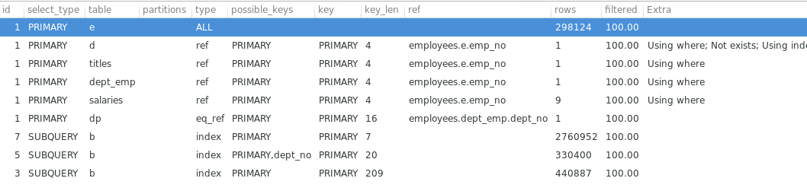
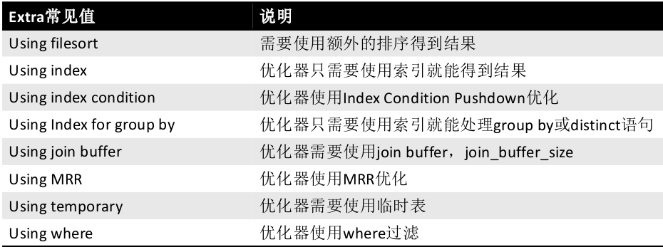

MySQL学习笔记（Day017：Explain_2）
=========================================================
@(MySQL学习)

[TOC]

## 一. 作业解析
* **哪张原数据表中记录了Cardinality信息**

```sql
--
-- 在information_schema.STATISTICS中记录了相关的信息
--
mysql> use information_schema;
Database changed

mysql> show create table STATISTICS\G
*************************** 1. row ***************************
       Table: STATISTICS
Create Table: CREATE TEMPORARY TABLE `STATISTICS` (
  `TABLE_CATALOG` varchar(512) NOT NULL DEFAULT '',
  `TABLE_SCHEMA` varchar(64) NOT NULL DEFAULT '',  -- 表所在的库
  `TABLE_NAME` varchar(64) NOT NULL DEFAULT '',  -- 表名
  `NON_UNIQUE` bigint(1) NOT NULL DEFAULT '0',
  `INDEX_SCHEMA` varchar(64) NOT NULL DEFAULT '', 
  `INDEX_NAME` varchar(64) NOT NULL DEFAULT '',  -- 索引名
  `SEQ_IN_INDEX` bigint(2) NOT NULL DEFAULT '0', -- 索引的序号
  `COLUMN_NAME` varchar(64) NOT NULL DEFAULT '',
  `COLLATION` varchar(1) DEFAULT NULL,
  `CARDINALITY` bigint(21) DEFAULT NULL,   -- 这里我们找到了Cardinality
  `SUB_PART` bigint(3) DEFAULT NULL,
  `PACKED` varchar(10) DEFAULT NULL,
  `NULLABLE` varchar(3) NOT NULL DEFAULT '',
  `INDEX_TYPE` varchar(16) NOT NULL DEFAULT '',
  `COMMENT` varchar(16) DEFAULT NULL,
  `INDEX_COMMENT` varchar(1024) NOT NULL DEFAULT ''
) ENGINE=MEMORY DEFAULT CHARSET=utf8
1 row in set (0.00 sec)


--
-- 之前我们可以通过 show index from table_name的方式查看索引
--

mysql>  show index from employees.salaries\G
*************************** 1. row ***************************
        Table: salaries
   Non_unique: 0
     Key_name: PRIMARY
 Seq_in_index: 1       -- 索引序号为1
  Column_name: emp_no
    Collation: A
  Cardinality: 286271  -- Cardinality值
     Sub_part: NULL
       Packed: NULL
         Null: 
   Index_type: BTREE
      Comment: 
Index_comment: 
*************************** 2. row ***************************
        Table: salaries
   Non_unique: 0
     Key_name: PRIMARY
 Seq_in_index: 2         -- 索引序号为2
  Column_name: from_date
    Collation: A
  Cardinality: 2760952   -- Cardinality值
     Sub_part: NULL
       Packed: NULL
         Null: 
   Index_type: BTREE
      Comment: 
Index_comment: 
2 rows in set (0.00 sec)

--
-- 现在可以通过STATISTICS表查看某张表的信息
--
mysql> select * from STATISTICS where table_name='salaries'\G
*************************** 1. row ***************************
TABLE_CATALOG: def
 TABLE_SCHEMA: employees
   TABLE_NAME: salaries
   NON_UNIQUE: 0
 INDEX_SCHEMA: employees
   INDEX_NAME: PRIMARY
 SEQ_IN_INDEX: 1        -- 索引序号为1
  COLUMN_NAME: emp_no
    COLLATION: A
  CARDINALITY: 286271   -- Cardinality值
     SUB_PART: NULL
       PACKED: NULL
     NULLABLE: 
   INDEX_TYPE: BTREE
      COMMENT: 
INDEX_COMMENT: 
*************************** 2. row ***************************
TABLE_CATALOG: def
 TABLE_SCHEMA: employees
   TABLE_NAME: salaries
   NON_UNIQUE: 0
 INDEX_SCHEMA: employees
   INDEX_NAME: PRIMARY
 SEQ_IN_INDEX: 2          -- 索引序号为2
  COLUMN_NAME: from_date
    COLLATION: A
  CARDINALITY: 2760952    -- Cardinality值
     SUB_PART: NULL
       PACKED: NULL
     NULLABLE: 
   INDEX_TYPE: BTREE
      COMMENT: 
INDEX_COMMENT: 
2 rows in set (0.00 sec)

---
---  可以看出，上面两个方法得到的Cardinality的值是相等
---  结论就是information_schema.STATISTICS这张表记录了Cardinality信息
---
```

* **检查表的索引创建的情况，判断该索引是否有创建的必要**

```sql
--
-- 1. 表的信息如table_schema, table_name, table_rows等
--    在information_schema.TABLES中
--
mysql> show create table TABLES\G  
*************************** 1. row ***************************
       Table: TABLES
Create Table: CREATE TEMPORARY TABLE `TABLES` (
  `TABLE_CATALOG` varchar(512) NOT NULL DEFAULT '',
  `TABLE_SCHEMA` varchar(64) NOT NULL DEFAULT '',   -- 表所在的库
  `TABLE_NAME` varchar(64) NOT NULL DEFAULT '',     -- 表名
  `TABLE_TYPE` varchar(64) NOT NULL DEFAULT '',
  `ENGINE` varchar(64) DEFAULT NULL,
  `VERSION` bigint(21) unsigned DEFAULT NULL,
  `ROW_FORMAT` varchar(10) DEFAULT NULL,
  `TABLE_ROWS` bigint(21) unsigned DEFAULT NULL,    -- 表的记录数
  `AVG_ROW_LENGTH` bigint(21) unsigned DEFAULT NULL,
  `DATA_LENGTH` bigint(21) unsigned DEFAULT NULL,
  `MAX_DATA_LENGTH` bigint(21) unsigned DEFAULT NULL,
  `INDEX_LENGTH` bigint(21) unsigned DEFAULT NULL,
  `DATA_FREE` bigint(21) unsigned DEFAULT NULL,
  `AUTO_INCREMENT` bigint(21) unsigned DEFAULT NULL,
  `CREATE_TIME` datetime DEFAULT NULL,
  `UPDATE_TIME` datetime DEFAULT NULL,
  `CHECK_TIME` datetime DEFAULT NULL,
  `TABLE_COLLATION` varchar(32) DEFAULT NULL,
  `CHECKSUM` bigint(21) unsigned DEFAULT NULL,
  `CREATE_OPTIONS` varchar(255) DEFAULT NULL,
  `TABLE_COMMENT` varchar(2048) NOT NULL DEFAULT ''
) ENGINE=MEMORY DEFAULT CHARSET=utf8
1 row in set (0.00 sec)

--
-- 2. information.STATISTICS中存在 table_schema 和 table_name 信息
--
mysql> show create table STATISTICS\G
*************************** 1. row ***************************
       Table: STATISTICS
Create Table: CREATE TEMPORARY TABLE `STATISTICS` (
  `TABLE_CATALOG` varchar(512) NOT NULL DEFAULT '',
  `TABLE_SCHEMA` varchar(64) NOT NULL DEFAULT '',  -- 表所在的库
  `TABLE_NAME` varchar(64) NOT NULL DEFAULT '',  -- 表名
  `NON_UNIQUE` bigint(1) NOT NULL DEFAULT '0',
  `INDEX_SCHEMA` varchar(64) NOT NULL DEFAULT '', 
  `INDEX_NAME` varchar(64) NOT NULL DEFAULT '',   -- 索引名
  `SEQ_IN_INDEX` bigint(2) NOT NULL DEFAULT '0', 
  `COLUMN_NAME` varchar(64) NOT NULL DEFAULT '',
  `COLLATION` varchar(1) DEFAULT NULL,
  `CARDINALITY` bigint(21) DEFAULT NULL, 
  `SUB_PART` bigint(3) DEFAULT NULL,
  `PACKED` varchar(10) DEFAULT NULL,
  `NULLABLE` varchar(3) NOT NULL DEFAULT '',
  `INDEX_TYPE` varchar(16) NOT NULL DEFAULT '',
  `COMMENT` varchar(16) DEFAULT NULL,
  `INDEX_COMMENT` varchar(1024) NOT NULL DEFAULT ''
) ENGINE=MEMORY DEFAULT CHARSET=utf8
1 row in set (0.00 sec)


--
-- 3. 将TABLES 和 STATISTICS 表中的table_schema和table_name相关联
--    通过Cardinality和table_rows 计算，即可得到对应索引名的 选择性
--

--
-- 3.1 因为存在复合索引，所以我们要取出复合索引中seq最大的哪个值
--     这样取出的cardinality值才是最大的
--
mysql> select 
    ->     table_schema, table_name, index_name,
    ->     max(seq_in_index)  -- 取出最大的seq号后，选出index_name等信息
    -> from
    ->     STATISTICS
    -> group by table_schema , table_name , index_name\G

--  -----------省略其他输出-----------
*************************** 10. row ***************************
     table_schema: burn_test
       table_name: test_index_2
       index_name: idx_mul_ab   -- 这个是上次测试复合索引建立的index
max(seq_in_index): 2            -- 取出了最大的seq
--  -----------省略其他输出-----------

--
--  3.2 得到了最大的seq，从而可以取出对应的cardinality
--

mysql> select 
    ->     table_schema, table_name, index_name, cardinality
    -> from
    ->     STATISTICS
    -> where
    ->     (table_schema , table_name, index_name, seq_in_index) in 
    ->        (select 
    ->             table_schema, table_name, 
    ->             index_name, max(seq_in_index)
    ->         from
    ->             STATISTICS
    ->         group by table_schema , table_name , index_name)\G

*************************** 1. row ***************************
table_schema: burn_test
  table_name: Orders
  index_name: PRIMARY
 cardinality: 5
*************************** 2. row ***************************
table_schema: burn_test
  table_name: Orders_MV
  index_name: product_name
 cardinality: 3
*************************** 3. row ***************************
table_schema: burn_test
  table_name: child
  index_name: par_ind
 cardinality: 0
*************************** 4. row ***************************
table_schema: burn_test
  table_name: parent
  index_name: PRIMARY
 cardinality: 1
*************************** 5. row ***************************
table_schema: burn_test
  table_name: t4
  index_name: PRIMARY
 cardinality: 4

--  -----------省略其他输出-----------

--
-- 3.3 最后通过table_schema和table_name 让上述的信息和TABLES表进行关联
--

SELECT 
     t.TABLE_SCHEMA,t.TABLE_NAME,INDEX_NAME, CARDINALITY, TABLE_ROWS, 
     CARDINALITY/TABLE_ROWS AS SELECTIVITY  -- 得到选择性
FROM
    TABLES t,  -- 查询的表一，TABLES
	(
		SELECT     
			table_schema,
			table_name,
			index_name,
			cardinality
		FROM STATISTICS 
		WHERE (table_schema,table_name,index_name,seq_in_index) IN (
		SELECT 
			table_schema,
			table_name,
			index_name,
			MAX(seq_in_index)
		FROM
			STATISTICS
		GROUP BY table_schema , table_name , index_name )
	) s   -- 查询的表二，就是上面3.2的查询结果
WHERE
    t.table_schema = s.table_schema   -- 通过库关联
        AND t.table_name = s.table_name  -- 再通过表变量
        AND t.table_schema = 'employees'   -- 指定某一个库名
ORDER BY SELECTIVITY;

+--------------+--------------+------------+-------------+------------+------------+
| TABLE_SCHEMA | TABLE_NAME   | index_name | cardinality | TABLE_ROWS | SELECTIVITY |
+--------------+--------------+------------+-------------+------------+------------+
| employees    | dept_emp     | dept_no    |           8 |     330400 |     0.0000 |
| employees    | salaries     | PRIMARY    |      286271 |    2760952 |     0.1037 |
| employees    | dept_manager | dept_no    |           9 |         24 |     0.3750 |
| employees    | titles       | PRIMARY    |      296887 |     440887 |     0.6734 |
| employees    | dept_emp     | PRIMARY    |      298761 |     330400 |     0.9042 |
| employees    | titles       | PRIMARY    |      440166 |     440887 |     0.9984 |
| employees    | salaries     | PRIMARY    |     2760952 |    2760952 |     1.0000 |
| employees    | dept_manager | PRIMARY    |          24 |         24 |     1.0000 |
| employees    | titles       | PRIMARY    |      440887 |     440887 |     1.0000 |
| employees    | departments  | PRIMARY    |           9 |          9 |     1.0000 |
| employees    | employees    | PRIMARY    |      298124 |     298124 |     1.0000 |
| employees    | dept_emp     | PRIMARY    |      330400 |     330400 |     1.0000 |
| employees    | dept_manager | PRIMARY    |          24 |         24 |     1.0000 |
| employees    | departments  | dept_name  |           9 |          9 |     1.0000 |
+--------------+--------------+------------+-------------+------------+------------+

--
--  通过最后一列的SELECTIVITY是否接近1，判断该索引创建是否合理
--  注意：
--  Cardinality和table_rows的值，都是通过随机采样，预估得到的
--  当analyze前后，Cardinality值相差较多，说明该索引是不应该被创建的(页上的记录数值分布不平均)
--
--  推荐 SELECTIVITY 15% 以上是适合的

--
-- 索引使用情况
--

mysql> select * from x$schema_index_statistics limit 1\G
*************************** 1. row ***************************
  table_schema: employees
    table_name: employees
    index_name: PRIMARY       --  索引名字
 rows_selected: 300024        --  读取的记录数
select_latency: 370177723990  --  使用该索引读取时总的延迟时间370毫秒（单位是皮秒）
 rows_inserted: 0             --  插入的行数
insert_latency: 0
  rows_updated: 0             --  更新的行数
update_latency: 0
  rows_deleted: 0
delete_latency: 0
1 row in set (0.00 sec)

-- 结合 之前的SELECTIVITY和这里的数值，可以更好的判断索引是否合理
-- 重启后数据归0
```

>索引是要排序的，建立索引越多，排序以及维护成本会很大，插入数据的速度会变慢，所以索引建立的多，不是仅仅是浪费空间，还会降低性能，增加磁盘IO

**注意：MySQL5.6的版本`STATISTICS数据存在问题`，截止5.6.28仍然存在，官方定性为Bug**

>作业一：在`MySQL5.6`中使用`mysql.innodb_index_stats`得到索引的选择性（SELECTIVITY）

-----

## 二. MySQL5.6安装sys库

```bash
shell > git clone https://github.com/mysql/mysql-sys.git
shell > ls | grep sys_56.sql
sys_56.sql # 这个就是我们要安装的到mysql5.6的sys

shell> mysql -u root -S /tmp/mysql.sock_56 < sys_56.sql  # 直接导入即可
```
```sql
mysql> select version();
+------------+
| version()  |
+------------+
| 5.6.27-log |
+------------+
1 row in set (0.00 sec)

mysql> show databases;
+--------------------+
| Database           |
+--------------------+
| information_schema |
| burn_test          |
| burn_test_56       |
| mysql              |
| performance_schema |
| sys                |  -- 新安装的sys库，但是这个里面只有88个记录，因为5.7中增加了几张表，有101个记录
| test               |
+--------------------+
7 rows in set (0.00 sec)
```

---

## 三. Explain（二）

### 1. Explain输出介绍

|  列  | 含义 |
|:----:|:----:|
|id|执行计划的id标志|
|select_type|SELECT的类型|
|table|输出记录的表|
|partitions|符合的分区，[PARTITIONS]|
|type|JOIN的类型|
|possible_keys|优化器可能使用到的索引|
|key|优化器实际选择的索引|
|key_len|使用索引的字节长度|
|ref|进行比较的索引列|
|rows|优化器`预估`的记录数量|
|filtered|根据条件过滤得到的记录的百分比[EXTENDED]|
|extra|额外的显示选项|




#### （1）. id
`从上往下理解`，不一定 id 序号大的先执行
> 可以简单的理解为 id 相等的从上往下看，id 相等的从下往上看。但是在某些场合也`不一定适用`


#### （2）. select_type

| select_type | 含义 |
|:------------:|:-----:|
| SIMPLE | 简单SELECT(不使用UNION或子查询等)  |
| PRIMARY | 最外层的select |
| UNION | UNION中的第二个或后面的SELECT语句 |
| DEPENDENT UNION | UNION中的第二个或后面的SELECT语句，依赖于外面的查询  |
| UNION RESULT | UNION的结果  |
| SUBQUERY | 子查询中的第一个SELECT  |
| DEPENDENT SUBQUERY | 子查询中的第一个SELECT，依赖于外面的查询 |
| DERIVED | 派生表的SELECT(FROM子句的子查询)  |
| MATERIALIZED | 物化子查询 |
| UNCACHEABLE SUBQUERY | 不会被缓存的并且对于外部查询的每行都要重新计算的子查询  |
| UNCACHEABLE UNION | 属于不能被缓存的 UNION中的第二个或后面的SELECT语句 |


* **MATERIALIZED**
    - 产生中间临时表（实体）
    - 临时表自动创建索引并和其他表进行关联，提高性能
    - 和子查询的区别是，优化器将可以进行`MATERIALIZED`的语句自动改写成`join`，并自动创建索引


#### （3）. table
* 通常是用户操作的用户表
* <unionM, N> UNION得到的结果表
* <derivedN> 排生表，由id=N的语句产生
* <subqueryN> 由子查询物化产生的表，由id=N的语句产生


####（4）. type
>**摘自姜老师的PDF，按照图上箭头的顺序来看，成本（cost）是从小到大**


####（5）. extra



* Using filesort：可以使用复合索引将filesort进行优化。提高性能
* Using index：比如使用覆盖索引
* Using where: 使用where过滤条件

> Extra的信息是可以作为优化的提示，但是更多的是优化器优化的一种说明