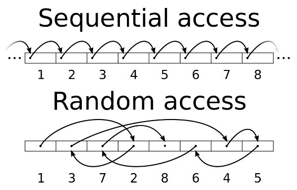
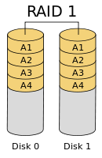
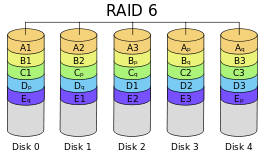
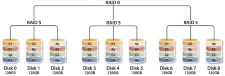

MySQL学习笔记（Day018：磁盘）
=============================
@(MySQL学习)

[TOC]

## 一. iostat

```bash
#
# 安装 iostat
#
shell> yum install sysstat 
# debian 系： apt-get install sysstat

# 使用
shell> iostat -xm 3 # x表示显示扩展统计信息，m表示以兆为单位显示，3表示每隔3秒显示
# 输出如下：
avg-cpu:  %user   %nice %system %iowait  %steal   %idle
           0.58    0.00    0.33    0.00    0.00   99.08

Device:         rrqm/s   wrqm/s     r/s     w/s    rMB/s    wMB/s avgrq-sz avgqu-sz   await r_await w_await  svctm  %util
sda               0.00     0.00    0.00    0.67     0.00     0.00     8.00     0.00    2.00    0.00    2.00   1.00   0.07
sdb               0.00     0.00    0.00    0.00     0.00     0.00     0.00     0.00    0.00    0.00    0.00   0.00   0.00
```

| CPU属性| 说明|
|:------:|:---:|
|%user|CPU处在用户模式下的时间百分比|
|%nice|CPU处在带NICE值的用户模式下的时间百分比|
|%sys|CPU处在系统模式下的时间百分比|
|%iowait|CPU等待IO完成时间的百分比|
|%steal|管理程序维护另一个虚拟处理器时，虚拟CPU的无意的等待时间的百分比|
|%idle|闲置cpu的百分比|
>**提示：**
如果%iowait的值过高，表示硬盘存在I/O瓶颈;
如果%idle值高，表示CPU较空闲，如果%idle值高但系统响应慢时，有可能是CPU等待分配内存，此时应加大内存容量。
如果%idle值如果`持续`很低，那么系统的CPU处理能力相对较低，表明系统中最需要解决的资源是CPU。

|Device属性 | 说明 |
|:----------:|:----:|
|rrqm/s	    |每秒进行 merge 的读操作数目 |
|wrqm/s	    |每秒进行 merge 的写操作数目|
|r/s	    |每秒完成的读 I/O 设备次数|
|w/s	    |每秒完成的写 I/O 设备次数|
|rsec/s	    |每秒读扇区数|
|wsec/s	    |每秒写扇区数|
|rkB/s	    |每秒读K字节数|
|wkB/s	    |每秒写K字节数|
|avgrq-sz	|平均每次设备I/O操作的数据大小 (扇区)|
|avgqu-sz	|平均I/O队列长度|
|await	    |平均每次设备I/O操作的等待时间 (毫秒)|
|svctm	    |平均每次设备I/O操作的服务时间 (毫秒)|
|%util	    |一秒中有百分之多少的时间用于 I/O 操作，即被io消耗的cpu百分比|
>**提示：**
如果 %util 接近 100%，说明产生的I/O请求太多，I/O系统已经满负荷，该磁盘可能存在瓶颈。
如果 svctm 比较接近 await，说明 I/O 几乎没有等待时间；
如果 await 远大于 svctm，说明I/O队列太长，io响应太慢，则需要进行必要优化。
如果avgqu-sz比较大，也表示有当量io在等待。

-----

## 二. 磁盘
### 1. 磁盘的访问模式
* 顺序访问
    - 顺序的访问磁盘上的块；
    - 一般经过测试后，得到该值的单位是`MB/s`，表示为磁盘`带宽`，普通硬盘在 50~ 100 MB/s
* 随机访问
    - 随机的访问磁盘上的块
    - 也可以用MB/s进行表示，但是通常使用`IOPS`（每秒处理IO的能力），普通硬盘在 100-200 IOPS



>拷贝文件属于顺序访问，`数据库`中访问数据属于`随机访问`。
数据库对数据的访问做了优化，把随机访问转成顺序访问。


### 2. 磁盘的分类
* HDD
    - 盘片通过旋转，磁头进行定位，读取数据；
    - 顺序性较好，随机性较差；
    - 常见转速
        - 笔记本硬盘：5400转/分钟；
        - 桌面硬盘：7200转/分钟；
        - 服务器硬盘：10000转/分钟、15000转/分钟；
        - SATA：120 ~ 150 IOPS
        - SAS ：150 ~ 200 IOPS
    
    >从理论上讲，15000转/分钟，最高是 15000/60 约等于250IOPS
    >由于机械盘片需要旋转，转速太高无法很好的散热

    >如果一个HDD对4K的块做随机访问是0.8MB/s，可通过`0.8 *（1 / 4）= 200` 或者 `（0.8 * 1000） / 4=200`得到`IOPS`，但是这个值存在部分干扰因素，如cache等

* SSD
    - 纯电设备
    - 由FLash Memory组成
    - 没有读写磁头
    - MLC闪存颗粒对一般企业的业务够用。目前SLC闪存颗粒价格较贵
    - IOPS高
        - 50000+ IOPS
        - 读写速度非对称 以 [INTEL SSD DC-S3500](http://www.intel.com/content/www/us/en/solid-state-drives/ssd-dc-s3500-spec.html)为例子：
            - Random 4KB3 Reads: Up to 75,000 IOPS 
            - Random 4KB Writes: Up to 11,500 IOPS
            - Random 8KB3 Reads: Up to 47,500 IOPS
            - Random 8KB Writes: Up to 5,500 IOPS
        
        - 当写入数据时，要先擦除老数据，再写入新数据
        - 擦除数据需要擦除整个区域（128K or 256K）一起擦除（自动把部分有用的数据挪到别的区域）
            
            > 对比发现4K性能要优于8K的性能，几乎是2倍的差距，当然16K就更明显，所以当使用SSD时，建议数据库页大小设置成4K或者是8K，`innodb_page_size=8K`）
            > 上线以前，SSD需要经过严格的压力测试（一周时间），确保性能平稳
        
    - Endurance Rating
        - 表示该SSD的寿命是多少
        - 比如450TBW，表示这个SSD可以反复写入的数据总量是450T（包括添加和更新）
    
    
    - SSD线上参数设置
        - 磁盘调度算法改为Deadline

            ```bash
            echo deadline > /sys/block/sda/queue/scheduler  # deadline适用于数据库，HDD也建议改成Deadline
            ```
            
        - MySQL参数
            - `innodb_log_file_size=4G`  该参数设置的尽可能大
            - `innodb_flush_neighbors=0`
            
            > 性能更平稳，且至少有15%的性能提升
        
    - SSD 品牌推荐
        - Intel
        - FusionIO
        - 宝存
        
    - 不是很建议使用PCI-E的Flash卡（PCI-E插槽的SSD） 
        - 性能过剩
        - 安装比较麻烦

### 3. 提升IOPS性能的手段
* 通过 RAID 技术
    - 功耗较高
    - IOPS在2000左右

* 通过购买共享存储设备
    - 价格非常昂贵
    - 但是比较稳定
    - 底层还是通过RAID实现

* 直接使用SSD
    - 性能较好的SSD可以达到 `万级别的IOPS`
    - 建议可以用SSD + RAID5，RAID1+0太奢侈


### 4. RAID类别

* RAID0

    - 速度最快
    - 没有冗余备份

* RAID1

    - 可靠性高
    - 读取速度理论上等于硬盘数量的倍数
    - 容量等于一个硬盘的容量

* RAID5

     - 至少要3块硬盘
     - 通过对数据的奇偶检验信息存储到不同的磁盘上，来恢复数据，最多只能坏一块
     - 属于折中方案

* RAID6

    - 至少是4块硬盘
    - 和RAID5比较，RAID6增加第二个独立的奇偶校验信息，写入速度略受影响
    - 数据可靠性高，可以同时坏两块
    - 由于使用了双校验机制，恢复数据速度较慢

* RAID1+0


* RAID5+0



### 5. RAID卡
* BBU
    - Battery Backup Unit
    - 目前几乎所有RAID卡都带BBU
    - 需要电池保证写入的可靠性（在断电后，将RAID卡`内存`中的缓存的数据刷入到磁盘）
    - 电池有充放电时间 (30天左右一个周期，充放电会切换成 Write Through，导致性能下降)
        - 使用`闪存（Flash）`的方式，就不会有充放电性能下降的问题

* RAID卡缓存
    - Write Backup （`强烈建议开启缓存`）
    - Write Through (不使用缓存，直接写入)


* LSI-RAID卡相关命令
    - 查看电量百分比
    
        ```bash
        [root@test_raid ~]# megacli -AdpBbuCmd -GetBbuStatus -aALL |grep "Relative State of Charge"
        Relative State of Charge: 100 %
        ```

    - 查看充电状态
    
        ```bash
        [root@test_raid ~]# megacli -AdpBbuCmd -GetBbuStatus -aALL |grep "Charger Status"
        Charger Status: Complete
        ```
    - 查看缓存策略
    
        ```bash
        [root@test_raid ~]# megacli -LDGetProp -Cache -LALL -a0
        Adapter 0-VD 0(target id: 0): Cache Policy:WriteBack, ReadAdaptive, Direct, No Write Cache if bad BBU
        ```

### 6. 文件系统和操作系统

* 文件系统
    - XFS/EXT4
    - noatime (不更新文件的atime标记，减少系统的IO访问)
    - nobarrier （禁用barrier，可以提高性能，前提是使用write backup和使用BBU）
    
    > mount -o noatime,nobarrier /dev/sda1 /data

* 操作系统
    - 推荐Linux
    - 关闭SWAP


