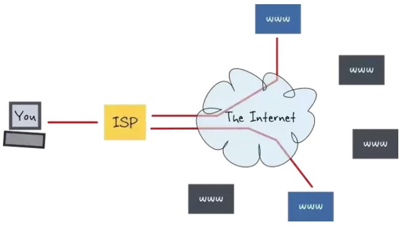
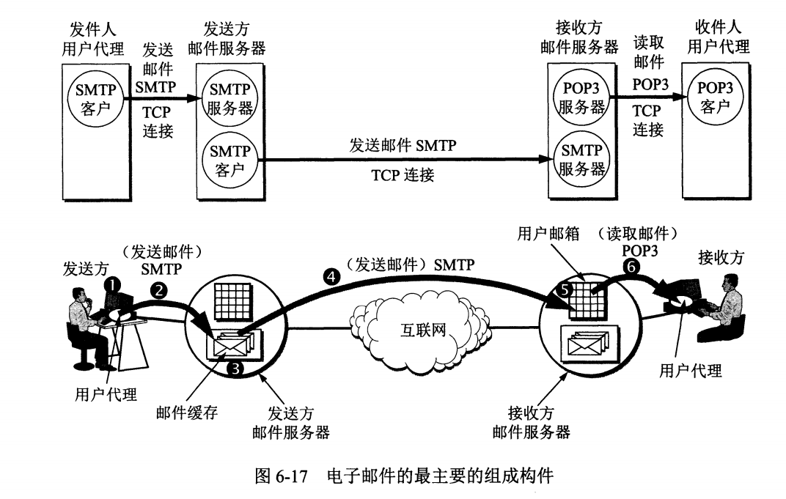
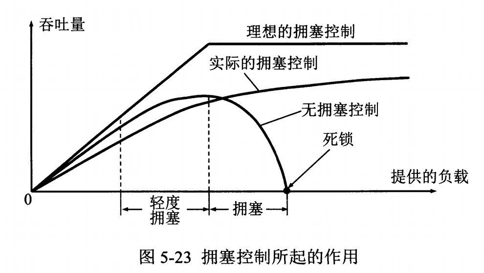
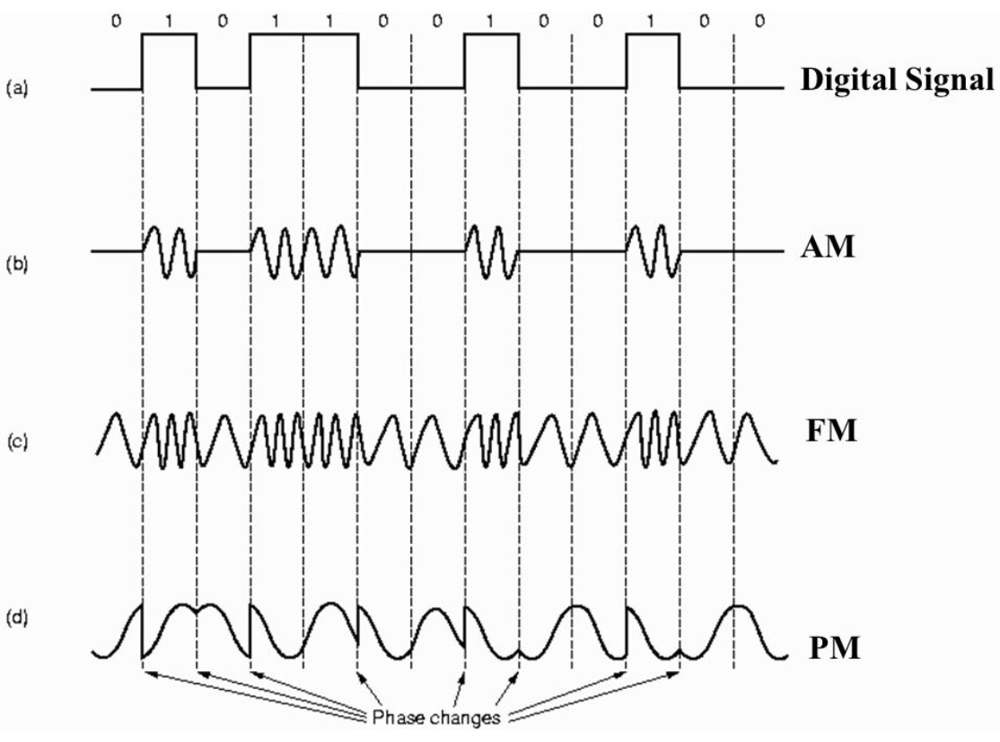

<!-- TOC -->

- [一、概述](#一概述)
    - [1、因特网：一个网络的网络](#1因特网一个网络的网络)
    - [2、ISP （Internet Service Provider）](#2isp-internet-service-provider)
    - [3、计算机网络结构：网络边缘、接入网、网络核心](#3计算机网络结构网络边缘接入网网络核心)
    - [4、主机之间的通信方式【C/S、P2P】](#4主机之间的通信方式csp2p)
    - [5、数据交换的类型：电路交换、分组交换](#5数据交换的类型电路交换分组交换)
        - [5.1 电路交换](#51-电路交换)
        - [5.2 分组交换  ****](#52-分组交换--)
            - [5.2.1 存储转发传输](#521-存储转发传输)
            - [5.2.2  时延  【结点总时延 = 结点处理时延 + 排队时延 + 传输时延 +  传播时延】](#522--时延--结点总时延--结点处理时延--排队时延--传输时延---传播时延)
    - [5.3 网路的性能测度：时延、丢包、吞吐量、带宽](#53-网路的性能测度时延丢包吞吐量带宽)
        - [5.3.1 丢包【分组丢失】：](#531-丢包分组丢失)
        - [5.3.2 吞吐量/率](#532-吞吐量率)
        - [5.3.2 带宽](#532-带宽)
    - [5.4 计算机网络体系结构](#54-计算机网络体系结构)
        - [5.4.1 五层协议  ******【目前应用最多的】](#541-五层协议--目前应用最多的)
            - [5.4.1.1 **应用层【报文，应用进程间如何通信】**](#5411-应用层报文应用进程间如何通信)
            - [5.4.1.2 **运输层【TCP报文段、UDP数据报，进程传输】**](#5412-运输层tcp报文段udp数据报进程传输)
            - [5.4.1.3 **网络层【IP数据报（分组），主机】**](#5413-网络层ip数据报分组主机)
            - [5.4.1.4 **数据链路层【帧，相邻网络元素】**](#5414-数据链路层帧相邻网络元素)
            - [5.4.1.5 **物理层【进行比特传输】**](#5415-物理层进行比特传输)
        - [5.4.2 OSI七层协议 【开放系统互连模型】](#542-osi七层协议-开放系统互连模型)
            - [5.4.2.1 **表示层【数据压缩、加密以及数据描述】**](#5421-表示层数据压缩加密以及数据描述)
            - [5.4.2.2 **会话层【建立及管理会话】**](#5422-会话层建立及管理会话)
        - [5.4.3 TCP/IP四层协议](#543-tcpip四层协议)
        - [5.4.4 数据在各层之间的传递过程](#544-数据在各层之间的传递过程)
        - [5.4.5 协议分层的优点](#545-协议分层的优点)
    - [5.5 附录](#55-附录)
        - [5.5.1 接入网的几种方式](#551-接入网的几种方式)
            - [5.5.1.1 家庭接入：DSL、电缆、FTTH、拨号和卫星](#5511-家庭接入dsl电缆ftth拨号和卫星)
            - [5.5.1.2 企业（家庭接入）：以太网、WiFi【局域网LAN】](#5512-企业家庭接入以太网wifi局域网lan)
            - [5.5.1.3 广域无线接入：3G和LET](#5513-广域无线接入3g和let)
        - [5.5.2 攻击网络](#552-攻击网络)
- [一、应用层 ****](#一应用层-)
    - [1、安全套接字层SSL——TCP的加强版， 在应用层使用来提供安全服务，包括加密、数据完整性、端点鉴别等](#1安全套接字层ssltcp的加强版-在应用层使用来提供安全服务包括加密数据完整性端点鉴别等)
    - [2、应用程序体系结构：C/S、P2P、混合结构](#2应用程序体系结构csp2p混合结构)
    - [2.1 客户机——服务器体系结构 C/S 【客户相互不直接通信，服务器具有固定的、周知的地址】](#21-客户机服务器体系结构-cs-客户相互不直接通信服务器具有固定的周知的地址)
        - [1、 域名系统 DNS](#1-域名系统-dns)
            - [1.1 DNS 概念 【DNS = 分布式数据库 + 应用层协议，把主机名解析为 IP 地址】](#11-dns-概念-dns--分布式数据库--应用层协议把主机名解析为-ip-地址)
            - [1.2 DNS 提供的服务](#12-dns-提供的服务)
                - [1) 主机名到IP地址的转换  ***【DNS 查询报文-> DNS 回答报文】](#1-主机名到ip地址的转换--dns-查询报文--dns-回答报文)
                - [2) 主机别名 【容易记忆】](#2-主机别名-容易记忆)
                - [3）邮件服务器别名 【容易记忆】](#3邮件服务器别名-容易记忆)
                - [4）负载分配 【DNS 在繁忙站点的服务器之间进行负载分配】](#4负载分配-dns-在繁忙站点的服务器之间进行负载分配)
            - [1.3 DNS 域名服务器 【根域名服务器、顶级域名服务器、权威域名服务器、本地域名服务器】](#13-dns-域名服务器-根域名服务器顶级域名服务器权威域名服务器本地域名服务器)
            - [1.4 DNS 大多数使用 UDP，但响应超过512字节使用 TCP](#14-dns-大多数使用-udp但响应超过512字节使用-tcp)
            - [1.5 解析过程 【主机向本地域名服务器：递归，本地域名服务器向其他域名服务器：递归或迭代】](#15-解析过程-主机向本地域名服务器递归本地域名服务器向其他域名服务器递归或迭代)
        - [2、文件传输协议 FTP 【建立两个并行的 TCP 连接：控制连接、数据连接】](#2文件传输协议-ftp-建立两个并行的-tcp-连接控制连接数据连接)
        - [3、动态主机配置协议 DHCP 【UDP】—— 使一个主机自动获取 IP 地址](#3动态主机配置协议-dhcp-udp-使一个主机自动获取-ip-地址)
            - [3.1 DHCP 的作用](#31-dhcp-的作用)
                - [1）主机从 DHCP 服务器自动获取IP地址、子网掩码、第一跳路由器（默认路由器）IP地址，本地DNS服务器地址](#1主机从-dhcp-服务器自动获取ip地址子网掩码第一跳路由器默认路由器ip地址本地dns服务器地址)
                - [2）即插即用](#2即插即用)
                - [3）允许地址重用 （自己关机了，地址可返还让别人用）](#3允许地址重用-自己关机了地址可返还让别人用)
                - [4）支持在用地址续租](#4支持在用地址续租)
                - [5）支持移动用户加入网络](#5支持移动用户加入网络)
            - [3.2 配置流程 【客：广播 DHCP 发现报文->服：广播DHCP 提供报文->客： DHCP 请求报文->服： Ack 报文】](#32-配置流程-客广播-dhcp-发现报文-服广播dhcp-提供报文-客-dhcp-请求报文-服-ack-报文)
        - [4、远程登录协议 TELNET 【用于登录到远程主机上，TCP承载】](#4远程登录协议-telnet-用于登录到远程主机上tcp承载)
        - [5、电子邮件协议 【发送协议：SMTP，读取协议：POP3 和 IMAP】](#5电子邮件协议-发送协议smtp读取协议pop3-和-imap)
            - [5.1 一个电子邮件系统组成：用户代理、邮件服务器、邮件协议【SMTP、POP3、IMAP、HTTP】。](#51-一个电子邮件系统组成用户代理邮件服务器邮件协议smtppop3imaphttp)
                - [5.1.1  SMTP 【发送协议】](#511--smtp-发送协议)
                - [5.1.2 第三版的邮局协议：POP3 【读取协议】](#512-第三版的邮局协议pop3-读取协议)
        - [3. 因特网邮件访问协议：IMAP 【读取协议】](#3-因特网邮件访问协议imap-读取协议)
    - [2.2 P2P结构](#22-p2p结构)
        - [2.2.1 P2P (Peer-to-Peer) 特点](#221-p2p-peer-to-peer-特点)
        - [2.2.2 P2P 应用之一：文件分发 【BitTorrent技术】](#222-p2p-应用之一文件分发-bittorrent技术)
    - [3、常用端口](#3常用端口)
    - [4、Web 页面请求过程](#4web-页面请求过程)
        - [4.1 准备阶段：](#41-准备阶段)
            - [1） DHCP 配置主机信息：配置客户主机的IP 地址、子网掩码和 DNS 服务器的 IP 地址，并在其 IP 转发表中安装默认网关【DHCP请求报文->ACK报文】](#1-dhcp-配置主机信息配置客户主机的ip-地址子网掩码和-dns-服务器的-ip-地址并在其-ip-转发表中安装默认网关dhcp请求报文-ack报文)
            - [2）ARP 获得网关路由器的 MAC 地址 【ARP 查询报文-> ARP 回答】](#2arp-获得网关路由器的-mac-地址-arp-查询报文--arp-回答)
            - [3） DNS 解析域名：向 DNS 服务器查询网站域名对应的 IP 地址 【DNS 查询报文->DNS 回答报文】](#3-dns-解析域名向-dns-服务器查询网站域名对应的-ip-地址-dns-查询报文-dns-回答报文)
        - [4.2 Web客户-服务器交互：HTTP](#42-web客户-服务器交互http)
            - [1) 三次握手建立连 TCP 连接 【客：SYN报文段->服：SYNACK报文段 --->ACK 报文段？】](#1-三次握手建立连-tcp-连接-客syn报文段-服synack报文段----ack-报文段)
            - [2） HTTP 请求页面 【 HTTP 请求报文->HTTP 响应报文】](#2-http-请求页面--http-请求报文-http-响应报文)
- [二、运输层 ****](#二运输层-)
    - [5.1 运输层概述](#51-运输层概述)
        - [5.1.1 运输层协议为运行在不同主机上的应用进程之间提供了逻辑通信功能](#511-运输层协议为运行在不同主机上的应用进程之间提供了逻辑通信功能)
        - [5.1.2 UDP 和 TCP 的基本责任：多路复用和多路分解](#512-udp-和-tcp-的基本责任多路复用和多路分解)
        - [5.1.3 无连接的分用和面向连接的分用的区别](#513-无连接的分用和面向连接的分用的区别)
            - [5.1.3.1 UDP：二元组标识，接收端将来自不同源 IP 地址和/或源端口号的 UDP 数据报导向同一个socket](#5131-udp二元组标识接收端将来自不同源-ip-地址和或源端口号的-udp-数据报导向同一个socket)
            - [5.1.3.2 TCP：四元组标识，接收端利用所有四个值将TCP报文段导向合适的socket](#5132-tcp四元组标识接收端利用所有四个值将tcp报文段导向合适的socket)
    - [5.2 用户数据报协议 UDP —— 无连接传输协议](#52-用户数据报协议-udp--无连接传输协议)
        - [5.2.1 UDP 的特点：是面向报文，无连接的，提供“尽力而为”服务  【和 TCP 都没有提供时延、带宽、安全性服务】](#521-udp-的特点是面向报文无连接的提供尽力而为服务--和-tcp-都没有提供时延带宽安全性服务)
        - [5.2.2 UDP 的价值及应用](#522-udp-的价值及应用)
            - [1、无需建立连接（减少了延迟） 【DNS 使用 UDP】](#1无需建立连接减少了延迟-dns-使用-udp)
            - [2、实现简单，无需维护链接状态](#2实现简单无需维护链接状态)
            - [3、头部开销小【8字节】](#3头部开销小8字节)
            - [4、没有拥塞控制  【应用可以更好地控制发送时间和速率】](#4没有拥塞控制--应用可以更好地控制发送时间和速率)
            - [应用：常用于流媒体应用：容忍丢失、速度敏感；以及DNS 、SNMP等](#应用常用于流媒体应用容忍丢失速度敏感以及dns-snmp等)
        - [5.2.3 UDP 首部格式 【8字节】：源端口、目的端口、长度、**检验和**](#523-udp-首部格式-8字节源端口目的端口长度检验和)
    - [5.3 传输控制协议 TCP 的首部格式 【20的固定字节 + 长度可变的选项】](#53-传输控制协议-tcp-的首部格式-20的固定字节--长度可变的选项)
    - [5.4 TCP —— 面向连接的传输协议](#54-tcp--面向连接的传输协议)
        - [1、面向字节流 （把应用层传下来的报文看成字节流，把字节流组织成大小不等的数据块）](#1面向字节流-把应用层传下来的报文看成字节流把字节流组织成大小不等的数据块)
        - [2、面向连接   （发送数据之前必须建立连接，连接的状态只在连接的两端中维护）](#2面向连接---发送数据之前必须建立连接连接的状态只在连接的两端中维护)
            - [2.1 TCP 连接管理：三次握手机制 【客：SYN报文段->服：SYNACK报文段->客：ACK报文段】    ****](#21-tcp-连接管理三次握手机制-客syn报文段-服synack报文段-客ack报文段----)
            - [2.2 TCP 三次握手的原因](#22-tcp-三次握手的原因)
            - [2.3 TCP 连接管理：四次挥手机制 【客：FIN 控制报文段->服：ACK 报文段 （此时TCP半关闭）->服：FIN 控制报文段->客：ACK 报文段】](#23-tcp-连接管理四次挥手机制-客fin-控制报文段-服ack-报文段-此时tcp半关闭-服fin-控制报文段-客ack-报文段)
            - [2.4 TCP 四次挥手的原因](#24-tcp-四次挥手的原因)
        - [3、点对点     （是单个发送方与单个接收方的连接）](#3点对点-----是单个发送方与单个接收方的连接)
        - [4、全双工服务 （同一连接中能传输双向数据流）](#4全双工服务-同一连接中能传输双向数据流)
        - [5、双方都有发送和接收缓存  （从这里发/收数据）](#5双方都有发送和接收缓存--从这里发收数据)
        - [6、提供可靠数据传输 （不错、不丢、不乱）【通过确认/重传来实现】](#6提供可靠数据传输-不错不丢不乱通过确认重传来实现)
            - [TCP 在 IP 层提供的不可靠服务基础上实现了可靠数据传输服务。](#tcp-在-ip-层提供的不可靠服务基础上实现了可靠数据传输服务)
            - [1）确认到达 + 超时重传和快速重传：防止丢包](#1确认到达--超时重传和快速重传防止丢包)
                - [1.1）采用累积确认【ACK（n）,确认号n之前的都已经接收了。（确认号是期待收到的下一个序号）】](#11采用累积确认ackn确认号n之前的都已经接收了确认号是期待收到的下一个序号)
                - [1.2）超时重传 ： 如果一个已经发送的报文段在超时时间内没有收到确认，那么就重传这个报文段](#12超时重传--如果一个已经发送的报文段在超时时间内没有收到确认那么就重传这个报文段)
                    - [1.2.1 使用单一重传定时器【用于超时重传一个分组】](#121-使用单一重传定时器用于超时重传一个分组)
                - [1.3） 快速重传 【收到3个冗余ACK，则快速重传】](#13-快速重传-收到3个冗余ack则快速重传)
            - [3）分组序列号：确保数据包的顺序](#3分组序列号确保数据包的顺序)
            - [4）检验和：来检测在一个传输分组中的比特错误](#4检验和来检测在一个传输分组中的比特错误)
            - [附录:流水线机制](#附录流水线机制)
                - [1.1）TCP 滑动窗口 【允许发送方发送多个分组而不需等待确认】](#11tcp-滑动窗口-允许发送方发送多个分组而不需等待确认)
                - [1.2） TCP 差错恢复（回退N步协议 GBN 和 选择重传协议 SR 的混合体）](#12-tcp-差错恢复回退n步协议-gbn-和-选择重传协议-sr-的混合体)
        - [7、提供流量控制【为了让接收方能来得及接收】](#7提供流量控制为了让接收方能来得及接收)
        - [8、提供拥塞控制 【为了降低整个网络的拥塞程度】](#8提供拥塞控制-为了降低整个网络的拥塞程度)
            - [8.1 为什么要有拥塞控制？——网络拥塞，导致分组会丢失，分组丢失导致重传，重传导致网络更加拥塞](#81-为什么要有拥塞控制网络拥塞导致分组会丢失分组丢失导致重传重传导致网络更加拥塞)
            - [8.2 TCP 主要通过四个算法来进行拥塞控制：慢启动、拥塞避免、快重传、快恢复。【共有 慢启动、拥塞避免、快恢复三种状态】](#82-tcp-主要通过四个算法来进行拥塞控制慢启动拥塞避免快重传快恢复共有-慢启动拥塞避免快恢复三种状态)
                - [8.2.1 慢启动与拥塞避免](#821-慢启动与拥塞避免)
                - [8.2.2 快重传与快恢复](#822-快重传与快恢复)
                - [8.2.3 TCP 拥塞控制方式 常常被称为 加性增、乘性减（AIMD）拥塞控制方式](#823-tcp-拥塞控制方式-常常被称为-加性增乘性减aimd拥塞控制方式)
- [三、网络层 ******](#三网络层-)
    - [1、网络层的功能：转发、路由、连接建立（某些有）](#1网络层的功能转发路由连接建立某些有)
        - [1.1 转发：将分组从路由器的输入端口转移到合适的输出端口  【略】](#11-转发将分组从路由器的输入端口转移到合适的输出端口--略)
        - [1.2 路由：确定分组从源到目的经过的路径【】](#12-路由确定分组从源到目的经过的路径)
            - [1.2.1 路由器的结构](#121-路由器的结构)
            - [1.2.2 路由器分组转发流程](#122-路由器分组转发流程)
            - [1.2.3 路由选择协议分为两大类：内部网关协议IGP【RIP、OSPF】、外部网关协议EGP【BGP】](#123-路由选择协议分为两大类内部网关协议igpripospf外部网关协议egpbgp)
                - [1.2.3.1 内部网关协议 RIP 【距离向量算法】](#1231-内部网关协议-rip-距离向量算法)
                - [1.2.3.2 内部网关协议 OSPF 【Dijkstra最短路径算法】](#1232-内部网关协议-ospf-dijkstra最短路径算法)
                - [1.2.3.3 外部网关协议 BGP，也叫 BGP4](#1233-外部网关协议-bgp也叫-bgp4)
            - [1.2.4 应用：在路由器转发表中增加一个AS之外目的地的步骤](#124-应用在路由器转发表中增加一个as之外目的地的步骤)
            - [附录：相关定义：AS、默认路由器、网关路由器、热土豆路由选择](#附录相关定义as默认路由器网关路由器热土豆路由选择)
        - [1.3 连接建立（某些网络体系结构需要，如ATM、帧中继、MPLS等，这些都属于虚电路网络） 【略】](#13-连接建立某些网络体系结构需要如atm帧中继mpls等这些都属于虚电路网络-略)
    - [2、网络的两种基本类型：虚电路网络、数据报网络](#2网络的两种基本类型虚电路网络数据报网络)
        - [2.1 虚电路网络【提供连接服务，ATM、帧中继等在用】（可略）](#21-虚电路网络提供连接服务atm帧中继等在用可略)
        - [2.2 数据报网络【提供无连接服务，因特网在用】****](#22-数据报网络提供无连接服务因特网在用)
    - [3、IP协议及其配套使用的三个协议：ARP、ICMP、IGMP 【数据报网络（因特网）使用】](#3ip协议及其配套使用的三个协议arpicmpigmp-数据报网络因特网使用)
        - [3.1 网际协议 IP](#31-网际协议-ip)
            - [3.1.1 IP概述](#311-ip概述)
            - [3.1.2 IP 数据报格式](#312-ip-数据报格式)
            - [3.1.3 IP 分片](#313-ip-分片)
            - [3.1.4 IP 地址编址方式历史阶段：有类编址->子网划分->无类别域间路由选择（CIDR）](#314-ip-地址编址方式历史阶段有类编址-子网划分-无类别域间路由选择cidr)
                - [3.1.4.1 有类编址](#3141-有类编址)
                - [3.1.4.2 子网划分](#3142-子网划分)
                - [3. 无类别域间路由选择 CIDR 【因特网的地址分配策略】](#3-无类别域间路由选择-cidr-因特网的地址分配策略)
        - [3.2 地址解析协议 ARP （Address Resolution Protocol）](#32-地址解析协议-arp-address-resolution-protocol)
            - [3.2.1 IP 地址和 MAC 地址](#321-ip-地址和-mac-地址)
            - [3.2.2 ARP 的作用：由 IP 地址得到 MAC 地址。【因为链路层帧需要 MAC 地址】【ARP 查询报文-> ARP 回答】](#322-arp-的作用由-ip-地址得到-mac-地址因为链路层帧需要-mac-地址arp-查询报文--arp-回答)
            - [3.2.3 ARP 和 DNS 的区别](#323-arp-和-dns-的区别)
        - [3.3 网际控制报文协议 ICMP (Internet Control Message Protocol)](#33-网际控制报文协议-icmp-internet-control-message-protocol)
            - [3.3.1 ICMP 介绍 【为了更有效地转发 IP 数据报和提高交付成功的机会】](#331-icmp-介绍-为了更有效地转发-ip-数据报和提高交付成功的机会)
            - [3.3.2 ICMP 应用之一：Ping 【用来测试两台主机之间的连通性】](#332-icmp-应用之一ping-用来测试两台主机之间的连通性)
            - [3.3.3 ICMP 应用之二：Traceroute 【用来跟踪一个分组从源点到终点的路径】](#333-icmp-应用之二traceroute-用来跟踪一个分组从源点到终点的路径)
        - [3.4 网际组管理协议 IGMP (Internet Group Management Protocol)](#34-网际组管理协议-igmp-internet-group-management-protocol)
    - [4、虚拟专用网 VPN 【 一个机构内，距离远的两部门的专用网之间建立一个专用的虚拟通道进行安全的通信】](#4虚拟专用网-vpn--一个机构内距离远的两部门的专用网之间建立一个专用的虚拟通道进行安全的通信)
    - [5、网络地址转换 NAT 【专用网内部的一些主机想与互联网上的主机通信，可以使用 NAT 来将本地 IP 转换为全球 IP】](#5网络地址转换-nat-专用网内部的一些主机想与互联网上的主机通信可以使用-nat-来将本地-ip-转换为全球-ip)
- [四、数据链路层](#四数据链路层)
    - [1、数据链路层要解决的三个基本问题](#1数据链路层要解决的三个基本问题)
        - [1.1 封装成帧](#11-封装成帧)
        - [1.2 透明传输](#12-透明传输)
        - [1.3 差错检测【CRC检查比特差错】](#13-差错检测crc检查比特差错)
    - [2、信道分类及其协议（广播、点对点信道）](#2信道分类及其协议广播点对点信道)
        - [2.1 广播信道](#21-广播信道)
            - [2.1.1 概念：一对多通信](#211-概念一对多通信)
            - [2.1.2 多路访问协议（MAC）避免碰撞：信道划分协议、随机接入协议、轮流协议](#212-多路访问协议mac避免碰撞信道划分协议随机接入协议轮流协议)
                - [2.1.2.1 信道划分协议【频分、时分、统计时分、波分、码分多路复用】](#2121-信道划分协议频分时分统计时分波分码分多路复用)
                - [2.1.2.2 随机接入协议【CSMA/CD协议、时隙ALOHA等】](#2122-随机接入协议csmacd协议时隙aloha等)
                    - [CSMA/CD 协议：具有碰撞检测的载波监听多路访问协议  *****](#csmacd-协议具有碰撞检测的载波监听多路访问协议--)
                - [2.1.2.3 轮流协议【轮回协议（主结点）、令牌传递协议（令牌）】 （略）](#2123-轮流协议轮回协议主结点令牌传递协议令牌-略)
        - [2.2 点对点信道](#22-点对点信道)
            - [2.2.1 概念：一对一通信。](#221-概念一对一通信)
            - [2.2.2 PPP协议](#222-ppp协议)
    - [3、典型的广播信道：局域网](#3典型的广播信道局域网)
        - [3.1 局域网分类](#31-局域网分类)
        - [3.2 MAC 地址【又叫LAN地址、物理地址、链路层地址】](#32-mac-地址又叫lan地址物理地址链路层地址)
        - [3.3 以太网：一种星型拓扑结构局域网](#33-以太网一种星型拓扑结构局域网)
            - [3.3.1 以太网发展历程：基于集线器的星型拓扑->基于交换机的星型拓扑结构](#331-以太网发展历程基于集线器的星型拓扑-基于交换机的星型拓扑结构)
            - [3.3.2 链路层交换机](#332-链路层交换机)
            - [3.3.3 交换机 VS. 路由器](#333-交换机-vs-路由器)
            - [3.3.4 以太网帧格式](#334-以太网帧格式)
        - [3.4 虚拟局域网(VLAN)](#34-虚拟局域网vlan)
- [二、物理层](#二物理层)
    - [1、通信方式【单工、半双工、全双工通信】](#1通信方式单工半双工全双工通信)
    - [2、带通调制](#2带通调制)
- [参考资料](#参考资料)

<!-- /TOC -->

# 一、概述

## 1、因特网：一个网络的网络

* **因特网是一个网络的网络：**
    * 网络把主机连接起来，而因特网是把多种不同的网络连接起来，因此因特网一个是网络的网络。
    

* **因特网的主要协议统称为TCP/IP协议**
    * TCP：传输控制协议
    * IP：网际协议【定义了在路由器和端系统之间发送和接收的分组格式】
* 因特网可以看成一种为运行在端系统上的分布式应用提供服务的基础设施。
* PS：
    * **协议**：定义了在两个或多个通信实体之间交换的报文格式和次序，以及报文发送/接受或其他事件所采取的动作
## 2、ISP （Internet Service Provider）

* 因特网服务提供商 ISP ：可以从互联网管理机构获得许多 IP 地址，同时拥有通信线路以及路由器等联网设备，个人或机构向 ISP 缴纳一定的费用就可以接入互联网。

* 目前的因特网是由等级制的互联ISP组成【端系统通过ISP接入因特网，ISP必须进一步互联，构成复杂的网络互联的网络】。ISP 根据覆盖面积的大小分为：
    * 一级 ISP：提供国家或国际范围的覆盖
    * 区域 ISP 
    * 接入 ISP
* 因特网交换点 IXP： 允许两个 ISP 直接相连而不用经过第三个 ISP。
* 对等：位于相同等级结构层次的邻近一对ISP能对等，能直接将它们的网络连到一起。
* IXP：第三方公司（如Google）创建一个IXP，是一个汇合点，多个ISP能够在这里共同对等。
* 内容提供商网络：私有网络，连接其数据中心与Internet，通常绕过一级ISP和区域ISP。

## 3、计算机网络结构：网络边缘、接入网、网络核心
* 网络边缘：端系统（主机）、应用程序
* 接入网：将端系统连接到其边缘路由器的物理链路
    * 边缘路由器：指端系统到任何其他远程端系统的路径上的第一台路由器
* 网络核心：互联的路由器
    * 分组交换机：
        * 路由器：通常用于网络核心中
        * 链路层交换机：通常用于接入网中

## 4、主机之间的通信方式【C/S、P2P】

- 客户-服务器（C/S）：客户是服务的请求方，服务器是服务的提供方。

- 对等（P2P）：不区分客户和服务器。

## 5、数据交换的类型：电路交换、分组交换

### 5.1 电路交换

* 电路交换用于电话通信系统，两个用户要通信之前需要建立一条专用的物理链路，并且在整个通信过程中始终占用该链路。由于通信的过程中不可能一直在使用传输线路，因此电路交换对线路的利用率很低，往往不到 10%。

### 5.2 分组交换  ****
* 分组：报文切分出来的一系列相对较小的数据包。
* 每个分组都有首部，包含了源地址和目的地址等控制信息。
* 允许在一条传输线路上传送多个主机的分组，也就是说两个用户之间的通信不需要占用端到端的线路资源。
#### 5.2.1 存储转发传输
* 分组交换使用了存储转发：存储转发机制是指交换机能够开始向输出链路传输该分组的第一个比特之前，必须接收到整个分组。
#### 5.2.2  时延  【结点总时延 = 结点处理时延 + 排队时延 + 传输时延 +  传播时延】

* 处理时延（us级以下）：
    * 主机或路由器收到分组时进行处理所需要的时间。【例如分析首部、从分组中提取数据、进行差错检验或查找适当的路由等。】

* 排队时延（ms~us级）

    * 分组在路由器的输出队列中排队等待的时间，取决于网络的拥塞程度。
        * 分组交换机有输出缓存（输出队列），用于存储路由器准备发往那条链路的分组

* 传输时延（ms~us级）

    * 主机或路由器传输数据帧所需要的时间。【将所有分组的比特推向链路所需的时间】
    * 取决于分组长度L，链路带宽R：
        * 传输时延 = L/R

* 传播时延(ms级)

    * 电磁波在信道中传播所需要花费的时间，电磁波传播的速度接近光速。
    * 取决于信道长度d，信号传播速度s：
        * 传播时延 = d/s

* PS：用流量强度来评估排队时延
**流量强度 = La/R**
【L：分组长度；a：分组到达队列的平均速率(分组/秒)； R：链路带宽bps】
    * ~0 ：平均排队时延很小
    * ->1：很大
    * >1 :超出服务能力，平均排队时延无限大

## 5.3 网路的性能测度：时延、丢包、吞吐量、带宽
### 5.3.1 丢包【分组丢失】：
* 分组可能发现输出缓存已经被其他等待传输的分组充满了，到达的分组或已经排队的分组之一将被丢弃。
### 5.3.2 吞吐量/率
* 表示在发送端与接收端之间传送的数据速率（b/s）
    * 即时吞吐量：给定时刻速率
    * 平均吞吐量：一段时间的平均速率
* 取决于瓶颈电路【在端到端的路径上，限制端到端吞吐量的链路】
### 5.3.2 带宽
* 网络的带宽是指数字信道所能传送的“最高数据率”，单位bps
* K=10^3,M=10^6,G=10^9

## 5.4 计算机网络体系结构

### 5.4.1 五层协议  ******【目前应用最多的】
* 各层的所有协议被称为协议栈

#### 5.4.1.1 **应用层【报文，应用进程间如何通信】** 
* 应用层协议定义了运行在不同端系统上的应用程序 **进程**如何相互传递报文。数据单位为报文。
    * 交换的报文类型：如请求报文、响应报文
    * 各种报文类型的语法：如报文中的各个字段以及如何描述
    * 字段的语义：即字段中包含的信息的含义
    * 一个进程何时及如何发送报文，对报文进行响应的规则
    * 例如 HTTP、DNS 等。
        * HTTP：提供web文档的请求和发送
        * SMTP：提供电子邮件报文的传输
        * FTP： 提供两个端系统之间的文件传输
        * DNS： 域名系统

#### 5.4.1.2 **运输层【TCP报文段、UDP数据报，进程传输】** 
* 运输层为运行在不同主机上的进程之间提供了逻辑通信。由于应用层协议很多，定义通用的运输层协议就可以支持不断增多的应用层协议。运输层包括两种协议：
    * 传输控制协议 TCP：提供面向连接、可靠的数据传输服务，数据单位为TCP报文段；
    * 用户数据报协议 UDP：提供无连接、尽最大努力的数据传输服务，数据单位为UDP数据报。
    * TCP 主要提供完整性服务，UDP 主要提供及时性服务。

#### 5.4.1.3 **网络层【IP数据报（分组），主机】** 
* 网络层提供了主机之间的逻辑通信。
    * 而运输层协议是为主机中的进程提供数据传输服务。网络层把运输层传递下来的报文段或者用户数据报封装成 **分组**。
    * 运行IP协议和路由选择协议

#### 5.4.1.4 **数据链路层【帧，相邻网络元素】** 
* 链路层的任务是提供 **相邻网络元素**（主机、交换机、路由器）的数据传输(传帧）  【链路层实现具体每段链路之间的通信，两主机之间可能要经过多条链路】
    * 数据链路层把网络层传下来的分组封装成 **帧**。
    * 协议：以太网、wifi、电缆接入所用的DOCSIS协议等

#### 5.4.1.5 **物理层【进行比特传输】** 
* 物理层的任务是将帧中的一个一个比特从一个结点移动到下一个结点
    * 物理层的作用是尽可能屏蔽传输媒体和通信手段的差异，使数据链路层感觉不到这些差异。
    * 比如以太网有许多物理层协议：关于双绞铜线的、关于同轴电缆的、关于光纤的

### 5.4.2 OSI七层协议 【开放系统互连模型】

#### 5.4.2.1 **表示层【数据压缩、加密以及数据描述】** 
* 数据压缩、加密以及数据描述，这使得应用程序不必关心在各台主机中数据内部格式不同的问题。
#### 5.4.2.2 **会话层【建立及管理会话】** 
* 对话控制：建立及管理会话。
* 同步：在数据流中插入同步点

五层协议没有表示层和会话层，而是将这些功能留给应用程序开发者处理。

### 5.4.3 TCP/IP四层协议

* 它只有四层，相当于五层协议中数据链路层和物理层合并为网络接口层。

* TCP/IP 体系结构不严格遵循 OSI 分层概念，应用层可能会直接使用 IP 层或者网络接口层。

* TCP/IP 协议族是一种沙漏形状，中间小两边大，IP 协议在其中占用举足轻重的地位。

### 5.4.4 数据在各层之间的传递过程

* 在向下的过程中，需要添加下层协议所需要的首部或者尾部，而在向上的过程中不断拆开首部和尾部。

* 路由器只有下面三层协议，因为路由器位于网络核心中，不需要为进程或者应用程序提供服务，因此也就不需要运输层和应用层。

### 5.4.5 协议分层的优点
* 协议分层提供了一种结构化方式来讨论系统组件。模块化使更新系统组件更为容易。
## 5.5 附录
### 5.5.1 接入网的几种方式
#### 5.5.1.1 家庭接入：DSL、电缆、FTTH、拨号和卫星
* 宽带住宅接入方式：
    * DSL（数字用户线）：每个用户的DSL调制解调器【数据->高频音】使用现有的电话线（双绞铜线）与位于本地电话公司的本地中心局中的数字用户线接入复用器（DSLAM）【用于音与数据的转换】来交换数据。
        * 电话线同时承载数据和电话信号，它们被编码为不同的频率来区分
    * 电缆因特网接入：利用了有线电视公司现有的有线电视基础设施，使用光纤、同轴电缆、电缆调制解调器，是共享广播媒体
    * 光纤到户【FTTH】：从本地中心局直接到家庭提供了一条光纤电路
    * 卫星接入：用于DSL、电缆、FTTH到不了的地方
    * 传统电话线的拨号接入：与DSL有相同的模式。家庭的一只调制解调器通过电话线连接到ISP中的一只调制解调器，但其56Kbps的慢速率令人头疼。
#### 5.5.1.2 企业（家庭接入）：以太网、WiFi【局域网LAN】
* 以太网：用户通过双绞铜线与以太网交换机相连
* WiFi：基于IEEE 802.11技术的无线LAN接入，通俗叫WiFi
    * 在无线LAN环境中，无线用户从/到一个接入点发送/接收分组，该接入点与企业网连接（很可能包含有线以太网），该企业再与有线因特网相连
    
     
 

#### 5.5.1.3 广域无线接入：3G和LET
* 通过蜂窝网提供商运营的基站来发送和接收分组【应用了与移动电话相同的基础设施】

### 5.5.2 攻击网络
* 1、坏家伙能够经因特网将有害程序放入你的计算机中
    * 病毒：是一种需要某种形式的用户交互来感染用户设备的恶意软件
    * 蠕虫：是一种无需任何明显用户交互就能进入设备的恶意软件
* 2、坏家伙能够攻击服务器的网络基础设施
    * 拒绝服务攻击（Denial-of-Service，Dos）：Dos攻击使得网络、主机或其他基础设施部分不能由合法用户所使用。一般有三种类型：
        * 弱点攻击
        * 带宽泛洪
        * 连接泛洪
* 3、坏家伙能嗅探分组
    * 记录每个流经的分组副本的被动接收机被称为分组嗅探器
* 4、坏家伙能伪装成你信任的人
    * 将具有虚假源地址的分组注入因特网的能力称为IP哄骗（一个用户冒充另一用户）
# 一、应用层 ****
## 1、安全套接字层SSL——TCP的加强版， 在应用层使用来提供安全服务，包括加密、数据完整性、端点鉴别等
## 2、应用程序体系结构：C/S、P2P、混合结构
## 2.1 客户机——服务器体系结构 C/S 【客户相互不直接通信，服务器具有固定的、周知的地址】
### 1、 域名系统 DNS 
#### 1.1 DNS 概念 【DNS = 分布式数据库 + 应用层协议，把主机名解析为 IP 地址】
* DNS：提供了主机名和 IP 地址之间相互转换的服务
    * 是一个由分层的 DNS 服务器实现的分布式数据库。【这里的分布式数据库是指，每个站点只保留它自己的那部分数据。】
    * 也是一个使得主机能够查询分布式数据库的应用层协议 
#### 1.2 DNS 提供的服务
##### 1) 主机名到IP地址的转换  ***【DNS 查询报文-> DNS 回答报文】
##### 2) 主机别名 【容易记忆】
* 更容易记忆，应用程序可以调用 DNS 来获得主机别名对应的规范主机名以及主机的 IP 地址
##### 3）邮件服务器别名 【容易记忆】
##### 4）负载分配 【DNS 在繁忙站点的服务器之间进行负载分配】
* 繁忙的站点被冗余的分配在多台服务器上，有不同的 IP 地址，但这个 IP 集合和一个规范主机名相联系。当客户对映射到某地址集合的名字发出一个DNS请求时，该服务器用 IP 地址的整个集合进行响应，但在每个回答中循环这些地址次序。因为客户总是向 IP 地址排在最前面的服务器发送 HTTP 请求报文，所以 DNS 就在这些冗余的服务器之间进行了负载分配。

#### 1.3 DNS 域名服务器 【根域名服务器、顶级域名服务器、权威域名服务器、本地域名服务器】
* 根域名服务器：解析顶级域名
* 顶级域名服务器：解析二级域名
* 权威域名服务器：解析区内域名 【组织内的域名解析服务器，提供组织内部服务器的解析】
* 本地域名服务器：【代理作用】也叫默认域名服务器，可以在其中配置高速缓存。
    * 严格来说不属于该服务器的层次结构，每个ISP都有一台本地域名服务器
    * 当主机发出DNS请求时，该请求被发往本地域名服务器，它起着代理的作用，并将该请求转发到DNS服务器层次结构中

#### 1.4 DNS 大多数使用 UDP，但响应超过512字节使用 TCP
* DNS 可以使用 UDP 或者 TCP 进行传输，使用的端口号都为 53。大多数情况下 DNS 使用 UDP 进行传输，这就要求域名解析器和域名服务器都必须自己处理超时和重传来保证可靠性。在两种情况下会使用 TCP 进行传输：

    - 如果返回的响应超过的 512 字节（UDP 最大只支持 512 字节的数据）。
    - 区域传送（区域传送是主域名服务器向辅助域名服务器传送变化的那部分数据）。
#### 1.5 解析过程 【主机向本地域名服务器：递归，本地域名服务器向其他域名服务器：递归或迭代】
* 迭代：本地域名服务器向一个域名服务器解析请求解析后，结果返回到本地域名服务器，然后本地域名服务器继续向其他域名服务器请求解析；
* 递归：结果不是直接返回，而是继续向前请求解析，最后结果才会返回

### 2、文件传输协议 FTP 【建立两个并行的 TCP 连接：控制连接、数据连接】

* FTP 使用 TCP 进行连接，它需要两个连接来传送一个文件：

    - 控制连接【端口号21】：控制连接在整个会话期间一直打开，用于在两机之间传输控制信息。（如用户标识、口令、改变远程目录的的命令、存放、获取等）
    - 数据连接【端口号20】：在数据传送完毕之后就关闭，用来传送一个文件数据。

* 根据数据连接是否是服务器端主动建立，FTP 有主动和被动两种模式：

    - 主动模式：服务器端主动建立数据连接，其中服务器端的端口号为 20，客户端的端口号随机，但是必须大于 1024，因为 0\~1023 是熟知端口号。
    - 被动模式：客户端主动建立数据连接，其中客户端的端口号由客户端自己指定，服务器端的端口号随机。

* 主动模式要求客户端开放端口号给服务器端，需要去配置客户端的防火墙。被动模式只需要服务器端开放端口号即可，无需客户端配置防火墙。但是被动模式会导致服务器端的安全性减弱，因为开放了过多的端口号。

### 3、动态主机配置协议 DHCP 【UDP】—— 使一个主机自动获取 IP 地址
#### 3.1 DHCP 的作用
##### 1）主机从 DHCP 服务器自动获取IP地址、子网掩码、第一跳路由器（默认路由器）IP地址，本地DNS服务器地址
##### 2）即插即用
##### 3）允许地址重用 （自己关机了，地址可返还让别人用）
##### 4）支持在用地址续租
##### 5）支持移动用户加入网络
#### 3.2 配置流程 【客：广播 DHCP 发现报文->服：广播DHCP 提供报文->客： DHCP 请求报文->服： Ack 报文】
* 客户端广播 DHCP 发现报文
    * 该报文的目的地址为 255.255.255.255:67【服务器端口号67】，源地址为 0.0.0.0:68【客户端口号68】，将其放入 UDP 中。
    * 该报文被广播到同一个子网的所有主机上。如果客户端和 DHCP 服务器不在同一个子网，就需要使用中继代理。
* DHCP 服务器发送 DHCP 提供报文进行响应
    * 该报文包含有收到发现报文的事务 ID ，向客户推荐的 IP 地址，子网掩码，IP 地址租用期等。
    * 还是广播地址：255.255.255.255
* 客户从一个或多个服务器提供中选择一个，广播发送 DHCP 请求报文，请求 IP 地址。
    * 还是255.255.255.255:67，方便别的DHCP服务器知道客户端已经选了
* DHCP 服务器发送 Ack 报文进行响应
    * 【还是255.255.255.255：68】表示客户端此时可以使用提供给它的信息。

### 4、远程登录协议 TELNET 【用于登录到远程主机上，TCP承载】

* TELNET 用于登录到远程主机上，并且远程主机上的输出也会返回。

* TELNET 可以适应许多计算机和操作系统的差异，例如不同操作系统系统的换行符定义。

### 5、电子邮件协议 【发送协议：SMTP，读取协议：POP3 和 IMAP】

#### 5.1 一个电子邮件系统组成：用户代理、邮件服务器、邮件协议【SMTP、POP3、IMAP、HTTP】。
* 用户代理：允许用户阅读、回复、转发、保存、撰写报文
* 邮件服务器：使用用户名和口令来鉴别用户
* 邮件协议：包含发送协议和读取协议
    * 发送协议常用 SMTP;
    * 读取协议常用 POP3 和 IMAP，HTTP(@163.COM等)。

##### 5.1.1  SMTP 【发送协议】

* SMTP 只能发送 ASCII 码，而互联网邮件扩充 MIME 可以发送二进制文件。MIME 并没有改动或者取代 SMTP，而是增加邮件主体的结构，定义了非 ASCII 码的编码规则。
* SMTP 一般不使用中间邮件服务器发送邮件，即使这两个邮件服务器位于地球两端，也是直接连接。

##### 5.1.2 第三版的邮局协议：POP3 【读取协议】

* POP3 的特点是只要用户从服务器上读取了邮件，就把该邮件删除。

### 3. 因特网邮件访问协议：IMAP 【读取协议】

* IMAP 协议中客户端和服务器上的邮件保持同步，如果不手动删除邮件，那么服务器上的邮件也不会被删除。IMAP 这种做法可以让用户随时随地去访问服务器上的邮件。

## 2.2 P2P结构
### 2.2.1 P2P (Peer-to-Peer) 特点
* 没有服务器
* 任意端系统直接通信
* 结点阶段性接入Internet
* 结点可能更换 IP 地址

### 2.2.2 P2P 应用之一：文件分发 【BitTorrent技术】
* 追踪器 tracker：跟踪参加 torrent 的节点，一台服务器
* 洪流 torrent：交换同一个文件的文件块的节点组
    * 节点加入 torrent
    * 下载的同时，节点需要向其他节点上传 chunk
    * 节点可能加入或离开
* 获得 chunk 的原则：稀缺优先
* 发送 chunk 的原则：优先选择以最高速率向其发送文件块的对等方
* 上传速率越高，则能找到更好地伙伴，更快的获取文件。

## 3、常用端口

|应用| 应用层协议 | 端口号 | 运输层协议 | 备注 |
| :---: | :--: | :--: | :--: | :--:
| 域名解析 | DNS | 53 | UDP/TCP | 长度超过 512 字节时使用 TCP |
| 动态主机配置协议 | DHCP | 67/68 | UDP | 客户端 68，服务器 67|
| 简单网络管理协议 | SNMP | 161/162 | UDP | |
| 文件传送协议 | FTP | 20/21 | TCP | 控制连接 21，数据连接 20
| 远程终端协议 | TELNET | 23 | TCP | |
| 超文本传送协议 | HTTP | 80 | TCP | |
| 简单邮件传送协议 | SMTP | 25 | TCP | |
| 邮件读取协议 | POP3 | 110 | TCP | |
| 网际报文存取协议 | IMAP | 143 | TCP | |

## 4、Web 页面请求过程
### 4.1 准备阶段：

#### 1） DHCP 配置主机信息：配置客户主机的IP 地址、子网掩码和 DNS 服务器的 IP 地址，并在其 IP 转发表中安装默认网关【DHCP请求报文->ACK报文】

- 假设主机最开始没有 IP 地址以及其它信息，那么就需要先使用 DHCP 来获取。

    - 主机生成一个 DHCP 请求报文，并将这个报文放入具有目的端口 67 和源端口 68 的 UDP 报文段中。

        - 该报文段则被放入在一个具有广播 IP 目的地址(255.255.255.255) 和源 IP 地址（0.0.0.0）的 IP 数据报中。

        - 该数据报则被放置在 MAC 帧中，该帧具有目的地址 FF:FF:FF:FF:FF:FF，将广播到与交换机连接的所有设备。

    - 连接在交换机的 DHCP 服务器收到广播帧之后，不断地向上分解得到 IP 数据报、UDP 报文段、DHCP 请求报文，之后生成 DHCP ACK 报文，
        - 该报文包含以下信息：IP 地址、DNS 服务器的 IP 地址、默认网关路由器的 IP 地址和子网掩码。
        - 该报文被放入 UDP 报文段中，UDP 报文段有被放入 IP 数据报中，最后放入 MAC 帧中。

    - 该帧的目的地址是请求主机的 MAC 地址，因为交换机具有自学习能力，之前主机发送了广播帧之后就记录了 MAC 地址到其转发接口的交换表项，因此现在交换机就可以直接知道应该向哪个接口发送该帧。

    - 主机收到该帧后，不断分解得到 DHCP 报文。之后就配置它的 IP 地址、子网掩码和 DNS 服务器的 IP 地址，并在其 IP 转发表中安装默认网关。
- 【注意】：客：广播 DHCP 发现报文->服：广播DHCP 提供报文->客： DHCP 请求报文->服： Ack 报文，这四个步骤中仅有最后两步是实际必要的，一般 DHCP服务器运行在路由器中

#### 2）ARP 获得网关路由器的 MAC 地址 【ARP 查询报文-> ARP 回答】

- DHCP 过程只知道网关路由器的 IP 地址，**为了获取网关路由器的 MAC 地址**，需要使用 ARP 协议。

    - 主机生成一个包含目的地址为网关路由器 IP 地址的 ARP 查询报文
        - 将该 ARP 查询报文放入一个具有广播目的地址（FF:FF:FF:FF:FF:FF）的以太网帧中，并向交换机发送该以太网帧，交换机将该帧转发给所有的连接设备，包括网关路由器。

    - 网关路由器接收到该帧后，不断向上分解得到 ARP 报文，发现其中的 IP 地址与其接口的 IP 地址匹配，因此就发送一个 ARP 回答报文，包含了它的 MAC 地址，发回给主机。

* 【注意】：ARP 查询报文-> ARP 回答

#### 3） DNS 解析域名：向 DNS 服务器查询网站域名对应的 IP 地址 【DNS 查询报文->DNS 回答报文】
- 主机通过浏览器生成一个 TCP 套接字，套接字向 HTTP 服务器发送 HTTP 请求。为了生成该套接字，主机需要知道网站的域名对应的 IP 地址。

    - 主机生成一个 DNS 查询报文
        - 该报文具有 53 号端口，因为 DNS 服务器的端口号是 53。

        - 该 DNS 查询报文被放入目的地址为 DNS 服务器 IP 地址的 IP 数据报中。

        - 该 IP 数据报被放入一个以太网帧中，该帧将发送到网关路由器。

        - 知道了网关路由器的 MAC 地址之后，就可以继续 DNS 的解析过程了。

        - 网关路由器接收到包含 DNS 查询报文的以太网帧后，抽取出 IP 数据报，并根据转发表决定该 IP 数据报应该转发的路由器。

        - 因为路由器具有内部网关协议（RIP、OSPF）和外部网关协议（BGP）这两种路由选择协议，因此路由表中已经配置了网关路由器到达 DNS 服务器的路由表项。

- 服务器发送 DNS 回答报文
    - 到达 DNS 服务器之后，DNS 服务器抽取出 DNS 查询报文，并在 DNS 数据库中查找待解析的域名，找到包含对应域名的IP地址的 DNS 源记录，发送 DNS 回答报文
    - 将该回答报文放入 UDP 报文段中，然后放入 IP 数据报中，通过路由器反向转发回网关路由器，并经过以太网交换机到达主机。

### 4.2 Web客户-服务器交互：HTTP
#### 1) 三次握手建立连 TCP 连接 【客：SYN报文段->服：SYNACK报文段 --->ACK 报文段？】
- 有了 HTTP 服务器的 IP 地址之后，主机就能够生成 TCP 套接字，该套接字将用于向 Web 服务器发送 HTTP GET 报文。

- 在生成 TCP 套接字之前，必须先与 HTTP 服务器进行三次握手来建立连接。生成一个具有目的端口 80 的 TCP SYN 报文段，并向 HTTP 服务器发送该报文段。

- HTTP 服务器收到该报文段之后，生成 TCP SYN ACK 报文段，发回给主机。
- 进入连接状态

#### 2） HTTP 请求页面 【 HTTP 请求报文->HTTP 响应报文】

- 连接建立之后，浏览器生成 HTTP GET 报文放入套接字，则GET 报文就成为了一个 TCP 报文段的载荷，并交付给 HTTP 服务器。

- HTTP 服务器从 TCP 套接字读取 HTTP GET 报文，生成一个 HTTP 响应报文，将 Web 页面内容放入报文主体中，发回给主机。

- 浏览器收到 HTTP 响应报文后，抽取出 Web 页面内容，之后进行渲染，显示 Web 页面。

# 二、运输层 ****

## 5.1 运输层概述
### 5.1.1 运输层协议为运行在不同主机上的应用进程之间提供了逻辑通信功能
* 运输层协议为运行在不同主机上的应用进程之间提供了逻辑通信功能，使应用程序无需考虑承载这些报文的物理基础设施细节。运输层是在端系统而不是路由器中实现的，网络路由器仅作用于该数据报的网络层字段，而不检查封装在该IP数据报的运输层报文段的字段。
### 5.1.2 UDP 和 TCP 的基本责任：多路复用和多路分解
* 多路复用：将源主机从不同套接字中收集数据块，并为每个数据块封装上首部信息（这将在以后用于分解）从而生成TCP报文段或UDP数据报，然后将报文段传递到网络层，所有这些工作就是多路复用。
* 多路分解：将运输层报文段交付到正确的套接字，即为多路分解
* 所以要求有源端口号字段和目的端口号字段
    * 端口号是一个16比特的数，大小在0~65535之间，0~1023范围是周知端口号，是保留给HTTP（80）、FTTP（21）之类的周知应用层协议来使用。
    * 通常应用程序客户端让运输层自动地（并且是透明的）分配端口号，而服务器则分配一个特定的端口号。
### 5.1.3 无连接的分用和面向连接的分用的区别
#### 5.1.3.1 UDP：二元组标识，接收端将来自不同源 IP 地址和/或源端口号的 UDP 数据报导向同一个socket
* 利用端口号创建Socket；【套接字是同一台主机应用层与运输层之间的接口】
* UDP 的socket用二元组标识 —— （目的 IP 地址，目的端口号）
* 主机收到 UDP 段后：
    * 检查段中的目的端口号 
    * 将 UDP 段导向绑定该端口号的socket
* 来自不同源 IP 地址和/或 源端口号的 IP 数据包【UDP 数据报】被导向同一个socket
#### 5.1.3.2 TCP：四元组标识，接收端利用所有四个值将TCP报文段导向合适的socket
* TCP 的socket用四元组标识——（源IP地址，源端口号，目的IP地址，目的端口号）
* 接收端利用所有四个值将TCP报文段导向合适的socket
* 服务器可能同时支持多个 TCP socket 【每个socket有自己的四元组标识】
* web 服务器为每个客户端开不同的socket 

## 5.2 用户数据报协议 UDP —— 无连接传输协议
### 5.2.1 UDP 的特点：是面向报文，无连接的，提供“尽力而为”服务  【和 TCP 都没有提供时延、带宽、安全性服务】
* 基于 IP 协议，只增加了多路复用/分用，及简单的错误校验（校验和）
* 是面向报文的：对于应用程序传下来的报文不合并也不拆分，只是添加 UDP 首部。支持一对一、一对多、多对一和多对多的交互通信。
* 提供 “尽力而为”服务（IP 也是）：UDP 段可能丢失，非按序到达等
* 是无连接的：UDP 发送方和接收方之间不需要握手，每个UDP 段的处理独立于其他段。
### 5.2.2 UDP 的价值及应用
#### 1、无需建立连接（减少了延迟） 【DNS 使用 UDP】
#### 2、实现简单，无需维护链接状态
#### 3、头部开销小【8字节】
#### 4、没有拥塞控制  【应用可以更好地控制发送时间和速率】
#### 应用：常用于流媒体应用：容忍丢失、速度敏感；以及DNS 、SNMP等

### 5.2.3 UDP 首部格式 【8字节】：源端口、目的端口、长度、**检验和**

* 首部字段只有 8 个字节，包括源端口、目的端口、长度、检验和。12 字节的伪首部是为了计算检验和临时添加的。
    * 长度：UDP 报文段的字节数（首部+数据）
    * 校验和：提供差错检验功能

## 5.3 传输控制协议 TCP 的首部格式 【20的固定字节 + 长度可变的选项】

-  **序号**  ：用于对字节流进行编号。
    * （例如序号为 301，表示第一个字节的编号为 301，如果携带的数据长度为 100 字节，那么下一个报文段的序号应为 401。）

-  **确认号**：期望收到的下一个报文段的序号。
    * (例如 B 正确收到 A 发送来的一个报文段，序号为 501，携带的数据长度为 200 字节，因此 B 期望下一个报文段的序号为 701，B 发送给 A 的确认报文段中确认号就为 701。)
    * 累计确认：该序列号之前的所有字节都已被正确接收

-  **数据偏移** ：即首部长度。
    * 指的是数据部分距离报文段起始处的偏移量。

-  **确认 ACK** ：当 ACK=1 时确认号字段有效，否则无效。
    * TCP 规定，在连接建立后所有传送的报文段都必须把 ACK 置 1。

-  **同步 SYN**  ：在连接建立时用来同步序号。
    * 当 SYN=1，ACK=0 时表示这是一个连接请求报文段。若对方同意建立连接，则响应报文中 SYN=1，ACK=1。

-  **终止 FIN**  ：用来释放一个连接
    * 当 FIN=1 时，表示此报文段的发送方的数据已发送完毕，并要求释放连接。

-  **窗口**  ：窗口值用于指示该接收方还有多少缓存空间，是接收方让发送方设置其发送窗口的依据。
    * 之所以要有这个限制，是因为接收方的数据缓存空间是有限的。
## 5.4 TCP —— 面向连接的传输协议
### 1、面向字节流 （把应用层传下来的报文看成字节流，把字节流组织成大小不等的数据块）
### 2、面向连接   （发送数据之前必须建立连接，连接的状态只在连接的两端中维护）
#### 2.1 TCP 连接管理：三次握手机制 【客：SYN报文段->服：SYNACK报文段->客：ACK报文段】    ****

* 首先：服务器处于 LISTEN（监听）状态，等待客户的连接请求。

* 第一阶段：客户主机向服务器发送 SYN 报文段 （连接请求 **报文段**）：
    * SYN=1，ACK=0，选择一个初始的序号 x。
    * 不携带数据
* 第二阶段：服务器收到 SYN 报文段，若同意连接则答复 SYNACK 报文段（连接确认报文段）：
    * SYN=1，ACK=1，确认号为 x+1，同时也选择一个初始的序号 y。
        * 因为 TCP 是全双工通信，所以客户这边要有自己的初始序列号 x ，服务器那边也要有自己的初始序列号 y ，以后通信各自 x+，y+
* 第三阶段： 客户机收到 SYNACK 报文段后，答复 ACK 报文段（确认报文段）
    * ACK = 1，确认号为 y+1，序号为 x+1。
    * SYN = 0，可携带数据

* 最后：服务器收到客户机的确认后，连接建立。

#### 2.2 TCP 三次握手的原因

三次握手的目的是建立可靠的通信信道，说到通讯，简单来说就是数据的发送与接收，而三次握手最主要的目的就是双方确认自己与对方的发送与接收是正常的。

第一次握手：Client 什么都不能确认；Server 确认了对方发送正常

第二次握手：Client 确认了：自己发送、接收正常，对方发送、接收正常；Server 确认了：自己接收正常，对方发送正常

第三次握手：Client 确认了：自己发送、接收正常，对方发送、接收正常；Server 确认了：自己发送、接收正常，对方发送接收正常

所以三次握手就能确认双发收发功能都正常，缺一不可。

#### 2.3 TCP 连接管理：四次挥手机制 【客：FIN 控制报文段->服：ACK 报文段 （此时TCP半关闭）->服：FIN 控制报文段->客：ACK 报文段】

以下描述不讨论序号和确认号，因为序号和确认号的规则比较简单。并且不讨论 ACK，**因为 ACK 在连接建立之后都为 1。**

* 第一次：客户机向服务器发送 FIN 控制报文段（连接释放报文段）：
    * FIN=1
    * 并停止再发送数据，主动关闭TCP连接，进入FIN-WAIT-1（终止等待1）状态，等待B的确认。

* 第二次：服务器收到之后发出确认报文段。
    * 服务器进入CLOSE-WAIT（关闭等待）状态，此时的TCP处于半关闭状态，客户机到服务器的连接释放（服务器能向客户机发送数据，但是客户机不能向服务器发送数据）。
* 客户机收到服务器的确认后，进入FIN-WAIT-2（终止等待2）状态，等待服务器发出的连接释放报文段。

* 第三次：当服务器不再需要连接时，发送 FIN 控制报文段（连接释放报文段）
    * FIN=1。

* 第四次：客户机收到后发出确认，进入 TIME-WAIT 状态，等待 2 MSL（最大报文存活时间）后释放连接。
    * **TIME_WAIT** ：客户端接收到服务器端的 FIN 报文后进入此状态，此时并不是直接进入 CLOSED 状态，还需要等待一个时间计时器设置的时间 2MSL。这么做有两个理由：

        - 确保最后一个确认报文能够到达。如果服务器没收到客户机发送来的确认报文，那么就会重新发送连接释放请求报文，客户机等待一段时间就是为了处理这种情况的发生。（所以TIME_WAIT状态就是用来重发可能丢失的ACK报文。）

        - 等待一段时间是为了让本连接持续时间内所产生的所有报文都从网络中消失，使得下一个新的连接不会出现旧的连接请求报文。？

* 最后： 服务器收到客户机的确认后释放连接。

#### 2.4 TCP 四次挥手的原因
任何一方都可以在数据传送结束后发出连接释放的通知，待对方确认后进入半关闭状态。当另一方也没有数据再发送的时候，则发出连接释放通知，对方确认后就完全关闭了TCP连接。

举个例子：A 和 B 打电话，通话即将结束后，A 说“我没啥要说的了”，B回答“我知道了”，但是 B 可能还会有要说的话，A 不能要求 B 跟着自己的节奏结束通话，于是 B 可能又巴拉巴拉说了一通，最后 B 说“我说完了”，A 回答“知道了”，这样通话才算结束。

上面讲的比较概括，推荐一篇讲的比较细致的文章：https://blog.csdn.net/qzcsu/article/details/72861891

* 客户端发送了 FIN 连接释放报文之后，服务器收到了这个报文，就进入了 CLOSE-WAIT（关闭等待） 状态。这个状态是为了让服务器端发送还未传送完毕的数据，传送完毕之后，服务器会发送 FIN 连接释放报文。

### 3、点对点     （是单个发送方与单个接收方的连接）
### 4、全双工服务 （同一连接中能传输双向数据流）
### 5、双方都有发送和接收缓存  （从这里发/收数据）
### 6、提供可靠数据传输 （不错、不丢、不乱）【通过确认/重传来实现】
####  TCP 在 IP 层提供的不可靠服务基础上实现了可靠数据传输服务。
#### 1）确认到达 + 超时重传和快速重传：防止丢包
##### 1.1）采用累积确认【ACK（n）,确认号n之前的都已经接收了。（确认号是期待收到的下一个序号）】
* 滑动窗口提高了传输效率，同时起到流量控制的作用。

##### 1.2）超时重传 ： 如果一个已经发送的报文段在超时时间内没有收到确认，那么就重传这个报文段
* 超时时间的确定：
    * 况一：收到上层应用数据和收到ACK时会重启定时器，则超时时间为  【有实测样本RTT的参加】
        * 超时时间 = 加权平均RTT + 4 * 偏差RTT
            * 加权平均RTT = （1-a）* 加权平均 RTT + a * 样本RTT   [a 参考值为 0.125]
            * 偏差RTT = （1-b）* 偏差RTT + b * |加权平均 RTT - 样本RTT|  [b 参考值为0.25]
        * 往返时间RTT ：指一个短分组从客户到服务器然后再返回客户所花的时间。
    * 况二：当超时了，重传引起重启定时器，此时超时时间设为上次值得2倍
###### 1.2.1 使用单一重传定时器【用于超时重传一个分组】
* 仅为最早的未被确认的报文段设置定时器
##### 1.3） 快速重传 【收到3个冗余ACK，则快速重传】 
#### 3）分组序列号：确保数据包的顺序
#### 4）检验和：来检测在一个传输分组中的比特错误

#### 附录:流水线机制 
##### 1.1）TCP 滑动窗口 【允许发送方发送多个分组而不需等待确认】

* 窗口是缓存的一部分，用来暂时存放字节流。
    *发送方和接收方各有一个窗口，接收方通过 TCP 报文段中的窗口字段告诉发送方自己的窗口大小，发送方根据这个值和其它信息设置自己的窗口大小。

* 发送窗口内的字节都允许被发送，接收窗口内的字节都允许被接收。
    * 如果发送窗口左部的字节已经发送并且收到了确认，那么就将发送窗口向右滑动一定距离，直到左部第一个字节不是已发送并且已确认的状态；接收窗口的滑动类似，接收窗口左部字节已经发送确认并交付主机，就向右滑动接收窗口。

* 接收窗口只会对窗口内最后一个按序到达的字节进行确认.
    * 例如接收窗口已经收到的字节为 {31, 34, 35}，其中 {31} 按序到达，而 {34, 35} 就不是，因此只对字节 31 进行确认。发送方得到一个字节的确认之后，就知道这个字节之前的所有字节都已经被接收。[累积确认]

##### 1.2） TCP 差错恢复（回退N步协议 GBN 和 选择重传协议 SR 的混合体）
*  TCP采用了累积确认的方式，这类似于GBN，即如果TCP发送了对某个序号N的确认，则表明在N之前的所有字节流都已经被正确接收。但是另一方面，TCP又不会像GBN协议那样简单丢弃失序到达的报文段，而是会将它们缓存起来，但是这些被缓存的报文段不会逐个被确认。当发生超时时，TCP只会重传发生超时的那一个报文段。
* TCP还允许接收方选择性的确认失序到达的分组，而不是累积的对最后一个确认最后一个正确到达的分组，将它与TCP所采取的选择重传结合起来看就很想选择重传协议的工作机制。因此说TCP的差错恢复结合了GBN和选择重传。
    * GBN协议：回退N步协议
        * 累计确认 ACK(n):确认序列号n (ack=n) 之前的分组均已被正确接收
        * 接收方丢弃乱序到达的分组
        * 出现超时，发送方重传所有已发送但为被确认过的分组
    * SR协议：选择重传协议
        * SR 协议通过让发送方仅重传那些它怀疑在接收方中出错的分组而避免不必要重传。
        * 这种个别的、按需的重传要求接收方逐个地确认正确接收的分组。
    * GBN 和 SR 都可以称为滑动窗口协议

### 7、提供流量控制【为了让接收方能来得及接收】

* 流量控制是为了控制发送方发送速率，保证接收方来得及接收。

* 接收方发送的确认报文中的窗口字段可以用来 **控制发送方窗口大小**，从而影响发送方的发送速率【窗口值rwdn用于指示该接收方还有多少缓存空间】。将窗口字段设置为 0，则发送方不能发送数据。

### 8、提供拥塞控制 【为了降低整个网络的拥塞程度】
#### 8.1 为什么要有拥塞控制？——网络拥塞，导致分组会丢失，分组丢失导致重传，重传导致网络更加拥塞
* 如果网络出现拥塞，分组将会丢失，此时发送方会继续重传，从而导致网络拥塞程度更高。因此当出现拥塞时，应当控制发送方的速率。这一点和流量控制很像，但是出发点不同。流量控制是为了让接收方能来得及接收，而拥塞控制是为了降低整个网络的拥塞程度。

#### 8.2 TCP 主要通过四个算法来进行拥塞控制：慢启动、拥塞避免、快重传、快恢复。【共有 慢启动、拥塞避免、快恢复三种状态】

* 拥塞窗口cwnd：TCP 连接的每一端都是由一个接受缓存、一个发送缓存、和几个变量（LastByteSend、LastByteAcked等）组成。运行在发送方的拥塞控制机制需要跟踪一个额外的变量，即拥塞窗口cwnd。注意拥塞窗口与发送方窗口的区别：拥塞窗口只是一个状态变量，实际决定发送方能发送多少数据的是发送方窗口。
* 在一个发送方中尚未确认的数据量不能超过 cwnd 和 rwnd 中的最小值，即
    * **LastByteSend - LastByteAcked <= min {cwnd , rwnd}**

* 为了便于讨论，做如下假设：

    - 接收方有足够大的接收缓存，因此不会发生流量控制；
    - 虽然 TCP 的窗口基于字节，但是这里设窗口的大小单位为报文段。

##### 8.2.1 慢启动与拥塞避免

* 慢启动的开始：送的最初执行慢启动，令 cwnd = 1，发送方只能发送 1 个报文段；当收到确认后，将 cwnd 加倍，因此之后发送方能够发送的报文段数量为：2、4、8 ...
* 慢启动的结束：
    * 况一：由于超时指示拥塞，重启慢启动
        * 发送方令慢启动阈值ssthresh = cwnd/2，且cwnd= 1来重启慢启动
    * 况二：由于cwnd >= ssthresh，进入拥塞避免
        * 拥塞避免是指：每次只将 cwnd 加1
    * 况三：当检测到3个冗余 ACK 时，执行快速重传并进入快速回复状态

注意到慢开始每个轮次都将 cwnd 加倍，这样会让 cwnd 增长速度非常快，从而使得发送方发送的速度增长速度过快，网络拥塞的可能性也就更高。设置一个慢开始门限 ssthresh，当 cwnd >= ssthresh 时，进入拥塞避免，每个轮次只将 cwnd 加 1。

如果出现了超时，则令 ssthresh = cwnd / 2，然后重新执行慢开始。

##### 8.2.2 快重传与快恢复

* 在接收方，要求每次接收到报文段都应该对最后一个已收到的有序报文段进行确认。例如已经接收到 M1 和 M2，此时收到 M4，应当发送对 M2 的确认。

* 快重传：在发送方，如果收到三个重复确认，那么可以知道下一个报文段丢失，此时执行快重传，立即重传下一个报文段。例如收到三个 M2，则 M3 丢失，立即重传 M3。

* 快恢复：
    * 令 ssthresh = cwnd / 2 ，cwnd = ssthresh，注意到此时直接进入拥塞避免。【因为在这种情况下，只是丢失个别报文段，而不是网络拥塞。因此执行快恢复。】

* 慢开始和快恢复的快慢指的是 cwnd 的设定值，而不是 cwnd 的增长速率。慢开始 cwnd 设定为 1，而快恢复 cwnd 设定为 ssthresh。

##### 8.2.3 TCP 拥塞控制方式 常常被称为 加性增、乘性减（AIMD）拥塞控制方式
* 因为当是3个冗余ACK时（不是超时），每个RTT内cwnd 线性（加性）增加 1个MSS(最大段长度)，然后出现3个冗余ACK时，cwnd 减半（乘性减）。

# 三、网络层 ****** 
## 1、网络层的功能：转发、路由、连接建立（某些有）
* 网络层实现主机到主机的通信服务
### 1.1 转发：将分组从路由器的输入端口转移到合适的输出端口  【略】
### 1.2 路由：确定分组从源到目的经过的路径【】
* 每台路由器都有一张转发表，确定在本路由器内如何转发分组；
* 运行路由算法：确定通过网络的端到端的路径。
#### 1.2.1 路由器的结构

* 路由器从功能上可以划分为：路由选择和分组转发。

* 分组转发结构由三个部分组成：交换结构、一组输入端口和一组输出端口。

#### 1.2.2 路由器分组转发流程
- 从IP数据报的首部提取目的主机的 IP 地址 D，得到目的网络地址 N。
- 若 N 就是与此路由器直接相连的某个网络地址，则进行直接交付；【大家在同一个网内】
- 若路由表中有目的地址为 D 的特定主机路由，则把数据报传送给表中所指明的下一跳路由器；
    * 特定主机路由:是你要到某一台机器的路由。
    * 特定网络路由:是你要到某一个Subnet的路由。
    * 特定主机路由也可视为特定网络路由的一个特例，即Mask为255.255.255.255的特定网络路由。
- 若路由表中有到达网络 N 的路由，则把数据报传送给路由表中所指明的下一跳路由器；
- 若路由表中有一个默认路由，则把数据报传送给路由表中所指明的默认路由器；
- 报告转发分组出错。

#### 1.2.3 路由选择协议分为两大类：内部网关协议IGP【RIP、OSPF】、外部网关协议EGP【BGP】
* 路由选择协议都是自适应的，能随着网络通信量和拓扑结构的变化而自适应地进行调整。
* 互联网可以划分为许多较小的自治系统 AS，一个 AS 可以使用一种和别的 AS 不同的路由选择协议。
##### 1.2.3.1 内部网关协议 RIP 【距离向量算法】

* RIP 是一种基于距离向量的路由选择协议。距离是指跳数，直接相连的路由器跳数为 1。跳数最多为 15，超过 15 表示不可达。

* RIP 按固定的时间间隔仅和相邻路由器交换自己的路由表，经过若干次交换之后，所有路由器最终会知道到达本自治系统中任何一个网络的最短距离和下一跳路由器地址。

* 距离向量算法：

    - 对地址为 X 的相邻路由器发来的 RIP 报文，先修改报文中的所有项目，把下一跳字段中的地址改为 X，并把所有的距离字段加 1；
    - 对修改后的 RIP 报文中的每一个项目，进行以下步骤：
    - 若原来的路由表中没有目的网络 N，则把该项目添加到路由表中；
    - 否则：若下一跳路由器地址是 X，则把收到的项目替换原来路由表中的项目；否则：若收到的项目中的距离 d 小于路由表中的距离，则进行更新（例如原始路由表项为 Net2, 5, P，新表项为 Net2, 4, X，则更新）；否则什么也不做。
    - 若 3 分钟还没有收到相邻路由器的更新路由表，则把该相邻路由器标为不可达，即把距离置为 16。

* RIP 协议实现简单，开销小。但是 RIP 能使用的最大距离为 15，限制了网络的规模。并且当网络出现故障时，要经过比较长的时间才能将此消息传送到所有路由器。
* RIP协议是运行在UDP上的应用层协议

##### 1.2.3.2 内部网关协议 OSPF 【Dijkstra最短路径算法】

* 开放最短路径优先 OSPF，是为了克服 RIP 的缺点而开发出来的。
* OSPF的核心就是洪泛法和Dijkstra最低费用路径算法。

* 开放表示 OSPF 不受某一家厂商控制，而是公开发表的；最短路径优先表示使用了 Dijkstra 提出的最短路径算法 SPF。

* OSPF 具有以下特点：

    - 向本自治系统中的所有路由器发送信息，这种方法是洪泛法。
    - 发送的信息就是与相邻路由器的链路状态，链路状态包括与哪些路由器相连以及链路的度量，度量用费用、距离、时延、带宽等来表示。
    - 只有当链路状态发生变化时，路由器才会发送信息。

* 所有路由器都具有全网的拓扑结构图，并且是一致的。相比于 RIP，OSPF 的更新过程收敛的很快。

##### 1.2.3.3 外部网关协议 BGP，也叫 BGP4

* BGP（Border Gateway Protocol，边界网关协议）：是事实上的标准域间路由协议，将因特网粘合为一个整体的关键。

* AS 之间的路由选择很困难，主要是由于：

    - 互联网规模很大；
    - 各个 AS 内部使用不同的路由选择协议，无法准确定义路径的度量；
    - AS 之间的路由选择必须考虑有关的策略，比如有些 AS 不愿意让其它 AS 经过。

* 每个 AS 都必须配置 BGP 发言人，通过在两个相邻 BGP 发言人之间建立 TCP 连接来交换路由信息。

* BGP为每个AS提供了一种手段：
    * eBGP（外部BGP）：从邻居AS获得子网可达性信息
    * iBGP（内部BGP）：向所有AS内部路由器传播子网可达性信息
    * BGP 根据可达性信息和策略，只能寻找一条比较好的路由，而不是最佳路由。

#### 1.2.4 应用：在路由器转发表中增加一个AS之外目的地的步骤
* 1）从AS间协议知道了经多个网关可达x
* 2）使用来自AS内部协议的路由选择信息，以决定到每个网关的最低费用路径的费用
* 3）热土豆路由选择：选择具有最小的最低费用的网关
* 4）从转发表确定通向最低费用网关的接口I，将（x,I）项添加到转发表中
#### 附录：相关定义：AS、默认路由器、网关路由器、热土豆路由选择
* 自治系统AS【Autonomous System,AS】：解决了规模与管理责任的问题。
    * 一个AS是一个处于相同管理和技术控制下的路由器集合，在AS之间都运行相同的路由选择协议，一个AS可以使用和别的AS不同的路由选择协议。
* 默认路由器【第一跳路由器】：主机通常直接与一台路由器相连接，该路由器即为该主机的默认路由器，又称为该主机的第一跳路由器。
* 网关路由器：在AS内部的一台或多台路由器，负责向本AS之外的目的地转发分组。
* 热土豆路由选择：AS尽可能快的扔掉分组。

### 1.3 连接建立（某些网络体系结构需要，如ATM、帧中继、MPLS等，这些都属于虚电路网络） 【略】
* 分组在传输之前两端主机要首先建立虚拟/逻辑连接
## 2、网络的两种基本类型：虚电路网络、数据报网络
### 2.1 虚电路网络【提供连接服务，ATM、帧中继等在用】（可略）
* 每条虚电路包括：
    * 从主机到目的主机的一条路径
    * 虚电路号（VCID）：沿路每段链路一个编号
    * 沿路的每个网络设备（如路由器），利用转发表记录经过的每条虚电路。
* 【注意】：
    * 沿某条虚电路传输的分组，携带对应虚电路的VCID，而不是目的地址
    * 同一条VC，在每段链路上的VCID通常不同
* 信令报文：端系统向网络发送指示虚电路启动和终止的报文，以及路由器之间传递的用于建立虚电路（即修改路由表中的连接状态）的报文
* 虚电路信令协议：用于VC的建立、维护和拆除
### 2.2 数据报网络【提供无连接服务，因特网在用】****
* 网络无连接；
* 每个分组携带目的地址；
* 路由器根据分组的目的地址转发分组；
* 基于路由协议/算法构建转发表；
* 检索转发表来转发；【使用最长前缀匹配规则：在检索转发表时，优先选择与分组目的地址匹配前缀最长的接口】
* 每个分组独立选路；【因为转发表能在任何时刻修改，所以一系列分组可能在通过网络时走不同的路径，并可能无序到达】
## 3、IP协议及其配套使用的三个协议：ARP、ICMP、IGMP 【数据报网络（因特网）使用】

### 3.1 网际协议 IP
#### 3.1.1 IP概述
* IP的服务模型是 **尽力而为交付**服务，它不确保报文段的交付，不保证报文段的按序交付、不保证报文段中数据的完整性。【因为网络层是整个互联网的核心，所以应当让网络层尽可能简单】
* 使用 IP 协议，可以把异构的物理网络连接起来，使得在网络层看起来好像是一个统一的网络。（实现主机到主机的通信服务）

#### 3.1.2 IP 数据报格式

-  **版本**  : 有 4（IPv4）和 6（IPv6）两个值；

-  **首部长度**  : 占 4 位，因此最大值为 15。值为 1 表示的是 1 个 32 位字的长度，也就是 4 字节。因为首部固定长度为 20 字节【5*4】，因此该值最小为 5。如果可选字段的长度不是 4 字节的整数倍，就用尾部的填充部分来填充。

-  **区分服务**  : 用来获得更好的服务，一般情况下不使用。【使不同的IP数据报（如实时、非实时）区分开来】

-  **总长度**  : IP分组的总字节数。【包括首部长度和数据部分长度】

-  **生存时间**  ：TTL，IP分组在网络中可以通过的路由器数。【它的存在是为了防止无法交付的数据报在互联网中不断兜圈子。以路由器跳数为单位，当 TTL 为 0 时就丢弃数据报。】

-  **协议** ：指出携带的数据应该上交给哪个协议进行处理，例如 ICMP、TCP、UDP 等。

-  **首部检验和** ：实现对IP分组首部的差错检测。【因为数据报每经过一个路由器，都要重新计算检验和，因此检验和不包含数据部分可以减少计算的工作量。】
- 标识、标志、片偏移用于分片、重组

    -  **标识**  : 用于标识一个IP分组。【在数据报长度过长从而发生分片的情况下，相同数据报的不同分片具有相同的标识符。】
    -  **标志**  ：有三位：
        * 保留
        * DF：是否允许分片【=0，允许分片；=1，不允许分片】
        * MF：是否是最后一片【=0，是最后一片或没有分片；=1，不是最后一片】

    -  **片偏移**  : 指示分片位于初始IP数据报的哪个位置。【和标识符一起，用于发生分片的情况。片偏移的单位为 8 字节。】

#### 3.1.3 IP 分片

* 数据报中的：标识、标志、片偏移是用于分片、重组的【见IP数据报格式】
* MTU：一个链路层帧能承载的最大数据量叫最大传送单元，即MTU。
* 链路层协议的MTU严格地限制着IP数据报的长度，故大IP分组向较小的MTU链路转发时，可以被“分片”。
* 数据报分片重新组装是在 **端系统**中，而非网络路由器。

#### 3.1.4 IP 地址编址方式历史阶段：有类编址->子网划分->无类别域间路由选择（CIDR）
* IP 地址长度为32位（4字节），按 **点分十进制法**书写，即地址中的每个字节用它的十进制形式书写：193.32.216.93
* 255.255.255.255：本网广播地址。【该报文交付给同一网络中的所有主机】
* 0.0.0.0：在本网范围内表示本机；在路由表中用于表示默认路由器
* 127.非全0或非全1的任何数：用于本地软件环回测试，称为环回地址

##### 3.1.4.1 有类编址

* 由两部分组成，网络号和主机号，其中不同分类【A、B、C、D、E】具有不同的网络号长度，并且是固定的。

* IP 地址 ::= {< 网络号 >, < 主机号 >}

##### 3.1.4.2 子网划分

* 通过在主机号字段中拿一部分作为子网号，把两级 IP 地址划分为三级 IP 地址。

* IP 地址 ::= {< 网络号 >, < 子网号 >, < 主机号 >}

* 要使用子网，必须配置子网掩码。一个 B 类地址的默认子网掩码为 255.255.0.0，如果 B 类地址的子网占两个比特，那么子网掩码为 11111111 11111111 11000000 00000000，也就是 255.255.192.0。【将IP地址与子网掩码按位运算，可提取子网地址。（maybe：有很多B类地址，每个B类地址又可分为很多大小不一的子网）】

注意，外部网络看不到子网的存在。

##### 3. 无类别域间路由选择 CIDR 【因特网的地址分配策略】

* 无分类编址 CIDR 消除了传统 A 类、B 类和 C 类地址以及划分子网的概念，使用网络前缀和主机号来对 IP 地址进行编码，网络前缀的长度可以根据需要变化。

* IP 地址 ::= {< 网络前缀号 >, < 主机号 >}   【a.b.c.d/x】

* CIDR 的记法上采用在 IP 地址后面加上网络前缀长度的方法，例如 128.14.35.7/20 表示前 20 位为网络前缀，/20记法，叫子网掩码，指示了最左侧20位定义了子网地址。
* CIDR 的优点：
    * 提高了IPV4地址空间分配效率 （maybe：能更方便地分配合适大小）
    * 提高了路由效率 （maybe：减少了路由表项和路由器）
        * 将多个子网聚合成一个较大的子网，即路由聚合，又叫构造超网。【 使用单个网络前缀通告多个网络的能力通常称为地址聚合、路由聚合、或路由摘要、构成超网。】

* 在路由表中的项目由“网络前缀”和“下一跳地址”组成，在查找时可能会得到不止一个匹配结果，应当采用最长前缀匹配来确定应该匹配哪一个。

### 3.2 地址解析协议 ARP （Address Resolution Protocol）
#### 3.2.1 IP 地址和 MAC 地址

* 网络层实现主机之间的通信，而链路层实现具体每段链路之间的通信。因此在通信过程中，IP 数据报的源地址和目的地址始终不变，而 MAC 地址随着链路的改变而改变。

#### 3.2.2 ARP 的作用：由 IP 地址得到 MAC 地址。【因为链路层帧需要 MAC 地址】【ARP 查询报文-> ARP 回答】

* ARP 分组包含链路层地址字段，也包含网络层地址，所以最好把 ARP 看做是跨越链路层和网络层边界两边的协议。

* 对路由器的每个接口，都有一个 ARP 模块和一个适配器。 

* 每个主机都有一个 ARP 高速缓存，里面有本局域网上的各主机和路由器的 IP 地址到 MAC 地址的映射表。【ARP 表】

* 【举例】：如果主机 A 知道主机 B 的 IP 地址，但是 ARP 高速缓存中没有该 IP 地址到 MAC 地址的映射，此时主机 A 通过广播的方式发送 ARP 请求分组，主机 B 收到该请求后会发送 ARP 响应分组给主机 A 告知其 MAC 地址，随后主机 A 向其高速缓存中写入主机 B 的 IP 地址到 MAC 地址的映射。

#### 3.2.3 ARP 和 DNS 的区别
* ARP 将一个IP地址解析为一个 MAC 地址，DNS 将主机名解析为IP地址，二者区别如下：
    * DNS 为在因特网中任何地方的主机解析主机名，而 ARP 只为在同一个网上的主机和路由器解析 IP 地址 得到 MAC 地址，若要发送到子网外，那么就是先得到第一跳路由器的相应接口的 MAC 地址。
### 3.3 网际控制报文协议 ICMP (Internet Control Message Protocol)
#### 3.3.1 ICMP 介绍 【为了更有效地转发 IP 数据报和提高交付成功的机会】
* ICMP 被主机和路由器用来彼此沟通网络层的信息，是为了更有效地转发 IP 数据报和提高交付成功的机会。它封装在 IP 数据报中，但是是网络层协议，而非高层协议。

ICMP 报文分为 **差错报告报文** 和 ***询问报文**。

#### 3.3.2 ICMP 应用之一：Ping 【用来测试两台主机之间的连通性】

* Ping 是 ICMP 的一个重要应用，主要用来测试两台主机之间的连通性。

* Ping 的原理是通过向目的主机发送 ICMP Echo 请求报文，目的主机收到之后会发送 Echo 回答报文。Ping 会根据时间和成功响应的次数估算出数据包往返时间以及丢包率。

#### 3.3.3 ICMP 应用之二：Traceroute 【用来跟踪一个分组从源点到终点的路径】

* Traceroute 是 ICMP 的另一个应用，用来跟踪一个分组从源点到终点的路径。

* Traceroute 发送的 IP 数据报封装的是无法交付的 UDP 用户数据报，并由目的主机发送终点不可达差错报告报文。

    - 源主机向目的主机发送一连串的 IP 数据报。第一个数据报 P1 的生存时间 TTL 设置为 1，当 P1 到达路径上的第一个路由器 R1 时，R1 收下它并把 TTL 减 1，此时 TTL 等于 0，R1 就把 P1 丢弃，并向源主机发送一个 ICMP 时间超过差错报告报文；
    - 源主机接着发送第二个数据报 P2，并把 TTL 设置为 2。P2 先到达 R1，R1 收下后把 TTL 减 1 再转发给 R2，R2 收下后也把 TTL 减 1，由于此时 TTL 等于 0，R2 就丢弃 P2，并向源主机发送一个 ICMP 时间超过差错报文。
    - 不断执行这样的步骤，直到最后一个数据报刚刚到达目的主机，主机不转发数据报，也不把 TTL 值减 1。但是因为数据报封装的是无法交付的 UDP，因此目的主机要向源主机发送 ICMP 终点不可达差错报告报文。
    - 之后源主机知道了到达目的主机所经过的路由器 IP 地址以及到达每个路由器的往返时间。
### 3.4 网际组管理协议 IGMP (Internet Group Management Protocol)

## 4、虚拟专用网 VPN 【 一个机构内，距离远的两部门的专用网之间建立一个专用的虚拟通道进行安全的通信】

* 出现原因：由于 IP 地址的紧缺，一个机构能申请到的 IP 地址数往往远小于本机构所拥有的主机数。并且因安全性需要，一个机构并不需要把所有的主机接入到外部的互联网中，机构内的计算机可以使用仅在本机构有效的 IP 地址（专用地址）。

* 有三个专用地址块：

    - 10.0.0.0 \~ 10.255.255.255
    - 172.16.0.0 \~ 172.31.255.255
    - 192.168.0.0 \~ 192.168.255.255

* VPN ： 使用 **公用的互联网** 作为本机构 **各专用网** 之间的通信载体。
    * 专用：指机构内的主机只与本机构内的其它主机通信；
    * 虚拟：指好像是，而实际上并不是，因为它有经过公用的互联网。
* VPN虚拟专用网就是 **两个站点网络之间**建立一个专用的虚拟通道进行 **安全的通信**。即一个机构内的，距离远的部门（各部门使用专用网）之间使用VPN来进行信息交流。

* 举例：下图中，场所 A 和 B 的通信经过互联网，如果场所 A 的主机 X 要和另一个场所 B 的主机 Y 通信，IP 数据报的源地址是 10.1.0.1，目的地址是 10.2.0.3。数据报先发送到与互联网相连的路由器 R1，R1 对内部数据进行 **加密**，然后重新加上数据报的首部，源地址是路由器 R1 的全球地址 125.1.2.3，目的地址是路由器 R2 的全球地址 194.4.5.6。路由器 R2 收到数据报后将数据部分进行解密，恢复原来的数据报，此时目的地址为 10.2.0.3，就交付给 Y。

## 5、网络地址转换 NAT 【专用网内部的一些主机想与互联网上的主机通信，可以使用 NAT 来将本地 IP 转换为全球 IP】

* 出现原因：专用网内部的一些主机想与 **互联网上的主机**通信，可以使用 NAT 来将本地 IP 转换为全球 IP。

* 原理：
    * 以前：NAT 将本地 IP 和全球 IP 一一对应，这种方式下拥有 n 个全球 IP 地址的专用网内最多只可以同时有 n 台主机接入互联网。
    * 现在：为了更有效地利用全球 IP 地址，现在常用的 NAT 转换表把运输层的端口号也用上了，使得多个专用网内部的主机共用一个全球 IP 地址。使用端口号的 NAT 也叫做网络地址与端口转换 NAPT。此时，NAT 路由器对外界的行为就如同一个具有单一IP地址的单一设备。

# 四、数据链路层

## 1、数据链路层要解决的三个基本问题

### 1.1 封装成帧

* 封装成帧就是在一段数据前后分别添加首部和尾部。接收端以便从收到的比特流中识别帧的开始与结束。
* 必要性：帧定界【封装成帧】是分组交换的必然要求；
* 为了提高帧的传输效率，应当使帧的数据部分长度尽可能大于首部和尾部的长度。但是，每一种链路层协议都规定了帧的数据部分的长度上限——最大传送单元MTU(Maximum Transfer Unit)。 

### 1.2 透明传输
* 不管什么字符都可以放在帧中传输过去，这样的传输就是透明传输。
* 必要性：透明传输避免消息符号【数据】与帧定界符号相混淆；

* 【问题】帧使用首部和尾部进行定界【如开头用SOH，结尾用EOT。】，如果帧的数据部分含有和首部尾部相同的内容，那么帧的开始和结束位置就会被错误的判定。这样的帧的传输肯定就不是透明传输了。所以为了解决透明传输的问题，就必须设法使数据中可能出现的控制字符”SOH”和”EOT”在接收端不被解析为控制字符。
* 【解决方法】：发送端的数据链路层在数据中出现控制字符”SOH”和”EOT”的前面插入一个转义字符”ESC”(其十六进制编码是1B)。而在接收端的数据链路层在将数据送往网络层之前删除这个插入的转义字符。这种方法称为字节填充(byte stuffing)或字符填充(character stuffing)。如果转义字符也出现在数据当中，那么解决方法仍然是在转义字符的前面插入一个转义字符。因此，当接收端收到连续的两个转义字符时，就删除其中前面的一个。 

### 1.3 差错检测【CRC检查比特差错】
* 【问题分析】为了保证数据传输的可靠性，在计算机网络传输数据时，必须采用各种检测措施。
* 【解决方法】目前在数据链路层广泛使用了循环冗余检验CRC(Cyclic Redundancy Check)的检测技术。
* 必要性：差错检测防止有差错的无效数据帧浪费后续路由上的传输和处理资源。

## 2、信道分类及其协议（广播、点对点信道）

### 2.1 广播信道

#### 2.1.1 概念：一对多通信
* 一个节点发送的数据能够被广播信道上所有的节点接收到。
    * 早期的总线以太网
    * 802.11 无线局域网
    * HFC的上行链路

* 所有的节点都在同一个广播信道上发送数据，因此需要有专门的控制方法进行协调【多路访问协议】，避免发生冲突（冲突也叫碰撞）。
#### 2.1.2 多路访问协议（MAC）避免碰撞：信道划分协议、随机接入协议、轮流协议
##### 2.1.2.1 信道划分协议【频分、时分、统计时分、波分、码分多路复用】
* 1、频分复用

    * 频分复用的所有主机在相同的时间占用不同的频率带宽资源。

* 2、时分复用

    * 时分复用的所有主机在不同的时间占用相同的频率带宽资源。
        * 每帧被划分为固定数量的时隙，网络在每个帧中为该链接指定一个时隙供其使用，传输该链接数据
    
    * 使用频分复用和时分复用进行通信，在通信的过程中主机会一直占用一部分信道资源。但是由于计算机数据的突发性质，通信过程没必要一直占用信道资源而不让出给其它用户使用，因此这两种方式对信道的 **利用率都不高**。

* 3、统计时分复用

    * 是对时分复用的一种改进，不固定每个用户在时分复用帧中的位置，只要有数据就集中起来组成统计时分复用帧然后发送。

https://github.com/CyC2018/CS-Notes/raw/master/notes/pics/6283be2a-814a-4a10-84bf-9592533fe6bc.png

* 4、波分复用

    * 光的频分复用。由于光的频率很高，因此习惯上用波长而不是频率来表示所使用的光载波。

* 5、码分复用
码分复用为每个结点分配一种不同的编码，每个节点用他唯一的编码来对他发送的数据进行编码
为每个用户分配 m bit 的码片，并且所有的码片正交，对于任意两个码片  和  有

  

为了讨论方便，取 m=8，设码片  为 00011011。在拥有该码片的用户发送比特 1 时就发送该码片，发送比特 0 时就发送该码片的反码 11100100。

在计算时将 00011011 记作 (-1 -1 -1 +1 +1 -1 +1 +1)，可以得到

  

  

其中  为  的反码。

利用上面的式子我们知道，当接收端使用码片  对接收到的数据进行内积运算时，结果为 0 的是其它用户发送的数据【因为正交，内积为0】，结果为 1 的是用户发送的比特 1，结果为 -1 的是用户发送的比特 0。

码分复用需要发送的数据量为原先的 m 倍。

##### 2.1.2.2 随机接入协议【CSMA/CD协议、时隙ALOHA等】
###### CSMA/CD 协议：具有碰撞检测的载波监听多路访问协议  *****
-  **多点接入** ：说明这是总线型网络，许多主机以多点的方式连接到总线上。
-  **载波监听** ：每个主机都必须不停地监听信道。在发送前，如果监听到信道正在使用，就必须等待。
-  **碰撞检测** ：在发送中，如果监听到信道已有其它主机正在发送数据，就表示发生了碰撞，此时停止传输。【虽然每个主机在发送数据之前都已经监听到信道为空闲，但是由于电磁波的传播时延的存在，还是有可能会发生碰撞。】
    * 广播信道端到端的传播时延【信号从一个结点传播到另一个结点所花费的时间】再决定其性能方面起着关键作用。该传播时延越长，载波监听结点不能监听到网络中另一个结点已经开始传输的机会就越大。

* 争用期：
    * 记端到端的传播时延为 τ，最先发送的站点最多经过 2τ 就可以知道是否发生了碰撞，称 2τ 为  **争用期** 。只有经过争用期之后还没有检测到碰撞，才能肯定这次发送不会发生碰撞。

* 二进制指数后退法：
    * 当发生碰撞时，站点要停止发送，等待一段时间再发送。这个等待时间采用  **二进制指数后退法**  来确定。从离散的整数集合 {0, 1, .., (2k-1)} 【经历K次碰撞后，K集合长度随碰撞次数呈指数增长】中随机取出一个数，记作 r，然后取 r 倍的争用期作为重传等待时间。

##### 2.1.2.3 轮流协议【轮回协议（主结点）、令牌传递协议（令牌）】 （略）

### 2.2 点对点信道

#### 2.2.1 概念：一对一通信。

* 因为不会发生碰撞，因此也比较简单，使用 PPP 协议进行控制。

#### 2.2.2 PPP协议

互联网用户通常需要连接到某个 ISP 之后才能接入到互联网，PPP 协议是用户计算机和 ISP 进行通信时所使用的数据链路层协议。

PPP 的帧格式：

- Flag字段:为帧的定界符
- Address 和 Control 字段暂时没有意义
- FCS 字段是使用 CRC 的检验序列
- 信息部分的长度不超过 1500

## 3、典型的广播信道：局域网
### 3.1 局域网分类
* 局域网是一种典型的广播信道，主要特点是网络为一个单位所拥有，且地理范围和站点数目均有限。

* 主要有以太网、令牌环网、FDDI 和 ATM 等局域网技术，目前 **以太网**占领着有线局域网市场。

* 也可以按照网络拓扑结构对局域网进行分类：

### 3.2 MAC 地址【又叫LAN地址、物理地址、链路层地址】

* MAC 地址是链路层地址，长度为 6 字节（48 位），用于唯一标识网络适配器（网卡）。通常用十六进制表示：FF-FF-FF-FF-FF-FF。【maybe ：MAC地址在相邻网络元素间用，两个IP地址中间可能有很多网络元素，有很多MAC地址】

* 一台主机拥有多少个网络适配器就有多少个 MAC 地址【是网络适配器具有MAC地址】。例如笔记本电脑普遍存在无线网络适配器和有线网络适配器，因此就有两个 MAC 地址。
* 链路层交换机并不具有与它们的接口（这些接口是与主机和路由器相连的）相关联的链路层地址。【因为链路层交换机的任务是在主机与路由器中间承载数据报，此是透明的，所以主机或路由器不必明确地将帧寻址到其间的交换机】

### 3.3 以太网：一种星型拓扑结构局域网
#### 3.3.1 以太网发展历程：基于集线器的星型拓扑->基于交换机的星型拓扑结构

* 以太网是一种星型拓扑结构局域网。

* 早期：使用集线器进行连接，集线器是一种 **物理层设备**， 作用于比特而不是帧，当一个比特到达接口时，集线器重新生成这个比特，并将其能量强度放大，从而扩大网络的传输距离，之后再将这个比特发送到其它所有接口。如果集线器同时收到同时从两个不同接口的帧，那么就发生了碰撞。

* 现在：目前以太网使用 **交换机**替代了集线器，交换机是一种链路层设备，它不会发生碰撞，能根据 MAC 地址进行存储转发。

#### 3.3.2 链路层交换机

* 交换机具有 **自学习**能力。交换表中存储着 MAC 地址到接口的映射。

* 正是由于这种自学习能力，因此交换机是一种即插即用设备，不需要网络管理员手动配置交换表内容，其表是自动、动态和自治地建立的。
* 交换机的性质：
    * 消除碰撞；
    * 异质的电路【将链路彼此隔离，局域网中的不同链路能以不同的速率运行并且能在不同的媒体上运行】
    * 方便管理【提供强化的安全性，且易于进行网络管理】
* 交换机的功能：
    * 过滤：决定一个帧应该转发到某个接口还是应当将其丢弃【若来自接口1的要转发到接口1，就丢弃，因为它在与接口1相连的局域网段广播过了】
    * 转发：决定一个帧应该被导向哪个接口，并把该帧移动到那些接口

* 举例：下图中，交换机有 4 个接口，主机 A 向主机 B 发送数据帧时，交换机把主机 A 到接口 1 的映射写入交换表中。为了发送数据帧到 B，先查交换表，此时没有主机 B 的表项，那么主机 A 就发送广播帧，主机 C 和主机 D 会丢弃该帧。主机 B 收下之后，查找交换表得到主机 A 映射的接口为 1，就发送数据帧到接口 1，同时交换机添加主机 B 到接口 3 的映射。

#### 3.3.3 交换机 VS. 路由器
* 两者均为存储-转发设备：
    * 路由器：网络层设备【检测网络层的分组首部】
    * 交换机：链路层设备【检测链路层帧的首部】
* 两者均使用转发表：
    * 路由器：利用路由算法（路由协议）计算（设置），依据IP地址
    * 交换机：利用自学习、泛洪构建转发表，依据MAC地址
* 流量隔离：都能
* 即插即用、直通传输：交换机能，路由器不能
* 广播域隔离、优化路由：交换机不能，路由器能

#### 3.3.4 以太网帧格式

-  **目的地址**：目的MAC地址
-  **源地址**：源MAC地址
-  **类型** ：指示上层使用的协议；【主机能使用其他网络层协议，而不仅仅是IP协议。此字段和网络层数据报中的协议字段，运输层报文段中的端口字段类似，都是为了把一层的某协议与上一层的某协议结合起来】
-  **数据** ：长度在 46-1500 之间，如果太小则需要填充，太大则主机要分片；
-  **FCS** ：帧检验序列，使用的是 CRC 检验方法；【检测帧是否引入了比特差错】
-  **前同步码** ：用于发送端和接收端的时钟同步，便于接收。

### 3.4 虚拟局域网(VLAN)
* 支持VLAN的交换机允许经一个单一的物理局域网基础设施定义多个虚拟机局域网。

* 虚拟局域网可以建立与物理位置无关的逻辑组，只有在同一个虚拟局域网中的成员才会收到链路层广播信息。

* 例如下图中 (A1, A2, A3, A4) 属于一个虚拟局域网，A1 发送的广播会被 A2、A3、A4 收到，而其它站点收不到。使用 VLAN 干线连接来建立虚拟局域网，每台交换机上的一个特殊接口被设置为干线接口，以互连 VLAN 交换机。IEEE 定义了一种扩展的以太网帧格式 802.1Q，它在标准以太网帧上加进了 4 字节首部 VLAN 标签，用于表示该帧属于哪一个虚拟局域网。

# 二、物理层

## 1、通信方式【单工、半双工、全双工通信】

根据信息在传输线上的传送方向，分为以下三种通信方式：

- 单工通信：单向传输
- 半双工通信：双向交替传输
- 全双工通信：双向同时传输

## 2、带通调制

模拟信号是连续的信号，数字信号是离散的信号。带通调制把数字信号转换为模拟信号。

# 参考资料

- 计算机网络（zi）, 谢希仁
- JamesF.Kurose, KeithW.Ross, 库罗斯, 等. 计算机网络: 自顶向下方法 [M]. 机械工业出版社, 2014.
- W.RichardStevens. TCP/IP 详解. 卷 1, 协议 [M]. 机械工业出版社, 2006.
- [Active vs Passive FTP Mode: Which One is More Secure?](https://securitywing.com/active-vs-passive-ftp-mode/)
- [Active and Passive FTP Transfers Defined - KB Article #1138](http://www.serv-u.com/kb/1138/active-and-passive-ftp-transfers-defined)
- [Traceroute](https://zh.wikipedia.org/wiki/Traceroute)
- [ping](https://zh.wikipedia.org/wiki/Ping)
- [How DHCP works and DHCP Interview Questions and Answers](http://webcache.googleusercontent.com/search?q=cache:http://anandgiria.blogspot.com/2013/09/windows-dhcp-interview-questions-and.html)
- [What is process of DORA in DHCP?](https://www.quora.com/What-is-process-of-DORA-in-DHCP)
- [What is DHCP Server ?](https://tecadmin.net/what-is-dhcp-server/)
- [Tackling emissions targets in Tokyo](http://www.climatechangenews.com/2011/html/university-tokyo.html)
- [What does my ISP know when I use Tor?](http://www.climatechangenews.com/2011/html/university-tokyo.html)
- [Technology-Computer Networking[1]-Computer Networks and the Internet](http://www.linyibin.cn/2017/02/12/technology-ComputerNetworking-Internet/)
- [P2P 网络概述.](http://slidesplayer.com/slide/11616167/)
- [Circuit Switching (a) Circuit switching. (b) Packet switching.](http://slideplayer.com/slide/5115386/)
