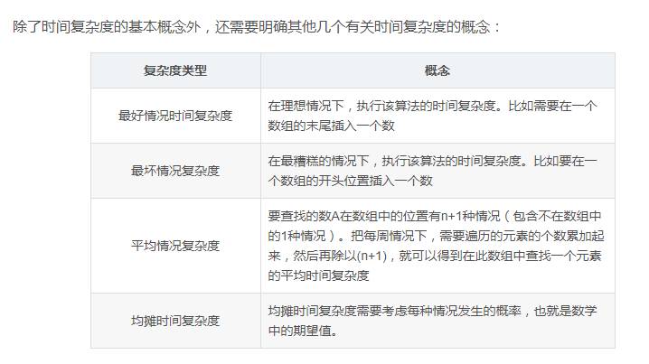

<!-- TOC -->

- [一、复杂度估计和算法排序（上）](#一复杂度估计和算法排序上)
    - [时间复杂度【最好情况时间复杂度、最坏情况时间复杂度、平均情况时间复杂度、均摊时间复杂度：需要考虑每种情况发生的概率，也就是数学中的期望值】](#时间复杂度最好情况时间复杂度最坏情况时间复杂度平均情况时间复杂度均摊时间复杂度需要考虑每种情况发生的概率也就是数学中的期望值)
    - [递归的时间复杂度估算-master公式](#递归的时间复杂度估算-master公式)
    - [排序对数器](#排序对数器)
    - [排序算法在工程中的应用](#排序算法在工程中的应用)
    - [排序的稳定性](#排序的稳定性)
    - [1、冒泡排序[时间复杂度O(N<sup>2</sup>),空间复杂度 O(1)，稳定]【通过比较交换，每次冒泡确定最后一个位置的元素】](#1冒泡排序时间复杂度onsup2sup空间复杂度-o1稳定通过比较交换每次冒泡确定最后一个位置的元素)
        - [1.1 冒泡排序的改进一：在外层循环里面加入一个标志变量change，如果在一次冒泡过程中发现没有发生数据交换，则认为当前数组已经有序，则改变change变量的值，不再进行接下来的冒泡。](#11-冒泡排序的改进一在外层循环里面加入一个标志变量change如果在一次冒泡过程中发现没有发生数据交换则认为当前数组已经有序则改变change变量的值不再进行接下来的冒泡)
    - [2、选择排序[O(N<sup>2</sup>), O(1)，不稳定]](#2选择排序onsup2sup-o1不稳定)
    - [3、插入排序[O(N)-O(N<sup>2</sup>), O(1)，稳定]](#3插入排序on-onsup2sup-o1稳定)
        - [3.1 希尔排序：也叫缩小增量排序【是插入排序的改进版本】【o(N)~o(NlogN)】](#31-希尔排序也叫缩小增量排序是插入排序的改进版本ononlogn)
    - [4、归并排序[时间复杂度O(NlogN), 额外空间复杂度O(N)，可以稳定]](#4归并排序时间复杂度onlogn-额外空间复杂度on可以稳定)
        - [4.1 归并排序的变体——小和问题和逆序对问题](#41-归并排序的变体小和问题和逆序对问题)
- [二、复杂度估计和排序算法（下）](#二复杂度估计和排序算法下)
    - [荷兰国旗问题[O(N), O(1)]](#荷兰国旗问题on-o1)
    - [5、经典快排和改进快排[O(NlogN), O(logN)，不稳定]【快速排序在大多数情况下都是适用的，尤其在数据量大的时候性能优越性更加明显，但它不是稳定的】](#5经典快排和改进快排onlogn-ologn不稳定快速排序在大多数情况下都是适用的尤其在数据量大的时候性能优越性更加明显但它不是稳定的)
        - [5.1 经典快排](#51-经典快排)
        - [5.2 改进快排](#52-改进快排)
            - [5.2.1 随机选择基准](#521-随机选择基准)
            - [5.2.2 序列较小时，使用插入排序代替快速排序](#522-序列较小时使用插入排序代替快速排序)
            - [5.2.3 重复元素较多时，使用三分区法【荷兰国旗】【利用随机+荷兰国旗】【通过划分让相等的元素连续地摆放，然后只对左侧小于V的序列和右侧大于V的序列进行排序。】](#523-重复元素较多时使用三分区法荷兰国旗利用随机荷兰国旗通过划分让相等的元素连续地摆放然后只对左侧小于v的序列和右侧大于v的序列进行排序)
    - [堆结构](#堆结构)
    - [6、堆排序【O(NlogN)，O(1)，不稳定】](#6堆排序onlogno1不稳定)
    - [7、桶排序 [时间复杂度O(N),空间复杂度O(N)]](#7桶排序-时间复杂度on空间复杂度on)
        - [7.1 桶排序的应用场景：比较适合用于外部排序：所谓的外部排序就是数据存储在外部磁盘中，数据量比较大，内存有限，无法将数据全部加载到内存中。](#71-桶排序的应用场景比较适合用于外部排序所谓的外部排序就是数据存储在外部磁盘中数据量比较大内存有限无法将数据全部加载到内存中)
    - [计数排序【时间复杂度O(n+k)，n是数据个数，k是桶个数；空间复杂度O(n+k)】:利用另外一个数组来计数实现排序【计数排序只能用在数据范围不大的场景中，如果数据范围k要比排序的数据n大很多，就不适合用计数排序了。而且计数排序只能给非负整数排序，如果排序的数据是其他数据类型，要将其在不改变相对大小的情况下，转化为非负整数。】](#计数排序时间复杂度onkn是数据个数k是桶个数空间复杂度onk利用另外一个数组来计数实现排序计数排序只能用在数据范围不大的场景中如果数据范围k要比排序的数据n大很多就不适合用计数排序了而且计数排序只能给非负整数排序如果排序的数据是其他数据类型要将其在不改变相对大小的情况下转化为非负整数)
    - [基数排序【时间复杂度O(2*k*n)，空间复杂度：采用链表是 O（n+d），d是基数的取值范围】](#基数排序时间复杂度o2kn空间复杂度采用链表是-ondd是基数的取值范围)
    - [数组排序后的最大差值问题](#数组排序后的最大差值问题)
    - [比较器](#比较器)
- [三、栈、队列、链表、数组、矩阵结构及相关常见面试题](#三栈队列链表数组矩阵结构及相关常见面试题)
    - [栈结构及面试](#栈结构及面试)
        - [题目一：用数组结构实现大小固定的队列和栈](#题目一用数组结构实现大小固定的队列和栈)
        - [题目二：能返回栈中最小元素的栈](#题目二能返回栈中最小元素的栈)
        - [题目三：仅用队列结构实现栈结构](#题目三仅用队列结构实现栈结构)
    - [队列结构及面试](#队列结构及面试)
        - [题目四：仅用栈结构实现队列结构](#题目四仅用栈结构实现队列结构)
        - [题目五：猫狗队列](#题目五猫狗队列)
    - [链表结构及面试](#链表结构及面试)
        - [基础：构建链表【包括基本的增删等】](#基础构建链表包括基本的增删等)
        - [题目八：反转单向和双向链表](#题目八反转单向和双向链表)
        - [题目十一：打印两个有序链表的公共部分【类似外排，荷兰国旗也用了外排】](#题目十一打印两个有序链表的公共部分类似外排荷兰国旗也用了外排)
        - [题目十二：判断一个链表是否为回文结构](#题目十二判断一个链表是否为回文结构)
        - [题目十三：将单向链表按某值划分成左边小、中间相等、右边大的形式【荷兰国旗】](#题目十三将单向链表按某值划分成左边小中间相等右边大的形式荷兰国旗)
        - [题目十四：复制含有随机指针节点的链表](#题目十四复制含有随机指针节点的链表)
        - [题目十五：两个单链表相交的一系列问题](#题目十五两个单链表相交的一系列问题)
            - [(1) 单链表是否有环](#1-单链表是否有环)
            - [(2) 两无环单链表是否相交](#2-两无环单链表是否相交)
            - [(3) 两有环单链表是否相交](#3-两有环单链表是否相交)
    - [数组结构及面试](#数组结构及面试)
    - [矩阵结构及面试——从宏观上实现（观察局部位置太复杂）](#矩阵结构及面试从宏观上实现观察局部位置太复杂)
        - [题目六：转圈打印矩阵【矩阵分圈处理】](#题目六转圈打印矩阵矩阵分圈处理)
        - [题目七：旋转正方形矩阵【矩阵分圈处理】](#题目七旋转正方形矩阵矩阵分圈处理)
        - [题目九：“之”字形打印矩阵【矩阵分斜线处理】](#题目九之字形打印矩阵矩阵分斜线处理)
        - [题目十：在行列都排好序的矩阵中找数【注意`都排好序`这个条件】](#题目十在行列都排好序的矩阵中找数注意都排好序这个条件)
- [四、二叉树](#四二叉树)
    - [题目一：实现二叉树的先序、中序、后序遍历，包括递归方式和非递归方式](#题目一实现二叉树的先序中序后序遍历包括递归方式和非递归方式)
        - [1 综： 递归思想**](#1-综-递归思想)
        - [1.1  先序、中序、后序遍历的递归版本](#11--先序中序后序遍历的递归版本)
        - [1.2先序、中序、后序遍历的非递归版本](#12先序中序后序遍历的非递归版本)
            - [1.2.1 先序【中左右】](#121-先序中左右)
            - [1.2.2 后序【左右中】【两个栈，由先序变来，先序中左右->中右左->左右中】](#122-后序左右中两个栈由先序变来先序中左右-中右左-左右中)
            - [1.2.3 中序【左中右】](#123-中序左中右)
    - [题目二：在二叉树中找到一个节点的后继节点](#题目二在二叉树中找到一个节点的后继节点)
    - [题目三、介绍二叉树的序列化和反序列化](#题目三介绍二叉树的序列化和反序列化)
    - [题目四、折纸问题](#题目四折纸问题)
    - [题目五、判断一棵二叉树是否是平衡二叉树](#题目五判断一棵二叉树是否是平衡二叉树)
        - [5.1 二叉树大套路：递归很好用【每个结点会来三次，不要去想什么先、中、后序，有没有打印递归都是存在的】](#51-二叉树大套路递归很好用每个结点会来三次不要去想什么先中后序有没有打印递归都是存在的)
        - [5.2 平衡二叉树：对任何一棵树，其左右子树高度差不超过1](#52-平衡二叉树对任何一棵树其左右子树高度差不超过1)
    - [题目六、判断一棵树是否是搜索二叉树、判断一棵树是否是完全二叉树](#题目六判断一棵树是否是搜索二叉树判断一棵树是否是完全二叉树)
        - [6.1 搜索二叉树：没有重复结点，对任何一节点，左子树都比它小，右子树都比它大](#61-搜索二叉树没有重复结点对任何一节点左子树都比它小右子树都比它大)
        - [6.2 完全二叉树：从左往右堆齐](#62-完全二叉树从左往右堆齐)
    - [题目七、已知一棵完全二叉树，求其节点的个数](#题目七已知一棵完全二叉树求其节点的个数)
- [五、哈希](#五哈希)
    - [模块一：认识哈希函数和哈希表](#模块一认识哈希函数和哈希表)
        - [1. 哈希函数：传入一个字符串，返回一个哈希码【十六进制，十六位，FFFF FFFF FFFF FFFF】](#1-哈希函数传入一个字符串返回一个哈希码十六进制十六位ffff-ffff-ffff-ffff)
            - [1.1 要求：](#11-要求)
            - [1.2 哈希函数特征](#12-哈希函数特征)
            - [1.3 如何实现1000个相互独立的哈希函数【规律不一样】 h= h1 + i * h2](#13-如何实现1000个相互独立的哈希函数规律不一样-h-h1--i--h2)
        - [2. 哈希表 【put(key,value), get(key), remove(key)】【复杂度数学上不是O(1)，但我们默认是 O(1),因为扩容次数很少，而且可以离线扩容】](#2-哈希表-putkeyvalue-getkey-removekey复杂度数学上不是o1但我们默认是-o1因为扩容次数很少而且可以离线扩容)
            - [2.1 离线扩容：用户有新数据，同步往新老结构放，使用get时，从老结构拿，直到扩容完毕，就启用新结构，废掉老结构【所以不需要让用户等】](#21-离线扩容用户有新数据同步往新老结构放使用get时从老结构拿直到扩容完毕就启用新结构废掉老结构所以不需要让用户等)
            - [2.2 开放地址法，拉链法，实际实现的时候是数组+红黑树](#22-开放地址法拉链法实际实现的时候是数组红黑树)
            - [2.3 应用：一个100T大文件，里面含字符串，要求你打印出所有重复的字符串](#23-应用一个100t大文件里面含字符串要求你打印出所有重复的字符串)
    - [题目一：设计RandomPool结构【默认哈希表的增、删、改、查都是 O(1)】](#题目一设计randompool结构默认哈希表的增删改查都是-o1)
    - [模块二：认识布隆过滤器【比特类型的一个Map，可以把所需内存压得很小】：解决爬虫驱虫问题、黑名单问题【检查是否处于这个集合的问题】](#模块二认识布隆过滤器比特类型的一个map可以把所需内存压得很小解决爬虫驱虫问题黑名单问题检查是否处于这个集合的问题)
        - [1. 举例：黑名单问题](#1-举例黑名单问题)
            - [1.1 将某个URL加入黑名单，将100亿个URL加入黑名单](#11-将某个url加入黑名单将100亿个url加入黑名单)
            - [1.2. 查某个URL是否在黑名单](#12-查某个url是否在黑名单)
            - [1.3 至少准备多大的容器：m = - (n * lnP) / (ln2)<sup>2</sup> 【由样本量和预期失误率决定】](#13-至少准备多大的容器m----n--lnp--ln2sup2sup-由样本量和预期失误率决定)
            - [1.4 计算需要多少个哈希函数 ：k = ln2 * (m / n)](#14-计算需要多少个哈希函数-k--ln2--m--n)
            - [1.5 我设计了 m 大小容器，k 个哈希函数，这种设计的真实失误率： （1 - e<sup>-(n*k)/m）</sup>）<sup>k</sup>](#15-我设计了-m-大小容器k-个哈希函数这种设计的真实失误率-1---esup-nkmsupsupksup)
    - [模块三：认识一致性哈希【是一种服务器设计】和虚拟节点技术](#模块三认识一致性哈希是一种服务器设计和虚拟节点技术)
        - [3.1 经典的服务器的抗压结构](#31-经典的服务器的抗压结构)
            - [3.1.1 场景：放数据，查数据，这个操作很频繁，怎样让它负载均衡](#311-场景放数据查数据这个操作很频繁怎样让它负载均衡)
            - [3.1.2 问题：当我想要加机器或者减机器的时候，这个结构就死了，跟哈希表扩容一样，数据需要全部重新分布【因为m变了，取余m 就肯定不一样了】](#312-问题当我想要加机器或者减机器的时候这个结构就死了跟哈希表扩容一样数据需要全部重新分布因为m变了取余m-就肯定不一样了)
        - [3.2 升级：一致性哈希结构 + 虚拟结点技术：在实现负载均衡的同时，把数据迁移的代价变得很低【有效地解决分布式存储结构下动态增加和删除节点所带来的问题】](#32-升级一致性哈希结构--虚拟结点技术在实现负载均衡的同时把数据迁移的代价变得很低有效地解决分布式存储结构下动态增加和删除节点所带来的问题)
            - [3.2.1 一致性哈希原理：](#321-一致性哈希原理)
            - [3.2.2 当缓存的节点有增加或删除的时候，一致性哈希的优势就显现出来了。](#322-当缓存的节点有增加或删除的时候一致性哈希的优势就显现出来了)
            - [3.2.2 一致性哈希算法引入了 虚拟节点 【迁移代价很低+负载均衡】](#322-一致性哈希算法引入了-虚拟节点-迁移代价很低负载均衡)
    - [模块四：认识并查集结构【时间复杂度：O(1)】](#模块四认识并查集结构时间复杂度o1)
        - [4.1 并查集功能【isSameSet，union】](#41-并查集功能issamesetunion)
            - [1） isSameSet:非常快的检查两个元素是否属于一个集合](#1-issameset非常快的检查两个元素是否属于一个集合)
            - [2） union: 将两个元素所属的集合合并在一起](#2-union-将两个元素所属的集合合并在一起)
            - [3） findHead时优化：任何一次查找头结点过程结束后，把这一条路径上的每个结点的父节点都改为头结点](#3-findhead时优化任何一次查找头结点过程结束后把这一条路径上的每个结点的父节点都改为头结点)
            - [4） 注意：](#4-注意)
                - [1.并查集结构必须一次性把数据给它，不支持流操作](#1并查集结构必须一次性把数据给它不支持流操作)
                - [2.并查集结构用两个HashMap来实现是最优的](#2并查集结构用两个hashmap来实现是最优的)
                - [3.样本为N，只要查询次数+合并次数 逼近于O(N)，则单次查询或合并的平均时间复杂度为O(1),即常数时间。](#3样本为n只要查询次数合并次数-逼近于on则单次查询或合并的平均时间复杂度为o1即常数时间)
        - [4.2 实现并查集](#42-实现并查集)
    - [题目二：岛问题 【矩阵很大时，用分治】](#题目二岛问题-矩阵很大时用分治)
- [六、前缀树、堆结构、贪心算法](#六前缀树堆结构贪心算法)
    - [1、前缀树Prefix Tree）,又叫字典树、Trie树，单词查找树或键树，是一种多叉树结构](#1前缀树prefix-tree又叫字典树trie树单词查找树或键树是一种多叉树结构)
        - [1.1 前缀树题目举例：一个字符串类型的数组arr1，另一个字符串类型的数组arr2。](#11-前缀树题目举例一个字符串类型的数组arr1另一个字符串类型的数组arr2)
            - [题目一、 arr2中有哪些字符，是arr1中出现的？请打印](#题目一-arr2中有哪些字符是arr1中出现的请打印)
            - [题目二、arr2中有哪些字符，是作为arr1中某个字符串前缀出现的？请打印](#题目二arr2中有哪些字符是作为arr1中某个字符串前缀出现的请打印)
            - [题目三、arr2中有哪些字符，是作为arr1中某个字符串前缀出现的？请打印arr2中出现次数最大的前缀。](#题目三arr2中有哪些字符是作为arr1中某个字符串前缀出现的请打印arr2中出现次数最大的前缀)
        - [1.2 前缀树的insert、delete、search、prefixNum方法代码:代码相似度很高，前半部分基本一样，都是从root开始遍历](#12-前缀树的insertdeletesearchprefixnum方法代码代码相似度很高前半部分基本一样都是从root开始遍历)
    - [2、堆结构的扩展与应用【经常用于贪心】](#2堆结构的扩展与应用经常用于贪心)
    - [3、贪心算法：你自己想出贪心策略，但只能感觉它对不对，理论证明放弃吧](#3贪心算法你自己想出贪心策略但只能感觉它对不对理论证明放弃吧)
        - [题目七：按最低字典序拼接字符串](#题目七按最低字典序拼接字符串)
        - [题目四：切分金条总代价最小](#题目四切分金条总代价最小)
        - [题目五：最多做K个项目的最大利润](#题目五最多做k个项目的最大利润)
        - [题目八：安排最多的宣讲场次](#题目八安排最多的宣讲场次)
        - [题目六：一个数据流中，随时可以取得中位数【未】](#题目六一个数据流中随时可以取得中位数未)
- [七、暴力递归和动态规划](#七暴力递归和动态规划)
    - [1. 递归](#1-递归)
        - [1.1 暴力递归的步骤](#11-暴力递归的步骤)
        - [题目二：汉诺塔问题](#题目二汉诺塔问题)
        - [题目二：打印一个字符串的全部子序列，包括空字符串【每个结点i：有 要 和 不要 两种选择，之后的随意选择要或不要】](#题目二打印一个字符串的全部子序列包括空字符串每个结点i有-要-和-不要-两种选择之后的随意选择要或不要)
        - [题目三：](#题目三)
            - [3.1 打印一个字符串的全部排列【每个结点i：有i~n-1种选择，之后的随意排序】](#31-打印一个字符串的全部排列每个结点i有in-1种选择之后的随意排序)
            - [3.2 进阶：打印一个字符串的全部排列，要求不要出现重复的排列](#32-进阶打印一个字符串的全部排列要求不要出现重复的排列)
        - [题目四：](#题目四)
            - [4.1 母牛每年生一只母牛，新出生的母牛成长三年后也能每年生一只母牛，假设不会死。求N年后，母牛的数量。（O(N)）](#41-母牛每年生一只母牛新出生的母牛成长三年后也能每年生一只母牛假设不会死求n年后母牛的数量on)
            - [4.2 如果每只母牛只能活10年，求N年后，母牛的数量。](#42-如果每只母牛只能活10年求n年后母牛的数量)
        - [题目六：给你一个栈，请你逆序这个栈，不能申请额外的数据结构，只能使用递归函数。如何实现？](#题目六给你一个栈请你逆序这个栈不能申请额外的数据结构只能使用递归函数如何实现)
    - [2. 动态规划（动态规划是从basecase往上推得到 n ，而递归是从 n 推到basecase再一个一个的返回来得到 n 的结果）](#2-动态规划动态规划是从basecase往上推得到-n-而递归是从-n-推到basecase再一个一个的返回来得到-n-的结果)
        - [1.2 动态规划的特点:](#12-动态规划的特点)
    - [3. 如何把暴力递归套路变为动态规划](#3-如何把暴力递归套路变为动态规划)
        - [题目七：矩阵最小路径和](#题目七矩阵最小路径和)
            - [7.1 递归版本](#71-递归版本)
            - [7.2 记忆化搜索版本，即加一个缓存，记录所有的子状态，每次递归前先看子状态之前算过没有](#72-记忆化搜索版本即加一个缓存记录所有的子状态每次递归前先看子状态之前算过没有)
            - [7.3 动态规划版本：考虑状态之间的依赖关系](#73-动态规划版本考虑状态之间的依赖关系)
        - [题目八（背包问题）：从数组任意选择数字，能不能累加得到aim](#题目八背包问题从数组任意选择数字能不能累加得到aim)
            - [8.1 递归版本](#81-递归版本)
            - [8.2 动态规划版本](#82-动态规划版本)
        - [题目九（背包问题）： 重量不超过bag](#题目九背包问题-重量不超过bag)
            - [9.1 递归版本](#91-递归版本)
            - [9.2 动态规划版本](#92-动态规划版本)
    - [总结（自己）：对每个位置进行选择，有 N 个位置，递归处理这类问题，它们所有可能结果都会出现在叶节点***，可以把递归想象成一棵树，每次basecase返回的时候就出现了一个叶节点，它的上一次递归就是其父节点，父节点会对递归返回来其叶节点信息进行决策这些（或不返回信息，父结点可能有1个2个3个。。。叶节点等等），不断的把决策一层层的返回根节点，最后 根 对比其子节点，进行决策，结果返回给我们。这类型的题目有：](#总结自己对每个位置进行选择有-n-个位置递归处理这类问题它们所有可能结果都会出现在叶节点可以把递归想象成一棵树每次basecase返回的时候就出现了一个叶节点它的上一次递归就是其父节点父节点会对递归返回来其叶节点信息进行决策这些或不返回信息父结点可能有1个2个3个叶节点等等不断的把决策一层层的返回根节点最后-根-对比其子节点进行决策结果返回给我们这类型的题目有)
        - [题目二：打印一个字符串的全部子序列，包括空字符串【每个结点i：有 要 和 不要 两种选择；叶节点不用返回给父节点信息，它直接打印每个叶节点结果】；](#题目二打印一个字符串的全部子序列包括空字符串每个结点i有-要-和-不要-两种选择叶节点不用返回给父节点信息它直接打印每个叶节点结果)
        - [题目三：打印一个字符串的全部排列（不出现重复的排列）【每个结点i：有i~n-1种选择；叶节点不用返回给父节点信息，它直接打印每个叶节点结果】；](#题目三打印一个字符串的全部排列不出现重复的排列每个结点i有in-1种选择叶节点不用返回给父节点信息它直接打印每个叶节点结果)
        - [题目七：矩阵最小路径和【每个位置有右和下两种选择，除了最后一行和最后一列；叶节点的结果是它这个情况的路径和，向父结点返回这个路径和，父结点比较子节点的结果，选择最小的作为自己的路径和，向其父结点返回...】](#题目七矩阵最小路径和每个位置有右和下两种选择除了最后一行和最后一列叶节点的结果是它这个情况的路径和向父结点返回这个路径和父结点比较子节点的结果选择最小的作为自己的路径和向其父结点返回)
        - [题目八：从数组任意选择数字，能不能累加得到aim【每个位置有 要和不要 两种选择；叶节点的结果是true或false（叶节点会看自己这里的结果是不是aim，从而向父结点返回true或false），父结点比较子节点的结果，根据子节点相或得到true或false作为自己的值，向其父结点返回...；】](#题目八从数组任意选择数字能不能累加得到aim每个位置有-要和不要-两种选择叶节点的结果是true或false叶节点会看自己这里的结果是不是aim从而向父结点返回true或false父结点比较子节点的结果根据子节点相或得到true或false作为自己的值向其父结点返回)
        - [题目九：重量不超过bag【每个东西有 要和不要 两种选择；叶节点的结果是它这个情况的价值和，向父结点返回这个价值和，父结点比较子节点的结果，根据子节点选择最大的作为自己的价值和，向其父结点返回...】](#题目九重量不超过bag每个东西有-要和不要-两种选择叶节点的结果是它这个情况的价值和向父结点返回这个价值和父结点比较子节点的结果根据子节点选择最大的作为自己的价值和向其父结点返回)
- [第八章：图算法：不管有向图还是无向图都可以用无向图表达](#第八章图算法不管有向图还是无向图都可以用无向图表达)
    - [8.1 图的存储方式：如何表达图？生成图？](#81-图的存储方式如何表达图生成图)
        - [8.1.1 经典表达方式](#811-经典表达方式)
            - [1）邻接表：某个结点的邻居是谁](#1邻接表某个结点的邻居是谁)
            - [2）邻接矩阵：一个矩阵【行和列就是结点】，没有路就是无穷大](#2邻接矩阵一个矩阵行和列就是结点没有路就是无穷大)
        - [8.1.2 面试表达方式：基本能解决所有图算法的结构描述](#812-面试表达方式基本能解决所有图算法的结构描述)
        - [大套路：1、一个图拥有点集和边集，如果题目只用到点集合，那么只需构建一个HashMap<Integer,Node> nodes；用到边集，就构建HashSet<Edge> edges;--->2、至于Node:一般value和nexts是需要的，至于in,out,edges,用到哪个才构建哪个----->3、题目一般给一个数组，一个由一条条边组成的数组，一条边[7,5,4]表示权重为7，从结点5指向结点4，你做的第一步就是看是要用到点集还是边集，然后构建点集或边集，然后再看Node需要什么，in,out,nexts,edges等](#大套路1一个图拥有点集和边集如果题目只用到点集合那么只需构建一个hashmapintegernode-nodes用到边集就构建hashsetedge-edges---2至于node一般value和nexts是需要的至于inoutedges用到哪个才构建哪个-----3题目一般给一个数组一个由一条条边组成的数组一条边754表示权重为7从结点5指向结点4你做的第一步就是看是要用到点集还是边集然后构建点集或边集然后再看node需要什么inoutnextsedges等)
            - [题目一：1Graph结构：拥有点集和边集【 HashMap<Integer,Node> nodes;HashSet<Edge> edges; 】](#题目一1graph结构拥有点集和边集-hashmapintegernode-nodeshashsetedge-edges-)
                - [1）点的结构Node：包含value、in(入度)、out（出度）、nexts(从我出发的邻居结点)、edges(从我出发的边的集合)](#1点的结构node包含valuein入度out出度nexts从我出发的邻居结点edges从我出发的边的集合)
                - [2）边的结构Edge：包含weight、Node from、Node to](#2边的结构edge包含weightnode-fromnode-to)
            - [题目二、给你一个数组，你生成图](#题目二给你一个数组你生成图)
    - [8.2 题目三、宽度优先遍历 bfs：利用队列实现 ,从一个node出发遍历【近的先输出，远的后输出，要记录有哪些点已经进过队列了，因为可能有环的存在【这就导致在前面的结点可能还会被后面的结点指着，所以要标记，用set】】【从一个节点遍历的 bfs 只需要 nexts，但如果是要遍历整个图，就需要点集hashmap了】](#82-题目三宽度优先遍历-bfs利用队列实现-从一个node出发遍历近的先输出远的后输出要记录有哪些点已经进过队列了因为可能有环的存在这就导致在前面的结点可能还会被后面的结点指着所以要标记用set从一个节点遍历的-bfs-只需要-nexts但如果是要遍历整个图就需要点集hashmap了)
        - [8.2.1 bfs单词接龙 【从一个节点出发的 bfs 只需要每个节点的nexts】](#821-bfs单词接龙-从一个节点出发的-bfs-只需要每个节点的nexts)
    - [8.3 深度优先遍历 ：利用栈实现 ：我这个结点下所有的路都走过我才弹出,一路走到头，不撞墙不回头](#83-深度优先遍历-利用栈实现-我这个结点下所有的路都走过我才弹出一路走到头不撞墙不回头)
        - [8.3.1 应用：被围绕的区域【和前面岛屿个数问题一样】【dfs需要nexts，但因为这里一个节点的nexts就是它的上下左右，以及能直接获得了，所以不需要我们构建】](#831-应用被围绕的区域和前面岛屿个数问题一样dfs需要nexts但因为这里一个节点的nexts就是它的上下左右以及能直接获得了所以不需要我们构建)
    - [8.4 拓扑排序算法：适用范围：有向图，且无环。【因为如果无向图，就是1->2,2->1这是环，所以必须有向图】 【拓扑排序点集HashMap，对于Node需要 邻接点nexts，以及节点的入度】](#84-拓扑排序算法适用范围有向图且无环因为如果无向图就是1-22-1这是环所以必须有向图-拓扑排序点集hashmap对于node需要-邻接点nexts以及节点的入度)
        - [8.4.1 应用：拓扑排序通常用来“排序”具有依赖关系的任务。比如编译原理](#841-应用拓扑排序通常用来排序具有依赖关系的任务比如编译原理)
        - [8.4.2 题目：](#842-题目)
    - [8.5 最小生成树算法：无向图  :在保证这个图所有点都连通的情况下，需要的权重最小的边的 集合。有kruskal和Prim算法，返回的都是边的集合](#85-最小生成树算法无向图--在保证这个图所有点都连通的情况下需要的权重最小的边的-集合有kruskal和prim算法返回的都是边的集合)
        - [8.5.1 Prim算法和Kruskal算法的在实现方面的区别：](#851-prim算法和kruskal算法的在实现方面的区别)
        - [8.5.2 kruskal算法：依次选小权重的边，如果选完后没有形成回路就要它，如果形成回路就不要。【并查集】](#852-kruskal算法依次选小权重的边如果选完后没有形成回路就要它如果形成回路就不要并查集)
        - [8.5.3 prim算法：从树发出的边中选择最小的带着新点的边，再把新点的边加入优先队列，重复上面步骤 【没有考虑复杂度，因为无向图，所以边基本都双向都加过，你也可以考虑】](#853-prim算法从树发出的边中选择最小的带着新点的边再把新点的边加入优先队列重复上面步骤-没有考虑复杂度因为无向图所以边基本都双向都加过你也可以考虑)
    - [8.6 Dijkstra算法 适用范围：没有权值为负数的边](#86-dijkstra算法-适用范围没有权值为负数的边)
- [九 、二分查找【一种查询效率非常高的查询算法，又称为折半查找。】](#九-二分查找一种查询效率非常高的查询算法又称为折半查找)
    - [9.1 基本的二分查找：O(logn)，不能处理含重复数据的数组](#91-基本的二分查找ologn不能处理含重复数据的数组)
    - [9.2 二分查找的变形【能在有重复元素的有序集合中进行查找操作】](#92-二分查找的变形能在有重复元素的有序集合中进行查找操作)
        - [1）查找第一个值等于给定值的元素](#1查找第一个值等于给定值的元素)
        - [2) 查找最后一个值等于给定值的元素](#2-查找最后一个值等于给定值的元素)
        - [3) 查找第一个大于等于给定值的元素](#3-查找第一个大于等于给定值的元素)
        - [4) 查找最后一个小于等于给定值的元素](#4-查找最后一个小于等于给定值的元素)

<!-- /TOC -->

# 一、复杂度估计和算法排序（上）
## 时间复杂度【最好情况时间复杂度、最坏情况时间复杂度、平均情况时间复杂度、均摊时间复杂度：需要考虑每种情况发生的概率，也就是数学中的期望值】
  * 时间复杂度为一个算法流程中，常数操作数量的指标。常用O（读作big O）来表示。具体来说，在常数操作数量的表达式中，只要高阶项，不要低阶项，也不要高阶项的  系数，剩下的部分如果记为f(N)，那么时间复杂度为O(f(N))。  
  * 常数时间的操作：一个操作如果和数据量没有关系，每次都是固定时间内完成的操作，叫做常数操作,O(1)。<br>
  
 时间复杂度由小到大依次为：


## 递归的时间复杂度估算-master公式

  * 如果一个递归行为的时间复杂度公式为以下形式，即为master公式，可直接推出时间复杂度
     * T(N) = a*T(N/b) + O(N<sup>d</sup>)【master公式】
     * log<sub>b</sub>a > d -> 复杂度为O(N<sup>log<sub>b</sub>a</sup>)
     * log<sub>b</sub>a = d -> 复杂度为O(N<sup>d</sup> * logN) 
     * log<sub>b</sub>a < d -> 复杂度为O(N<sup>d</sup>)

  *  //比如归并排序T(N)=2T(N/2)+O(N)，b=2,a=2,d=1,因为log<sub>2</sub>2=1=d,所以时间复杂度为O(NlogN)<br>

## 排序对数器

  * 用于检查自己的排序是否有错误<br>
  1.有一个你想要测的方法a，<br>
  2.实现一个绝对正确但是复杂度不好的方法b，<br>
  3.实现一个随机样本产生器<br>
  4.实现比对的方法<br>
  5.把方法a和方法b比对很多次来验证方法a是否正确。<br>
  6.如果有一个样本使得比对出错，打印样本分析是哪个方法出错<br>
  7.当样本数量很多时比对测试依然正确，可以确定方法a已经正确。<br>
```Java
import java.util.Arrays;

public class Main {
    //排序对数器：测试所编写的排序方法是否正确
    public static void main(String[] args) {
        int testTime = 5000;                                    //测试次数
        int maxSize = 100;                                      //数组大小
        int maxValue = 100;                                     //值大小
        boolean succeed = true;                                 //若不正确则返回false
        for (int i = 0; i < testTime; i++) {
            int[] arr1 = generateRandomArray(maxSize, maxValue);//生成大小和值大小都随机的数组
            int[] arr2 = copyArray(arr1);
            BublleSort.bublleSort(arr1);                        //自己编写的方法将arr1排序
            comparator(arr2);                                   //一个绝对正确的方法将arr2排序
            if (!isEqual(arr1, arr2)) {
                succeed = false;
                break;
            }
        }
        System.out.println(succeed ? "Nice!" : "Fucking fucked!");

        int[] arr = generateRandomArray(maxSize, maxValue);
        printArray(arr);
        System.out.println();
        BublleSort.bublleSort(arr);
        printArray(arr);
    }


    //一个绝对正确的方法将arr2排序
    public static void comparator(int[] arr) {
        Arrays.sort(arr);
    }

    //生成大小和值大小都随机的数组
    public static int[] generateRandomArray(int maxSize, int maxValue) {
        int[] arr = new int[(int) ((maxSize + 1) * Math.random())];
        for (int i = 0; i < arr.length; i++) {
            arr[i] = (int) ((maxValue + 1) * Math.random()) - (int) (maxValue * Math.random());
        }
        return arr;
    }

    //复制数组
    public static int[] copyArray(int[] arr) {
        if (arr == null) {
            return null;
        }
        int[] res = new int[arr.length];
        for (int i = 0; i < arr.length; i++) {
            res[i] = arr[i];
        }
        return res;
    }

    //查看自己写的方法和正确方法结构是否一样
    public static boolean isEqual(int[] arr1, int[] arr2) {
        if ((arr1 == null && arr2 != null) || (arr1 != null && arr2 == null)) {
            return false;
        }
        if (arr1 == null && arr2 == null) {
            return true;
        }
        if (arr1.length != arr2.length) {
            return false;
        }
        for (int i = 0; i < arr1.length; i++) {
            if (arr1[i] != arr2[i]) {
                return false;
            }
        }
        return true;
    }

    //打印数组
    public static void printArray(int[] arr) {
        if (arr == null) {
            return;
        }
        for (int i = 0; i < arr.length; i++) {
            System.out.print(arr[i] + " ");
        }
        System.out.println();
    }
}
```
## 排序算法在工程中的应用

* 综合排序：
    * 数组长度短（<60）：直接用插入排序，因为插入排序的常数项极低
    * 数组长度长；先判断数据类型
        * 基础类型：用快速排序，因为基础类型不用区分原始顺序（不需要稳定，因为相同值无差异）
        * 引用类型：用归并排序，因为原始顺序是有用的


## 排序的稳定性
* 排序的稳定性:如果一个排序算法能够保留数组中重复元素的相对位置则可以被称为稳定的。
* 稳定性的意义：现实应用的需求，要求保留原始次序，比如：一个客户有身高和体重两个信息，对很多客户进行排序，先依据身高排序，再根据体重排序，如果具有稳定性，那么身高的排序信息能被保留（如果体重一样的话）
* 时间复杂度：
    * O(N<sup>2</sup>)：基于比较
      * 冒泡排序（稳定）
      * 选择排序（不稳定）
      * 插入排序（稳定）<br>
    * O(NlogN)：基于比较
      * 归并排序（可以稳定，只要merge的时候遇到相等，先拷贝左边，再拷贝右边即可）
      * 快速排序（不稳定，因为partition做不到稳定）
      * 堆排序（不稳定，因为交换过程中控制不住相等值）
    * O(N):不是基于比较
        * 桶排序(稳定)
        * 计数排序（稳定）
        * 基数排序（稳定）


## 1、冒泡排序[时间复杂度O(N<sup>2</sup>),空间复杂度 O(1)，稳定]【通过比较交换，每次冒泡确定最后一个位置的元素】

  * 时间复杂度:O(N<sup>2</sup>)<br>
    * 等差数列的和Sn=n(a1+an)/2；第一个冒泡放在最后要n-1次交换，第二次n-2次，一直到1,所以复杂度是 (n-1)(1+n-1)/2 = O(n^2)
  * 额外空间复杂度：O(1)
  * 原理：N个元素，相邻两个元素比较大小，前者大则交换位置，一轮结束后，最大的元素则到了本轮的最末位置，不再变动；再对前面N-1个元素再进行同样的操作，进而每轮把最大的元素扔在最后。【通过比较交换，每次冒泡确定最后一个位置的元素】<br>
  
```Java
public class BublleSort {
    public static void bublleSort(int[] arr) {
        if(arr == null || arr.length<2)   //当元素小于两个，即没有或只有一个，肯定不用排序了
            return;

        for(int i=arr.length-1 ; i>0 ; i--){
            for(int j=0 ; j<i;j++){   //遇到==不交换，所以可以保持稳定
                if(arr[j] > arr[j+1])
                swap(arr,j,j+1);
            }
        }

    }

    private static void swap(int[] arr, int j, int i) {
        int temp=arr[j];
        arr[j]=arr[i];
        arr[i]=temp;
    }
}

```
### 1.1 冒泡排序的改进一：在外层循环里面加入一个标志变量change，如果在一次冒泡过程中发现没有发生数据交换，则认为当前数组已经有序，则改变change变量的值，不再进行接下来的冒泡。
* 如果你手写过上面冒泡排序的代码，你会发现，它的实现过程优点傻傻的感觉，它的想法就是：不管你本身有序还是无序，每个位置上的元素都会和相邻元素相互比较一次，再决定要不要进行位置交换。很明显这样的一个排序过程中有很多次的比较都是多余的，比如数组A = {4 ，3，5，7，8，9}，很明显只需要将4和3的位置交换一次，再用4和后面的元素进行比较，就会发现这个数组已经有序了，就没有必要再进行剩下的4趟冒泡了。
* 当原始数据元素正序排列时，冒泡排序的比较次数为n-1，移动次数为0，即最好情况时间复杂度为：O(n)

* 当原始数据元素逆序排列时，冒泡排序的比较次数为n(n-1)/2，移动次数为3n(n-1)/2，所以最坏时间复杂度为：O(n^2)

* 当原始数据元素杂乱无序时，冒泡排序的平均时间复杂度为：O(n^2)
```java
  public static void bublleSort1(int[] arr){
        if(arr == null || arr.length<2){
            return;
        }
        boolean changed = true;
        //用于标志此次冒泡是否交换了位置，true表示改变了，
        // false表示没改变，没改变则意味着数组有序了，不用再继续冒泡了
        for (int i=arr.length-1 ; i>0 && changed == true; i--){
            changed = false;
            for (int j = 0; j<i; j++){
                if(arr[j] > arr[j+1]){
                    swap(arr,j,j+1);
                    changed = true;
                }
            }
        }
    }
```
## 2、选择排序[O(N<sup>2</sup>), O(1)，不稳定]

  * 时间复杂度：O(N<sup>2</sup>)<br>
    * 当原始序列正序时，也需要进行：(n-1) + (n-2) + 2 + 1次比较和0次位置交换，所以最好情况复杂度为：O(N<sup>2</sup>)

    * 当原始序列逆序时，需要进行：(n-1) + (n-2) + 2 + 1次比较和n-1次位置交换，所以最坏情况时间复杂度为：O(N<sup>2</sup>)

    * 当原始序列无序时，其平均时间复杂度为：O(N<sup>2</sup>)
  * 额外空间复杂度：O(1)
  * 原理：进行N轮，每轮把最小的元素放在最前面：0-N 找最小的元素放在0位置；1-N 找最小的元素放在1位置<br>

```Java
  public class SelectionSort {
    public static void selectionSort(int[] arr){
        if(arr==null || arr.length<2)
            return;

        for(int i=0; i<arr.length-1;i++){
            int minIndex=i;
            for(int j=i+1;j<arr.length;j++){
                if (arr[minIndex] > arr[j])
                    minIndex=j;
            }
            swap(arr,minIndex,i);
        }
    }

    private static void swap(int[] arr, int j, int i) {
        int temp=arr[j];
        arr[j]=arr[i];
        arr[i]=temp;
    }
}
```

 
## 3、插入排序[O(N)-O(N<sup>2</sup>), O(1)，稳定]

   * 时间复杂度：<br>
     1.当原始序列正序时，直接插入排序效果最好，所有元素只需要进行一次比较（不包含第一个元素），所以共计n-1次比较，并且无需进行位置交换操作，所以直接插入排序最好情况复杂度为O(N)<br>
     2.当原始序列逆序时，直接插入排序效果最差，所以需要进行1+2+3+...+(n-1)次比较以及1+2+3+n-1次位置交换（往后挪一位），所以最坏情况时间复杂度为O(N<sup>2</sup>)<br>
     3.当原始数据元素杂乱无序时，相当于在数组中插入一个数据(时间复杂度为O(n))，循环执行n次操作，所以直接插入排序的平均时间复杂度为：O(N<sup>2</sup>)
   * 额外空间复杂度：O(1)
   * 原理：相当于一副牌，每抓一张，往前面正确的位置插入。第一张牌因为只有一张所以不用排序，于是依次找第二张牌、第三张、第四张、、、的位置【顺序地把待排序的序列中的各个元素按照其关键字的大小，插入到已排序的序列中的适当位置。】[用一个枢轴元素(tmp)将当前元素先保存起来，然后执行移动操作，待确定了最终位置后，再将当前元素放入合适的位置，而如果用交换，一次交换要三次赋值，移动操作只需要一次赋值]
   
```java
  public class InsertionSort {
    public static void insertSort(int[] arr){
        if(arr==null || arr.length<2)
            return;

        for(int i = 1; i< arr.length; i++){
            int temp = arr[i];
            int j = i-1; // 看 j 这个位置要不要挪到后面
            for ( ; j>=0 && arr[j] > temp; j--){ //只有大于temp才需挪后面一位，此时相当于temp占用了它的位置，即相当于交换
                arr[j+1] = arr[j];
            }
            arr[j+1] = temp; // 这里就是该放的位置
        }
    }
}

```
### 3.1 希尔排序：也叫缩小增量排序【是插入排序的改进版本】【o(N)~o(NlogN)】
* 算法思想：希尔排序是把记录按下标的一定增量分组，对每组使用直接插入排序算法排序；随着增量逐渐减少，每组包含的关键词越来越多，当增量减至1时，整个文件恰被分成一组，算法便终止。【优点：让关键字值小的元素能很快前移，且序列若基本有序时，再用直接插入排序处理，时间效率会高很多。】【希尔排序的一个重要性质是，一个h(k)排序的文件保持它的h(k)排序性，否则该算法没有任何意义，因为前面各趟排序的结果会被后面各趟排序给打乱。】
    * 简单插入排序很循规蹈矩，不管数组分布是怎么样的，依然一步一步的对元素进行比较，移动，插入，比如[5,4,3,2,1,0]这种倒序序列，数组末端的0要回到首位置很是费劲，比较和移动元素均需n-1次。而希尔排序在数组中采用跳跃式分组的策略，通过某个增量将数组元素划分为若干组，然后分组进行插入排序，随后逐步缩小增量，继续按组进行插入排序操作，直至增量为1。希尔排序通过这种策略使得整个数组在初始阶段达到从宏观上看基本有序，小的基本在前，大的基本在后。然后缩小增量，到增量为1时，其实多数情况下只需微调即可，不会涉及过多的数据移动。
    * 我们来看下希尔排序的基本步骤，在此我们选择增量gap=length/2，缩小增量继续以gap = gap/2的方式，这种增量选择我们可以用一个序列来表示，{n/2,(n/2)/2...1}，称为增量序列。希尔排序的增量序列的选择与证明是个数学难题，我们选择的这个增量序列是比较常用的，也是希尔建议的增量，称为希尔增量，但其实这个增量序列不是最优的。此处我们做示例使用希尔增量。
* 时间复杂度：希尔排序的性能无法准确量化，跟输入的数据有很大关系，在实际应用中也不会用它，因为十分不稳定，虽然比传统的插入排序快，但比快速排序等慢，其时间复杂度介于O(nlogn) 到 O(n^2) 之间
* 因为插入排序过程中，元素两两交换，相同元素的前后顺序发生了改变，所以希尔排序是一种非稳定的排序算法


```java
    public static void shellSort(int[] arr){
        if(arr == null || arr.length <2){
            return;
        }
        for(int gap=arr.length/2; gap>0; gap /=2){
            for(int i = gap; i< arr.length; i++){
                int temp = arr[i];
                int j = i-gap; // 看 j 这个位置要不要挪到后面
                for ( ; j>=0 && arr[j] > temp; j-=gap){ //只有大于temp才需挪后面一位，此时相当于temp占用了它的位置，即相当于交换
                    arr[j+gap] = arr[j];
                }
                arr[j+gap] = temp; // 这里就是该放的位置
            }
        }
    }
```
## 4、归并排序[时间复杂度O(NlogN), 额外空间复杂度O(N)，可以稳定]

  * 时间复杂度：O(NlogN)：T(N)=2T(N/2)+O(N),其中O(N)为merge操作的时间复杂度，此递归算式符合master公式，直接得到时间复杂度为O(NlogN)
  * 额外空间复杂度：O(N)
  * 原理：采用分治的思想，分为左右分别排序，再进行整体归并 
    * 归并排序使用的就是分治思想。分治，顾名思义就是分而治之，将一个大问题分解成小的问题来解决，小的问题解决了，大的问题自然也就解决了。分治思想和递归思想很像，实际上分治算法一般都是用递归来实现的。分治是一种解决问题的处理思想，递归是一种编程技巧。归并排序采用的就是分治思想，可以用递归代码实现。
```java
package day1;
  
public class MergeSort {
    public  static  void mergeSort(int[] arr){
        if(arr==null || arr.length<2)
            return;
        mergeSort(arr,0,arr.length-1);           //递归进行归并排序
    }

    private static void mergeSort(int[] arr, int l, int r) {
        if (l==r)                               //说明已经到树梢了，只有一个元素，所以不用排序
            return;
        /** 右移一位相当于除了2，（l+r）/2 ,因为l和r都是下标，可能有溢出的风险,位运算比算数运算快*/
        int mid=l+((r-l)>>1);
        mergeSort(arr,l,mid);                  //对左边进行排序
        mergeSort(arr,mid+1,r);                //对右边进行排序
        merge(arr,l,mid,r);                    //进行归并排序
    }

    private static void merge(int[] arr, int l, int mid, int r) {
        int p1=l;                               //左边数组的起始下标
        int p2=mid+1;                            // 右边数组的起始下标
        int i=0;
        int[] help=new int[r-l+1];              //所需的额外空间，用于存放排好序的数组
        while (p1<=mid && p2<=r) {              //当左右数组都没有溢出各自范围时,除了循环就说明有一边已经全部放入help数组中了
            help[i++]=(arr[p1]<arr[p2])?arr[p1++]:arr[p2++];
        }
        while (p1<=mid){                      //说明溢出的是P2，那么就是右边已经全部放入help中了，所以现在要把左边全部放入数组
            help[i++]=arr[p1++];
        }
        while(p2<=r){                         //说明溢出的是P1
            help[i++]=arr[p2++];
        }
        /** 至此，左右两边数组的元素都排好序放入辅助数组help了，我们再将它放入arr即可 */
        for(i=0; i<help.length;i++) {            //切记不可以是i<arr.length,因为这是递归，每个子进程的范围都不一样
            arr[l+i]=help[i];                    //help和arr的数组大小是不一样的，所以只能这样
        }
    }
}

```
### 4.1 归并排序的变体——小和问题和逆序对问题

   * 小和问题
```
问题：
在一个数组中，每一个数左边比当前数小的数累加起来，叫做这个数组的小和。求一个数组的小和。
例子：
[1,3,4,2,5]
1左边比1小的数，没有；
3左边比3小的数，1；
4左边比4小的数，1、3；
2左边比2小的数，1；
5左边比5小的数，1、3、4、2；
所以小和为1+1+3+1+1+3+4+2=16
```

   * 原理： 实质就是对每个数找右边有多少个数比它大。设小和为res，对于左边数组的每一个数i，归并的时候看右边数组有多少比它大(不能再看左边本身比它大的了，因为之前已经归并过计算过了)，然后res+i*个数,直到最后全部归并完成，把下面的红色算式全部加起来就是小和<br>
     <br>
 
```Java
package day1;

public class SmallSum {
    public static int smallSum(int[] arr){
        if(arr==null || arr.length<2)
            return 0;           //****只有一个或者是null的时候没有小和，即为0
        return mergeSort(arr,0,arr.length-1);
    }

    public static int mergeSort(int[] arr, int l, int r) {
        if(l==r)
            return 0;           //****到树梢了，只有一个元素，小和为0
        int mid=l+((r-l)>>1);
        return mergeSort(arr,l,mid)
                +mergeSort(arr,mid+1,r)
                +merge(arr,l,mid,r);    //****左边归并得到的小和+右边归并得到的小和+左右归并得到的小和
    }

    public static int merge(int[] arr,int l,int mid,int r){
        int p1=l;
        int p2=mid+1;
        int i=0;
        int[] help=new int[r-l+1];
        int res=0;               //****用于存放小和
        while (p1<=mid && p2<=r) {
            /**  //****左边数小，则左边数就是小和，右边数小，因为它在右边，所以不符合小和的定义 */
            res+=(arr[p1]<arr[p2])?(r-p2+1)*arr[p1]:0;
            help[i++]=(arr[p1]<arr[p2])?arr[p1++]:arr[p2++];
        }
        while (p1<=mid){
            help[i++]=arr[p1++];
        }
        while(p2<=r) {
            help[i++] = arr[p2++];
        }
        for(i=0; i<help.length;i++) {
            arr[l+i]=help[i];
        }
        return res;        //****返回小和
    }
}
```
   * 逆序对问题
 
    * 【问题描述】：在数组中的两个数字，如果前面一个数字大于后面的数字，则这两个数字组成一个逆序对。输入一个数组,求出这个数组中的逆序对的总数P。并将P对1000000007取模的结果输出。 即输出P%1000000007

     * 原理：实质就是对右边的每个数找左边有多少个数比它大，在小和那里改为<br>
```java
        while(p1<=mid && p2<=r){
            res+= (arr[p1] > arr[p2])?(mid-p1+1):0;
            if(res>=1000000007){  //**需要有,防止数值过大
                res %=1000000007;
            }
            help[i++]= (arr[p1]<=arr[p2])?arr[p1++]:arr[p2++];
        }
```
    
```java
public class Solution {
    public int InversePairs(int [] arr) {
        if(arr == null || arr.length <2)
            return 0;
        return mergeSort(arr,0,arr.length-1);
    }
    
    private int mergeSort(int[] arr,int l,int r){
        if(l == r)
            return 0;
        int mid = l+((r-l)>>1);
        //数值过大，求余
        return (mergeSort(arr,l,mid)+mergeSort(arr,mid+1,r)+merge(arr,l,mid,r))%1000000007;
    }
    
    private int merge(int[] arr,int l ,int mid,int r){
        int p1=l;
        int p2=mid+1;
        int[] help = new int[r-l+1];
        int i=0;
        int res = 0;
        while(p1<=mid && p2<=r){
            res+= (arr[p1] > arr[p2])?(mid-p1+1):0;
            if(res>=1000000007){  //**需要有,防止数值过大
                res %=1000000007;
            }
            help[i++]= (arr[p1]<=arr[p2])?arr[p1++]:arr[p2++];
        }
        
        while(p1<=mid){
           help[i++] = arr[p1++];
       }
        while(p2<=r){
            help[i++] = arr[p2++];
        }
        for(i=0; i< help.length; i++){
            arr[l+i] = help[i];
        }
        return res;
    }
}
```
    
# 二、复杂度估计和排序算法（下）

## 荷兰国旗问题[O(N), O(1)]

```
问题一：（荷兰国旗问题是分为三堆（遇到‘等于’不用动），这个问题只是分成两堆而已，小于等于————大于，遇到‘大于’时不用动）
给定一个数组arr，和一个数num，请把小于等于num的数放在数组的左边，大于num的数放在数组的右边。
要求额外空间复杂度O(1)，时间复杂度O(N)

问题二（荷兰国旗问题）（遇到‘等于’不用动）
给定一个数组arr，和一个数num，请把小于num的数放在数组的左边，等于num的数放在数组的中间，大于num的数放在数组的右边。
要求额外空间复杂度O(1)，时间复杂度O(N)
```
   * 时间复杂度：O(N)
   * 空间复杂度：O(1)
   * 原理:用了三个指针，less指示小于区域，more指示大于区域，cur指示当前需要判断的数
```java
package day2;

public class NetherlandsFlag {
    public static int[] partition(int[] arr,int L,int R,int num){
        int less=L-1;           //左边小于区域
        int more=R+1;           //右边大于区域
        int cur=L;              //当前位置，要判断它是大于等于小于，然后放在合适的位置
        while(cur<more){        //more及其右边是已经分好的大于num的数，cur遇到more就意味着没有需要划分的数了
            if(arr[cur] < num){ //若小于num则放在小于区(swap)，小于区less++,然后判断下一个数cur++
                swap(arr,++less,cur++);
            }else if(arr[cur] > num){
                /** //若大于num则放在大于区(swap)，大于区扩大more--，从大于区交换来的cur位置的数没有判断过，所以cur不++ */
                swap(arr,--more,cur);
            }else cur++;        //若等于num,则不管它，然后继续判断下一个数cur++;
        }
        return new int[]{less+1,more-1};
        }

    private static void swap(int[] arr, int i, int j) {
        int temp=arr[i];
        arr[i]=arr[j];
        arr[j]=temp;
    }
}
```
  
## 5、经典快排和改进快排[O(NlogN), O(logN)，不稳定]【快速排序在大多数情况下都是适用的，尤其在数据量大的时候性能优越性更加明显，但它不是稳定的】
### 5.1 经典快排
* 快速排序将比关键字大的元素从前面移动到后面，比关键字小的元素从后面直接移动到前面，从而减少了总的比较次数和移动次数，同时采用”分而治之“的思想，把大的拆分为小的，小的再拆分为更小的，其原理如下：
    * 通过一趟排序将待排序的数组分成两个部分，其中一部分记录的是比关键字更小的，另一部分是比关键字更大的，然后再分别对着两部分继续进行排序，直到整个序列有序；
* 步骤：代码也很容易理解，其实就是一个“填坑”的过程，
    * 第一个“坑”挖在每次排序的第一个位置arr[low]，从序列后面往前找第一个比pivot小的数来把这个“坑”填上，这时候的“坑”就变成了当前的arr[high]
    * 然后再从序列前面往后用第一个比pivot大的数把刚才的“坑”填上，
    * 如此往复，始终有一个“坑”需要我们填上，直到最后一个“坑”出现，这个“坑”使用一开始的pivot填上就可以了，而这个“坑”的位置也就是pivot该填上的正确位置，我们再把这个位置返回，就可以把当前序列分成两个部分再依次这样操作最终就达到排序的目的了【为什么low和high相遇处就是pivot的位置？因为high右边一定是>=pivot的，low左边一定是<=pivot的，所以它们相遇处就是pivot】
```java
public class QuickSort {

    public static void quickSort(int[] arr){
        if(arr == null || arr.length<2){
            return;
        }
        quickSort(arr,0,arr.length-1);
    }

    private static void quickSort(int[] arr, int low, int high) {
        if(low < high){
            int index = partition(arr,low,high);// 递归排序左子数组
            quickSort(arr,low,index-1); // 递归排序左子数组
            quickSort(arr,index+1,high);// 递归排序右子数组
        }
    }

    private static int partition(int[] arr, int low, int high) {
        int pivot = arr[low]; //基准点
        while (low < high){
            while (low < high && arr[high] >= pivot){
                high--;
            }
            arr[low] = arr[high];  // 把比基准点小的数填到左边,现在的坑变成了arr[high]，这个位置应该填 >= pivot的
            while (low < high && arr[low] <= pivot ){
                low++;
            }
            arr[high] = arr[low]; // 把比基准点大的数扔给arr[high]，即右边，现在arr[low]成为新坑，需要一个<=pivot的数
        }
        //扫描完成，基准点到位，返回基准点的位置
        arr[low] = pivot;
        return low;
    }

    // for test
    public static void comparator(int[] arr) {
        Arrays.sort(arr);
    }
}
```

  * 时间复杂度：
    * 最好情况时间复杂度是O(NlogN)：当每次分区操作，我们选择的分区基准点pivot都很合适，正好能将大区间对等地一分为二，那么根据master公式：T(n) = 2 * T(n/2)+ n；可知快速排序的最好情况时间复杂度是O(NlogN)
    * 最坏情况时间复杂度O(N^2)：经典快排在遇见有序数组时：1，2，3，4，5，6；每次只能排好最后一个数，要历时N轮，时间复杂度为O(N<sup>2</sup>)，其实这个时候快速排序就退化成了冒泡排序
  * 空间复杂度：O(logN):因为递归的时候每一层都需要记录划分点（记录等于区域的位置）[快速排序需要一个递归栈，通常情况下这个栈不会很深，为log(n)级别。但是，如果每次划分的两个数组长度严重失衡，则为最坏情况，栈的深度将增加到O(n)]
    * 为了解决这个问题，我们可以在每次划分后比较两端的长度，并先对短的序列进行排序（目的是先结束这些栈以释放空间），可以将最大深度降回到O(㏒n)级别。

### 5.2 改进快排
* 快速排序的优缺点：
    * 优点：（1）对于当数据量很大的时候，快速排序很容易将某个元素放到对应的位置；【快速排序快的主要原因是大大减少了比较和交换的次数，因为按基准数切分的两半数组，在一个数组里面的数据是绝对不会和第二个数组里面的数字产生比较的机会的，所以大幅度降低了做无用功的机会。】
    * 缺点：
        * （1）如果原始数组就是有序的，那么快速排序过程中对序列的划分会十分的不均匀，将序列划分为：1和n-1大小(时间复杂度为：O(N<sup>2</sup>))
        * （2）对于小数组进行排序时，也需要递归好几次才能将数据放到正确的位置上；
        * （3）快速排序不是稳定的排序算法，当重复数据比较多时，效率比较低。

#### 5.2.1 随机选择基准
* 由于快速排序在原始数据有序时，将退化为冒泡排序，其时间复杂度为O(N<sup>2</sup>)。，所以使用随机选择基准点来避免
```java

/*随机选择枢轴的位置，区间在low和high之间*/
int SelectPivotRandom(int arr[],int low,int high)
{
	//产生枢轴的位置
	srand((unsigned)time(NULL));
	int pivotPos = rand()%(high - low) + low;
 
	//把枢轴位置的元素和low位置元素互换，此时可以和普通的快排一样调用划分函数
	swap(arr[pivotPos],arr[low]);
	return arr[low];
}
```
#### 5.2.2 序列较小时，使用插入排序代替快速排序
* 如果数组非常小，快速排序不如直接插入排序更好，直接插入排序是简单排序中性能最好的。原因是快速排序用到了递归操作，在大量数据排序时，这点性能影响对于它的整体算法优势而言是可以忽略的。
* 方法：每次递归开始之前对文件的大小进行测试，如果小于设定值，则将调用插入排序【插入排序对小文件的排序比较好】
```java
private static final int M = 10;
public void quickSort(int[] arr, int low, int high){
    if(low >= high)   return; 
    if(high - low <= M)  return;   // 小数组不用排序
 
    int i = partition(arr, low, high);
    quickSort(arr, low, i - 1);  // 左边排序
    quickSort(arr, i + 1, high); // 右边排序
}
 
public void sort(int[] arr, int low, int high){
    quickSort(arr, low, high);
    insertionSort(arr, low, high);   // 小数据时使用插入排序
}
 
public void partition(int[] arr, int low, int high){
    // ...省略
}
```
#### 5.2.3 重复元素较多时，使用三分区法【荷兰国旗】【利用随机+荷兰国旗】【通过划分让相等的元素连续地摆放，然后只对左侧小于V的序列和右侧大于V的序列进行排序。】
   * 随机快排的优点：经典快排在遇见有序数组时：1，2，3，4，5，6；每次只能排好最后一个数，要历时N轮，时间复杂度为O(N<sup>2</sup>),随机快排则不会出现此问题，其长期期望时间复杂度为O(NlogN)；<br>与归并排序相比：虽然时间复杂度都是O(NlogN),但归并排序有更多的while循环，常数时间比随机快排多，而且额外空间复杂度是O(N)，这个大于随机快排的O(logN),所以随机快排更优。
```java
package day2;

import java.util.Arrays;

public class QuickSort {
    public static void quickSort(int[] arr){
        if(arr==null || arr.length<2)
            return;
        quickSort(arr,0,arr.length-1); //数组及其要排序的范围
    }
    
    private static void quickSort(int[] arr, int L, int R){
        if(L < R){      //L和R是需要排序的范围
            /** 荷兰国旗问题是按给的数来划分，随机快排是随机选择一个数作为num来划分,经典快排是一直以最后一个数来划分 */
            int num=arr[L+(int)Math.random()*(R-L+1)];
            /** partition荷兰国旗的代码，一摸一样 */
            int[] p=partition(arr,L,R,num);  //会返回中间"等于"区域的左边界和右边界放在P[]中
            quickSort(arr, L, p[0]-1);   //中间排好序后排两边
            quickSort(arr, p[1]+1, R);
        }
    }

    private static int[] partition(int[] arr, int L, int R, int num) {//此为荷兰国旗问题的代码
        int less=L-1;
        int more=R+1;
        int cur=L;
        while (cur < more){
            if(arr[cur] < num){
                swap(arr, ++less, cur++);
            }else if(arr[cur] > num){
                swap(arr,--more,cur);
            }else {
                cur++;
            }
        }
        return new int[]{less+1,more-1};
    }

    private static void swap(int[] arr, int i, int j) {
        int temp=arr[i];
        arr[i]=arr[j];
        arr[j]=temp;
    }
 }
```
## 堆结构
   * 堆：堆存储在`数组`中，完全二叉树只是为了帮助理解而想象出来的：<br>
   对结点i：左节点下标为(2*i）+1；右结点为(2* i）+2；父节点为（i-1）/2；<br>
   <br>
   * 堆的分类：<br>
     * 大根堆（即优先队列）：堆中的每个结点都大于它的两个子结点
     * 小根堆：堆中的每个结点都小于它的两个子结点
     
   * 大根堆的构造（上浮swim）（在数组中构造）：实质就是每添加一个数，就将它上浮，直到它不再大于其父结点
   * 建立堆的时间复杂度：O(N)：log1+log2+log3+...logN-1【收敛于O(N)】
## 6、堆排序【O(NlogN)，O(1)，不稳定】
   * 时间复杂度：O(NlogN)
   * 额外空间复杂度：O(1)
   * 堆排序（在数组中排序从小到大）：
      * 1、构造大根堆（上浮）；
      * 当while（heapSize > 0），循环执行2、3两步
      * 2、将顶点与尾部交换，堆大小heapSize减1（因为最大的那个数已经在末尾了，不需要再排序）
      * 3、将交换得来的顶点`下沉`到其应该的位置（即它比左右子结点都大），从而恢复堆有序
```Java
package day2;

import java.util.Arrays;

public class HeapSort {
    public static void heapSort(int[] arr){
        if(arr==null || arr.length<2)
            return;
        for (int i=0; i<arr.length ;i++){ //构造一个大根堆,依次将元素加入堆中
            swim(arr,i);                   //将位arr[i]上浮，直到它不再大于它的父节点
        }
        int heapsize=arr.length;
        while(heapsize > 0){
            swap(arr, 0, --heapsize);       //将堆的头部和尾部交换，堆大小减一，然后下沉头部
            sink(arr,0,heapsize);              //将0下沉，直到它比它的两边节点都大
        }
    }

    public static void swim(int[] arr, int i){
        while(arr[i] > arr[(i-1)/2]){
            swap(arr, i, (i-1)/2);
            i=(i-1)/2;
        }
    }

    public static void sink(int[] arr, int i, int heapSize){//将位于i的元素下沉
       int left = (2 * i)+1;
       int right =left+1;
       while(left < heapSize){
           int largest = (right < heapSize && arr[right] > arr[left])?right:left;
           largest = (arr[largest] > arr[i])?largest:i;    //找到i和其左右结点中最大的数，记录其位置
           if(largest == i){            //位于i的元素已经比它的左右子结点都大了，不用再下沉
               break;
           }else {
               swap(arr, i, largest);
               i=largest;
               left = (2 * i)+1;
               right =left+1;
           }
       }
    }

    private static void swap(int[] arr, int i, int j) {
        int temp=arr[i];
        arr[i]=arr[j];
        arr[j]=temp;
    }
 }
```


## 7、桶排序 [时间复杂度O(N),空间复杂度O(N)]

* 桶排序的基本思想：将要排序的数据分到几个有序的桶里，每个桶里的数据再单独进行排序，有可能再使用其他排序算法或是递归的方式继续使用桶排序进行排序。桶内排完序后，再把每个桶里的数据按照顺序依次取出，组成的序列就是有序的了。当要被排序的数组内数值是均匀分配的时候，桶排序使用线性时间O(n)。
* 算法描述：
    * （1）设置一个定量的数组作为空桶；
    * （2）遍历数列，并且把数据元素挨个放到对应的桶中；
    * （3）对每个不是空的桶子进行排序；
    * （4）从不是空的桶子里把项目再放回原来的序列里。
* 此为非基于比较的排序，与被排序的样本的实际数据状况很有关系，所以实际中并不经常使用，是稳定的排序
   * 时间复杂度：O(N)
    * 我们把n个数据均匀地划分到m个桶内，每个桶里就有k=n/m个元素。每个桶内部再使用快速排序，时间复杂度为O(k * logk)。m个桶排序的时间复杂度就是O(m * k * logk)，因为k = n / m，所以整个桶排序的时间复杂度为O(n * log(n / m))。当桶的个数m接近数据个数n的时候，log(n / m)就是一个非常小的常量，这个时候桶排序的时间复杂度接近O(n)。
   * 额外空间复杂度：O(N)
    * 桶排序要有两个数组的空间开销，一个存放待排序数组，还需要一个额外的，就是所谓的桶，比如待排序的值是0到m-1，那就需要m个桶，这个桶数组至少需要m个空间，所以桶排序的空间复杂度为：O(n)
* 排序过程中，元素两两交换时，可以让相同元素的前后顺序没有发生改变，是一种稳定排序算法（比如用归并排序）。


### 7.1 桶排序的应用场景：比较适合用于外部排序：所谓的外部排序就是数据存储在外部磁盘中，数据量比较大，内存有限，无法将数据全部加载到内存中。
* 可以看到我们上面在对时间复杂度分析的时候，做了很多的假设，最后才得出时间复杂度为O(n)，可以看出来桶排序对要排序的数据的要求还是十分苛刻的。

    * 首先，要排序的n个数据要很容易的划分到m个桶里，并且桶与桶之间有着天然的大小顺序。这样每个桶内的数据都排序完成后，桶与桶之间的数据不需要再进行排序。

    * 其次，数据在各个桶之间的分布是比较均匀的。如果数据经过桶划分之后，有些桶里面的数据非常多，有些非常少，很不平均，那桶内数据的时间复杂度就不再是常量级了。在极端情况下，如果数据都被划分到一个桶里，那就退化为O(nlogn)的排序算法了。

* 从上面的分析可以看出来，桶排序比较适合在外部排序中，所谓的外部排序就是数据存储在外部磁盘中，数据量比较大，内存有限，无法将数据全部加载到内存中。

    * 比如说我们有10GB的订单数据，我们希望按订单金额进行排序，但是我们的内存有限，只有几百MB，没有办法一次性将10GB的数据全都加载到内存中，这个时候我们就可以借助桶排序来解决这个问题了。我们可以先扫描一遍文件，看订单金额所处的数据范围。假设经过扫描之后我们得到订单金额最小是1元，最大是10万元。我们将所有订单根据金额划分到100个桶里，第一个桶我们存储金额在1元到1000元之间的订单，第二个桶存储金额在1001元到2000元之内的订单，以此类推。每一个桶对应一个文件，并且按照金额范围的大小顺序编号命名（00，01，02 .... 99）。

    * 理想的情况下，如果订单金额在1到10万之间均匀分布，那订单会被均匀划分到100个文件中，每个小文件中大约存储100MB的订单数据，我们就可以将这100个小文件依次放到内存中，再用快速排序来排序，等所有文件都排好序之后，我们只需要按照文件编号，从小到大依次读取每个文件中的订单数据，并将其写入一个文件中，那这个文件中存储的就是按照金额从小到大的订单数据了。

    * 不过你可能也发现，订单按照金额在1元到10万元之间并不一定是均匀的，所以10GB订单数据是无法均匀地划分到100个文件中的。有可能某个金额区间的数据特别多，划分之后对应的文件就会很大，没法一次性读入内存。那么针对这些划分之后还是比较大的文件，我们可以继续划分，比如：订单金额在1到1000元的数据比较多，我们就将这个区间继续划分为10个小区间，1~100，101~200 ... 901~1000元。如果划分之后，101~200元之间的订单还是太多，无法一次读入内存，那就再继续进行划分，直到所有的文件都能读入到内存为止。

## 计数排序【时间复杂度O(n+k)，n是数据个数，k是桶个数；空间复杂度O(n+k)】:利用另外一个数组来计数实现排序【计数排序只能用在数据范围不大的场景中，如果数据范围k要比排序的数据n大很多，就不适合用计数排序了。而且计数排序只能给非负整数排序，如果排序的数据是其他数据类型，要将其在不改变相对大小的情况下，转化为非负整数。】
* 不是基于比较的排序算法，其核心在于将输入的数据值转化为键存储在额外开辟的数组空间中。作为一种线性时间复杂度的排序，计数排序要求输入的数据必须是有确定范围的整数。
假如xxx省2018年参加高考的考生为50w，考试的满分为700分，最低分为0分，这个数据范围比较小，所以我们可以将其分成901个桶，1分对应一个桶。根据考生的成绩将这50w的考生划分到901个桶里。桶内的数据都是分数相同的考生，所以并不需要再进行排序了，我们只需要依次扫描每个桶，将桶内的考生依次输出到一个数组中，就实现50w考生的排序。因为只涉及扫描遍历操作，所以时间复杂度为O(n)。

计数排序的算法思想就是这么简单，和桶排序十分类似，只是桶的大小粒度不同而已(桶排序一个桶里有多种数据，而计数排序一个桶里只有一种数据，下标表示数据，存放的是该数据的个数)。那么”计数“的含义从何谈起呢？下面举个例子：

假设现在只有8个考生，分数在0到5分之间。这8个考生的成绩我们放在一个数组A[8]中，它们分别是：2，5，3，0，2，3，0，3。考生成绩从0分到5分，我们使用大小为6的数组C[6]表示桶，其中下标对应分数，值对应该分数为该下标的考生个数。我们只需要遍历一遍考生分数就可以得到C[6]的值，如图1所示：

从图1中可以看出，分数为3的考生有3个，小于3分的考生有4个，所以成绩为3分的考生在排序之后的有序数组R[8]中，会保存下标为4，5，6的位置。

**那么我们如何快速计算出每个分数的考生在有序数组中对应的存储位置呢[即如何完成排序]？**思路是这样的：我们对C[6]数组顺序求和，C[6]存储的数据就变成了图3所示的样子。C[k]里存储小于等于分数k的考生个数。

* 有了前面的准备之后，我们从后向前依次扫描数组A，
    * 比如扫描到3的时候，其值为7，也就是说，到目前为止，包括自己在内，分数小于等于3的考生有7个，也就是说3是数组R中的第7个元素(也就是数组R中下标为6的位置)。当3放入到数组R中后，小于等于3的元素只剩下6个了，所以相应的C[3]要减1，变成6.
    * 以此类推，当我们扫描到第2个分数为3的考生的时候，就会把它放入数组R中的第6个元素位置(也就是数组R中下标为5的位置)。当我们扫描完整个数组A后，数组R内的数据就是按照分数从小到大有序排列的了。

* 计数排序只能用在数据范围不大的场景中，如果数据范围k要比排序的数据n大很多，就不适合用计数排序了。而且计数排序只能给非负整数排序，如果排序的数据是其他数据类型，要将其在不改变相对大小的情况下，转化为非负整数。
    * 比如：如果考生的成绩精确到小数点后一位，我们就需要将所有分数都先乘以10，转化为整数，然后再放到9010个桶内。再比如，如果要排序的数据中有分数，数据范围是[-1000, 1000]，那么我们就需要先对每个数据都加1000，转化为非负整数。
* 【算法描述】：
    * （1）找出待排序的数组中最大和最小的元素；

    * （2）统计数组中每个值为i的元素出现的次数，存入数组的C的第i项；

    * （3）对所有的计数累加（从C中的第一个元素开始，每一项和前一项相加）；

    * （4）反向填充目标数组，将每个元素i放在新数组的第C[ i ]项，每放一个元素就将c[ i ]减去1。【反向填充可以保证排序是稳定的】
* 【时间复杂度】：O(n+k)【n是数据个数，k是桶个数】
* 【空间复杂度】：O(n+k)
* 是稳定性的算法，因为第四步进行排序放置的时候是反向的，那么相同大小，在后面的会先遍历到，然后放在排序数组的后面位置【因为计数会减，那么后遍历到的会放在前面】
```java
public class CountSort {
 
	public static void countSort(int[] a, int n){
		
		if(n <= 1){
			return;
		}
		
		// 查找数组中数据的范围
		int max = a[0];
		for(int i = 1; i < n; i++){
			if(max < a[i]){
				max = a[i];
			}
		}
		
		int[] c = new int[max + 1];   // 申请一个计数数组C，下标大小为[0, max]
		for(int i = 0; i <= max; i++){
			c[i] = 0;     // 将数组c中的元素都初始化为0
		}
		
		// 计算每个元素的个数，放入c中
		for(int i = 0; i < n; i++){
			c[a[i]]++;    
		}
		
		// 依次累加
		for(int i = 1; i <= max; i++){
			c[i] = c[i - 1] + c[i];   // c数组当前下标的值等于当前下标对应值的数目和前面所有值数目之和
		}
		
		// 临时数组r，存储排序之和的结果
		int[] r = new int[n];
		// 计算排序的关键步骤
		for(int i = n - 1; i >= 0; i--){
			int index = c[a[i]] - 1;
			r[index] = a[i];
			c[a[i]]--;
		}
		
		// 将结果拷贝给数组a
		for(int i = 0; i < n; i++){
			a[i] = r[i];
		}	
	}
	
	// 测试
	public static void main(String[] args) {
		
		int[] a = {2, 5, 3, 0, 2, 3, 0, 3};
		countSort(a, 8);
		System.out.println(Arrays.toString(a));
	}
}
```
## 基数排序【时间复杂度O(2*k*n)，空间复杂度：采用链表是 O（n+d），d是基数的取值范围】
* 是一种非比较型整数排序算法，其原理是将字符串按位数切割成不同的单个字符，然后按每个位数分别比较。
* 基本思想：基数排序是按照低位优先排序，然后收集；再按照高位排序，然后再收集；依次类推，直到最高位。有时候有些属性是有优先级顺序的，先按低优先级排序，再按高优先级排序。最后的次序就是高优先级的在前，高优先级相同的低优先级高的在前。
* 应用场景：基数排序对要排序的数据是有要求的，需要可以分割出独立的“位”来比较，而且位之间有递进关系，如果a数据的高位比b数据大，那剩下的低位就不用再比较了。除此之外，每一位的数据范围都不能太大，要可以用线性排序算法来排序，否则，基数排序的时间复杂度就无法做到O(n)了。

假设我们要对10w个手机号进行从小到大的排序，我们可以使用时间复杂度为O(nlogn)。但是桶排序和计数排序就不太适用了，因为手机号11位，范围太大了。那么另外一种时间复杂度也为O(n)的基数排序就可以很好的解决这个问题。

手机号从小到大排序问题的规律：假设要比较连个手机号Num1和Num2的大小，如果在前面几位中，Num1的手机号码已经比Num2的号码大了，那么后面的几位就没有必要再进行比较了。

因此，我们可以先按照最后一位来排序手机号码，然后，再按照倒数第二位重新排序，依次类推，最后按照第一位重新排序，经过11次排序之和，手机号码就有序了。需要注意的是，这里按照每位来排序的算法必须是稳定的，因为最后一次排序只会考虑最高位的大小顺序，完全不管其他位的大小关系，那么低位排序就没有意义了。

根据每一位来排序，我们可以借助桶排序或者计数排序，因为它们都是稳定的，它们的时间复杂度都为O(n)。如果要排序的数据有k位，那我们就需要k次桶排序或者计数排序，总的时间复杂度为O(k*n)。当k不大的时候，比如手机号11位，所以基数排序的时间复杂度就近似于O(n)。

实际上，有时候要排序的数据并不是都等长的，比如我们排序牛津字典中的20w个英文单词，最短的只有1个字母，最长的是尘肺病，45个字母。对于这种不等长的数据，我们可以把所有的单词补齐到相同的长度，位数不够的可以在后面补“0”，因为补0不会影响到原有的大小顺序。
* 【算法描述】：
    * （1）、根据待排序整数序列的进制d（十进制为10，十六进制为16...）设置d个桶，编号分别为0，1，...，d-1；
    * （2）、各个记录按照其关键字最低位的值的大小放入到相应的桶中；
    * （3）、按照桶编号从小到大的顺序收集各个桶中的数据，对于同一桶中的数据按照先后次序收集，先进桶先收集；
    * （4）、按照关键字的次低位，重复上述步骤...（没有高位的数据则高位补0 ）按增量序列个数k，对序列进行k 趟排序； 每趟排序，根据对应的增量ti，将待排序列分割成若干长度为m 的子序列，分别对各子表进行直接插入排序。仅增量因子为1 时，整个序列作为一个表来处理，表长度即为整个序列的长度。

* 【时间复杂度】：O(2*k*n)，其中n是排序元素个数，k是数字位数【因为每一位都要先放进去，再收集，这是2*n,有k位，所以是 2*k*n】
* 【空间复杂度】：空间复杂度采用数组是O(n*d)，采用链表是O(d+n)，d是进制（关键字的取值范围）
* 是稳定的排序算法
```java

public class RadixSort {
 
	/**
	 * @param arr  待排序的数组
	 * @param d    最大数的位数
	 */
	public static void radixSort(int[] arr, int d){
		
		int k = 0, n = 1, m = 1;
		// 数组的第一位表示可能的余数0-9
		int[][] temp = new int[10][arr.length];
		int[] order = new int[10];
		while(m <= d){
			for(int i = 0; i < arr.length; i++)
            {
                int lsd = ((arr[i] / n) % 10);
                temp[lsd][order[lsd]] = arr[i];
                order[lsd]++;
            }
            for(int i = 0; i < 10; i++)
            {
                if(order[i] != 0)
                    for(int j = 0; j < order[i]; j++)
                    {
                        arr[k] = temp[i][j];
                        k++;
                    }
                order[i] = 0;
            }
            n *= 10;
            k = 0;
            m++;
        }
    }
	
	// 测试
    public static void main(String[] args){
        
    	int[] data = {73, 22, 93, 43, 55, 14, 28, 65, 39, 81, 33, 100};
        radixSort(data, 3);
        System.out.println(Arrays.toString(data));
    }
}
```
## 数组排序后的最大差值问题
```
 问题：
 给定一个数组，求如果排序之后，相邻两数的最大差值，要求时间复杂度O(N)，且要求不能用非基于比较的排序。
```


## 比较器
* Array.sort(基础类型)：按值排序<br>
Array.sort(非基础类型)：按内存地址排序，所以无意义，无价值，因而有了比较器Comparator
* 可用的方法:<br>
     Arrays.sort(students,new IdComparator());  <br>
     PriorityQueue<Student> heap=new PriorityQueue<>(new IdComparator());//****用优先队列来排<br>
     TreeSet<Student> treeSet=new TreeSet<>(new IdComparator()); <br>
 
```Java
 package day2;
 
 public class ComparatorTest {
    public static class Student{        //静态内部类
        public String name;
        public int id;
        public int age;
        public Student(String name,int id,int age){
            this.name=name;
            this.id=id;
            this.age=age;
        }
        
        public String toString() {
            return name+' '+id+' '+age;
        }
    }
    public static class IdComparator implements Comparator<Student>{    //静态内部类，比较器
        public int compare(Student num1,Student num2){
            return num1.id-num2.id;
        }
    }
    public static void main(String[] args) {
        Student student1 = new Student("A", 1, 23);
        Student student2 = new Student("B", 2, 21);
        Student student3 = new Student("C", 3, 22);
        Student[] students = new Student[] { student3, student2, student1 };
        
        Arrays.sort(students,new IdComparator());        //****用数组自带的来排序，但还要给它一个比较器它才可以排序
        
        for(int i=0;i<students.length;i++){
            System.out.println(students[i]);
        }
    }

}
```

# 三、栈、队列、链表、数组、矩阵结构及相关常见面试题
## 栈结构及面试
### 题目一：用数组结构实现大小固定的队列和栈
   
```Java
package day3;   //用数组实现栈

public class Stack {
    int[] arr;
    int index;      //指向即将放入的位置

    public Stack(int initSize){
        if(initSize<0)
            throw new IllegalArgumentException("the init size is less than 0");
        arr=new int[initSize];
        index=0;
    }

    public void push(int obj){      //压入栈
        if(index==arr.length)
            throw new ArrayIndexOutOfBoundsException("the stack is full");
        arr[index++]=obj;
    }

    public int pop(){           //弹出栈
        if(index==0)
            throw new ArrayIndexOutOfBoundsException("the stack is empty");
        return arr[--index];
    }

    public int peek(){          //查看栈顶元素，但不移除
        if(index==0)
            throw new ArrayIndexOutOfBoundsException("the stack is empty");
        return arr[index-1];
    }
}
```
 ```Java
 package day3;  //用数组实现队列

public class Queue {
    int[] arr;
    int first;       //指向队头，要删除的位置
    int last;       //指向下一个要添加的位置
    int size;
    public Queue(int initSize){
        if(initSize<0)
            throw new IllegalArgumentException("the init size is less than 0");
        arr=new int[initSize];
        first=0;
        last=0;
        size=0;
    }

    public void push(int obj){
        if(size==arr.length)
            throw new ArrayIndexOutOfBoundsException("the queue is full");
        size++;
        arr[last]=obj;
        last=(last==arr.length-1)?0:last+1;
    }
    public int poll(){
        if(size==0)
            throw new ArrayIndexOutOfBoundsException("the queue is empty");
        size--;
        int tmp = first;
        first = (first == arr.length - 1 )? 0 : first + 1;
        return arr[tmp];
    }
}

 ```
 
### 题目二：能返回栈中最小元素的栈
* 实现一个特殊的栈，在实现栈的基本功能的基础上，再实现返回栈中最小元素的操作<br>
【要求】<br>
1．pop、push、getMin操作的时间复杂度都是O(1)。<br>
2．设计的栈类型可以使用现成的栈结构。<br>

```Java
  package day3;

import java.util.Stack;

public class MyStack{
  private Stack<Integer> stackData;
  private Stack<Integer> stackMin;

  public MyStack(){
      stackData=new Stack<Integer>();
      stackMin =new Stack<Integer>();
  }

  public void push(int obj){
      stackData.push(obj);
      if(stackMin.isEmpty()){
          stackMin.push(obj);
      }else if(obj <= stackMin.peek()){
          stackMin.push(obj);
      }else {
          stackMin.push(stackMin.peek());
      }
  }

  public int pop(){
      stackMin.pop();
      return stackData.pop();
  }

  public int getMin(){
      if(stackMin.isEmpty())
          throw new ArrayIndexOutOfBoundsException("the stack is empty");
      return stackMin.peek();
  }

```

### 题目三：仅用队列结构实现栈结构

* 如何仅用队列结构实现栈结构？<br>
* 原理：可以用两个队列（queue、help）来实现栈,加元素时加在queue，删除时，把queue最后一位前的元素全部弹出放入help队列中，然后再弹出返回queue的最后一位元素（这就达成栈后入先出的要求了），然后交换help和queue指针即可
* 队列：poll(移除并返回队列的头部)，add(添加一个元素到队列尾部)，peek（返回队列的头部，不删除）

```java
package day3;
import java.util.LinkedList;
import java.util.Queue;

public class TwoQueueStack {
    private Queue<Integer> queue = new LinkedList<Integer>();  //LinkedList实现了Queue接口
    private Queue<Integer> help = new LinkedList<Integer>();   //不能使用原始类型int,而应该用Integer

    public void push(int obj){
        queue.add(obj);
    }

    public int pop(){
        if(queue.isEmpty())
            throw new RuntimeException("stack is empty");
        while (queue.size()>1){
            help.add(queue.poll());
        }
        int res=queue.poll();
        swap();
        return res;
    }

    public int peek(){
        if (queue.isEmpty())
            throw new RuntimeException("stack is empty");
        while (queue.size()!=1)
            help.add(queue.poll());
        int res=queue.poll();
        help.add(res);
        return res;
}
    public void swap(){
        Queue<Integer> temp=help;
        help=queue;
        queue=temp;
    }
}
```

## 队列结构及面试
### 题目四：仅用栈结构实现队列结构

* 如何仅用栈结构实现队列结构？<br>图片地址：(https://img-blog.csdn.net/20180527092623978)<br>
* 原理：可以用两个栈（stack1和stack2）来实现队列 ，进入时放入stack1栈，出栈时从stack2栈出，这样就能把顺序变为先进先出,( 栈：push,pop,peek)
* 图（1）：将队列中的元素“abcd”压入stack1中，此时stack2为空；<br>
图（2）：将stack1中的元素pop进stack2中，此时pop一下stack2中的元素，就可以达到和队列删除数据一样的顺序了；<br>
图（3）：可能有些人很疑惑，就像图3，当stack2只pop了一个元素a时，satck1中可能还会插入元素e,这时如果将stack1中的元				素e插入stack2中，在a之后出栈的元素就是e了，显然，这样想是不对的，我们必须规定当stack2中的元素pop完之后，也就是satck2为空时，再插入stack1中的元素。<br>

	  
```Java
package day3;

import java.util.Stack;

public class TwoStackQueue {
    Stack<Integer> stack1=new Stack<Integer>();
    Stack<Integer> stack2=new Stack<Integer>();

    public void add(int obj){
        stack1.push(obj);
    }

    public int poll(){
        if (stack2.isEmpty() && stack1.isEmpty()){
            throw new RuntimeException("queue is empty");
        }else if(stack2.isEmpty()){
            while (!stack1.isEmpty()){      //只有当stack2为空时，才能将stack1中的元素放进来
                stack2.push(stack1.pop());
            }
        }
        return stack2.pop();       //如果stack2中有元素，那么直接弹出，要stack2中没有元素了才能从stack1中重新放
    }

    public int peek(){
        if (stack2.isEmpty() && stack1.isEmpty()){
            throw new RuntimeException("queue is empty");
        }else if(stack2.isEmpty()){
            while (!stack1.isEmpty()){
                stack2.push(stack1.pop());
            }
        }
        return stack2.peek();       //和poll前面一样的判断，只是最后只需返回不需删除
    }
}
```

### 题目五：猫狗队列
```
宠物、狗和猫的类如下：
public class Pet { private String type;
public Pet(String type) { this.type = type; }
public String getPetType() { return this.type; }
}
public class Dog extends Pet { public Dog() { super("dog"); } }
public class Cat extends Pet { public Cat() { super("cat"); } }

实现一种狗猫队列的结构，要求如下： 
用户可以调用add方法将cat类或dog类的实例放入队列中； 
用户可以调用pollAll方法，将队列中所有的实例按照进队列的先后顺序依次弹出； 
用户可以调用pollDog方法，将队列中dog类的实例按照进队列的先后顺序依次弹出； 
用户可以调用pollCat方法，将队列中cat类的实例按照进队列的先后顺序依次弹出； 
用户可以调用isEmpty方法，检查队列中是否还有dog或cat的实例；
用户可以调用isDogEmpty方法，检查队列中是否有dog类的实例； 
用户可以调用isCatEmpty方法，检查队列中是否有cat类的实例。
```
   * 分析：1、建一个猫狗队列，这个队列里包含 DogQ 和 CatQ 两个队列，用于分别加猫和加狗，但这个会导致在pollAll时无法判断之前猫狗的顺序，所以有了2<br>
   2、建一个CatDog类，里面包含pet和count两个成员，pet用于记录CatDog类的这个实例是猫还是狗，count用于记录当前pet的顺序，那么就能判断猫狗的顺序了
   ```Java
   package day4;

import java.util.*;

public class CatDogQueue {

    //用户给的猫和狗的类定义，定义为静态类或许只是为了代码不冗杂
    public static class Pet {
        private String type;

        public Pet(String type) {
            this.type = type;
        }

        public String getPetType() {
            return this.type;
        }
    }

    public static class Dog extends Pet {
        public Dog() {
            super("dog");
        }
    }

    public static class Cat extends Pet {
        public Cat() {
            super("cat");
        }
    }

    public static class CatDog{
        private Pet pet;       //用于记录是猫还是狗
        private long count;    //用于记录当前pet的顺序
        public CatDog(Pet pet ,long count){
            this.pet=pet;
            this.count=count;
        }
        public Pet getPet(){
            return this.pet;
        }
        public long getCount(){
            return this.count;
        }
    }


    /** CatDogQueue的正式代码 */
    private Queue<CatDog> catQ = new LinkedList<CatDog>(); //Queue只是一个接口，其具体实现为LinkedList
    private Queue<CatDog> dogQ = new LinkedList<CatDog>();
    private long count = 0;

    public void add(Pet pet){
        if (pet.getPetType().equals("cat")){
            catQ.add(new CatDog(pet,count++));
        }else if(pet.getPetType().equals("dog")){
            dogQ.add(new CatDog(pet,count++));
        }else throw new RuntimeException("err,this is not dog or cat");
    }

    public Pet pollAll(){
        if(!catQ.isEmpty()&& !dogQ.isEmpty()){
            if (catQ.peek().count<dogQ.peek().count){
                return catQ.poll().getPet();
            }else {
                return dogQ.poll().getPet();
            }
        }else if(!catQ.isEmpty()){
            return catQ.poll().getPet();
        }else if(!dogQ.isEmpty()){
            return dogQ.poll().getPet();
        }else {
            throw new RuntimeException("err, queue is empty!");
        }
    }

    public Dog pollDog(){
        if(!dogQ.isEmpty()){
            return (Dog)dogQ.poll().getPet();
        }else {
            throw new RuntimeException("the dog queue is empty");
        }
    }

    public Cat pollCat(){
        if(!catQ.isEmpty()){
            return (Cat) catQ.poll().getPet();
        }else {
            throw new RuntimeException("the cat queue is empty");
        }
    }

    public boolean isAllEmpty(){
        return dogQ.isEmpty()&&catQ.isEmpty();
    }

    public boolean isDogEmpty(){
        return dogQ.isEmpty();
    }

    public boolean isCatEmpty(){
        return catQ.isEmpty();
    }

   ```
	

## 链表结构及面试
### 基础：构建链表【包括基本的增删等】
### 题目八：反转单向和双向链表
* 【题目】 分别实现反转单向链表和反转双向链表的函数。<br>
【要求】 如果链表长度为N，时间复杂度要求为O(N)，额外空间
复杂度要求为O(1)
* 反转单向链表
    * 【分析】从头到尾一个结点一个结点的挨个处理：将当前结点（head） 和下一个结点断开，指向前一个结点
```Java
package day4;

public class ReverseLikedlist {
    public static class Node{       //结点的定义
        public int value;
        public Node next;
        public Node(int value){
            this.value=value;
        }
    }
    public static Node revserSingleList(Node head){ //反转单向链表
        Node pre = null;
        Node next = null;
        while (head != null){
            next = head.next;
            head.next=pre;  //将当前结点（head）与下一个结点断开指向前一个结点
            pre = head;    //当前结点就是下一个当前结点的前一个结点
            head = next;       //头指针指向下一个结点，开始处理下一个结点
        }
        return pre;
    }

    public static void printLinkedlist(Node head){//打印单项链表
        System.out.println("Linkedlist: ");
        while (head != null){
            System.out.print(head.value + " ");
            head = head.next;
        }
        System.out.println();
    }

   public static void main(String[] args) {//测试
        Node head=new Node(1);
        head.next = new Node(2);
        head.next.next = new Node(3);
        printLinkedlist(head);
        head=revserSingleList(head);
        printLinkedlist(head);
    }
}

```
* 反转双向链表
    * 【分析】从头到尾一个结点一个结点的挨个处理：对每个结点，交换其next和last即可，并记录当前的引用（仅仅为了最后的返回）
```Java
package day4;

public class ReverseDoubleLinkedlist {
    public static class DoubleNode{
        int value;
        DoubleNode last;
        DoubleNode next;
        public DoubleNode(int value){
            this.value = value;
        }
    }

    public static DoubleNode reverseDoubleLinkedList(DoubleNode head){
        DoubleNode temp = null;
        DoubleNode pre = null;
        while (head != null ){
            temp = head.next;
            head.next = head.last;
            head.last = temp;
            pre = head;     //pre的作用仅仅是记录head，因为我们要返回head，但最后head是null，所以需要一个变量来记录
            head = temp;
        }
        return pre;
    }

    public static void printDoubleLinkedList(DoubleNode head) {
        System.out.print("Double Linked List: ");
        DoubleNode end = null;
        while (head != null) {
            System.out.print(head.value + " ");
            end = head;
            head = head.next;
        }
        System.out.print("| ");
        while (end != null) {
            System.out.print(end.value + " ");
            end = end.last;
        }
        System.out.println();
    }

    public static void main(String[] args) {
        DoubleNode head2 = new DoubleNode(1);
        head2.next = new DoubleNode(2);
        head2.next.last = head2;
        head2.next.next = new DoubleNode(3);
        head2.next.next.last = head2.next;
        head2.next.next.next = new DoubleNode(4);
        head2.next.next.next.last = head2.next.next;
        printDoubleLinkedList(head2);
        printDoubleLinkedList(reverseDoubleLinkedList(head2));

    }
}

```
### 题目十一：打印两个有序链表的公共部分【类似外排，荷兰国旗也用了外排】
* 【题目】 给定两个有序链表的头指针head1和head2，打印两个链表的公共部分。
```Java
package day4;

public class PrintCommonPart {
    public static class Node{       //结点定义
        int value;
        Node next;
        public Node(int value){
            this.value = value;
        }
    }
    public static void printCommonPart(Node head1,Node head2){
        System.out.println("print common part: ");
        while (head1 !=null && head2 != null){  //外排
            if(head1.value < head2.value){
                head1=head1.next;
            }else if(head1.value > head2.value){
                head2=head2.next;
            }else {
                System.out.print(head1.value + " ");
                head1=head1.next;
                head2=head2.next;
            }
        }
    }
}
```

### 题目十二：判断一个链表是否为回文结构
* 【题目】 给定一个链表的头节点head，请判断该链表是否为回文结构。 例如： 1->2->1，返回true。 1->2->2->1，返回true。15->6->15，返回true。 1->2->3，返回false。<br>
进阶： 如果链表长度为N，时间复杂度达到O(N)，额外空间复杂度达到O(1)。
* 【分析】回文：理解1：原序和逆序一样 。  理解2：能从中间对折
    * isPalindrome1非进阶版：因为不需要空间O(1),所以可以增加一个额外的空间O(N)，我们先遍历一次链表，把每个结点的值放入一个栈中，那么值弹出时就是原链表的逆序，所以只需要每弹出一个比较一个即可，若有不一样的，则直接返回false，否则就是回文
    * isPalindrome2进阶版：空间复杂度O(1),总体上是先找到链表中点，再把后半部分反转，然后前后比较，一样则是回文。
        * 找中点用了快指针（一次两步）和慢指针（一次一步），若为偶数，慢指针指向两个中点的前一个，若为奇数，慢指针指向正中位置。
        * 判断完回文后要把后半部分再反转回去，不能说别人给你的数据，你把结构给别人改变了
```Java
package day4;

import java.util.Stack;

public class IsPalindromList {
    public static class Node{
        int value;
        Node next;
        public Node(int value){
            this.value=value;
        }
    }

    public static boolean isPalindrome1(Node head){    //用了栈，空间复杂度O(N)
        Node cur = head ;
        Stack<Node> stack = new Stack<>();
        while (cur != null){        //第一次遍历链表，存放于stack中
            stack.push(cur);
            cur=cur.next;
        }
        cur = head;
        while (cur != null){        //第二次遍历链表，与stack弹出【逆序】的进行比较
            if(cur.value != stack.pop().value){
                return false;
            }
            cur = cur.next;
        }
        return true;
    }

    public static boolean isPalindrome2(Node head){
        if(head == null || head.next==null){   //没有或只有一个时为回文
            return true;
        }
        Node cur = head;
        Node fast = head;
        Node slow = head;
        /** //慢指针一次一步，最后会走到中间，若为偶数，走到中间的前一位，若为奇数，走到正中间*/
        while (fast.next !=null && fast.next.next!=null){
            fast = fast.next.next;  //快指针一次走两步,若fast.next!=null,那么说明这是偶数个，快指针最后达到的位置是末尾的前一位
            slow = slow.next;
        }
        Node end = revserSingleList(slow); //slow到达的是中点位置，反转后半部分，反转后中点指向的是null
        fast = end;
        while (cur != null && fast != null){  //将前半部分与后半部分折叠对比
            if(cur.value != fast.value){
                return false;
            }
            cur = cur.next;
            fast = fast.next;
        }
        cur = revserSingleList(end); //不能改变原来给的数据结构，所以最后还要把后半部分反转回去
        return true;
    }

    public static Node revserSingleList(Node head){
        Node pre = null;
        Node next = null;
        while (head != null){
            next = head.next;
            head.next=pre;
            pre = head;
            head = next;
        }
        return pre;
    }
}
```

### 题目十三：将单向链表按某值划分成左边小、中间相等、右边大的形式【荷兰国旗】
* 【题目】 给定一个单向链表的头节点head，节点的值类型是整型，再给定一个
整数pivot。实现一个调整链表的函数，将链表调整为左部分都是值小于 pivot
的节点，中间部分都是值等于pivot的节点，右部分都是值大于 pivot的节点。
除这个要求外，对调整后的节点顺序没有更多的要求。 例如：链表9->0->4->5->1，pivot=3。 调整后链表可以是1->0->4->9->5，也可以是0->1->9->5->4。总
之，满足左部分都是小于3的节点，中间部分都是等于3的节点（本例中这个部
分为空），右部分都是大于3的节点即可。对某部分内部的节点顺序不做要求。
* 进阶： 在原问题的要求之上再增加如下两个要求。
    * 在左、中、右三个部分的内部也做顺序要求，要求每部分里的节点从左到右的
顺序与原链表中节点的先后次序一致。 例如：链表9->0->4->5->1，pivot=3。
调整后的链表是0->1->9->4->5。 在满足原问题要求的同时，左部分节点从左到
右为0、1。在原链表中也是先出现0，后出现1；中间部分在本例中为空，不再
讨论；右部分节点 从左到右为9、4、5。在原链表中也是先出现9，然后出现4，
最后出现5。
    * 如果链表长度为N，时间复杂度请达到O(N)，额外空间复杂度请达到O(1)。

* 【分析】：
    * listPartition1非进阶版：不需要稳定性和空间复杂度。所以可以遍历一遍链表存放在数组中，然后就是荷兰国旗问题，将数组划分为三段less，equal，more，再将数据转移到链表中。
    * listPartition2进阶版：要求稳定性和空间复杂度O(1)，遍历链表时less,equal,more指向它们第一次出现的结点，用endless,endequal,endmore来添加结点，属于哪一个就加在哪一个的尾巴后面【保证了稳定性，因为less，equal，more指向的是各自范围出现的第一个】，最后再将less，equa，more三个链表链接在一起就可以了。
```Java
package day4;

public class SmallEqualBigger {
    public static class Node{
        int value;
        Node next;
        public Node(int value){
            this.value=value;
        }
    }

    public static Node listPartition1(Node head , int num){  //先放入数组再进行划分的方法
        while (head==null || head.next==null)
            return head;
        int i=0;
        Node cur = head;
        while (cur != null){  //计算有多少个结点
            i++;
            cur = cur.next;
        }
        int[] arr = new int[i]; //建立和链表一样大的数组
        cur = head;
        i = 0;
        while (cur != null){    //将链表的值复制到数组
            arr[i++] = cur.value;
            cur = cur.next;
        }
        arrPartiton(arr , num); //在数组中用荷兰国旗的方法对值进行小、等于、大的划分
        cur = head;
        i=0;
        while (cur != null){    //将划分好的数值放入链表
            cur.value = arr[i++];
            cur = cur.next;
        }
        return head;            //返回划分好的链表
    }

    private static void arrPartiton(int[] arr, int num){
        int less = -1;
        int more = arr.length;
        int cur = 0;
        while (cur != more){       //less指向小于区最前方的位置，more指向大于区最前方的位置，cur=more，说明所有的数都排过了
            if(arr[cur] < num ){
                swap(arr , ++less, cur++);
            }else if(arr[cur] > num){
                swap(arr , cur , --more);
            }else {
                cur++;      //等于时不动
            }
        }
    }

    private static void swap(int[] arr, int i, int j) {
        int temp = arr[i];
        arr[i] = arr[j];
        arr[j] = temp;
    }
}
```
* 进阶版
```Java

    public static Node listPartition2(Node head, int num ) {
        Node less = null;      //存放小于num的结点
        Node equal = null;
        Node more = null;
        Node endless = null;       //指向各自那条链表的最后一位
        Node endequal = null;
        Node endmore = null;
        Node next = null;
        while (head != null) {
            next = head.next;
            head.next = null;   //*****那么每次加入的结点都是指向null，就是less，equal，more末尾结点
            if (head.value < num) {     //若小于num，则放在less链表中
                if (less == null) {
                    less = head;
                    endless = head;
                } else {
                    endless.next = head;
                    endless = head;
                }
            } else if (head.value > num) {    //若大于num，则放在more链表中
                if (more == null) {
                    more = head;
                    endmore = head;
                } else {
                    endmore.next = head;
                    endmore = head;
                }
            } else {                         //若等于num，则放在equal链表中
                if (equal == null) {
                    equal = head;
                    endequal = head;
                } else {
                    endequal.next = head;
                    endequal = head;
                }
            }
            head = next;
        }

        /** 返回划分好的链表 */
        if (less != null){      //less链表存在
            endless.next = equal;
            if(equal != null){  //equal链表存在
                endequal.next = more;
            }else {             //less存在，equal链表不存在
                endless.next = more;
            }
            return less;
        }else {                 //less不存在
            if (equal != null){ //less不存在，equal存在
                endequal.next = more;
                return equal;    //返回equal
            }else {             //less不存在，equal不存在
                return more;      //返回more
            }
        }
    }
```
### 题目十四：复制含有随机指针节点的链表
* 【题目】 一种特殊的链表节点类描述如下：
```
public class Node { 
    public int value; 
    public Node next; 
    public Node rand;
    public Node(int data) {
         this.value = data;
     }
}
    Node类中的value是节点值，next指针和正常单链表中next指针的意义一样，都指向下一个节点，rand指针是Node类中新增的指针，这个指针可能指向链表中的任意一个节点，也可能指向null。 给定一个由Node节点类型组成的无环单链表的头节点head，请实现一个函数完成这个链表中所有结构的复制，并返回复制的新链表的头节点。 
进阶：不使用额外的数据结构，只用有限几个变量，且在时间复杂度为 O(N)内完成原问题要实现的函数。
```
* 【分析】：
    * copyListWithRand1非进阶版：利用一个hashmap实现原链表结点和复制结点的映射，然后就可以把结构关系复制下来了。
    * copyListWithRand2进阶版：因为要求不使用额外的数据结构，即不能用hashmap，只用链表，步骤如下：
        * 1、复制结点到链表，成为1->1'->2->2'->3->3'->...->null形式；
        * 2、复制rand结构
        * 3、将链表拆分出来，得到原链表和复制链表。

```Java
import java.util.HashMap;

public class CopyListWithRandom {
    public static class Node{
        int value;
        Node rand;
        Node next;
        public Node(int value){
            this.value = value;
        }
    }
    public static Node copyListWithRand1(Node head){     //利用hashmap来进行元列表结点和复制结点的映射
        HashMap<Node,Node> map = new HashMap<Node ,Node>();
        Node cur = head;
        while (cur != null){        //第一次遍历，形成结点与复制结点的映射
            map.put(cur, new Node(cur.value));
            cur = cur.next;
        }
        cur = head;
        while (cur != null){        //第二次遍历，复制结点间的关系，包括next和rand
            map.get(cur).next = map.get(cur.next);
            map.get(cur).rand = map.get(cur.rand);
            cur = cur.next;         //****
        }
        return map.get(head);       //返回复制列表的头结点
    }
}
```
* 进阶版
```Java
public static Node copyListWithRand2(Node head){
        if(head == null){
            return null;
        }
        Node cur = head;
        Node temp = null;
        while (cur != null){  //复制结点构建为1->1'->2->2'->3->3'->...->null形式
            temp = cur.next;
            cur.next = new Node(cur.value);
            cur.next.next=temp;
            cur = cur.next.next;
        }
        cur = head;
        Node curCopy = head.next;
        while (cur != null){        //复制rand结构
            curCopy = cur.next;     //****不要遗忘了
            curCopy.rand = (cur.rand == null) ? null : cur.rand.next;
            cur = cur.next.next;
        }
        Node headCopy = head.next;
        cur = head;
        while (cur != null){        //拆分链表
            curCopy = cur.next;
            cur.next = cur.next.next;
            curCopy.next = curCopy.next == null ? null :  curCopy.next.next;
            cur = cur.next;
        }
        return headCopy;
    }
```
### 题目十五：两个单链表相交的一系列问题
```
【题目】 在本题中，单链表可能有环，也可能无环。给定两个单链表的头节点 head1和head2，这两个链表可能相交，也可能不相交。请实现一个函数， 如果两个链表相交，请返回相交的第一个节点；如果不相交，返回null 即可。 <br>

进阶：要求：如果链表1的长度为N，链表2的长度为M，时间复杂度请达到 O(N+M)，额外空间复杂度请达到O(1)。

```
* 【分析】：这道题实际是三道题的综合，要解决以下三个问题：【以下是基础版，进阶版（不使用HashSet）比较玄幻，咱策略性放弃】
    * (1)、单链表是否有环，有环则返回入环结点，否则null
    * (2)、两无环单链表是否相交，相交则返回相交的第一个结点，否则null
    * (3)、两有环单链表是否相交，相交则返回相交的第一个结点，否则null
* 主函数：
```Java
import sun.java2d.pipe.LoopBasedPipe;

import java.util.HashSet;

public class FindFirstIntersectNode {
    public static class Node{
        int value;
        Node next;
        public Node(int value){
            this.value = value;
        }
    }

    /*主函数*/
    public static Node findFirstIntersectNode(Node head1,Node head2){
        if (head1 == null || head2 == null){
            return null;
        }
        Node loop1 = getLoopNode(head1);    //判断单链表是否有环：若有环，则返回入环结点，无环则返回null
        Node loop2 = getLoopNode(head2);
        if(loop1 == null && loop2 == null){ //两个都是无环单链表
            return noLoop(head1 , head2);       //无环单链表是否相交：相交返回相交的第一个结点，不相交返回null
        }else if (loop1 != null && loop2 != null){  //两个都是有环单链表
            return bothLoop(head1,loop1,head2,loop2); //两个有环单链表是否相交：相交返回结点，不相交返回null
        }
        return null;        //一个有环，一个无环，不可能相交，返回null
    }
}
```
#### (1) 单链表是否有环
```Java
/*单链表是否有环，有环则返回入环结点，否则null*/
public static Node getLoopNode(Node head){
        HashSet<Node> set = new HashSet<>();
        while (head != null){
            if (!set.contains(head)){   //若结点不在set里，则放入set
                set.add(head);      //*****记住是add，不是push
                head = head.next;
            }else {             //结点在set里面说明之前已经遇见过了，即有环，此为入环结点
                return head;
            }
        }
        return null;    //直到遍历完后都没有遇到重复的，说明无环
    }
```
#### (2) 两无环单链表是否相交
```Java
    /** 判断两个无环单链表是否相交：相交返回相交的第一个结点，不相交返回null*/
    public static Node noLoop(Node head1 ,Node head2){
        HashSet<Node> set = new HashSet<>();
        while (head1 != null){  //将head1链表放入set中
            set.add(head1);
            head1 = head1.next;
        }
        while (head2 != null){  //遍历head2，看是否与head1有重复的结点，有则返回，即为第一个相交的结点
            if (set.contains(head2)){
                return head2;
            }
            head2 = head2.next;
        }
        return null;        //遍历完head2都没有与head1有重复的结点，说明不相交
    }
```

#### (3) 两有环单链表是否相交
* 【分析】：两有环单链表相交的可能情况如下，若不相交，则是不相干的两个 6 6 。

```Java
    /** 两个有环单链表是否相交： */
    public static Node bothLoop(Node head1, Node loop1, Node head2, Node loop2){
        // 即情况二，那么在环的上方可归结为无环单链表找相交点
        if (loop1 == loop2){ 
            HashSet<Node> set = new HashSet<>();
            while (head1 != loop1){ //将head1环上部分放入set
                set.add(head1);
                head1 = head1.next;
            }
            while (head2 != loop2){ //将head2环上部分遍历，与head1比较
                if (set.contains(head2)){   //在head1中找到一样的，则即为第一个相交点
                    return head2;
                }
                head2 = head2.next;
            }
            return loop1;   //若直到遍历完环上部分都没有重复的，说明入环点loop1==loop2即为第一个相交点
        }
        
        //即情况一或者情况三【6 6 形式】
        else {
            Node cur = loop1.next;
            while (cur != loop1){       //cur从loop1开始向下遍历，若直到再次返回loop1都没有遇见loop2，说明二者不相交
                if (cur == loop2){
                    return loop1;       //遇见loop2，则说明相交，为情况一
                }
                cur = cur.next;
            }
            return null;        //cur遍历完它自己那个环都没遇见loop2 ，说明不相交，为6 6 这种形式
        }
    }
```

## 数组结构及面试
## 矩阵结构及面试——从宏观上实现（观察局部位置太复杂）
### 题目六：转圈打印矩阵【矩阵分圈处理】
* 【题目】 给定一个整型矩阵matrix，请按照转圈的方式打印它。例如：
```
 1  2  3  4 
 5  6  7  8
 9 10 11 12 
 13 14 15 16 
 打印结果为：1，2，3，4，8，12，16，15，14，13，9，5，6，7，11， 10
【要求】 额外空间复杂度为O(1)。
``` 
* 【分析】：这是一个宏观的调度问题，使用分圈的处理方式，每次对一个矩阵的外围圈进行处理（记得考虑当圈只是一行或者一列或者一个点的情况），如图所示：


```Java
package day4;

public class PrintMatrixSpiral {
    public static void printMatrixSpiral(int[][] matrix){
        int a=0;        //左上角坐标(a,b),右下角坐标c(c,d)
        int b=0;
        int c=matrix.length-1;  //matrix.length是行长度
        int d=matrix[0].length-1; //matrix[0].length是列长度
        while(a<=c && b<=d){       //一个圈一个圈地打印
            printCircle(matrix,a++,b++,c--,d--);
        }
    }

    private static void printCircle(int[][] m, int a, int b, int c, int d) {
        int i,j;
        if(a==c){       //当只有一行时（包括只有一个元素的情况）
            for (j=b ; j<=d ;j++){
                System.out.print(m[a][j]+" ");
            }
        }else if(b==d){ //当只有一列时
            for (i=a; i<=c; i++){
                System.out.print(m[i][b]+" ");
            }
        }else{      //当是一个正常的矩形时
           for (j=b; j<d; j++){
               System.out.print(m[a][j]+" ");
           }
           for (i=a; i<c; i++){
               System.out.print(m[i][d]+" ");
           }
           for (j=d; j>b; j--){
               System.out.print(m[c][j]+" ");
           }
           for (i=c; i>a; i--){
               System.out.print(m[i][b]+" ");
           }
        }
    }

    //测试
    public static void main(String[] args) {
        int[][] matrix = { { 1, 2, 3, 4 }, { 5, 6, 7, 8 }, { 9, 10, 11, 12 }, { 13, 14, 15, 16 } };
        printMatrixSpiral(matrix);
    }
}

```

### 题目七：旋转正方形矩阵【矩阵分圈处理】
* 【题目】 给定一个整型`正方形`矩阵matrix，请把该矩阵调整成顺时针旋转90度的样子。
【要求】 额外空间复杂度为O(1)。<br>


* 【分析】：这个也是一个宏观的调度问题，还是使用分圈的处理方式，每次对一个矩阵的外围进行处理，我们发现只要替换四个数，替换n-1次，就把外面的边界替换好了，然后我们缩小范围(左上角的(ar,ac)和右下角的(br,bc)分别减一)，就可以完成操作，如下图：<br>


```Java
package day4;

public class RotateMatrix {
    public static void rotateMatrix(int[][] matrix){
        int a=0;        //左上角坐标(a,b),右下角坐标c(c,d)
        int b=0;
        int c=matrix.length-1;  //matrix.length是行长度
        int d=matrix[0].length-1; //matrix[0].length是列长度
        while(a<c){
            rotateEdge(matrix,a++,b++,c--,d--);
        }
    }

    private static void rotateEdge(int[][] m, int a, int b, int c, int d) {
        int times=d-b;      //第一行有几个数据需要旋转，即一个圈要旋转几次
        int temp;
        for(int i=0; i<times; i++){ //自己画个图，标一下各个位置的下标就晓得了
            temp =m[a][b+i];
            m[a][b+i]=m[c-i][b];
            m[c-i][b]=m[c][d-i];
            m[c][d-i]=m[a+i][d];
            m[a+i][d]=temp;
        }
    }
}
```

### 题目九：“之”字形打印矩阵【矩阵分斜线处理】
* 【题目】 给定一个矩阵matrix，按照“之”字形的方式打印这个矩阵，例如： 
```
1  2  3  4  
5  6  7  8  
9  10 11 12
“之”字形打印的结果为：1，2，5，9，6，3，4，7，10，11，8，12
【要求】 额外空间复杂度为O(1)。
```


* 【分析】：同样要从宏观来看，看成不断打印斜线，每打印了一条斜线就换方向来打印下一条斜线
   * 刚开始时A（row2，coll2）、B(row ,coll)位于（0,0）处，然后A往右走，走到尽头就往下面走，同时B往下走，走到尽头就往右走，当两者走到末尾右下角时所有的打印都结束了。
```Java
package day4;

public class PrintZigZagMatrix {
    public static void printZigZag(int[][] matrix){
        int a=0;        //A(a,b),B(c,d)
        int b=0;
        int c=0;
        int d=0;
        int endRow=matrix.length-1;     //矩阵右下角的下标（endRow,endCol)
        int endCol=matrix[0].length-1;
        boolean dire=true;
        while (a<=endRow && b<=endCol){   //移动到最末尾打印后就结束，
                printSlash(matrix,a,b,c,d,dire);
            dire=!dire;
            d = c >= endRow ? d+1 : d;  //d和c的顺序,a和b的顺序不能反
            c = c < endRow ? c+1 : c;   //即c这一行和b那一行不能在前面，因为它们如果改变了值会直接影响后面的d和a
            a = b >=endCol ? a+1:a;
            b=b < endCol ? b+1:b;

        }
    }

    private static void printSlash(int[][] m, int a,int b,int c, int d,boolean dire) {
        if(dire){
            for(; a<=c; c--,d++){
                System.out.print(m[c][d]+" ");
            }
        }else{
            for(;a<=c;a++,b--){
                System.out.print(m[a][b]+" ");
            }
        }

    }
}
```

### 题目十：在行列都排好序的矩阵中找数【注意`都排好序`这个条件】

* 【分析】：从第一行的最后一个数开始查询，当前查询的数记作a(i,j)，因为是排好序的，所以：
    * 若a<k，则a所在行左边的数都一定小于k，所以a向下移动；
    * 若a>k，则a所在列的下方的数一定都大于k，所以a向左移动;
    * 否则，a=k，返回true;
    * 若查完了矩阵都没有返回，说明k不在矩阵中，返回false。

```Java
package day4;

public class SearchInSortedMatrix {
    public static boolean isContains(int[][] matrix, int k){
        int i=0;
        int j=matrix[0].length-1;
        while (i<matrix.length && j>-1){
            if (matrix[i][j] < k){
                i++;
            }else if(matrix[i][j] > k){
                j--;
            }else {
                return true;
            }
        }
        return false;
    }

    //测试
    public static void main(String[] args) {
        int[][] matrix=new int[][]{{1,2,3,4},{6,67,543,765},{4543,454,35,66}};      //***记住数组是怎么创建的
        int k=7;
        System.out.println(isContains(matrix,k));
    }
}
    
```
# 四、二叉树
## 题目一：实现二叉树的先序、中序、后序遍历，包括递归方式和非递归方式
### 1 综： 递归思想**
* 【分析】：必须想清楚你这一层要返回给你的上一层什么东西，这些信息需要同样的格式
    * 左交给我信息
    * 右交给我信息
    * 我要交给上一层什么信息

* 实际遍历的时候三者是一样的，每个结点会遇见3次，先序、中序、后序遍历只是选择在哪里打印
### 1.1  先序、中序、后序遍历的递归版本
```Java
    public static class Node{
        public int value;
        public Node left;
        public Node right;
        public Node(int value){
            this.value = value;
        }
    }

    //递归版本【递归打印】
        public static void preOrderRecur(Node head){
        if(head == null)
            return;
        System.out.print(head.value + " ");//先序
        preOrderRecur(head.left);
        preOrderRecur(head.right);
    }

    public static void inOrderRecur(Node head){
        if (head == null)
            return;
        inOrderRecur(head.left);
        System.out.print(head.value + " "); //中序
        inOrderRecur(head.right);
    }

    public static void posOrderRecur(Node head){
        if (head == null)
            return;
        posOrderRecur(head.left);
        posOrderRecur(head.right);
        System.out.print(head.value + " " );//后序
    }
```
### 1.2先序、中序、后序遍历的非递归版本
#### 1.2.1 先序【中左右】
* 【分析】：处理当前结点，有右先压右，有左再压左，那么这样弹出就会是先左，再右
    * 为什么使用栈：二叉树只有从上到下的路径，所以需要一个结构让他回去，只有栈【队列只能从上到下，回不去】
```Java
 public static void preOrderUnRecur(Node head){
        System.out.println("pre - order:");
        if (head == null)
            return;
        Stack<Node> stack = new Stack<Node>();
        stack.push(head);
        while (!stack.isEmpty()){
            head = stack.pop(); //先处理当前结点
            System.out.print(head.value + " ");
            if (head.right != null){ //有右先压右，有左再压左，那么弹出的时候就会是先左，再右了
                stack.push(head.right);
            }
            if(head.left != null){
                stack.push(head.left);
            }
        }
        System.out.println();
    }
```
#### 1.2.2 后序【左右中】【两个栈，由先序变来，先序中左右->中右左->左右中】
* 【分析】：先序中左右，先处理当前结点，然后改为先压左孩子，再压右孩子，那么弹出的顺序就成为了右左【中右左】，利用一个栈即可变为左右中
```Java
  public static void posOrderUnRecur(Node head){//在先序遍历【中左右】的基础上改，中左右->中右左->利用一个新栈变成左右中
        System.out.println("post-order:");
        if (head == null)
            return;
        Stack<Node> s1= new Stack<Node>();
        Stack<Node> s2= new Stack<Node>(); //用于将 中右左 变为 左右中【后序】
        s1.push(head);
        while (!s1.isEmpty()){
            head = s1.pop();
            s2.push(head);  //***不是直接打印，而是放入栈中
            if (head.left != null) //***和先序相反
                s1.push(head.left);
            if (head.right != null) //**
                s1.push(head.right);
        }
        while (!s2.isEmpty())
            System.out.print(s2.pop().value + " ");
    }
```

#### 1.2.3 中序【左中右】
* 【分析】：压一绺左边界，再再从尾端依次往外弹，弹出每个结点，再去遍历其右孩子【压右孩子的左边界】的过程就模拟了左中右这个过程 

```Java
   public static void inOrderUnRecur(Node head){
        System.out.println("in-Order:");
        if (head == null)
            return;
        Stack<Node> stack = new Stack<Node>();
        /** 压一绺左边界，再再从尾端依次往外弹，弹出每个结点，再去遍历其右孩子的过程就模拟了左中右这个过程 */
        while (!stack.isEmpty() || head != null) { //head!=null只是用于刚开始stack为空的时候，因为它没有像别的那样在循环前就push了head
            if (head != null){
                while (head != null) {//当前结点不为空，当前结点压入栈，当前结点往左移动【一压就压一斜绺】
                    stack.push(head);
                    head = head.left;
                }
            }else {  //当前结点为空说明上面已经压完一绺了，弹出结点（中点），再处理右边
                head = stack.pop();
                System.out.print(head.value + " ");
                head = head.right;
            }
        }
        System.out.println();

    }
```

## 题目二：在二叉树中找到一个节点的后继节点
```
【题目】 现在有一种新的二叉树节点类型如下：
public class Node { 
    public int value; 
    public Node left;
    public Node right;
    public Node parent;
    public Node(int data) { this.value = data; }
}
二叉树节点结构多了一个指向父节点的parent指针。假设有一 棵Node类型的节点组成的二叉树，
树中每个节点的parent指针都正确地指向 自己的父节点，头节点的parent指向null。
只给一个在二叉树中的某个节点 node，请实现返回node的后继节点的函数。
在二叉树的中序遍历的序列中，node的下一个节点叫作node的后继节点。
```


```Java
package day5;

public class SuccessorNode {
    public static class Node{ //带parent指针的结点定义
        private Node left;
        private Node right;
        private Node parent;
        private int value;
        public Node(int value){
            this.value = value;
        }
    }

    public static Node getSuccessorNode(Node node){
        if (node == null) 
            return null; //不能是return；因为要求有返回值
        if (node.right != null){
            //情况一，如果有右子树，后继节点是右子树最左边的结点
            return getLeftMost(node.right);
        }else {  
            //情况二，没有右子树，向上查找我属于哪个结点的左子树，该节点即为后继节点，整棵树只有最后一个结点没有后继结点，会查找到根节点的父节点null
            Node parent = node.parent;
            while (parent != null && parent.left != node){ 
            //parent！=null是为最后一个结点设置的，若parent==null，说明是最后一个结点，其后继结点为null
                node = parent;
                parent = node.parent;
            }
            return parent;
        }
    }

    private static Node getLeftMost(Node node) {
        if (node == null)
            return node;  
        while (node.left != null)
            node = node.left;
        return node;
    }
    
}
```
## 题目三、介绍二叉树的序列化和反序列化
* 【分析】：序列化：怎么记录下来（包括结构这些），反序列化：怎么还原结构。
    * “_”：用于分开字符
    * “#”：用于表示尾端null
* 【技巧】：利用递归，怎么序列化就用同样的方式反序列化【先序、中序、后序都是一个套路】
```Java
package day5;

import testTools.Node;
import testTools.PrintTree;
import java.util.LinkedList;
import java.util.Queue;

public class SerializeAndReconstruct {
    
    public static String serialByPre(Node head){ //利用先序来进行序列化
        if (head == null)
            return "#_";
        String res = head.value + "_";
        res += serialByPre(head.left);
        res += serialByPre(head.right);
        return res;
    }

    public static Node reconByPreString(String s){ //反序列化
        String[] values = s.split("_"); //*****
        Queue<String> queue = new LinkedList<String>();
        for (String i: values){
            queue.add(i);
        }
        return reconByPreString( queue);
    }

    private static Node reconByPreString(Queue<String> queue) {
        String s = queue.poll();//queue利用poll
        if (s.equals("#")){ //不能用s==“#”
            return null;
        }
        Node node = new Node(Integer.valueOf(s));//*****
        node.left = reconByPreString(queue);
        node.right = reconByPreString(queue);
        return node;
    }
    
}
```
## 题目四、折纸问题
【题目】 请把一段纸条竖着放在桌子上，然后从纸条的下边向
上方对折1次，压出折痕后展开。此时 折痕是凹下去的，即折痕
突起的方向指向纸条的背面。如果从纸条的下边向上方连续对折
2 次，压出折痕后展开，此时有三条折痕，从上到下依次是下折
痕、下折痕和上折痕。
给定一 个输入参数N，代表纸条都从下边向上方连续对折N次，
请从上到下打印所有折痕的方向。 例如：N=1时，打印： down
N=2时，打印： down down up
## 题目五、判断一棵二叉树是否是平衡二叉树
### 5.1 二叉树大套路：递归很好用【每个结点会来三次，不要去想什么先、中、后序，有没有打印递归都是存在的】
* 【套路】：
    * 1.列出所有可能性
    * 2.整理出返回值的类型ReturnData【整个递归要按照同样的返回值的结构】
    * 3.得到左右子树的信息
    * 4.整合子树的信息
    * 5.返回我的信息
### 5.2 平衡二叉树：对任何一棵树，其左右子树高度差不超过1
* 【分析】：只要每个结点的树都是平衡的，则整棵树就是平衡的
    * 1.左子树不平衡？
    * 2.右子树不平衡？
    * 3.都平衡，高度差超过1？
    * 4.都平衡，高度差不超过1，则说明是平衡树

```Java
package day5;

import testTools.Node;

public class IsBalance {

    public static class ReturnData{ //返回值的结构
        public boolean isB;
        public int h;
        public ReturnData(boolean isB,int h){
            this.h = h;
            this.isB = isB;
        }
    }

    public static boolean isBalance(Node head){ //主调用
        return process(head).isB;
    }

    private static ReturnData process(Node head){ //递归从把自己看作是一棵子树的开头来看
        if (head == null){
            return new ReturnData(true,0);
        }
        ReturnData l = process(head.left); //得到左子树的高度和是否平衡信息
        if (l.isB == false){ //左子树不平衡，则整棵树不平衡
            return new ReturnData(false, -1);//可以只用h就表示高度和是否平衡，加上isB只是方便记忆递归套路
        }
        ReturnData r = process(head.right);
        if (r.isB == false){ //右子树不平衡，则整棵树不平衡
            return new ReturnData(false,-1);
        }

        if (Math.abs(r.h-l.h) > 1){ //左右子树平衡，但高度差超过1，整棵树也不平衡
           return new ReturnData(false,-1);
        }

        //左右子树都平衡，且高度差小于等于1，则此节点所引导的子树平衡，高度为左右子树最高的高度+1
        return new ReturnData(true,Math.max(r.h,l.h) + 1);
    }
    
}
```

## 题目六、判断一棵树是否是搜索二叉树、判断一棵树是否是完全二叉树
### 6.1 搜索二叉树：没有重复结点，对任何一节点，左子树都比它小，右子树都比它大
* 【分析】：判断方法：实际就是中序遍历的结果如果是依次升序，就是搜索二叉树【非递归版好改一些】
```Java
package day5;

import testTools.Node;
import testTools.PrintTree;
import java.util.Stack;

public class IsBinarySearchTree {

    public static Boolean isBinarySearchTree (Node head){
        //基于中序遍历
        if (head == null)
            return true; //空树是二叉搜索树
        int pre = Integer.MIN_VALUE; //*******不要忘记设置值，否则默认为0，而树里第一个数可能小于0，导致错误
        Stack<Node> stack = new Stack<Node>();
        /** 压一绺左边界，再再从尾端依次往外弹，弹出每个结点，再去遍历其右孩子的过程就模拟了左中右这个过程 */
        while (!stack.isEmpty() || head != null) { //head!=null只是用于刚开始stack为空的时候，因为它没有像别的那样在循环前就push了head
            if (head != null){
                while (head != null) {//当前结点不为空，当前结点压入栈，当前结点往左移动【一压就压一斜绺】
                    stack.push(head);
                    head = head.left;
                }
            }else {  //当前结点为空说明上面已经压完一绺了，弹出结点（中点），再处理右边，对右边下一次一压就压一斜绺
                head = stack.pop();
                if (pre > head.value){ //*****【位置不能放错了哈】前一个数大于后一个，则一定不是二叉搜索树
                    return false;
                }
                pre = head.value; // ****前一个数小于当前，则pre记录当前，即为下一个数的前一个数
                head = head.right;
            }
        }
        return true; //中序遍历完了都没有返回false，说明是二叉搜索树
    }
}
```

### 6.2 完全二叉树：从左往右堆齐
* 【分析】：进行层序遍历每个结点：
    * 情况1：左右双全，则看下一个结点
    * 情况2：如果一个结点不是左右双全
        * 2.1 如果一个结点无左结点，有右节点，则一定不是完全二叉树
        * 2.2 如果一个结点有左结点，无右节点，则后面遇到的结点必须都是叶节点才能使完全二叉树，否则false
        * 2.3 如果一个结点无左结点，无右结点，依然则后面遇到的结点必须都是叶节点才能使完全二叉树，否则false

```Java
package day5;

import testTools.Node;
import testTools.PrintTree;
import java.util.LinkedList;
import java.util.Queue;

public class IsCompleteBT {
    public static Boolean isCompleteBT(Node head){
        if (head == null){ //永远的第一步
            return true;
        }
        Boolean afterMustLeaf = false;
        Queue<Node> queue = new LinkedList<Node>();
        queue.offer(head);
        while (! queue.isEmpty()){
            head = queue.poll();
            if (afterMustLeaf && (head.left!=null || head.right!=null)){
                return false; //在这结点前已经开启后续结点必须是叶节点的要求后，此节点却不是叶节点，则一定不是完全二叉树
            }
            //没开启afterMustLeaf，说明之前的结点都正常，是不是完全二叉树就看我及之后的结点了
            if (head.left == null && head.right != null){ //情况2.1，无左结点，有右节点，则一定不是完全二叉树
                return false;
            }
            //压入左右结点【为了层序遍历】，并且开始判断之后是否要开启afterMustLeaf
            if (head.left != null){
                queue.offer(head.left);
            }
            if (head.right != null){
                queue.offer(head.right);
            }else { // 前面所有结点都是左右双全，但自己少了右结点【左结点可能有，可能无，情况2.2和2.3】，后续结点都必须是叶节点
                afterMustLeaf = true;
            }
        }
        return true; //层序遍历完了都没出现问题返回false，则说明是完全二叉树
    }
}
```
## 题目七、已知一棵完全二叉树，求其节点的个数
* 已知一棵完全二叉树，求其节点的个数。 要求：时间复杂度低于O(N)，N为这棵树的节点个数
* 【分析】：如果是按照遍历，复杂度会是O(N)，所以不可以用遍历整棵树来求，所以要利用满二叉树的性质：结点个数为2^h-1.
    * 1）如果树为空，返回0；
    * 2）不为空，遍历左子树左边界，得到左子树高度
    * 3）遍历右子树左边界得到右子树高度
        * 若右子树的高度等于左子树，说明左子树一定是满二叉树，总结点数 = 2^hl-1【左子树结点数】 +1【是父结点】+ 递归得到的右子树结点个数
        * 若右子树的高度不等于（少1）左子树，说明右子树一定是满二叉树，总结点数 = 2^hr-1【右子树结点数】 +1【是父结点】+ 递归得到的左子树结点个数
* 【时间复杂度分析】：总共要找到 logN 个结点【每层一个】，每个结点要找它的左子树高度+右子树高度 logN，所以时间复杂度是O[(logN)^2]
    * 如果树有2^32个结点，用遍历是2^32，而我们的算法得到的是32^2，所以 O[(logN)^2] 小于 O(N) 

```Java
package day5;

import testTools.Node;

public class NodeNum {

    public static int nodeNum(Node head){
        if (head == null){
            return 0;
        }
        int hl = high(head.left);   //得到左子树的高度
        int hr = high(head.right);  //得到右子树的高度
        if (hr == hl){
            //如果右子树的高度等于左子树，说明左子树一定是满二叉树，结点数2^hl-1，+1加的是父结点，然后再加右子树结点个数
            return ((1<<hl) -1 +1 +nodeNum(head.right));
        }else { //如果不等于，肯定是少了1层【完全二叉树的性质】，则右子树一定是满二叉树
            return ((1<<hr) -1 +1 + nodeNum(head.left));
        }
    }

    private static int high(Node node) { //求树的高度
        if (node == null)
            return 0;
        int h = 0;
        while (node != null){
            h++;
            node = node.left;
        }
        return h;
    }

}
```
#  五、哈希
## 模块一：认识哈希函数和哈希表
### 1. 哈希函数：传入一个字符串，返回一个哈希码【十六进制，十六位，FFFF FFFF FFFF FFFF】
#### 1.1 要求：
 * 1）输入域无穷大
 * 2）输出是有穷尽的
 * 3）同一个输入，返回值一定一样
 * 4）当输入不一样，也可能得到一样的值
 * 5）给我很多不同的输入，我将在整个输出域S上均匀分布【离散型】
#### 1.2 哈希函数特征
* 1）和输入规律没有关系【所以可以用来打乱输入规律】
* 2）哈希函数的推论：如果哈希函数返回值在整个S域上均匀分布，则返回值%m，可以把输出域限定在0~m-1，且在这个范围上也是均匀分布的
    * 面试官不会让你实现一个哈希函数的
#### 1.3 如何实现1000个相互独立的哈希函数【规律不一样】 h= h1 + i * h2
* 你只有一个哈希函数，你把得到的16位结果分为两半。
    * 把前八位作为第一个哈希函数 H1，把后八位作为第二个哈希函数 H2
        * 因为在哈希函数内部，16位哈希码的每一位的结果也是独立的
        * 当然如果你本身就有两个哈希函数，你直接按公式就可以
    * H = H1 + i * H2 【i = 1,2,3,4......,可以做无数个哈希函数】


### 2. 哈希表 【put(key,value), get(key), remove(key)】【复杂度数学上不是O(1)，但我们默认是 O(1),因为扩容次数很少，而且可以离线扩容】
#### 2.1 离线扩容：用户有新数据，同步往新老结构放，使用get时，从老结构拿，直到扩容完毕，就启用新结构，废掉老结构【所以不需要让用户等】
#### 2.2 开放地址法，拉链法，实际实现的时候是数组+红黑树

#### 2.3 应用：一个100T大文件，里面含字符串，要求你打印出所有重复的字符串
* 【分析】：这是一个经典的大数据的问题，用哈希来分流。
    * 问面试官给多少台机器，大文件存在哪，按行读有没有很快的工具？
        * 1000台机器，标好号0——999，大文件存在分布式文件系统上，有很快的工具，你直接说怎么处理吧
    * 每行作为一个文本读出来，利用哈希函数算出一个hashcode，然后hashcode%1000，就可以把这行文本扔到该机器，我们可以知道，相同的文本一定在相同的机器上。会把n种字符串均匀地分布到这1000 台机器上。然后单独在一台机器上是统计哪些是重复的【1000台机器运行，并发】
        * 如果这1000 台机器每台的数据你还是觉得多，就可以在每台机器上再通过哈希函数分成小文件，每台机器又可以并行？


## 题目一：设计RandomPool结构【默认哈希表的增、删、改、查都是 O(1)】

```
【题目】 设计RandomPool结构

设计一种结构，在该结构中有如下三个功能：

insert(key)：将某个key加入到该结构，做到不重复加入。

delete(key)：将原本在结构中的某个key移除。 

getRandom()：等概率随机返回结构中的任何一个key。

【要求】 Insert、delete和getRandom方法的时间复杂度都是 O(1)
```
* 【分析】：准备两张哈希表和一个size，size用于记录含有多少个元素【且0 ~ size-1 一定含有东西】
```Java
package day6;

import java.util.HashMap;

/** 可以加入数据，删除数据，且等概率随机返回结构中的任何一个数据 */
public class RandomPool<K> { //此处的K不能忘，泛型

    private HashMap<K,Integer> map1; //用Integer是因为下标是int
    private HashMap<Integer,K> map2;
    private int size; //用于记录有多少个元素，且保证 0~size-1 里面一定是有元素的

    public RandomPool(){
        map1 = new HashMap<K, Integer>();
        map2 = new HashMap<Integer, K>();
        size = 0;
    }

    public void insert(K key){ //将某个key加入到该结构，做到不重复加入。
        if (! map1.containsKey(key)){ //**因为如果加入重复的键，则会改变value值，而不是添加一个新的，所以要判断
            map1.put(key,size); // key->index
            map2.put(size,key); //此表是用于等概率随机返回的,index->key
            size++;
        }
    }


    public void delete(K key){ //将原本在结构中的某个key移除。
        //删除原本key对儿,lastIndex对儿,加入lastKey->deleteIndex这一对儿
        if ( map1.containsKey(key)){ //如果包含才删除
            int deleteIndex = map1.get(key); //要删除的元素的标号，我们要将最后一个元素和这个标号连在一起
            int lastIndex = --size; //同时数据个数减1了
            K lastKey = map2.get(lastIndex);
            //加入已经存在的键就是更新其值，记住key才是真正的数据，index是你自己定义的，为了随机返回
            map1.put(lastKey, deleteIndex); //加入lastKey->deleteIndex这一对儿
            map2.put(deleteIndex,lastKey);  //加入lastKey->deleteIndex这一对儿
            map1.remove(key); //删除元素
            map2.remove(lastIndex); //删除元素
        }
    }

    public K getRandom(){ //等概率随机返回结构中的任何一个key
        if (size == 0)
            return null; // *****不要忘记
        //不要忘记（int），否则返回类型是double，也不要忘记 (Math.random() *size)的括号，否则出大问题
        int index =(int) (Math.random() *size);
        return map2.get(index);
    }

}
```

## 模块二：认识布隆过滤器【比特类型的一个Map，可以把所需内存压得很小】：解决爬虫驱虫问题、黑名单问题【检查是否处于这个集合的问题】
* 假如有一个100亿个URL的黑名单。你给我一个URL，如果属于我返回true，否则false。
    * 如果用哈希集合HashSet,一个URL假设是64字节，那么需要6400亿字节【640G】，需要的空间太大了【只有一台机器做不到】，所以不能用此方法
    * 如果你用哈希表来分流到很多机器，还是需要代价
* 所以此种类型的题应该用布隆过滤器，布隆过滤器可以只用一台机器实现查某个东西是否在集合中。
     * 缺点：布隆过滤器一定有失误率【宁可错杀三千，不放过一个】: 一个URL在黑名单里，它一定会报true，但一个URL不在黑名单里，它也可能报true。失误率万分之一，可以容忍
### 1. 举例：黑名单问题
#### 1.1 将某个URL加入黑名单，将100亿个URL加入黑名单

* 布隆过滤器先根据 样本大小和要求的失误率 准备一个大小为 m 的容器，比如int[] arr = new int[1000];//此容器可以表示m=32*1000个位置，因为一个int是4字节，32位
* 然后准备 K 个相互独立的哈希函数
* 该URL通过这 K 个哈希函数得到 K 个hashcode【这是取模后的，%m】（可能有重复）,在容器中将这些位置描黑（比特位置为1），则这个URL就进入到布隆过滤器里面来了，描黑步骤如下，比如其中一个位置index = 30000：
    * 先 intIndex = index/32得到这个比特位来第几个整数
    * 再 bitIndex = intIndex%32 得到来自这个整数的哪个比特位
    * 再 arr[intIndex] =( arr[intIndex] | (1 << bitInt) ); 将该比特位改为1 ，就算是这个位置被标记了，以后查这个URL是否在黑名单就看它所属的位置是否被标记为1了
* 重复100亿次就将这100亿个URL加入黑名单了，所以这个容器要大，否则基本所有的位置都被描黑了，那么即使不在里面，你也会查出描黑返回true，出现失误
* 所以空间 m 越大，失误率越低


#### 1.2. 查某个URL是否在黑名单
* 经过 K 个哈希函数找到那 K 个位置【可能小于k，因为可能存在哈希函数得到了一样的值】
    * 如果所有这些位置都被描黑，则返回true，表示在黑名单里
    * 如果这些位置存在一个及以上位置没有被描黑，则一定不在黑名单里【因为如果在黑名单，进黑名单的时候这些位置就肯定全部描黑了】

#### 1.3 至少准备多大的容器：m = - (n * lnP) / (ln2)<sup>2</sup> 【由样本量和预期失误率决定】
* n 是样本量，p 是要求的预期失误率 ，比如：n=100亿 ，p=0.0001
    * 代入公式得 m = 131571428572 大小，但这是比特，所以还要除以8 ，才能得到需要多少字节数，得到23G (而原本不用布隆过滤器要640G，所以布隆过滤器很省空间)
#### 1.4 计算需要多少个哈希函数 ：k = ln2 * (m / n)
* 通过1.3得到 m ,一般我们向上取整（因为越大，失误率越低），然后如果K 是带小数的，我们也向上取整【因为哈希函数不可能 几点几个】，但这样的话，失误率又变了，所以要通过 1.5 来计算失误率是否小于我们期望的值

#### 1.5 我设计了 m 大小容器，k 个哈希函数，这种设计的真实失误率： （1 - e<sup>-(n*k)/m）</sup>）<sup>k</sup>
* 计算出来大约是多少，是否小于0.0001，我的设计是否满足要求


## 模块三：认识一致性哈希【是一种服务器设计】和虚拟节点技术 

### 3.1 经典的服务器的抗压结构

#### 3.1.1 场景：放数据，查数据，这个操作很频繁，怎样让它负载均衡
* 有很多前端，接受request；有一个后端集群组含m台机器，比如 机器1，2,3
* 怎样放入 【“左”，1】这条数据？
    * 所有前端都带同一个哈希函数，得到hashcode%m，是哪台机器就放在哪台机器，以此实现负载均衡，查数据也是找到这台机器
#### 3.1.2 问题：当我想要加机器或者减机器的时候，这个结构就死了，跟哈希表扩容一样，数据需要全部重新分布【因为m变了，取余m 就肯定不一样了】

### 3.2 升级：一致性哈希结构 + 虚拟结点技术：在实现负载均衡的同时，把数据迁移的代价变得很低【有效地解决分布式存储结构下动态增加和删除节点所带来的问题】

#### 3.2.1 一致性哈希原理：

* 假设哈希函数得到的hashcode范围是 ：0~2^32-1；将这个范围想象成一个环 【2^32-1 的下一个位置为0】

* 1.我们的每台机器【缓存节点node】，根据IP得到hashcode，映射到环形空间当中。

* 2.一个数据key来，用同样的哈希函数计算出hashcode，打到环上，顺时针找到离它最近的缓存节点，就扔到里面去。所以图中key1存储于node1，key2，key3存储于node2，key4存储于node3。

* 顺时针找的实现方法：将这些机器的hashcode从小到大排成数组，前端每台机器都有一个这个数组，来了一个request，计算其哈希值hr，在数组里找到第一个大于等于hr的值，这个值就是该request应该去的机器【优化：使用二分法来找这个机器】


#### 3.2.2 当缓存的节点有增加或删除的时候，一致性哈希的优势就显现出来了。

* 1.增加节点

    * 当缓存集群的节点有所增加的时候，整个环形空间的映射仍然会保持一致性哈希的顺时针规则，所以有一小部分key的归属会受到影响。
    * 图中加入了新节点node4，处于node1和node2之间，按照顺时针规则，从node1到node4之间的缓存不再归属于node2，而是归属于新节点node4。因此受影响的key只有key2。
    * 最终把key2的缓存数据从node2迁移到node4，就形成了新的符合一致性哈希规则的缓存结构。


* 2.删除节点

    * 当缓存集群的节点需要删除的时候（比如节点挂掉），整个环形空间的映射同样会保持一致性哈希的顺时针规则，同样有一小部分key的归属会受到影响。
    * 图中删除了原节点node3，按照顺时针规则，原本node3所拥有的缓存数据就需要“托付”给node3的顺时针后继节点node1。因此受影响的key只有key4。
    * 最终把key4的缓存数据从node3迁移到node1，就形成了新的符合一致性哈希规则的缓存结构。


说明：这里所说的迁移并不是直接的数据迁移，而是在查找时去找顺时针的后继节点，因缓存未命中而刷新缓存。?

#### 3.2.2 一致性哈希算法引入了 虚拟节点 【迁移代价很低+负载均衡】
* 引入虚拟节点的原因：
    * 因为机器节点太少，所以可能出现分布不均衡的情况【因为机器结点的位置是由IP计算hashcode得到的，哈希算法能在很多结点的时候让它们均匀分布在整个空间，但很少的时候可能让两台机器距离很近或很远，导致负载不均衡】。
    * 即使一开始做到均匀分布，但加入和删除机器都会破坏这种均匀，所以引入了 虚拟节点 的概念。
* 所谓虚拟节点，就是基于原来的物理节点映射出 N 个子节点，最后把所有的子节点映射到环形空间上。

* 真实机器是：node1,node2,node3，准备3000个虚拟结点，每台机器分配1000个虚拟机结点，将机器和其对应的虚拟结点记录在路由表中【可以查真实的机器有哪些虚拟结点，虚拟节点属于哪个真实机器】，此时环形空间中不再有物理节点node1，node2，node3，只有虚拟节点node1-1，node1-2,...node2-1，node2-2...node3-1....。由于虚拟节点数量较多，缓存key与虚拟节点的映射关系也变得相对均衡了。将虚拟节点负责的域都扔给它属于的真实机器来处理即可。
* 增加机器的时候，就分别从node1,2,3含有的虚拟节点取出一部分分给node4，那么只需要迁移这部分虚拟结点的数据即可【直接迁移到node4】。

* 虚拟节点的实现：假如node1的ip是192.168.1.109，那么原node1节点在环形空间的位置就是hash（“192.168.1.109”）。我们基于node1构建两个虚拟节点，node1-1 和 node1-2，虚拟节点在环形空间的位置可以利用（IP+后缀）计算，例如：hash（“192.168.1.109#1”），hash（“192.168.1.109#2”）


## 模块四：认识并查集结构【时间复杂度：O(1)】

### 4.1 并查集功能【isSameSet，union】

#### 1） isSameSet:非常快的检查两个元素是否属于一个集合
* a,b的头结点一样，则是一个集合，否则不是
#### 2） union: 将两个元素所属的集合合并在一起
* 合并，谁的元素多，就挂在谁下。
#### 3） findHead时优化：任何一次查找头结点过程结束后，把这一条路径上的每个结点的父节点都改为头结点
#### 4） 注意：
##### 1.并查集结构必须一次性把数据给它，不支持流操作
##### 2.并查集结构用两个HashMap来实现是最优的
##### 3.样本为N，只要查询次数+合并次数 逼近于O(N)，则单次查询或合并的平均时间复杂度为O(1),即常数时间。
### 4.2 实现并查集
* 【分析】：
* 第一步：初始化所有结点，将每个结点作为一个集合，一个头结点，指向自己
* 第二步到第n步：合并或者查询，即isSameSet，或union


```Java
package day7;

import java.util.ArrayList;
import java.util.HashMap;
import java.util.List;
import java.util.Stack;

public class UnionFindSet { //并查集利用两个hashmap实现
    public static class Node{ //随便你放什么都可以，并查集和结点无关
        int i;
        public Node(int i){
            this.i = i;
        }
    }

    HashMap<Node,Node> fatherMap;  //结点->father结点，father只是上一个结点，不代表就是头结点哈
    HashMap<Node,Integer> sizeMap; //结点->集合size，实际我们会用到的只有头结点对应的集合size
    public UnionFindSet(List<Node> list){
        initialSet(list);
    }

    private void initialSet(List<Node> nodes) { //初始化并查集
        fatherMap = new HashMap<Node,Node>();
        sizeMap = new HashMap<Node,Integer>();
        for (Node node:nodes){  //初始化，将每个结点作为一个集合，一个头结点，指向自己
            fatherMap.put(node,node);
            sizeMap.put(node,1);
        }
    }

    /** 查看a,b是否属于同一个集合 */
    public boolean isSameSet(Node a,Node b){
        return findHead(a)==findHead(b); //比较的是地址？
    }

    /** 合并a,b所在的集合 */
    public void union(Node a,Node b){
        if (a == null || b == null){ 
            return;
        }
        Node aHead = fatherMap.get(a);
        Node bHead = fatherMap.get(b);
        if (aHead != bHead){ //两个不在一个集合才需要合并
            int aSize = sizeMap.get(aHead);
            int bSize = sizeMap.get(bHead);
            if (aSize <= bSize){ //即a集合小，则a挂在b集合下
                fatherMap.put(aHead,bHead);
                sizeMap.put(bHead,aSize+bSize);
            }else {
                fatherMap.put(bHead,aHead);
                sizeMap.put(aHead,aSize + bSize);
            }
        }
    }

    /** 查找头节点 */
    private Node findHead(Node cur) {
        if (cur == null){ 
            return null;
        }
        Stack<Node> stack = new Stack<>();
        Node father = fatherMap.get(cur);
        while (cur != father){//找头结点
            stack.push(cur);  //不是头结点就存起来，方便之后优化：将它们的父节点直接指向头
            cur = father;
            father = fatherMap.get(cur);
        }
        while (!stack.isEmpty()){ //进行优化，将该路径上所有节点都指向头节点
            fatherMap.put(stack.pop(),father);
        }
        return father;
    }
}
```

## 题目二：岛问题 【矩阵很大时，用分治】

```
一个矩阵中只有0和1两种值，每个位置都可以和自己的上、下、左、右四个位置相连，
如果有一片1连在一起，这个部分叫做一个岛，求一个矩阵中有多少个岛？举例：
0 0 1 0 1 0
1 1 1 0 1 0
1 0 0 1 0 0
0 0 0 0 0 0
这个矩阵中有三个岛。

进阶：这个矩阵巨大无比，但你有多个CPU，怎么让它快速得出结果，
设计一个分治的思路，能并行的算法，就是你把它分成几块来处理，然后合并出岛的信息
```

* 基础版（不分治，和并查集没有任何关系，利用的是递归）：
    * 【分析】：利用dfs思想，遇到一个未被感染的区域，就递归感染其周围相连的（将数值变为2）

```Java
package day7;

public class CountIslands {
    public static int countIslands(int[][] m){
        if (m==null || m[0]==null) //maybe因为m.length和m[0].length
            return 0;
        int row = m.length; //***行数
        int column = m[0].length; //***列数
        int countOfIslands = 0;
        for (int i = 0;i<row ; i++){
            for (int j = 0; j< column; j++){
                if (m[i][j] == 1){//说明遇到了一个新的未被感染的区域
                    countOfIslands++;
                    inject(m,i,j,row,column);
                }
            }
        }
        return countOfIslands;
    }

    private static void inject(int[][] m, int i, int j, int row, int column) {
        if (i<0 || i>=row || j<0 || j>=column || m[i][j]!=1){
            return; //当超出边界，和遇到被感染区或者不相连的地方（!= 1）,就不再需要感染
        }
        m[i][j] = 2; //否则感染它
        inject(m,i-1,j,row,column);//感染上面
        inject(m,i+1,j,row,column);//感染下面
        inject(m,i,j-1,row,column);//感染左边
        inject(m,i,j+1,row,column);//感染右边
    }
}
```


* 进阶版【利用并查集】：矩阵可以分成几块，放在不同的CPU上处理，重点在于合并的逻辑。


#  六、前缀树、堆结构、贪心算法
## 1、前缀树Prefix Tree）,又叫字典树、Trie树，单词查找树或键树，是一种多叉树结构

* 前缀树的功能很强大，比如有一个字符串数据，我们要从查找其中以“hell”开头的(设置一个passN)，或者以"ive"结尾的字符的个数(?)等等操作。我们只需要在定义前缀树的时候加上相应得数据项就OK了。下面来简单通俗易懂的解释一下前缀树。
### 1.1 前缀树题目举例：一个字符串类型的数组arr1，另一个字符串类型的数组arr2。
#### 题目一、 arr2中有哪些字符，是arr1中出现的？请打印
* /** 返回树中有多少个要求查找的单词 */ public int search(String word) 的变体
#### 题目二、arr2中有哪些字符，是作为arr1中某个字符串前缀出现的？请打印
* /** 有多少单词以pre为前缀 */ public int prefixNumber(String pre)的变体
#### 题目三、arr2中有哪些字符，是作为arr1中某个字符串前缀出现的？请打印arr2中出现次数最大的前缀。
*  /** 有多少单词以pre为前缀 */ public int prefixNumber(String pre)，找最大的个

### 1.2 前缀树的insert、delete、search、prefixNum方法代码:代码相似度很高，前半部分基本一样，都是从root开始遍历
* 假设刚开始我们，有一个空节点，现在我们有一个操作，往这个空的节点上insert字符串“abc”, 那么我们按照下面的步骤insert：

* process: 1、首先看当前节点有没有指向字符'a'的路径，没有的话就创建指向'a'的路径，否则滑过到下一个字符，同样是看看有没有到该字符的路径。一直遍历完字符，并且都创建好了路径。如下图所示：


```Java
package day7;

class TrieNode{
     public int passN; //表示有多少个字符串到达过
     public int endN; //表示有多少个字符串以它结尾
     public TrieNode[] paths; //指路径，paths[0]!=null代表该节点到下一个结点的路径 a 存在

     public TrieNode(){
         passN = 0;
         endN = 0;
         paths = new TrieNode[26];  //若只认同小写字母，则一个结点拥有26条路：a-z
     }
}

//字母在路径上，是否为null表示路径的有无
//结点是该字母的记录结点，下面的路径从该节点发出
//要对某条边做处理应该是在它的记录节点上进行处理，有多少个字符串到达过等
//将字母（路径）和该字母的记录结点看作 “一体”*******
public class TrieTree {

     private TrieNode root; //每次不管什么操作都要从根节点开始，所以要记录根节点
     public TrieTree(){  //前缀树的初始化
         root = new TrieNode();
    }

    /** 往树中加入一个单词 */
    public void insert(String word){
         if (word == null)
             return;
         char[] chars = word.toCharArray();
         TrieNode node = root;
         int index = 0; //0-25对应路径a-z
        for (int i=0; i<chars.length; i++){ //把整个单词插入树中，字母在路径上
            index =chars[i]-'a'; //计算该字母应该在哪条路径上，不能是“”，因为这样代表字符串
            if (node.paths[index] == null){ //==null，说明这条路径不存在，就要创建它
                node.paths[index] = new TrieNode(); //路径存在了，连接着该路径的记录节点
            }
            node = node.paths[index];  //到达了此路径（字母）的记录结点，即将走向下一条路径
            node.passN++; //又有一个单词滑过了
        }
        node.endN++; //又有一个单词以该字母结尾
    }

    /** 从树中删除一个单词 */
    public void delete(String word){
         if (search(word) == 0 )
             return; //树中没有此单词 ，自然不用删除
         char[] chars= word.toCharArray();
         TrieNode node = root;
         int index =0;
         for (int i=0; i<chars.length; i++){
             index = chars[i] -'a'; //计算该字母应该在哪条边上
             if (-- node.paths[index].passN == 0){ //要对某条边做处理应该是在它的记录节点上进行处理，将到达过的字符串数量减1，等于0说明没有字符串经过了
                 node.paths[index] = null;
                 return;
             }
             node = node.paths[index]; //***
         }
         node.endN--;  //删除了整个单词，所以将该单词的数量减1
    }

    /** 返回树中有多少个查找的单词 */
    public int search(String word) {
        if (word == null)
            return 0;
        char[] chars = word.toCharArray();
        TrieNode node = root;
        int index = 0;
        for (int i=0; i< chars.length; i++){
            index = chars[i] -'a';
            if (node.paths[index] == null){ //这个字母所在的路不存在，说明单词不在树中
                return 0;
            }
            node = node.paths[index];//到达了此路径（字母）的记录结点，即将走向下一条路径
        }
        //整个单词的所有字母都在，说明单词在树中，返回最后一个字母记录结点中的endN:有多少个字符串以它结尾
        return node.endN;
    }

    /** 有多少单词以pre为前缀 */
    public int prefixNumber(String pre){
        if (pre == null)
            return 0;
        char[] chars = pre.toCharArray();
        TrieNode node = root;
        int index = 0;
        for (int i=0; i<chars.length; i++){
            index = chars[i]-'a';
            if (node.paths[index] == null){ //这个字母所在的路不存在，说明以pre为前缀的单词不在树中
                return 0;
            }
            node = node.paths[index];//到达其记录结点，将去判断下一条路了
        }
        return node.passN;
    }

}


```

## 2、堆结构的扩展与应用【经常用于贪心】
* 堆：用于在一群数据中拿出最好的那个（根据比较器），默认建的是小根堆（优先级小的放前面）
## 3、贪心算法：你自己想出贪心策略，但只能感觉它对不对，理论证明放弃吧
* 所谓贪心算法是指，在对问题求解时，**总是做出在当前看来是最好的选择(最小，最大，最优等等)。**也就是说，不从整体最优上加以考虑，他所做出的仅是在某种意义上的局部最优解。 
* 贪心策略适用的前提是：局部最优策略能导致产生全局最优解。 【不要去理论证明你选择的贪心策略的正确性，因为太复杂，你最好直接看结果对不对就好】
* 3.1 贪心算法的基本思路： 
    * 1.建立数学模型来描述问题。 
    * 2.把求解的问题分成若干个子问题。 
    * 3.对每一子问题求解，得到子问题的局部最优解。 
    * 4.把子问题的解局部最优解合成原来解问题的一个解。

### 题目七：按最低字典序拼接字符串
* 题目：给定一个字符串类型的数组strs，找到一种拼接方式，使得把所有字符串拼起来之后形成的字符串具有最低的字典序。
* 字典序：对于两个字符串
    * 长度不一样，将短的个补0（0是最小ASCII码值），补成长度一样
    * 先按首字符排序，如果首字符相同，再按第二个字符排序，以此类推。如aa,ab,ba,bb,bc就是一个字典序，从小到大
* 【分析】贪心：你定一个指标，按这个指标来，对每个样本分出个优先，优先级大的先处理
    * 本题的贪心策略就是你选择的比较策略
        * str1.str2<=str2.str1，则str1放前面，否则str2放前面【根据两个字符串拼接的结果的大小来决定排序】

```Java
package day7;

import java.util.Arrays;
import java.util.Comparator;

public class Lowest {

    private static class MyComparator implements Comparator<String>{
        @Override
        public int compare(String a, String b) {
            return (a+b).compareTo(b+a); //ab<ba，则返回-1，说明a小，b大
        }
    }

    public static String lowestString(String[] strs){
        if (strs==null || strs.length==0){ //**指针为null和数组为空
            return "";
        }
        Arrays.sort(strs,new MyComparator());
        String res ="";
        for (String s:strs){
            res+=s;
        }
        return res;
    }

    public static void main(String[] args) {
        String[] strs2 = { "ba", "b" };  //正确排序为bab,而非bba
        System.out.println(lowestString(strs2));

    }

}

```

### 题目四：切分金条总代价最小
```
一块金条切成两半，是需要花费和长度数值一样的铜板的。比如
长度为20的 金条，不管切成长度多大的两半，都要花费20个铜
板。一群人想整分整块金条，怎么分最省铜板？

例如,给定数组{10,20,30}，代表一共三个人，整块金条长度为
10+20+30=60. 金条要分成10,20,30三个部分。 如果， 先把长
度60的金条分成10和50，花费60，再把长度50的金条分成20和30，
花费50，一共花费110铜板。

但是如果先把长度60的金条分成30和30，花费60，再把长度30
金条分成10和20，花费30 一共花费90铜板。
输入一个数组，返回分割的最小代价。
```
* 【分析】：贪心：每次合并代价最小的，设总代价为cost=0
    * 1）把数组的元素放入优先队列（堆）中
    * 2）每次弹出最小的两个数【使其代价最小】，然后相加的结果为c，总代价加上c，并且将c放入堆中
    * 3）重复1）、2）步骤，直到堆中只剩有一个数结束
* 【注意】： 优先队列是小根堆，你认为谁该在前面，就通过比较器把它的优先级设小【并不是实际数值小就在前面，也可能实际数值大在前面，看你比较器怎么弄了，返回负数：表示o1小于o2】

```Java
package day7;

import java.util.Comparator;
import java.util.PriorityQueue;

public class LowestMoney {

    public static class MinComparator implements Comparator<Integer>{
        @Override
        public int compare(Integer o1, Integer o2) {
            return o1-o2;  // 谁大谁小是你规定的，-表示o1小
        }
    }

    public static int lowestMoney(int[] arr){
        //优先队列是小根堆，你认为谁该在前面，就把它的优先级设小
        PriorityQueue<Integer> pq = new PriorityQueue<>(new MinComparator());
        for (int i: arr){
            pq.add(i);
        }
        int costTotal = 0; //总花费
        int costOne=0;  //合并一次的开销
        while (pq.size()>1){ //等于1时说明只有一根金条，即已经合并完成了
            costOne = pq.poll() + pq.poll();
            costTotal += costOne;
            pq.add(costOne);
        }
        return costTotal;
    }
}

```

### 题目五：最多做K个项目的最大利润
```
costs[]：花费 ，costs[i] 表示i号项目的花费 
profits[]：利润， profits[i]表示i号项目在扣除花费之后还能挣到的钱(利润)
一次只能做一个项目，最多做k个项目，m表示你初始的资金
说明：你每做完一个项目，马上获得的收益，可以支持你去做下一个项目。
求你最后获得的最大钱数。
```

* 【分析】贪心：每次总是做能够做的项目中利润最大的
    * 准备一个小根堆和大根堆，小根堆放着全部的项目，按谁花费（成本）最低就在头部
    * 1）若小根堆不为空，项目也没做完 K 个，则每次先从小根堆解锁能够做的项目，放入大根堆（大根堆按照谁的利润最大放在头部）
    * 2）大根堆不为空，从大根堆弹出项目来做（即利润最大的项目）
    * 3）把 m 加上利润，再重复1)、2）步骤

```Java
package day7;

import java.util.Comparator;
import java.util.PriorityQueue;

public class IPO_test {

    public static class Node { //项目
        public int p;
        public int c;

        public Node(int p, int c) {
            this.p = p;
            this.c = c;
        }
    }
        
    public static int findMaximizedCapital(int k, int W, int[] Profits, int[] Capital) {
        Node[] nodes = new Node[Profits.length];
        for (int i = 0; i < Profits.length; i++) {
            nodes[i] = new Node(Profits[i], Capital[i]);
        }
        //优先队列是谁小谁放在前面，比较器决定谁小
        PriorityQueue<Node> minCostQ = new PriorityQueue<>(new MinCostComparator()); //按花费
        PriorityQueue<Node> maxProfitQ = new PriorityQueue<>(new MaxProfitComparator());//按利润
        for (int i = 0; i < nodes.length; i++) {
            minCostQ.add(nodes[i]); //包含了所有项目，你想做项目要到此堆解锁项目放入大根堆
        }
        for (int i = 0; i < k; i++) {
            while (!minCostQ.isEmpty() && minCostQ.peek().c <= W) { //还剩有项目&&这个项目你有能力做
                maxProfitQ.add(minCostQ.poll()); //那么解锁此项目
            }
            if (maxProfitQ.isEmpty()) { //为空说明没有你能解锁的新项目，之前解锁的项目也做完了，总体就是你没有项目可做了
                return W;  //你就只能赚这么多了
            }
            W += maxProfitQ.poll().p; //我现在的本金
        }
        return W;  //做完 K 个项目了
    }

    public static class MinCostComparator implements Comparator<Node> {

        @Override
        public int compare(Node o1, Node o2) {
            return o1.c - o2.c;
        }

    }

    public static class MaxProfitComparator implements Comparator<Node> {

        @Override
        public int compare(Node o1, Node o2) {
            return o2.p - o1.p;
        }  //****

    }
}
```

### 题目八：安排最多的宣讲场次
```
一些项目要占用一个会议室宣讲，会议室不能同时容纳两个项目的宣讲。 
给你每一个项目开始的时间和结束的时间(给你一个数组，里面是一个个具体项目)，
你来安排宣讲的日程，要求会议室进行的宣讲的场次最多。返回这个最多的宣讲场次。
```
* 【分析】：贪心：按哪个宣讲先结束来排【不要试图去理论证明它，靠直觉吧】

```Java
package class_07;

import java.util.Arrays;
import java.util.Comparator;

public class BestArrange {

	public static class Program {
		public int start;
		public int end;

		public Program(int start, int end) {
			this.start = start;
			this.end = end;
		}
	}
	
	public static int bestArrange(Program[] programs, int cur) {
		Arrays.sort(programs, new ProgramComparator());
		int result = 0;
		for (int i = 0; i < programs.length; i++) {
			if (cur <= programs[i].start) {
				result++;
				cur = programs[i].end;
			}
		}
		return result;
	}

	public static class ProgramComparator implements Comparator<Program> {

		@Override
		public int compare(Program o1, Program o2) {
			return o1.end - o2.end;
		}

	}
}

```

### 题目六：一个数据流中，随时可以取得中位数【未】

# 七、暴力递归和动态规划
## 1. 递归
### 1.1 暴力递归的步骤
* 1，把问题转化为规模缩小了的同类问题的子问题
* 2，有明确的不需要继续进行递归的条件(base case)
* 3，有当得到了子问题的结果之后的决策过程
* 4，不记录每一个子问题的解  *****
### 题目二：汉诺塔问题
* 打印n层汉诺塔从最左边移动到最右边的全部过程
```
在一根柱子上从下往上按照大小顺序摞着 n 片黄金圆盘。把圆盘从下面开始按大小顺序重新摆放在另一根柱子上。
并且规定，任何时候，在小圆盘上都不能放大圆盘，且在三根柱子之间一次只能移动一个圆盘。打印出全过程
```


* 【分析】：给三根柱子分别命名为 “left”、“mid”、“right”，from代表此次需要移动的圆盘所在的位置，to代表这些圆盘要去的地方，help是用于辅助的，分三步走：
   * 1）n-1个圆盘从from到help
   * 2）第 n 个圆盘从from到to
   * 3) 把那n-1个圆盘从help移动到to上面来
* 时间复杂度：f(n) = 2f(n-1) +1，是2<sup>(n-1)</sup>

```Java
package day8;

public class Hanoi {
    public static void hanoi(int n) {
        if (n > 0) {
            hanoi(n, "left", "mid", "right");
        }
    }

    /**
     * from代表此次需要移动的圆盘所在的位置，to代表这些圆盘要去的地方，help是用于辅助的，
     * 它们的具体值是在变化的，因为每次递归，起始位置不一样，目的位置也不一样
     */
    public static void hanoi(int n, String from, String to, String help) {
        if (n == 1) {//只有一个时，直接源地方移动到目的地即可
            System.out.println(n + ":" + from + "->" + to);
            return;//不要忘记返回
        }
        hanoi(n - 1, from, help, to); //第一步，n-1个圆盘从源位置移动到辅助位置
        System.out.println(n + ":" + from + "->" + to); //那么第n个圆盘就可以直接到目的位置了
        hanoi(n - 1, help, to, from); //第三步，把在辅助位置的圆盘移到目的位置，那么全部n个圆盘就移动好了
    }

}

```
### 题目二：打印一个字符串的全部子序列，包括空字符串【每个结点i：有 要 和 不要 两种选择，之后的随意选择要或不要】
```
子序列顺序不能变
输入：

abc

输出：
    // 第一个是空串
c
b
bc
a
ac
ab
abc
```

```Java
package day8;

public class PrintAllSubString {
    public static void printAllSub(String str){
        if (str == null){
            return;
        }
        char[] chars = str.toCharArray();
        if (chars.length > 0){
            String pre = new String("");
            f(0,pre,chars);
        }else {
            System.out.println(""); //认为“”也会打印“”
        }
    }

    /** pre：表示i之前的位置即 0~i-1 形成的结果，从 i 开始可以自由选（pre也是递归自由选择出来的，
     * 为了获得pre，前面已经存在很多很多函数栈了）
     * 这个函数是递归判断第 i 位置的数字到底要不要 ,获得i及其后面的字符串
     * maybe可以想象成一棵二叉树，每个结点有要和不要，那么所有情况都会在叶节点出现了，
     * maybe所以每打印一种情况其实都遍历了一次chars数组*/
    private static void f(int i,String pre,char[] chars){
        if (i == chars.length){  //所以每打印一种情况其实都遍历了一次chars数组
            System.out.println(pre);
            return;
        }
        //它会一直递归，每到一个结点就会又分两种情况，其下所有递归都结束于if那个条件,然后打印
        f(i+1,pre,chars);//不要当前结点
        f(i+1,pre + String.valueOf(chars[i]),chars);//要当前结点
    }

}

```

### 题目三：
#### 3.1 打印一个字符串的全部排列【每个结点i：有i~n-1种选择，之后的随意排序】
* 你也可以同题目二一样用pre，思想是一样的，这里的i有 n-i 总选择，而题目二因为求的是子序列，只有 2 种选择【要或者不要】
    * 差别：题目二不是所有字母都在，而且字母建不能乱序，所以不能用打印chars这种方法，而要用额外的pre来记录


```Java
package day8;

public class PrintAllSort {
    public static void printAllSort(String str){
        if (str == null)
            return;
        char[] chars = str.toCharArray();
        if (chars.length>0){
            f(0,chars);
        }
    }

    private static void f(int i,char[] chars){ //对i及其后面的字符进行全排序
        if (i == chars.length){
            System.out.println(String.valueOf(chars));
            return;
        }
        for (int j=i; j<chars.length; j++){ //第 i 个位置可能有 i~n-1这些选择
            swap(i,j,chars);  //对 i 位置放置不同的选择，i这个位置就定好了
            f(i+1,chars);     //对 i+1 及其后面的字符进行全排序，类似题目二的话就用f(i+1,pre+String.valueOf(chars[i]),chars),只不过显得多余，因为chars本身就能表示，你用pre并不能减少什么
            swap(i,j,chars);  //****必须有
        }
    }

    private static void swap(int i, int j, char[] chars) {
        char temp = chars[i];
        chars[i] =chars[j];
        chars[j] = temp;
    }
}

```

#### 3.2 进阶：打印一个字符串的全部排列，要求不要出现重复的排列
```
什么是不重复的字符串全排列，如果是普通字符串全排列，那么

输入：

acc

输出：【即认为后面两个c是不一样的，3.1的做法】

acc
acc
cac
cca
cca
cac
要求写出的去重的，也就是会输出：

acc
cac
cca
【即认为后面两个c是一样的】
```
* 【分析】：和3.1基本一样，只是增加了一个hashset，用于保证重复字符不会被再次交换，***即代码不一样的地方
```Java
    public static void printAllSort(String str){//完全一样，只是名字改为了f2
        if (str == null)
            return;
        char[] chars = str.toCharArray();
        if (chars.length>0){
            f2(0,chars);
        }
    }


  private static void f2(int i,char[] chars){
        if (i == chars.length){
            System.out.println(String.valueOf(chars));
            return;
        }
        HashSet<Character> set = new HashSet<>();  //***用于保证每次交换的字符不存在重复字符
        for (int j=i; j<chars.length; j++){ //第 i 个位置可能有 i~n-1这些选择
            if (!set.contains(chars[j])) { //***只有之前没交换过这个字符，才会交换
                set.add(chars[j]); //***
                swap(i, j, chars);  //对 i 位置放置不同的选择
                f2(i + 1, chars);//i位置选择好了
                swap(i, j, chars);//必须有
            }
        }
    }
```

### 题目四：
####　4.1 母牛每年生一只母牛，新出生的母牛成长三年后也能每年生一只母牛，假设不会死。求N年后，母牛的数量。（O(N)）
* 【分析】：第一年：1只；第二年：2只（生了1只）；第三年：3只（又生了1只）
    * cowNum(n) = cowNum(n-1) + cowNum(n-1)；即今年的牛等于去年的牛加上三年前的牛（因为三年前的牛能够生新牛了）

```Java
package day8;

public class CowNum {
    public static int cowNum(int n){//求第n年的牛
        if (n == 1)
            return 1;
        if (n == 2)
            return 2;
        if (n == 3)
            return 3;
        return cowNum(n-1) + cowNum(n-3);
    }
}

```

#### 4.2 如果每只母牛只能活10年，求N年后，母牛的数量。
* 【分析】 cowNum(n) = cowNum(n-1) + cowNum(n-1) -cowNum(n-10)；即今年的牛等于去年的牛加上三年前的牛（因为三年前的牛能够生新牛了）,然后再减去十年前的牛
```Java
package day8;

public class CowNum {
    public static int cowNum(int n){//求第n年的牛
        if (n < 1)
            return 0; //没有牛
        if (n == 1)
            return 1;
        if (n == 2)
            return 2;
        if (n == 3)
            return 3;
        return cowNum(n-1) + cowNum(n-3) - cowNum(n-10);
    }
}
```

### 题目六：给你一个栈，请你逆序这个栈，不能申请额外的数据结构，只能使用递归函数。如何实现？


```Java
package day8;

import java.util.Stack;

public class ReverseStackUsingRecursive {
    public static void reverse(Stack<Integer> stack){
        if (stack.isEmpty()){
            return;
        }
        int i = getAndRemoveLast(stack);//弹出最后一个元素
        reverse(stack);
        stack.push(i);
    }

    private static int getAndRemoveLast(Stack<Integer> stack){
        int temp = stack.pop();
        if (stack.isEmpty()){ //判断temp是不是最后一个元素
            return temp;
        }
        int last = getAndRemoveLast(stack);//找到最后一个元素。它会直到栈空才找到
        stack.push(temp);//然后递归的把之前递归弹出的元素再放回栈中（除了最后一个）
        return last;
    }
    
}
```

## 2. 动态规划（动态规划是从basecase往上推得到 n ，而递归是从 n 推到basecase再一个一个的返回来得到 n 的结果）
### 1.2 动态规划的特点:
* 1，从暴力递归中来
* 2，将每一个子问题的解记录下来，避免重复计算【记录每个子问题的解】
* 3，把暴力递归的过程，抽象成了状态表达
* 4，并且存在化简状态表达，使其更加简洁的可能
## 3. 如何把暴力递归套路变为动态规划
* 【前提】：问题必须是无后效性问题，即我怎么到达子状态的路径不影响子状态的返回值
* 套路化步骤：
    * 1）分析可变参数（解空间）【可变参数就是，当参数固定了，返回值（状态）就固定了】
    * 2）确定最终状态（即目标状态）
    * 3）根据basecase确定确定初始状态
    * 4）分析一个普遍位置依赖哪些位置
    * 5）根据依赖顺序逆序求整个表
### 题目七：矩阵最小路径和
```
给你一个二维数组，二维数组中的每个数都是正数，要求从左上
角走到右下角，每一步只能向右或者向下。沿途经过的数字要累
加起来。返回最小的路径和。
```
#### 7.1 递归版本
* 如果矩阵为 n x n，那么时间复杂度为 O（2<sup>n<sup>2</sup></sup>


```Java
package day8;

public class MinPath {
    public static int minPath(int[][] m){
        if (m == null || m.length == 0 || m[0] == null || m[0].length == 0) {
            return 0;
        }
        return process(m,0,0);
    }
    /** 返回当前位置（i，j）到右下角的最短距离 */
    private static int process(int[][] m,int i,int j){
        if (i == m.length-1 && j==m[0].length-1){ //注意要减1 
            return m[i][j];  //到达右下角，那么右下角到右下角的路径大小为其本身
        }
        if (i == m.length-1){ //到达最后一行，那么之后只能忘右走
            return m[i][j] + process(m,i,j+1);
        }
        if (j == m[0].length-1){//到达最后一列，那么之后只能忘下面走
            return m[i][j] + process(m,i+1,j);
        }
        return m[i][j] + Math.min(process(m,i,j+1),process(m,i+1,j));
        //正常情况下既能往右走，又能往下走，选择两者中的最小的一个
    }

}

```

#### 7.2 记忆化搜索版本，即加一个缓存，记录所有的子状态，每次递归前先看子状态之前算过没有
* 矩阵为 n x n，那么时间复杂度为O(n<sup>2</sup>)
```Java

    public static HashMap<String, Integer> cache = new HashMap<>();//增加的缓存

    private static int process2(int[][] m, int i, int j) {
        if (i == m.length - 1 && j == m[0].length - 1) { //注意要减1
            return m[i][j];  //到达右下角，那么右下角到右下角的路径大小为其本身
        }
        if (i == m.length - 1) { //到达最后一行，那么之后只能忘右走
            if (cache.containsKey(i+"_"+(j+1))){ //每次决定要不要递归前先查看之前是否对其递归过
                return m[i][j] + cache.get(i+"_"+(j+1));
            }else { 
                return m[i][j] + process(m, i, j + 1);
            }
        }
        if (j == m[0].length - 1) {//到达最后一列，那么之后只能忘下面走
            if (cache.containsKey((i+1)+"_" + j)){//
                return m[i][j] + cache.get((i+1)+"_" + j);
            }else{
                return m[i][j] + process(m, i + 1, j);
            }
        }
        return m[i][j] + Math.min(process(m, i, j + 1), process(m, i + 1, j));
        //正常情况下既能往右走，又能往下走，选择两者中的最小的
        //如果有被递归过，那么即使进去了，也会马上返回来，所以我没管他，你可以管一管
  
    }


```

#### 7.3 动态规划版本：考虑状态之间的依赖关系


```Java
    public static int minPath2(int[][] m){
        if (m == null || m.length == 0 || m[0] == null || m[0].length == 0) {
            return 0;
        }
        int lastRow = m.length-1;
        int lastCol = m[0].length-1;
        int[][] dp = new int[lastRow+1][lastCol+1];
        dp[lastRow][lastCol] = m[lastRow][lastCol]; //basecase,右下角到右下角的路径大小为其本身

        for (int i = lastRow,j=lastCol-1; j>=0; j--){//因为最后一行，只能忘右走，所以可以从右推出左
            dp[i][j] = m[i][j]+dp[i][j+1];
        }

        for (int j = lastCol,i=lastRow-1; i>=0; i--){//因为最后一列，只能忘下面走，所以可以从下推出上
            dp[i][j]= m[i][j] + dp[i+1][j];
        }

        for (int i = lastRow-1;i>=0 ; i--){
            for (int j = lastCol-1; j>=0; j--){
                dp[i][j] = m[i][j] +Math.min(dp[i+1][j],dp[i][j+1]);
                //正常情况就从右和下选出最小的
            }
        }
        return dp[0][0];//返回目标

    }
```

### 题目八（背包问题）：从数组任意选择数字，能不能累加得到aim
```
给你一个数组arr，和一个整数aim。如果可以任意选择arr中的
数字，能不能累加得到aim，返回true或者false
```
#### 8.1 递归版本
* 【分析】：每个位置 i :有 要和不要 两种选择；叶节点会看自己这里的结果是不是aim，从而向父结点返回true或false，父结点比较子节点的结果，有一个为true就一直返回true，否则返回false
```Java
package day8;

public class SumToAim {
    public static boolean IsSumToAim(int[] arr,int aim){
        if (arr == null)
            return false;
        return process(arr,0,0,aim);//为什么不直接写成递归呢？为了让使用者只传入很少的参数，并且进行上方的边界判断
    }

/** 用于判断pre+i及其后面的数字随意选择相加，是否能得到aim
* pre：是0~i-1 随意相加形成的结果*/
    private static boolean process(int[] arr,int i,int pre,int aim){
        if (i == arr.length){//全部位置都选择结束，叶节点已经形成，于是可以进行判断了
            return pre == aim;
        }
        return process(arr,i+1 ,pre,aim) || process(arr, i+1, pre + arr[i] , aim);
        //非叶节点的结果是其子节点的结果进行或，只要子节点有一个为真就返回真，否则false
        //位置 i 有两种选择，要 还是 不要，所以每个非叶节点都有两个子节点。
    }
    
}

```

####　8.2 动态规划版本
* 按照递归版本一步一步地改就好


```Java
 public static boolean isSumToAim2(int[] arr,int aim){
        if (arr == null || arr.length == 0){
            return false;
        }
        boolean[][] dp = new boolean[arr.length+1][aim+1];
        for (int i = arr.length,pre = 0 ; pre<=aim ; pre++) {//i为横坐标，pre是纵坐标,填好最后一行
            if (pre == aim){
                dp[i][pre] = true;
            }else {
                dp[i][pre] = false;
            }
        }

        for (int i = arr.length-1; i>=0; i--){ //按递归填好每一个位置
            for (int pre = aim; pre>=0; pre--){
                if (pre + arr[i] > aim){
                    dp[i][pre] =dp[i+1][pre];
                }else {
                    dp[i][pre]=dp[i+1][pre] || dp[i+1][pre+arr[i]];
                }
            }
        }

        return dp[0][0];
    }
```

### 题目九（背包问题）： 重量不超过bag
```
给定两个数组w和v，两个数组长度相等，w[i]表示第i件商品的重量，v[i]表示第i件商品的价值。
再给定一个整数bag，要求你挑选商品的重量加起来一定不能超过bag，
返回满足这个条件下，你能获得的最大价值。
```

#### 9.1 递归版本
* 【分析】：每个商品 i ：要 还是 不要，每种尝试我都试一次，就得到了所有情况的叶节点，叶节点的结果是它这个情况的价值和，向父结点返回这个价值和，父结点比较子节点的结果，选择最大的作为自己的价值和，向其父结点返回...
    * 优化（少了一些递归）：当某个结点的preWeight>bag，说明这个结点原本连接的叶节点这些情况是无效的,因为它们的重量肯定超过bag了，所以我们直接在中途（超过bag的结点）结束这条路的递归，直接返回Integer.MIN_VALUE，直接以此结点作为叶节点,Integer.MIN_VALUE即为其值
* process 函数的意思是，从 i 位置开始（包括 i ）随机选择，得到的最大价值和
    * preWeight：0~i-1做的选择形成的重量

```Java
package day8;

public class LessBag {
    public static int maxValue(int[] w, int[] v,int bag){ //用户只需传入w,v.bag
        if (w == null || v == null || w.length == 0 ||v.length == 0 || bag < 0)
            return 0;
        return process(w,v,0,0,bag); //递归求解
    }

    /** 返回从 i 位置开始随机选择得到的最大价值 */
    private static int process(int[] w, int[] v, int i, int preWeight, int bag) {
        //优化，对不符合的分支直接返回系统最小，不再继续向下递归，当然你也可以不选择优化，在最后遍历完再进行判断
        if (preWeight > bag){
            return Integer.MIN_VALUE;
        }
        if (i == w.length){
            return 0; //已经到最尾巴了，没有商品存在了，所以肯定为0；**basecase
        }
        return Math.max(process(w,v,i+1,preWeight,bag),
                v[i] + process(w,v,i+1,w[i]+preWeight,bag));
        //返回 i 这个商品要和不要两种情况获得最大的价值和
    }
}

```

#### 9.2 动态规划版本


```Java
 public static int maxValue2(int[] w ,int[] v, int bag){
        if (w == null || v == null || w.length == 0 ||v.length == 0 || bag < 0)
            return 0;

        //使用动态规划
        int[][] dp = new int[w.length+1][bag+1]; //动态规划解空间

        for (int i =w.length,j=0; j< dp[0].length; j++){ //basecase，也可以不写？因为初始默认值为0？
            dp[i][j] = 0;
        }

        for (int i = w.length-1; i>=0 ;i--){
            for (int j = bag; j>=0 ;j--){ //j 即为preWeight，为纵坐标
                if (w[i] + j <= bag){
                    dp[i][j] = Math.max(dp[i+1][j] , v[i]+dp[i+1][w[i]+j]);
                }else {
                    dp[i][j] = dp[i+1][j];
                }
            }
        }

        return dp[0][0];
    }
```


## 总结（自己）：对每个位置进行选择，有 N 个位置，递归处理这类问题，它们所有可能结果都会出现在叶节点***，可以把递归想象成一棵树，每次basecase返回的时候就出现了一个叶节点，它的上一次递归就是其父节点，父节点会对递归返回来其叶节点信息进行决策这些（或不返回信息，父结点可能有1个2个3个。。。叶节点等等），不断的把决策一层层的返回根节点，最后 根 对比其子节点，进行决策，结果返回给我们。这类型的题目有：

### 题目二：打印一个字符串的全部子序列，包括空字符串【每个结点i：有 要 和 不要 两种选择；叶节点不用返回给父节点信息，它直接打印每个叶节点结果】；

### 题目三：打印一个字符串的全部排列（不出现重复的排列）【每个结点i：有i~n-1种选择；叶节点不用返回给父节点信息，它直接打印每个叶节点结果】；

### 题目七：矩阵最小路径和【每个位置有右和下两种选择，除了最后一行和最后一列；叶节点的结果是它这个情况的路径和，向父结点返回这个路径和，父结点比较子节点的结果，选择最小的作为自己的路径和，向其父结点返回...】

### 题目八：从数组任意选择数字，能不能累加得到aim【每个位置有 要和不要 两种选择；叶节点的结果是true或false（叶节点会看自己这里的结果是不是aim，从而向父结点返回true或false），父结点比较子节点的结果，根据子节点相或得到true或false作为自己的值，向其父结点返回...；】

### 题目九：重量不超过bag【每个东西有 要和不要 两种选择；叶节点的结果是它这个情况的价值和，向父结点返回这个价值和，父结点比较子节点的结果，根据子节点选择最大的作为自己的价值和，向其父结点返回...】

# 第八章：图算法：不管有向图还是无向图都可以用无向图表达
## 8.1 图的存储方式：如何表达图？生成图？	
### 8.1.1 经典表达方式
#### 1）邻接表：某个结点的邻居是谁
#### 2）邻接矩阵：一个矩阵【行和列就是结点】，没有路就是无穷大

### 8.1.2 面试表达方式：基本能解决所有图算法的结构描述
### 大套路：1、一个图拥有点集和边集，如果题目只用到点集合，那么只需构建一个HashMap<Integer,Node> nodes；用到边集，就构建HashSet<Edge> edges;--->2、至于Node:一般value和nexts是需要的，至于in,out,edges,用到哪个才构建哪个----->3、题目一般给一个数组，一个由一条条边组成的数组，一条边[7,5,4]表示权重为7，从结点5指向结点4，你做的第一步就是看是要用到点集还是边集，然后构建点集或边集，然后再看Node需要什么，in,out,nexts,edges等
#### 题目一：1Graph结构：拥有点集和边集【 HashMap<Integer,Node> nodes;HashSet<Edge> edges; 】
##### 1）点的结构Node：包含value、in(入度)、out（出度）、nexts(从我出发的邻居结点)、edges(从我出发的边的集合)
##### 2）边的结构Edge：包含weight、Node from、Node to
```Java
package day9;

import java.util.HashMap;
import java.util.HashSet;

public class Graph {
    //点集nodes包含所有的点，一个点应该含有很多东西，但传进来时只是一个数1，2,3 等，所以要和相应的结点用map对应起来
    public HashMap<Integer,Node> nodes;
    public HashSet<Edge> edges;  //node和node之间的关系，from、to、weight

    public Graph(){
        nodes = new HashMap<>();
        edges = new HashSet<>();
    }
}

```

```Java
import java.util.ArrayList;

public class Node {
    public int value;
    public int in;
    public int out;
    public ArrayList<Node> nexts;
    public ArrayList<Edge> edges;

    public Node(int value){
        this.value = value;
        in = 0;
        out = 0;
        nexts = new ArrayList<>();
        edges = new ArrayList<>();
    }
}

```


```Java
public class Edge {
    public int weight;
    public Node from;
    public Node to;

    public Edge(int weight,Node from ,Node to){
        this.weight = weight;
        this.from = from;
        this.to = to;
    }
}
```

#### 题目二、给你一个数组，你生成图
* 一般面试会给你一个由一条条边组成的数组，一条边[7,5,4]表示权重为7，从结点5指向结点4.
    * 

```Java
package day9;

public class GraphGenerator {
    public static Graph createGraph(int[][] m){
        Graph graph = new Graph();
        for (int i=0; i<m.length; i++){
            int weight = m[i][0];
            int from = m[i][1];
            int to = m[i][2]; 
            //如果这条边的两个结点还不在图中，则把这两个结点加入图中（加入图的点集）
            if (!graph.nodes.containsKey(from)){
                graph.nodes.put(from,new Node(from));
            }
            if(!graph.nodes.containsKey(to)){
                graph.nodes.put(to,new Node(to));
            }
            
            Node fromNode = graph.nodes.get(from); //from对应的结点
            Node toNode = graph.nodes.get(to);    //to对应的结点
            Edge newEdge = new Edge(weight,fromNode,toNode); //创建这条边
            fromNode.edges.add(newEdge);
            fromNode.nexts.add(toNode);
            fromNode.out++;
            toNode.in++;
            //把这条边加入图中
            graph.edges.add(newEdge);
        }
        return graph;
    }
}

```


## 8.2 题目三、宽度优先遍历 bfs：利用队列实现 ,从一个node出发遍历【近的先输出，远的后输出，要记录有哪些点已经进过队列了，因为可能有环的存在【这就导致在前面的结点可能还会被后面的结点指着，所以要标记，用set】】【从一个节点遍历的 bfs 只需要 nexts，但如果是要遍历整个图，就需要点集hashmap了】
* 步骤：
    * 1）从源节点开始依次按照宽度进队列，然后弹出 
    * 2）每弹出一个点，把该节点所有没有进过队列的邻接点放入队列 
    * 3）直到队列变空

```Java
public class BFS {
    public static void bfs(Node node){
        if (node == null){
            return;
        }
        Queue<Node> queue = new LinkedList<>();  //队列
        Set<Node> set = new HashSet<>();  //用于标记结点是否进过队列
        Node cur;
        queue.add(node);
        set.add(node);
        while (!queue.isEmpty()){
            cur = queue.poll();
            System.out.println(cur.value);  //取出队列的头结点，打印
            for (Node next : cur.nexts){   //将其邻接点加入队列（如果之前没进过队列的话）
                if (!set.contains(next)){  
                    queue.add(next);
                    set.add(next);  //不要忘记了标记
                }
            }
        }
    }
}

```
### 8.2.1 bfs单词接龙 【从一个节点出发的 bfs 只需要每个节点的nexts】
```
给定两个单词（beginWord 和 endWord）和一个字典，找到从 beginWord 到 endWord 的最短转换序列的长度。转换需遵循如下规则：

每次转换只能改变一个字母。
转换过程中的中间单词必须是字典中的单词。
说明:

如果不存在这样的转换序列，返回 0。
所有单词具有相同的长度。
所有单词只由小写字母组成。
字典中不存在重复的单词。
你可以假设 beginWord 和 endWord 是非空的，且二者不相同。
```
```
示例 1:

输入:
beginWord = "hit",
endWord = "cog",
wordList = ["hot","dot","dog","lot","log","cog"]

输出: 5

解释: 一个最短转换序列是 "hit" -> "hot" -> "dot" -> "dog" -> "cog",
     返回它的长度 5。
```
```
示例 2:

输入:
beginWord = "hit"
endWord = "cog"
wordList = ["hot","dot","dog","lot","log"]

输出: 0

解释: endWord "cog" 不在字典中，所以无法进行转换。
```
* 【分析】：一层一层的来，看那一层找到了endword,其层数就是节点个数，beginword是第一层


```java
class Solution {
       public int ladderLength(String beginWord, String endWord, List<String> wordList) {
        if(wordList == null || !wordList.contains(endWord)){
            return 0;
        }
        Queue<String> q = new LinkedList<>();
        Set<String> words = new HashSet<>(wordList);  //要用set更快才能不超时*******
        q.offer(beginWord);
        int count =1; //记录当前层数，现在头结点是第一层
        while (!q.isEmpty()){
            int size = q.size();
            count++; //我们即将遍历第二层
            for(int i=0; i<size; i++){ //我们每次只能遍历一层，一层一层的来才能统计层数
                String word = q.poll();//对当前层的每一个数，开始扫描它的下一层
                List<String> nexts = getNexts(word,words);
                //得到它的下一层节点，我们不需要判断是否之前已经存在在队列了，是因为之前入了队列的我们都从wordList删除了
                for(String next : nexts){
                    if(next.equals(endWord)){ //在当前层找到了，那么返回当前层层数
                        return count;
                    }
                    q.offer(next);
                }
            }
        }
        return 0; //BFS 宽度优先遍历完成了都没有找到，那么说明不存在这样的转换，返回0
    }

    private List<String> getNexts(String word, Set<String> wordList) {
        List<String> cardidates = new LinkedList<>();
        StringBuilder sb = new StringBuilder(word);
        for(int i=0; i<sb.length(); i++){ //对sb的每一个字母都用a-z替换一次，找wordList中有没有一样的，一样说明可以转换，是下一个
            char temp = sb.charAt(i);
            for(char c = 'a'; c<='z' ;c++){
                if(temp == c){
                    continue; //因为转换了还是自身，比如从hit转换成hit，没必要，也不符合转换的要求
                }
                sb.setCharAt(i,c);
                String newWord = sb.toString();
                if(wordList.remove(newWord)){ //返回true，说明删除成功，即这个转换是可以的
                    cardidates.add(newWord);
                }
            }
            sb.setCharAt(i,temp); // 记得要转回去，因为还要对下一位的字符进行变化
        }
        return cardidates;
    }
}
```
## 8.3 深度优先遍历 ：利用栈实现 ：我这个结点下所有的路都走过我才弹出,一路走到头，不撞墙不回头


* 举例：现在我们从1号顶点开始遍历这个图（遍历指的是把每一个顶点都访问一次）。使用深度优先搜索来遍历这个图我们将得到以下结果：


* 使用深度优先搜索来遍历这个图的具体过程是：
    * 首先从一个未走到过的顶点作为起始顶点，比如1号顶点作为起点。
    * 沿1号顶点的边去尝试访问其它未走到过的顶点，首先发现2号顶点还没有走到过，于是来到了2号顶点。
    * 再以2号顶点作为出发点继续尝试访问其它未走到过的顶点，这样又来到了4号顶点。
    * 再以4号顶点作为出发点继续尝试访问其它未走到过的顶点。
    * 但是，此时沿4号顶点的边，已经不能访问到其它未走到过的顶点了，所以需要返回到2号顶点。
    * 返回到2号顶点后，发现沿2号顶点的边也不能再访问到其它未走到过的顶点。此时又会来到3号顶点（2->1->3），再以3号顶点作为出发点继续访问其它未走到过的顶点，于是又来到了5号顶点。
    * 至此，所有顶点我们都走到过了，遍历结束。		

* 步骤：
    * 1、从源节点开始把节点按照深度放入栈，然后弹出 
    * 2、每弹出一个点，把该节点下一个没有进过栈的邻接点放入栈 
    * 3、直到栈变空	

```Java
package day9;

import java.util.HashSet;
import java.util.Set;
import java.util.Stack;

//一个结点的所有邻居结点都被dfs了，那么这个结点才算完，可以返回了【彻底弹出】
public class DFS {
    public static void dfs(Node node){
        if (node == null){
            return;
        }
        Stack<Node> stack = new Stack<>();
        Set<Node> set = new HashSet<>();
        stack.push(node);
        System.out.println(node.value);  //记住一push就要打印哈，这个点已经遍历了
        set.add(node);
        Node cur;
        while (!stack.isEmpty()){
            cur = stack.pop();
            for (Node next: cur.nexts){
                if (!set.contains(next)){  //cur的邻居结点里还有未深度遍历的，就要准备深度遍历它了
                    //因为我们只要找到cur的一个未遍历的邻居结点就break了，并没有找完它所有的邻居结点，
                    // 等处理完它的这个邻居，就要回来找是否还有其它邻居需要处理，所有cur也要push
                    stack.push(cur);
                    stack.push(next);
                    set.add(next);
		    System.out.println(next.value);
                    break;  //只要找到了一个就开始遍历它
                }
            }
        }
    }
}

```	
### 8.3.1 应用：被围绕的区域【和前面岛屿个数问题一样】【dfs需要nexts，但因为这里一个节点的nexts就是它的上下左右，以及能直接获得了，所以不需要我们构建】
* 【分析】：该题目需要将所有被X包围的O找出来，那剩下的O就是连接起来与边界连通的O。直接找出来所有被X包围的O并不好找，但是我们可以用排除法：先找到所有连接起来与边界连通的O，将这些O标记一下，然后遍历数组，所有没有被标记的O就是我们要找的O。
* 【步骤】
首先对矩阵边界上所有的O做深度优先搜索，将相连的O更改为-，然后编辑数组，将数组中O更改为X，将数组中-更改为O。

```java
public class Solution {
    int row,col;
    public void solve(char[][] board) {  //dfs只需要nexts，它的nexts就是上下左右，能直接得到，所以不需要构建了
        if(board == null || board.length==0){
            return;
        }
        row = board.length;
        col = board[0].length;
        for (int j=0; j<col; j++){ //对第一行和最后一行的O进行深度优先搜索
            dfs(board,0,j);
            dfs(board,row-1,j);
        }
        for(int i=0; i<row; i++){ //对第一列和最后一列的O 进行dfs
            dfs(board,i,0);
            dfs(board,i,col-1);
        }
        for (int i=0; i<row; i++){
            for (int j=0; j<col; j++){
                if(board[i][j] == 'O'){
                    board[i][j] = 'X';
                }
                if(board[i][j] == '-'){
                    board[i][j] = 'O';
                }
            }
        }
    }

    private void dfs(char[][] board, int i, int j) {
        if(i <0 || i>=row ||j<0 || j>=col || board[i][j] != 'O'){
            return;
        }
        board[i][j] = '-';
        dfs(board,i-1,j);
        dfs(board,i+1,j);
        dfs(board,i,j-1);
        dfs(board,i,j+1);
    }
}

```
## 8.4 拓扑排序算法：适用范围：有向图，且无环。【因为如果无向图，就是1->2,2->1这是环，所以必须有向图】 【拓扑排序点集HashMap，对于Node需要 邻接点nexts，以及节点的入度】
### 8.4.1 应用：拓扑排序通常用来“排序”具有依赖关系的任务。比如编译原理

* 比如，如果用一个DAG图来表示一个工程，其中每个顶点表示工程中的一个任务，用有向边表示在做任务 B 之前必须先完成任务 A。故在这个工程中，任意两个任务要么具有确定的先后关系，要么是没有关系，绝对不存在互相矛盾的关系（即环路）。

	

* 拓扑排序的思想是：

    * （1）从有向图中选取一个入度为0的点，输出；

    * （2）从有向图中删去此顶点以及所有它发出的边，就会产生新的入度为0的结点

    * 重复上述两步，直至图空，或者图不空但找不到入度为0的顶点为止。
### 8.4.2 题目：
```
现在你总共有 n 门课需要选，记为 0 到 n-1。

在选修某些课程之前需要一些先修课程。 例如，想要学习课程 0 ，你需要先完成课程 1 ，我们用一个匹配来表示他们: [0,1]

给定课程总量以及它们的先决条件，返回你为了学完所有课程所安排的学习顺序。

可能会有多个正确的顺序，你只要返回一种就可以了。如果不可能完成所有课程，返回一个空数组。

示例 1:

输入: 2, [[1,0]] 
输出: [0,1]
解释: 总共有 2 门课程。要学习课程 1，你需要先完成课程 0。因此，正确的课程顺序为 [0,1] 。
示例 2:

输入: 4, [[1,0],[2,0],[3,1],[3,2]]
输出: [0,1,2,3] or [0,2,1,3]
解释: 总共有 4 门课程。要学习课程 3，你应该先完成课程 1 和课程 2。并且课程 1 和课程 2 都应该排在课程 0 之后。
     因此，一个正确的课程顺序是 [0,1,2,3] 。另一个正确的排序是 [0,2,1,3] 。
说明:

输入的先决条件是由边缘列表表示的图形，而不是邻接矩阵。详情请参见图的表示法。【即输入是边的集合】
你可以假定输入的先决条件中没有重复的边。
提示:

这个问题相当于查找一个循环是否存在于有向图中。如果存在循环，则不存在拓扑排序，因此不可能选取所有课程进行学习。
通过 DFS 进行拓扑排序 - 一个关于Coursera的精彩视频教程（21分钟），介绍拓扑排序的基本概念。
拓扑排序也可以通过 BFS 完成。
```

```java
public class Solution {
    static class Node{  //拓扑排序需要 邻接点nexts，以及节点的入度
        int val;
        int in;
        ArrayList<Node> nexts;
        public Node(int val){
            this.val = val;
            in = 0;
            nexts = new ArrayList<>();
        }
    }

    public int[] findOrder(int numCourses, int[][] p) {
        //一、根据边缘列表构建图【一个图包括边集和点集，拓扑只需要构建点集】
        HashMap<Integer,Node> map = new HashMap<>();
        //正确地构造点集合，因为可能有些点没有边，天生入度为0，如果按照边缘列表p来构造，那么会导致这些游离的点不在点集中
        for(int i =0 ;i<numCourses;i++){
            map.put(i,new Node(i));
        }
        //遍历给的边，一行就是一条边，构建每个点的入度以及邻接点集合
        for(int i=0; i<p.length; i++){   //构造点集
            int from = p[i][1];
            int to = p[i][0];
            Node From = map.get(from);
            Node To = map.get(to);
            From.nexts.add(To);
            To.in++;
        }

        // 二、*** 拓扑排序
        int[] res = new int[numCourses];
        int index = 0;
        Queue<Node> zeroQ = new LinkedList<>();  ////存放入度为0的结点
        for(Node node: map.values()){
            if(node.in == 0){
              ((LinkedList<Node>) zeroQ).add(node);   //遍历每个结点，找出入度为0 的节点
            }
        }
        while (!zeroQ.isEmpty()){      //拓扑排序就是不断取出入度为0 的结点，直到全部取完
            Node cur = zeroQ.poll();  
            res[index++] = cur.val;
            for (Node next : cur.nexts){   //对每个0入度的结点，我们都要处理它邻居结点后才能放过它
                if(--next.in == 0){
                    ((LinkedList<Node>) zeroQ).add(next);   //如果减1后变成了0入度，则加入0入度队列
                }
            }
        }
        if(index < numCourses){   //如果这是一个能够拓扑排序的图，那么numCourses个节点肯定都在res中，否则说明存在环，导致在环中的节点入度不为0
            return new int[]{};  
        }
        return res;
    }


}

```
## 8.5 最小生成树算法：无向图  :在保证这个图所有点都连通的情况下，需要的权重最小的边的 集合。有kruskal和Prim算法，返回的都是边的集合
### 8.5.1 Prim算法和Kruskal算法的在实现方面的区别：

* 1、Kruskal算法在生成最小生成树的过程中产生的是森林【所以要用并查集合并】，Prim算法在执行过程中始终都是一棵树【从树出发不断找新的点加入树】；


### 8.5.2 kruskal算法：依次选小权重的边，如果选完后没有形成回路就要它，如果形成回路就不要。【并查集】
```Java
package day9;

import java.util.*;

public class KruskalMST {
    //最小生成树的实现
    public static Set<Edge> kruskalMST(Graph graph){
        UnionFindSet unionFind = new UnionFindSet(graph.nodes.values()); ////所有的点集
        PriorityQueue<Edge> pq= new PriorityQueue<Edge>(new EdgeComparator());//建立边权重的小根堆
        for (Edge edge : graph.edges){
            pq.add(edge);
        }

        Set<Edge> result = new HashSet<>();  //返回的最小生成树，是边的集合
        while (!pq.isEmpty()){  //从小权重的边开始筛，筛完所有的边
            Edge edge = pq.poll();
            if (!unionFind.isSameSet(edge.from,edge.to)){ //如果二者不在一个集合上
                result.add(edge);
                unionFind.union(edge.from,edge.to); //合并二者所在的集合
            }
        }

        return result;
    }

    public static class EdgeComparator implements Comparator<Edge> {
        @Override
        public int compare(Edge o1, Edge o2) {
            return o1.weight - o2.weight;
        }

    }

 
    /** 并查集的实现 */
    public static class UnionFindSet { //并查集利用两个hashmap实现

        HashMap<Node,Node> fatherMap;  //结点->father结点，father只是上一个结点，不代表就是头结点哈
        HashMap<Node,Integer> sizeMap; //结点->集合size，实际我们会用到的只有头结点对应的集合size
        public UnionFindSet(Collection<Node> list){
            initialSet(list);
        }

        private void initialSet(Collection<Node> nodes) {
            fatherMap = new HashMap<Node,Node>();
            sizeMap = new HashMap<Node,Integer>();
            for (Node node: nodes){  //初始化，将每个结点作为一个集合，一个头结点，指向自己
                fatherMap.put(node,node);
                sizeMap.put(node,1);
            }
        }

        /** 查看a,b是否属于同一个集合 */
        public boolean isSameSet(Node a, Node b){
            return findHead(a)==findHead(b); //比较的是地址？
        }

        /** 合并a,b所在的集合 */
        public void union(Node a,Node b){
            if (a == null || b == null){
                return;
            }
            Node aHead = fatherMap.get(a);
            Node bHead = fatherMap.get(b);
            if (aHead != bHead){ //两个不在一个集合才需要合并
                int aSize = sizeMap.get(aHead);
                int bSize = sizeMap.get(bHead);
                if (aSize <= bSize){ //即a集合小，则a挂在b集合下
                    fatherMap.put(aHead,bHead);
                    sizeMap.put(bHead,aSize+bSize);
                }else {
                    fatherMap.put(bHead,aHead);
                    sizeMap.put(aHead,aSize + bSize);
                }
            }
        }

        /** 查找头节点 */
        private Node findHead(Node cur) {
            if (cur == null){
                return null;
            }
            Stack<Node> stack = new Stack<>();
            Node father = fatherMap.get(cur);
            while (cur != father){//找头结点
                stack.push(cur);  //不是头结点就存起来，方便之后优化：将它们的父节点直接指向头
                cur = father;
                father = fatherMap.get(cur);
            }
            while (!stack.isEmpty()){ //进行优化，将该路径上所有节点都指向头节点
                fatherMap.put(stack.pop(),father);
            }
            return father;
        }

    }
}

```

### 8.5.3 prim算法：从树发出的边中选择最小的带着新点的边，再把新点的边加入优先队列，重复上面步骤 【没有考虑复杂度，因为无向图，所以边基本都双向都加过，你也可以考虑】

* Prim算法基于贪心算法设计，其从一个顶点出发，选择这个顶点发出的边中权重最小的一条加入最小生成树中，然后又从当前的树中的所有顶点发出的边中选出权重最小的一条加入树中，以此类推，直到所有顶点都在树中，算法结束。

```Java
package day9;

import java.util.HashSet;
import java.util.PriorityQueue;
import java.util.Set;

public class PrimMST {
    public static Set<Edge> primMST(Graph graph){
        PriorityQueue<Edge> pq = new PriorityQueue<>();
        Set<Node> set = new HashSet<>();  //用于记录在树中的点
        Set<Edge> result = new HashSet<>();  //用于存放结果
        
        for (Node node : graph.nodes.values()){ //因为可能是森林，就是本身这个图就是几团几团，团之间不连通
            if (!set.contains(node)){  //有新的一棵树出现
                set.add(node);   //****不要忘记加了，这是这棵树的起点，是从这个点出发建树
                for (Edge edge: node.edges){
                    pq.add(edge);
                }
                while (!pq.isEmpty()){  //没有达到最高效率哈，这种会有很多重复的边被加进了，我也没管
                    Edge edge = pq.poll();
                    Node toNode = edge.to;
                    if (!set.contains(toNode)){  //这颗树有新的点可以加入
                        set.add(toNode);
                        result.add(edge);  //这条边就可以入树了
                        for (Edge nextEdge: toNode.edges){  //又把新点的边加入优先队列
                            pq.add(nextEdge);
                        }
                    }
                }
            }
        }
    }
}

```

## 8.6 Dijkstra算法 适用范围：没有权值为负数的边


# 九 、二分查找【一种查询效率非常高的查询算法，又称为折半查找。】
## 9.1 基本的二分查找：O(logn)，不能处理含重复数据的数组
* 【思想】：假设表中元素按照升序排列，将表的中间位置记录的关键字与要查找的关键字比较，如果两者相等，则查找成功；否则利用中间位置记录将表分成前、后两个子表，如果中间位置记录的关键字大于要查找的关键字，则在前子表中查找，否则在后子表中查找，以此类推，直到找到满足条件的记录，查找成功，或者二分到子表不存在为止，则要查找的关键字不在表中。

* 要求：
    * （1）必须采用顺序存储结构，一般都是使用数组；
    * （2）必须按关键字大小有序排列。
* 【时间复杂度度】：O(logn)
    * 我们假设数据大小为n，每次查找后数据都会缩小为原来的一半，也就是会除以2，最坏情况下，直到查找区间被缩小为空，才停止。所以被查找区间的大小变化如上图所示。其中n/=1时，k的值就是总共缩小的次数。而每一次缩小操作只涉及两个数据大小的比较（待查找元素和mid位置上元素）。所以，经过了k次区间缩小操作，时间复杂度就是O(k)。通过n/=1，我们可以求得k=，所以时间复杂度就是O(logn)。
* 【空间复杂度】：O(1)
* 优缺点：
    * 优点：比较次数少，查找速度快，平均性能好，占用系统内存较少；
    * 缺点：要求待查表为有序表，且插入删除困难，因此，二分查找方法适用于不经常变动而查找频繁的有序列表。
* 二分查找应用场景的局限性
    * 二分查找的时间复杂度虽然是O(logn)，查找数据的效率非常高。但是并不是什么情况下都适合二分查找，它的应用场景是有很大的局限性的，下面列举几条：
    * （1）二分查找依赖的是顺序表结构，简单点说就是数组，其他数据结构无法使用二分查找；
    * （2）二分查找针对的是有序数组，如果是无序数组，还需要先排序，再使用二分查找。因此，二分法针对的是一组静态的数据，没有频繁的插入和删除操作，进行一次排序，多次查找；
    * （3）数据量太小不适合二分查找。当数据量比较小的时候，使用遍历就可以了；
    * （4）数据量太大也不适合二分查找。二分查找底层依赖数组这种数据结构，而数组为了支持随机访问的特性，要求内存空间连续，对内存的要求比较苛刻。比如，我们有1GB大小的数据，如果希望使用数组来存储，那就需要1GB的连续内存空间来存储。
* 基本的二分查找：不含重复数据

```java
public class BinarySearch_Circulate {
 
	public static int binarySearch(int[] arr,int value){
		
		int low = 0;
		int high = arr.length - 1;
		// 注意：终止循环条件为low<=high，等于不要漏掉了
		while(low <= high){
			int mid = low + (high - low) >> 2;
			if(arr[mid] == value){
				return mid;
			}else if(arr[mid] < value){
				low = mid + 1;   // 在后半部分查找
			}else{
				high = mid - 1;  // 在前半部分查找
			}
		}
		return -1;   // 未查找到
	}
	
	// 测试
	public static void main(String[] args) {
		
		int arr[] = {2, 5, 6, 34, 65, 79, 88, 106, 127};
		int index = binarySearch(arr, 88);   // index = 6
		System.out.println(index);
	}
}
```
## 9.2 二分查找的变形【能在有重复元素的有序集合中进行查找操作】
我们先来分析下，上面介绍的简单二分查找为什么不能处理有重复数据的情况：

假设有这样的一个数组： int  array  =  {1, 3, 4, 5, 6, 8, 8, 8, 11, 18}，其中a[5]，a[6]，a[7]的值都等于8，是重复的数据，现在希望查找第一个等于8的数据，也就是下标为5的元素。如果用上面的二分查找方法，首先拿8与区间的中间值a[4]进行比较，8比6大，于是在下标5到9之间继续查找。下标5到9的中间位置是下标7，而a[7]正好等于8，所以找到就返回了。尽管a[7]也等于8，但它并不是我们想要找的一个等于8的元素，因为第一个值等于8的元素是数组下标为5的元素。

### 1）查找第一个值等于给定值的元素
```java
public static int binarySearch(int[] arr, int n, int val){
		
		int low = 0;
		int high = n - 1;
		while(low <= high){
			int mid = low + ((high - low) >> 1);  //***记得要加（），因为>>优先级小于+
			if(arr[mid] > val){
				high = mid - 1;
			}else if(arr[mid] < val){
				low = mid + 1;
			}else{
				// 如果a[mid]=val，且a[mid - 1] != val，则a[mid]就是我们要找的第一个值为val的元素
				if(mid == 0 || (arr[mid - 1]) != val){
					return mid;
				}else{
					high = mid - 1;
				}
			}
		}
		return -1;
	}

```
### 2) 查找最后一个值等于给定值的元素
```java
public static int binarySearch(int[] arr, int n, int val){
		int low = 0;
		int high = n - 1;
		while(low <= val){
			int mid = low + ((high - low) >> 1);
			if(arr[mid] > val){
				high = mid - 1;
			}else if(arr[mid] < val){
				low = mid + 1;
			}else{
				if(mid == n - 1 || (arr[mid + 1] != val)){
					return mid;
				}else{
					low = mid + 1;
				}
			}
		}
		return -1;
	}

```
### 3) 查找第一个大于等于给定值的元素
```java
public static int binarySearch(int[] arr, int n, int val){
		int low = 0;
		int high = n - 1;
		while(low <= high){
			int mid = low + ((high - low) >> 1);
			if(arr[mid] >= val){
				// 如果(mid == 0) || (arr[mid - 1] < val，则mid位置上的元素则是第一个大于val的元素
				if((mid == 0) || (arr[mid - 1] < val)){
					return mid;
				}else{
					high = mid - 1;
				}
			}else{
				low = mid + 1;
			}
		}
		return -1;
	}

```
### 4) 查找最后一个小于等于给定值的元素
```java
// 查找最后一个小于等于给定值的的元素
	public static int binarySearch(int[] arr, int n, int val){
		int low = 0;
		int high = n - 1;
		while(low <= high){
			int mid = low + ((high - low) >> 1);
			if(arr[mid] > val){
				high = mid - 1;
			}else{
				// 如果(mid == n - 1) || (arr[mid + 1] > val)，则mid位置上的元素为最后一个小于等于给定值val的元素
				if((mid == n - 1) || (arr[mid + 1] > val)){
					return mid;
				}else{
					low = mid + 1;
				}
			}
		}
		return -1;
	}

```