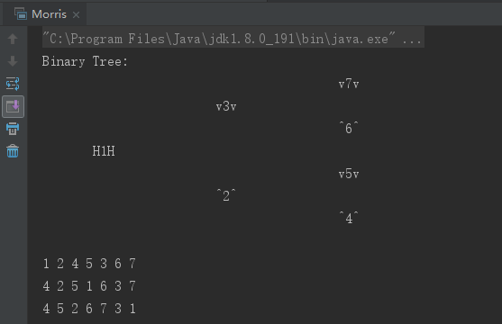

<!-- TOC -->

- [第一课](#第一课)
    - [1、KMP算法详解与应用【时间复杂度O(N+M)，空间复杂度O(M)】](#1kmp算法详解与应用时间复杂度onm空间复杂度om)
        - [1.1 KMP算法基础:str1 中某一子串是否等于 str2 【子串是连续的，子序列可以不连续】](#11-kmp算法基础str1-中某一子串是否等于-str2-子串是连续的子序列可以不连续)
        - [1.2 KMP算法应用](#12-kmp算法应用)
            - [1） 例1：T2 是不是 T1 的子树，即 T1 的某棵子树完全和 T2 一样，就说 T1 包含 T2](#1-例1t2-是不是-t1-的子树即-t1-的某棵子树完全和-t2-一样就说-t1-包含-t2)
            - [2) 例2：给定一个字符串，如何加最短的字符（只能在原始串的后面进行添加）使其构成一个长的字符串且包含两个原始字符串~](#2-例2给定一个字符串如何加最短的字符只能在原始串的后面进行添加使其构成一个长的字符串且包含两个原始字符串)
    - [2、Manacher算法详解与应用](#2manacher算法详解与应用)
        - [2.1 Manacher算法基础:一个字符串中最长的回文子串【时间复杂度 O(N)】](#21-manacher算法基础一个字符串中最长的回文子串时间复杂度-on)
            - [1）暴力解法 O(N<sup>2</sup>)](#1暴力解法-onsup2sup)
            - [2）manacher解法](#2manacher解法)
        - [2.2 Manacher算法应用](#22-manacher算法应用)
            - [1) 例1：给一个字符串，在后面添加最少的字符，使之整体都是回文字符串](#1-例1给一个字符串在后面添加最少的字符使之整体都是回文字符串)
    - [3、BFPRT算法详解与应用【时间复杂度 O(N)】](#3bfprt算法详解与应用时间复杂度-on)
        - [3.1 BFPRT算法【在一个无序数组中找到第 k 小的数（/或第 k 大的数）（/或返回前 100 大的数：找到第100 大的数后，假如是23，再遍历一次，找出逼 第 100 大的数，如果找到是93个，说明剩下7个是23）】](#31-bfprt算法在一个无序数组中找到第-k-小的数或第-k-大的数或返回前-100-大的数找到第100-大的数后假如是23再遍历一次找出逼-第-100-大的数如果找到是93个说明剩下7个是23)
- [第二课 介绍窗口以及窗口内最大值或最小值的更新结构(单调双向队列)](#第二课-介绍窗口以及窗口内最大值或最小值的更新结构单调双向队列)
    - [1、滑动窗口【生成窗口最大/小值数组】【O(N)】](#1滑动窗口生成窗口最大小值数组on)
        - [1.1 滑动窗口例题 ：最大值/最小值数组](#11-滑动窗口例题-最大值最小值数组)
        - [1.2 例二：求一个数组中最大值减去最小值小于或等于num的子数组数量 【O(N)】](#12-例二求一个数组中最大值减去最小值小于或等于num的子数组数量-on)
- [三、单调栈结构【O(N),给一个数组，求任何位置左边和右边离它最近的比它大/小的数】](#三单调栈结构on给一个数组求任何位置左边和右边离它最近的比它大小的数)
    - [3.1 单调栈，就是一个栈，里面的元素满足一定的单调性。（多见于单调增/单调减）](#31-单调栈就是一个栈里面的元素满足一定的单调性多见于单调增单调减)
    - [3.2 例子1 ：求最大子矩阵的大小](#32-例子1-求最大子矩阵的大小)
    - [3.3 例子2：可见山峰问题](#33-例子2可见山峰问题)
- [第三课 树](#第三课-树)
    - [1. Morris遍历【一种时间复杂度O(N)，额外空间复杂度O(1)的二叉树的遍历方式，N为二叉树的节点个数】【二叉树的遍历，跟遍历有关的最优解都是Morris遍历】](#1-morris遍历一种时间复杂度on额外空间复杂度o1的二叉树的遍历方式n为二叉树的节点个数二叉树的遍历跟遍历有关的最优解都是morris遍历)
    - [2、Morris的先序，中序，后序遍历](#2morris的先序中序后序遍历)
    - [3、何为搜索二叉树？如何实现二叉查找树的查找？插入？删除？](#3何为搜索二叉树如何实现二叉查找树的查找插入删除)
        - [1、二叉查找树【不具备平衡性的普通二叉查找树】：树中的任何一个节点，其左子树都比它小，右子树都比它大；【二叉查找树是为了实现快速查找而生的。它不仅支持快速查找一个数据，还支持快速插入、删除一个数据。】](#1二叉查找树不具备平衡性的普通二叉查找树树中的任何一个节点其左子树都比它小右子树都比它大二叉查找树是为了实现快速查找而生的它不仅支持快速查找一个数据还支持快速插入删除一个数据)
    - [4、何为具有平衡性的树【增删改查都是o(logN)，并且有序，具有平衡性】？介绍调整树的左旋操，介绍调整树的右旋操作](#4何为具有平衡性的树增删改查都是ologn并且有序具有平衡性介绍调整树的左旋操介绍调整树的右旋操作)
            - [4.1 AVL、红黑树、SB树这些的原子操作都是 左旋和右旋，它们所有的操作都是这两个操作的组合](#41-avl红黑树sb树这些的原子操作都是-左旋和右旋它们所有的操作都是这两个操作的组合)
        - [4.2 二叉查找树在极端情况下，可能会退化成链表（树高远远大于 logN），时间复杂度会退变为O(n)的算法，平衡二叉查找树就是为了解决时间复杂度退化的问题，所以通过定义不同的平衡性衍生出了几种不同平衡二叉查找树。【“平衡”就是让整棵树左右看起来比较“对称”，比较“平衡”，不要出现左子树很高而右子树很矮的情况。这样就能让整棵树的高度相对来说低一些，相应的插入、删除和查找等操作的效率高一些。】【平衡二叉查找树的查找和普通二叉查找树一样，不同点在于插入和删除】](#42-二叉查找树在极端情况下可能会退化成链表树高远远大于-logn时间复杂度会退变为on的算法平衡二叉查找树就是为了解决时间复杂度退化的问题所以通过定义不同的平衡性衍生出了几种不同平衡二叉查找树平衡就是让整棵树左右看起来比较对称比较平衡不要出现左子树很高而右子树很矮的情况这样就能让整棵树的高度相对来说低一些相应的插入删除和查找等操作的效率高一些平衡二叉查找树的查找和普通二叉查找树一样不同点在于插入和删除)
            - [1）AVL：平衡性高度严苛，任何节点高度差都不超过一。因为严苛，所以很可能调整频率高。【时间复杂度 O(logn)】](#1avl平衡性高度严苛任何节点高度差都不超过一因为严苛所以很可能调整频率高时间复杂度-ologn)
                - [1.1 AVL发生左旋和右旋的情况：插入和删除的时候只需要找到第一棵不平衡的树，调整它即可。失去平衡后进行调整的规律可归纳为下列四种情况：](#11-avl发生左旋和右旋的情况插入和删除的时候只需要找到第一棵不平衡的树调整它即可失去平衡后进行调整的规律可归纳为下列四种情况)
                - [1.1.1 LL型：进行单旋转即可 ---- 右旋](#111-ll型进行单旋转即可------右旋)
                - [1.1.2 RR型：进行单旋转即可 ---- 左旋](#112-rr型进行单旋转即可------左旋)
                - [1.1.3 LR型：进行双旋转 ---- 左右旋（先左后右旋）](#113-lr型进行双旋转------左右旋先左后右旋)
                - [1.1.4 RL型：进行双旋转 ---- 右左旋（先右后左旋）](#114-rl型进行双旋转------右左旋先右后左旋)
            - [AVL树代码](#avl树代码)
            - [2）红黑树：红黑树是一种平衡二叉查找树。它是为了解决普通二叉查找树在数据更新的过程中，复杂度退化的问题而产生的。红黑树的高度近似 logn，所以它是近似平衡，阉割了平衡性【所以在维护平衡的成本上，要比 AVL 树要低】，长链和短链的长度差不超过一倍，插入、删除、查找操作的时间复杂度都是O(logn)。](#2红黑树红黑树是一种平衡二叉查找树它是为了解决普通二叉查找树在数据更新的过程中复杂度退化的问题而产生的红黑树的高度近似-logn所以它是近似平衡阉割了平衡性所以在维护平衡的成本上要比-avl-树要低长链和短链的长度差不超过一倍插入删除查找操作的时间复杂度都是ologn)
                - [2.1 红黑树满足的要求：1）节点不是红色就是黑色 2)根节点一定是黑色的；3) 每个叶子结点都是黑色的空结点，即叶子结点不存储数据（这样做是为了便于代码实现）；4) 任何相邻的结点都不能同时为红色，即红色结点是被黑色结点隔开的；5)每个结点，从该结点到达其可达叶子结点的所有路径（80，40，20，10，NIL是一条路径），都包含相同数目的黑色结点。【上面的这些约束条件体现了红黑树的一个关键性质：从根结点到叶子结点最长的路径不多于最短的路径的两倍长】](#21-红黑树满足的要求1节点不是红色就是黑色-2根节点一定是黑色的3-每个叶子结点都是黑色的空结点即叶子结点不存储数据这样做是为了便于代码实现4-任何相邻的结点都不能同时为红色即红色结点是被黑色结点隔开的5每个结点从该结点到达其可达叶子结点的所有路径80402010nil是一条路径都包含相同数目的黑色结点上面的这些约束条件体现了红黑树的一个关键性质从根结点到叶子结点最长的路径不多于最短的路径的两倍长)
                - [2.2 红黑树的时间复杂度 2logn](#22-红黑树的时间复杂度-2logn)
                - [2.3 红黑树的操作：左旋、右旋【红黑树的平衡其实就是遇到什么样的节点排布，我们就对应怎么去调整，只要按照这些固定的调整规则来操作，就能将一个非平衡的红黑树调整为平衡的】](#23-红黑树的操作左旋右旋红黑树的平衡其实就是遇到什么样的节点排布我们就对应怎么去调整只要按照这些固定的调整规则来操作就能将一个非平衡的红黑树调整为平衡的)
                - [2.4 插入操作：【插入组合5种，删除8种】](#24-插入操作插入组合5种删除8种)
                - [2.5 删除操作：](#25-删除操作)
            - [3）SB树（Size Balanced Tree），平衡性来自，任何一个叔叔节点的节点个数，不能少于任何一个侄子节点的节点个数。Y不能少于Z1或者Z2整颗树的节点数。](#3sb树size-balanced-tree平衡性来自任何一个叔叔节点的节点个数不能少于任何一个侄子节点的节点个数y不能少于z1或者z2整颗树的节点数)
            - [综：为什么需要这些树，就是在修改最严苛的平衡性，做到每个节点来说，左右子树节点个数差不多的。只是平衡性标准不一样。目的为了调整不用那么频繁。增删改查都是O(logn)。](#综为什么需要这些树就是在修改最严苛的平衡性做到每个节点来说左右子树节点个数差不多的只是平衡性标准不一样目的为了调整不用那么频繁增删改查都是ologn)
    - [5 跳表](#5-跳表)
        - [5.1 跳表的概念](#51-跳表的概念)
        - [5.2 插入操作：插入的数有value和level，插入就是在level及以下的每层找到value应该放的位置](#52-插入操作插入的数有value和level插入就是在level及以下的每层找到value应该放的位置)
        - [5.3 查找操作](#53-查找操作)
        - [5.4 删除操作](#54-删除操作)
        - [5.5 遍历](#55-遍历)
- [第四课](#第四课)
    - [有序表/有序树：增删改查全是 O(logn) 的，key是按有序组织的，AVL树、红黑树、SB树、跳表这些都可以用于实现有序表，对外无差别，即使有，也是常数项的差别](#有序表有序树增删改查全是-ologn-的key是按有序组织的avl树红黑树sb树跳表这些都可以用于实现有序表对外无差别即使有也是常数项的差别)
    - [题目一：汉洛塔问题：找数组arr是汉洛塔最优移动结构的第几个状态](#题目一汉洛塔问题找数组arr是汉洛塔最优移动结构的第几个状态)
    - [总结树形dp：（问自己求解流程是否能定成以每一个节点为头的答案，且答案就在其中）思路：小树计算完，再算父亲树。 1、考察以任意一个节点为头的子树的答案，分析其分析可能性-> 2、根据可能性列信息全集，定下返回值结构（我要我的子树返回给我什么信息）。-> 3、整合出自己的信息，向上返回。【basekey要单独考虑一下，作为最简单的情况，要给父返回啥，不至于让他干扰。】](#总结树形dp问自己求解流程是否能定成以每一个节点为头的答案且答案就在其中思路小树计算完再算父亲树-1考察以任意一个节点为头的子树的答案分析其分析可能性--2根据可能性列信息全集定下返回值结构我要我的子树返回给我什么信息--3整合出自己的信息向上返回basekey要单独考虑一下作为最简单的情况要给父返回啥不至于让他干扰)
    - [树形dp都是 o(N)，相当于后序遍历，先找左树要信息，再找右树要信息，再返回我的信息](#树形dp都是-on相当于后序遍历先找左树要信息再找右树要信息再返回我的信息)
    - [题目二 【二叉树套路，树形dp】：给定一棵二叉树的头节点head，请返回最大搜索二叉子树的大小](#题目二-二叉树套路树形dp给定一棵二叉树的头节点head请返回最大搜索二叉子树的大小)
    - [题目三 【二叉树套路，树形dp】：聚会活跃度问题](#题目三-二叉树套路树形dp聚会活跃度问题)
    - [题目四 【二叉树套路，树形dp】：求一棵二叉树上的最远距离](#题目四-二叉树套路树形dp求一棵二叉树上的最远距离)
    - [题目五 蓄水池算法](#题目五-蓄水池算法)
- [第五课](#第五课)
    - [题目一【无后效性问题，递归改动态规划】 ：给定一个数字组成的字符串str，返回有多少种合法的ipv4组合。](#题目一无后效性问题递归改动态规划-给定一个数字组成的字符串str返回有多少种合法的ipv4组合)
    - [题目二 ：一种消息接收并打印的结构设计](#题目二-一种消息接收并打印的结构设计)
    - [题目三：在数组中找到出现次数大于N/K的数](#题目三在数组中找到出现次数大于nk的数)
    - [题目四：最长的可整合子数组的长度](#题目四最长的可整合子数组的长度)
    - [题目五：需要排序的最短子数组长度](#题目五需要排序的最短子数组长度)
    - [题目六：](#题目六)
    - [题目七：哈希表增加setAll功能](#题目七哈希表增加setall功能)
    - [题目八 ：子数组最大累乘积【子数组套路：在标准S下，看以每个位置 i 开头或者以 i 结尾的子数组是什么答案【最优，最大，最小，最大累乘积等等】，答案一定在这些结果中】](#题目八-子数组最大累乘积子数组套路在标准s下看以每个位置-i-开头或者以-i-结尾的子数组是什么答案最优最大最小最大累乘积等等答案一定在这些结果中)
    - [题目九：打气球问题](#题目九打气球问题)
    - [题目十：机器人走路](#题目十机器人走路)

<!-- /TOC -->
# 第一课
## 1、KMP算法详解与应用【时间复杂度O(N+M)，空间复杂度O(M)】
### 1.1 KMP算法基础:str1 中某一子串是否等于 str2 【子串是连续的，子序列可以不连续】
* 【问题】：给定两个字符串 O 和 f，长度分别为 n 和 m，判断 f 是否在 O 中出现，如果出现则返回出现的位置。常规暴力方法是遍历 o 的每一个位置，然后从该位置开始和 f 进行匹配，但是这种方法的复杂度是 O(n*m)。kmp算法通过一个O(m)的预处理，使匹配的复杂度降为O(n+m)。

* 数组next存放的是 i 位置前面字符串前缀和后缀的最长匹配长度【前缀不能扩到最后一个字符，后缀也不能扩到第一个字符】
    * A段字符串是f的一个前缀。
    * B段字符串是f的一个后缀。
    * A段字符串和B段字符串相等。

* 【分析1】：在字符串O中寻找f，当匹配到位置i时两个字符串不相等，这时我们需要将字符串f向后移动。常规方法是每次向后移动一位，但是它没有考虑前i-1位已经比较过这个事实，所以效率不高。KMP就是要加速这个过程：
    * 在没越界的范围内：
        * 1）str1 的 p1 位置和 str2 的 p2 位置的值相等，则 p1++,p2++
        * 2) 否则（不相等，如图，i 位置不相等了）
            * 2.1 如果 p2 已经是 0 位置了（next[p2] = -1），则 p2 就不能往前走了，需要 p1++ 【因为str1 的当前位置和str2 的0位置都不匹配，所以str1 要到下一个位置】
            * 2.2 否则 p2 = next[p2]（next[p2]是p2位置前面字符串的前缀和后缀的最长匹配长度，从新的 p2 位置开始和 str1 的当前位置比较下去，即图中的 A 的下一位和 a 继续比较）
                * 【实质】：1）尝试解决位置 j[O 中 B 的第一位]开头能否匹配出str2；2）认为从 j 到 i 中间位置一律配不出str2
    * 越界了：如果是p2 越界，说明str2 已经遍历完，str1 匹配出了str2
* 【分析2】：next[] 数组【存放 i 位置前面字符串的前缀和后缀的最长匹配长度】的求解方法
    * 0位置：前面没有字符，人为规定为-1
    * 1位置：前面只有一个字符，但前缀不能扩到最后一个字符，后缀也不能扩到第一个字符，所以人为规定为0
    * 求 i 位置利用前面的已得到的结果，n 表示跳到的位置，即需要和 i-1 位置字符比较的位置
        * 跳到 n 相等，则得到结果next[i++] = ++n
        * 不相等就要继续往前面跳，直到有相等或者 n=-1 没办法跳了


* 【分析3】：时间复杂度分析O（M+N）
   

```java
package class01;

public class KMP {
    //* 主函数：返回str2在str1中第一次出现的位置
    public static int getIndexOf(String str1,String str2){
        if(str1 == null || str2 == null || str2.length()<1 || str1.length()<str2.length()){
            return -1;
        }
        int p1=0; //s1的指针
        int p2=0; //s2的指针
        char[] s1 = str1.toCharArray();
        char[] s2 = str2.toCharArray();
        int[] next = getNextArray(s2);
        while (p1<str1.length() && p2<str2.length()){
            if(s1[p1] == s2[p2]){
                p1++;
                p2++;
            }else {//不相等就要往前跳
                if(next[p2] == -1){//s2 到0位置了，没办法往前跳，而你s1当前位置和我的0位置都不匹配，s1得往后走一步
                    p1++;
                }else {
                    p2=next[p2];
                }
            }
        }
        return p2==s2.length ? p1-p2 : -1;
    }

    // * 求next数组
    public static int[] getNextArray(char[] str2){
        int[] next = new int[str2.length];
        next[0]= -1;
        if(str2.length == 1){
            return next;
        }
        // 长度不止1
        next[1] = 0;
        int i=2; // 从左往右求每一个 i 的 next 数组值
        int n=0; //n 表示跳到的位置，即需要和 i-1 位置字符比较的位置
        while (i < next.length){
            if(str2[i-1] == str2[n]){
                next[i++] = ++n;  //得到了 i 位置的值，可以求i+1 位置的了
            }else { // 不相等，我们就要往前跳来比较，直到不能再跳，或者找到相等
                if(next[n] == -1){
                    next[i++] = 0;  // 不能再继续跳了，已经到0位置了，且0位置和i-1位置不相等
                }else {
                    n = next[n]; //往前面跳，继续比较
                }
            }
        }
        return next;
    }
    //getNextArray 函数的时间复杂度 O（m）
    //设str2 的长度为 m ,分析其时间复杂度的困惑在于，在while里面不是每次循环都执行 ++i 操作，所以整个while的执行次数不一定为m。
    //换个角度，注意到在每次循环中，无论 if 还是 else 都会修改 n 的值且每次循环仅对 n 进行一次修改，所以在整个while中 n 被修改的次数即为getNextArray函数的时间复杂度。
    //每次成功匹配时，++i; ++n; , 由于 ++i 最多执行 m-1 次，故++j也最多执行 m-1 次，即 n 最多增加m-1次；
    //对应的，只有在 n =next[n] 处, n 的值一定会变小，由于 n 最多增加m-1次，故 n 最多减小m-1次。
    //所以 时间复杂度为 2*m,
    //综上所述，getNextArray 函数的时间复杂度为O(m)，若带匹配串S的长度为n，则kmp函数的时间负责度为O(m+n)。

    public static void main(String[] args) {
        String str = "abcabcababaccc";
        String match = "ababa";
        System.out.println(getIndexOf(str, match));

    }
}


```

### 1.2 KMP算法应用
#### 1） 例1：T2 是不是 T1 的子树，即 T1 的某棵子树完全和 T2 一样，就说 T1 包含 T2
* 【思路】：把 T1 先序遍历，序列化为字符串，把 T2 序列化为字符串，如果前者包含后者，则说明 T1 包含 T2
```java
package advanced_class_01;

public class Code_03_KMP_T1SubtreeEqualsT2 {

	public static class Node {
		public int value;
		public Node left;
		public Node right;

		public Node(int data) {
			this.value = data;
		}
	}

	public static boolean isSubtree(Node t1, Node t2) {
		String t1Str = serialByPre(t1);
		String t2Str = serialByPre(t2);
		return getIndexOf(t1Str, t2Str) != -1;
	}

	public static String serialByPre(Node head) {
		if (head == null) {
			return "#!";
		}
		String res = head.value + "!";
		res += serialByPre(head.left);
		res += serialByPre(head.right);
		return res;
	}

	// KMP
	public static int getIndexOf(String s, String m) {
		if (s == null || m == null || m.length() < 1 || s.length() < m.length()) {
			return -1;
		}
		char[] ss = s.toCharArray();
		char[] ms = m.toCharArray();
		int[] nextArr = getNextArray(ms);
		int index = 0;
		int mi = 0;
		while (index < ss.length && mi < ms.length) {
			if (ss[index] == ms[mi]) {
				index++;
				mi++;
			} else if (nextArr[mi] == -1) {
				index++;
			} else {
				mi = nextArr[mi];
			}
		}
		return mi == ms.length ? index - mi : -1;
	}

	public static int[] getNextArray(char[] ms) {
		if (ms.length == 1) {
			return new int[] { -1 };
		}
		int[] nextArr = new int[ms.length];
		nextArr[0] = -1;
		nextArr[1] = 0;
		int pos = 2;
		int cn = 0;
		while (pos < nextArr.length) {
			if (ms[pos - 1] == ms[cn]) {
				nextArr[pos++] = ++cn;
			} else if (cn > 0) {
				cn = nextArr[cn];
			} else {
				nextArr[pos++] = 0;
			}
		}
		return nextArr;
	}

}

``` 

#### 2) 例2：给定一个字符串，如何加最短的字符（只能在原始串的后面进行添加）使其构成一个长的字符串且包含两个原始字符串~
* 【分析】：其实就是最大前后缀长度数组~   e.g.  abcabc ---->abcabcabc  最少增加3个,多求一位nextArr,可以看出之前4个复用,所以再添一位就好~
    * 总结： 在KMP中nextArr数组基础上 多求一位终止位  将不是的补上即可


```java
package advanced_class_01;

public class Code_02_KMP_ShortestHaveTwice {

	public static String answer(String str) {
		if (str == null || str.length() == 0) {
			return "";
		}
		char[] chas = str.toCharArray();
		if (chas.length == 1) {
			return str + str;
		}
		if (chas.length == 2) {
			return chas[0] == chas[1] ? (str + String.valueOf(chas[0])) : (str + str);
		}
		int endNext = endNextLength(chas);
		return str + str.substring(endNext);
	}

	public static int endNextLength(char[] chas) {
		int[] next = new int[chas.length + 1];
		next[0] = -1;
		next[1] = 0;
		int pos = 2;
		int cn = 0;
		while (pos < next.length) {
			if (chas[pos - 1] == chas[cn]) {
				next[pos++] = ++cn;
			} else if (cn > 0) {
				cn = next[cn];
			} else {
				next[pos++] = 0;
			}
		}
		return next[next.length - 1];
	}

	public static void main(String[] args) {
		String test1 = "a";
		System.out.println(answer(test1));

		String test2 = "aa";
		System.out.println(answer(test2));

		String test3 = "ab";
		System.out.println(answer(test3));

		String test4 = "abcdabcd";
		System.out.println(answer(test4));

		String test5 = "abracadabra";
		System.out.println(answer(test5));

	}

}

```

## 2、Manacher算法详解与应用
### 2.1 Manacher算法基础:一个字符串中最长的回文子串【时间复杂度 O(N)】
* 回文串：简单来说就是正着读和反着读都是一样的字符串，比如abba，noon等等，一个字符串的最长回文子串即为这个字符串的子串中，是回文串的最长的那个
#### 1）暴力解法 O(N<sup>2</sup>)
* 【思路】：对字符串遍历每一个字符，以对每一个字符，以它为中心，往两边扩，找出以该字符串为中心的回文串大小
    * 这里要分为两种情况，一种是回文串长度是奇数的情况，另一种是回文串长度是偶数的情况，奇数直接扩能找出回文，偶数则不可以
#### 2）manacher解法
* 【思路】：和暴力解法一样，都是每一个字符往两边扩，只是利用前面的结果加速了这个过程，对每个字符，都从它至少的回文半径大小开始往两边扩
    * 相关技巧前提：
        * 首先，Manacher算法提供了一种巧妙地办法，将长度为奇数的回文串和长度为偶数的回文串一起考虑，具体做法是，在原字符串的每个相邻两个字符中间插入一个分隔符，同时在首尾也要添加一个分隔符，一般情况下可以用#号，新字符串长度为原本的2倍+1。下面举一个例子：
        
        * 回文半径数组pArr：记录每个位置往两边扩，能扩出来的回文半径大小【后面的就能利用前面的进行加速】
        * R：所有回文半径中最靠右的位置【所有回文右边界中最大的一个】【每个字符往两边扩下，最右到了什么位置，就是该位置的回文右边界】
        * C：取得最大回文右边界时对应的中心位置
    * 求 i 位置回文半径的步骤分析：
        * 1）况一：i 在 R 外(i>=R)：i 不在最大回文右边界里，那么无法利用之前的结论，i 位置的值只能通过往两边暴力扩得到
        * 2）况二：i 在 R 内：【则可以利用之前已有的结果进行加速，i 位置的回文半径至少为 min(R-i,pArr[i'])】(i‘ 与 i 关于 C 对称，l 和 R 关于 C 对称)
            * 2.1)（i’-pArr[i']）> l ：以 i' 为中心的回文字符串完全在 (L, R)范围内，则 i 位置的回文半径大小 = pArr[i'] 【其右边界小于 R 】 
            * 2.2)（i’-pArr[i']）= l ：以 i' 为中心的回文字符串左边界压线 L，则 i 位置的回文半径大小 >= pArr[i']，即 >= R-i，至于是否能扩得更大，需要去暴力试【其回文右边界至少是 R，或许大于 R】
            * 2.3)（i’-pArr[i']）< l ：以 i' 为中心的回文字符串左边界超出(L, R)范围，则 i 位置的回文半径大小 = R-i 【其右边界就是 R】
                * 不可能大于 R-i，因为如果大于，说明以 C 为中心的回文字符串的右边界比 R 大，说明你之前算错了
            
```java
package class01;

import java.util.Map;

public class Manacher {
    public static int maxlcpslength(String str){
        if(str == null || str.length() == 0){
            return 0;
        }
        char[] chars = manacherString(str); // 把字符串处理为manachar类字符串，1221->#1#2#2#1#
        int[] pArr = new int[chars.length]; // 回文半径数组
        int C = -1; // 取得 R 时的回文中心
        int R = -1; // R-1 为最大回文右边界，R 是最大回文右边界的下一位
        int max = Integer.MIN_VALUE;
        for (int i=0; i<chars.length; i++){ //遍历每一个字符，计算以该字符为中心的回文字符串长度
            //况一： R <= i ,i 彻底在回文右边界的右侧，回文半径至少为 1 （它本身）
            //况二： R > i,
            //得到 i 位置回文半径至少的长度
            pArr[i] = R > i ? Math.min(R-i,pArr[C-(i-C)]): 1; //C-(i-C)即 i'
            //从可能扩得更远的位置开始验证
            while (i+pArr[i] < chars.length && i-pArr[i]>-1){
                if(chars[i+pArr[i]] == chars[i-pArr[i]]){
                    pArr[i]++; //回文半径增大
                }else {
                    break; // 已经得到该位置的回文半径了
                }
            }
            if(i+pArr[i] > R){
                R = i+pArr[i];
                C = i;
            }
            max = Math.max(max,pArr[i]); // 此回文半径是否比max大，大就替换，否则保持不变不替换  //并没有求最大回文字符串是哪一个
        }
        //返回最大回文字符串长度，因为我们的chars是改造过的，是原字符串的 2倍+1
        // 【从中心开始，每个字符后面有一个#，即相当于*2，但中心字符只有一个，所以要-1】
        return max-1;
    }

    public static char[] manacherString(String str){
        char[] chars = str.toCharArray();
        char[] res = new char[chars.length*2+1];
        int index =0;
        for (int i = 0; i<res.length; i++){
            res[i] = (i&1)==0? '#':chars[index++];
        }
        return res;
    }

    public static void main(String[] args) {
        String str1 = "abc1234321ab";
        System.out.println(maxlcpslength(str1));
    }
}

```

### 2.2 Manacher算法应用
#### 1) 例1：给一个字符串，在后面添加最少的字符，使之整体都是回文字符串
* 【分析】：实质：就是求必须包含最后一个字符情况下的回文子串。
    * 从左往右扩每个字符，直到第一次最右回文边界 R 到达最后一个字符，那么就找到了，在把L前面的逆序加在后面即可
```java
package advanced_class_01;

public class Code_05_Manacher_ShortestEnd {

	public static char[] manacherString(String str) {
		char[] charArr = str.toCharArray();
		char[] res = new char[str.length() * 2 + 1];
		int index = 0;
		for (int i = 0; i != res.length; i++) {
			res[i] = (i & 1) == 0 ? '#' : charArr[index++];
		}
		return res;
	}

	public static String shortestEnd(String str) {
		if (str == null || str.length() == 0) {
			return null;
		}
		char[] charArr = manacherString(str);
		int[] pArr = new int[charArr.length];
		int index = -1;
		int pR = -1;
		int maxContainsEnd = -1;
		for (int i = 0; i != charArr.length; i++) {
			pArr[i] = pR > i ? Math.min(pArr[2 * index - i], pR - i) : 1;
			while (i + pArr[i] < charArr.length && i - pArr[i] > -1) {
				if (charArr[i + pArr[i]] == charArr[i - pArr[i]])
					pArr[i]++;
				else {
					break;
				}
			}
			if (i + pArr[i] > pR) {
				pR = i + pArr[i];
				index = i;
			}
			if (pR == charArr.length) {  // R 到达最右边界，就找到了
				maxContainsEnd = pArr[i];
				break;
			}
		}
		char[] res = new char[str.length() - maxContainsEnd + 1];
		for (int i = 0; i < res.length; i++) {
			res[res.length - 1 - i] = charArr[i * 2 + 1];
		}
		return String.valueOf(res);
	}

	public static void main(String[] args) {
		String str2 = "abcd123321";
		System.out.println(shortestEnd(str2));

	}

}
```

## 3、BFPRT算法详解与应用【时间复杂度 O(N)】
### 3.1 BFPRT算法【在一个无序数组中找到第 k 小的数（/或第 k 大的数）（/或返回前 100 大的数：找到第100 大的数后，假如是23，再遍历一次，找出逼 第 100 大的数，如果找到是93个，说明剩下7个是23）】
* 【分析】：
    * 法一【笔试用这个】：类似于随机快排，与随机快排的区别：它不用左右都要排序，它只需要排一边即可。【数划分得好就是 O（N），划分得不好就是 O（N<sup>2</sup>）,这是一个概率问题，长期期望是 O(N)】;
        * 1）每次随机选择一个数
        * 2）进行划分荷兰国旗划分成三堆，看 = 部分位置有没有命中 k，如果没有，且 位置 < k ,那么排右边，否则排左边，知道命中就返回
    * 法二【bfprt，面试可以吹这个】：与法一的区别在于它不是随机选择用于划分的那个数，而是选择中位数组的中位数，这样选出的数能保证左右两边都至少有 3N/10 的数据，而不像随机选择那样左右两边数据量不确定
        * 1)得到中位数组的中位数
            * 1.1 相邻 5 个数为一组（0-4，5-9，。。。），最后一个组剩几个就有几个[因为是逻辑上的划分，所以不花时间]
            * 1.2 每一个小组内排序【5个数排序是O（1），共有约 N/5 个小组，所以时间复杂度是 O（N/5）】
            * 1.3 把每个小组中的中位数拿出来组成一个新数组：中位数数组 【因为长度为 N/5, 所以是 O(N)】
            * 1.4 递归调用bfprt ，求出中位数数组的中位数【bfprt 解决的是第 k 大的问题，即排好序后位于 k-1 的数】[时间复杂度 T(N/5)]
        * 2）进行划分荷兰国旗划分成三堆，看 = 部分位置有没有命中 k，如果没有，且 位置 < k ,那么排右边，否则排左边，知道命中就返回 【因为选出的数能保证左右两边都至少有 3N/10 的数据，即下一次最多只有 7N/10 的数据，因为是递归，所以时间复杂度是 T(7N/10)】
    * BFPRT 时间复杂度为 ：T(N) = T(N/5) + T(7N/10) + O(N) +O（N/5) => O（N）
        * 为什么选出的数能保证左右两边都至少有 3N/10 的数据
            * 我们先把数每五个分为一组。同一列为一组。排序之后，第三行就是各组的中位数。我们把第三行的数构成一个数列，递归找，找到中位数。
            * 这个黑色框为什么找的很好。因为他一定比A3、B3大，而A3、B3、C3又在自己的组内比两个数要大。
            * 我们看最差情况：就算其它的数都比c3大，也至少有3/10的数据比它小.
            
```java
package class01;

public class BFPRT {

    public static int getMinKth(int[] arr, int k) throws Exception {
        if (arr == null || arr.length == 0 || k < 0 || k >= arr.length) {
            throw new Exception("输入不合法");
        }
        return bfprt(arr, 0, arr.length - 1, k - 1);  //返回从小到大，位于 k-1 位置的数字，就是第 k 大的数
    }

    // 在 l,r 范围上，找到从小到大排序为 i 的数，即为第 i+1 小的数
    public static int bfprt(int[] arr, int l, int r, int i) {
        if (l == r) {
            return arr[l];
        }
        //法一：随机选择一个数来划分

        //int num = arr[ l + (int)Math.random()*(r-l+1)];  // ** 不能少了 l

        //法二：bfprt 算法选择中位数组的中位数来划分，可以每次确定甩掉 3N/10 的数据量
        int num = medianOfMedians(arr,l,r);

        int[] p = partition(arr, l, r, num);
        if (i >= p[0] && i <= p[1]) {
            return arr[i];
        } else if (i < p[0]) {
            return bfprt(arr, l, p[0] - 1, i);
        } else {
            return bfprt(arr, p[1] + 1, r, i);
        }
    }

    // 根据数 num 对arr[] 上l,r范围进行划分，（荷兰国旗）
    public static int[] partition(int[] arr, int l, int r, int num){
        int less = l-1;
        int more = r+1;
        int cur =l;
        while (cur < more){
            if(arr[cur] < num){
                swap(arr, ++less, cur++);
            }else if(arr[cur] > num){
                swap(arr, --more, cur);
            }else {
                cur++;
            }
        }
        return new int[]{less+1,more-1};
    }


    public static int medianOfMedians(int[] arr, int l, int r){ //求中位数数组的中位数
        int num = r-l+1;
        int offset = num%5 == 0?0:1;
        int[] mArr = new int[num/5+offset]; //中位数数组
        int index = 0;
        for(int i =l ;i< r; i=i+5){  // *** 要从 l 开始，而不是0开始
            mArr[index++] = getMedian(arr,i,Math.min(r,i+4));
        }
        return bfprt(mArr,0,mArr.length-1,(mArr.length)/2);

    }


    public static int getMedian(int[] arr, int l, int r) {
        insertionSort(arr, l, r);
        return arr[(r+l)/2];
    }

    public static void insertionSort(int[] arr ,int l, int r){
        for(int i = l+1; i<=r ;i++){
            for (int j = i; j>l ;j--){
                if(arr[j-1]>arr[j]){
                    swap(arr,j-1,j);
                }else {
                    break;
                }
            }
        }
    }

    private static void swap(int[] arr, int i, int j) {
        int temp = arr[i];
        arr[i] = arr[j];
        arr[j] = temp;
    }

    public static void main(String[] args) {
        int[] arr = {6, 9, 1, 3, 1, 2, 2, 5, 6, 1, 3, 5, 9, 7, 2, 5, 6, 1, 9};
        // sorted : { 1, 1, 1, 1, 2, 2, 2, 3, 3, 5, 5, 5, 6, 6, 6, 7, 9, 9, 9 }
        //printArray(getMinKNumsByHeap(arr, 10));
        //printArray(getMinKNumsByBFPRT(arr, 10));
        try {
            System.out.println(getMinKth(arr, 10));
        } catch (Exception e) {
            e.printStackTrace();
        }


    }
}

```

# 第二课 介绍窗口以及窗口内最大值或最小值的更新结构(单调双向队列)
## 1、滑动窗口【生成窗口最大/小值数组】【O(N)】
https://www.cnblogs.com/haozhengfei/p/a14049ec0869a8125a69f3af37471c77.html
* 普通解法的时间复杂度为O(N*w)，也就是每次对一个窗口遍历其中的w个数，选出最大值，最优解可以做到O(N
* 【分析】:准备一个双端队列，双端队列存放着数组中的下标值，假设当前为arr[i],则放入规则如下
    * R 右滑，窗口加数：
        * 1）如果 q 为空，直接把下标 i 放入 q 中
        * 2）如果 q 不为空，取出当前 q 队尾存放的下标 j。如果arr[j] > arr[i],则直接把 i 放入队尾
        * 3）果arr[j] <= arr[i],则一直从 q 的队尾弹出下标，直到某个下标在 q 中的对应值大于 arr[i],然后把 i 放入队尾 【为什么可以弹出，因为我永远比你晚过期，我又比你大或者和你一样大，有我在，你永远不可能最大，所以你可以滚了】
    * L 右滑，窗口减数：
        * 1）看弹出的 L 是否与队列头相等，如果相等，说明这个队列头已经不在窗口内了，所以弹出 q 当前的队头
    * 双端队列的队头就是当前窗口最大值的下标
```java
package advancedClass.class02_window_stack;

import java.util.LinkedList;

//这是一个结构化的，一般做题不需要构造这样一个Window，只需要组合其步骤就可以了
public class window {
    private int[] arr;
    private int  L;
    private int R;
    private LinkedList<Integer> q; //需要一个双端队列，与指向滑动窗口的L和R
    public window(int[] arr){
        this.arr=arr;
        L=0;
        R=0;
        q = new LinkedList<>();
    }

    //往滑动窗口加数时对双端队列的操作
    public void addNumToRight(){
        if(R==arr.length){ //R已经到达最右了，滑动窗口无法增加数
            return;
        }
        while (!q.isEmpty() && arr[q.peekLast()]<=arr[R]){ 
            q.pollLast();//*** 弹出所有比arr[R]小的数的下标
        }
        q.add(R);
        R++;
    }

    public void removeNumFromLeft(){
        if(L<R){ //这样才有窗口存在
            if(q.peekFirst() == L){ //要移除的这个数是双端队列的头，则弹出它，表示它已经不在窗口里，失效了
                q.pollFirst();
            }
        }
        L++;
    }
    
    public Integer getMax(){
        if(q.isEmpty()){
            return  null;
        }
        return arr[q.peekFirst()]; //双端队列的头结点就是当前滑动窗口的最大值
    }
}

```

### 1.1 滑动窗口例题 ：最大值/最小值数组


```java
package advancedClass.class02_window_stack;

import java.util.LinkedList;

public class GetMaxWindow {

    public static int[] getMaxWindow(int[] arr, int w) {
        if (arr == null || w < 1 || arr.length < w) {
            return null;
        }
        LinkedList<Integer> qmax = new LinkedList<Integer>();
        int[] res = new int[arr.length - w + 1];
        int index = 0;
        for (int i = 0; i < arr.length; i++) { //考察每一个数
            while (!qmax.isEmpty() && arr[qmax.peekLast()] <= arr[i]) {
                qmax.pollLast();
            }
            qmax.addLast(i);
            if (qmax.peekFirst() == i - w) {  // 只有当窗口形成后才会有从双端队列头部失效一个数,即过期还是没过期
                qmax.pollFirst();
            }
            if (i >= w - 1) { //至少有一个窗口存在时，才会有max
                res[index++] = arr[qmax.peekFirst()];
            }
        }
        return res;
    }
}

```

### 1.2 例二：求一个数组中最大值减去最小值小于或等于num的子数组数量 【O(N)】
```
最大值减去最小值小于或等于num的子数组数量
【题目】 给定数组arr和整数num，共返回有多少个子数组满足如下情况: 
        max(arr[i..j]) - min(arr[i..j]) <= num 
        max(arr[i..j])表示子数组arr[i..j]中的最大值，min(arr[i..j])表 示子数组arr[i..j]中的最小值。
【要求】 如果数组长度为N，请实现时间复杂度为O(N)的解法。
```
* 暴力方法是找出所有的子数组，再找每一个子数组的最大最小值看符合条件不，是O（N^3）
* 【分析】：这里有两个结论
    * 如果子数组arr[i..j]满足条件，那么arr[k..l]（i<=k<=l<=j）都满足条件,即若一个数组满足条件，它的所有子数组肯定满足条件。[max变小 - min变大 <= num肯定成立]
    * 如果子数组arr[i..j]不满足条件，那么arr[k..l](k<=i<=j<=l)都不满足条件,即若一个数组不满足条件，所有包含它的数组肯定都不满足条件。【[max变大 - min变小 >= num肯定成立]
* 【步骤】：准备两个双端队列，一个 qMax 是窗口内最大值更新结构，一个 qMin 是窗口内最小值更新结构，l,r表示窗口的左右边，窗口范围为 【l,r-1】;算 以 l 开头达标的子数组个数，每个 l 就可以算出一批答案，相加即可
    * 1) 以 l 开头的情况下，r 往外扩，扩到不达标就停【因为再往外肯定也不达标】，算以 l 开头的子数组有多少个【这些子数组都达标的】
    * 2) l 右移一位，然后重复 1）。
    * 因为 l ,r 都不后退，且每个数都只进出一次，所以是 o(N)
```java
package advancedClass.class02_window_stack;

import java.util.LinkedList;

public class AllLessNumSubArray {
    public static int allLessNumSubArray(int[] arr,int num){
        int l = 0;
        int r = 0;
        int res = 0;
        if(arr == null || arr.length == 0){
            return 0;
        }
        LinkedList<Integer> qMax = new LinkedList<>();
        LinkedList<Integer> qMin = new LinkedList<>();
        while (l<arr.length){ // 尝试每个以 l 开头的情况
            while (r < arr.length){ // 尝试以 l 开头的情况，r 往外扩
                while (!qMax.isEmpty() && arr[qMax.peekLast()]<=arr[r]){
                    qMax.pollLast();
                }
                qMax.addLast(r);
                while (!qMin.isEmpty() && arr[qMin.peekLast()] >= arr[r]){
                    qMin.pollLast();
                }
                qMin.addLast(r);
                if(qMax.peekFirst()-qMin.peekFirst() <= num){
                    r++;
                }else {  // 不满足条件了，那么继续往外扩也肯定不满足条件
                    break;
                }
            }
            res += r-l; //以 l 开头的满足条件的子数组r-l个
            // l 右移动一位
            if(l == qMax.peekFirst()){
                qMax.pollFirst();
            }
            if(l == qMin.peekFirst()){
                qMin.pollFirst();
            }
            l++;
        }
        return res;
    }
}

```
# 三、单调栈结构【O(N),给一个数组，求任何位置左边和右边离它最近的比它大/小的数】
## 3.1 单调栈，就是一个栈，里面的元素满足一定的单调性。（多见于单调增/单调减）
* 1）新元素加入栈前，会在栈顶端把破坏栈单调性的元素都删除，直到栈为空或者栈满足单调性才能加入新元素。
* 2）单调栈是 O(n) 级的时间复杂度，所有元素只会进入栈一次，并且出栈后再也不会进栈。
* 3）单调栈可以找到元素向左遍历第一个比他小（大）的元素，也就是说在元素进栈前他向左拓展的区间已经确定，在出栈前她能向右拓展的区间也能确定（左区间好理解，仔细体会右区间的确定，若该元素至遍历结束后也未出栈，那么就是说在原数组中，该元素的右方向没有一个元素可以比它大/小，那么该元素的右边界就是原数组的大小（就是没有右边界），否则它的右边界就是令它出栈的元素）。
* 【综】：单调栈分为两种情况：【数据无重复和数据有重复的】

    * 况一，数据无重复的：
        * 则一个数从栈中出来时即可生成信息，出来时它压着谁，谁就是左边离它最近比它大/小的，谁让它出来的，谁就是右边离它最近比它大/小的。
        ```java
        public static int[][] getNearLessNoRepeat(int[] arr) {
		int[][] res = new int[arr.length][2];
		Stack<Integer> stack = new Stack<>();
		for (int i = 0; i < arr.length; i++) {
			while (!stack.isEmpty() && arr[stack.peek()] > arr[i]) {
				int popIndex = stack.pop();
				int leftLessIndex = stack.isEmpty() ? -1 : stack.peek();
				res[popIndex][0] = leftLessIndex;
				res[popIndex][1] = i;
			}
			stack.push(i);
		}
		while (!stack.isEmpty()) {
			int popIndex = stack.pop();
			int leftLessIndex = stack.isEmpty() ? -1 : stack.peek();
			res[popIndex][0] = leftLessIndex;
			res[popIndex][1] = -1;
		}
		return res;
	    }
        ```
    * 况二，数据有重复的：
        * 弹出时弹出的是整个list，这一整个list都找到了左边和右边离她最近比它小的
            * 左边：它压着的list的最后一个位置
            * 右边：让它弹出的那个数
 ```java
            // 二、如果 arr 中存在重复的数
    public static int[][] getNearLess(int[] arr){
        if(arr == null){
            return null;
        }
        int[][] res = new int[arr.length][2];
        Stack<LinkedList<Integer>> s = new Stack<>();
        for (int i=0 ; i < arr.length ; i++){
            while (!s.isEmpty() && arr[s.peek().getLast()] > arr[i]){
                LinkedList<Integer> pops = s.pop();
                for (int pop : pops){
                    res[pop][0] = s.isEmpty()? -1 : s.peek().getLast(); //** 左边离它最近比它小的数的位置:是它压着的列表的最后一个
                    res[pop][1] = i;
                }
            }

            //把当前数的位置放入栈中
            if(!s.isEmpty() && arr[s.peek().getLast()] == arr[i]){ // ** 不要忘记判空
                s.peek().addLast(i);
            }else {
                LinkedList<Integer> list = new LinkedList<>();
                list.addLast(i);
                s.push(list);
            }
        }

        while (!s.isEmpty()){ //如果全部数都遍历后，栈却不为空，说明栈中的数不存在右边比它小的数
            LinkedList<Integer> pops = s.pop();
            for (int pop : pops){
                res[pop][0] = s.isEmpty()? -1 : s.peek().getLast();
                res[pop][1] = -1; // 右边不存在比它小的数
            }
        }
        return res;
    }
 ```

## 3.2 例子1 ：求最大子矩阵的大小
```
【题目】
给定一个整型矩阵map，其中的值只有0和1两种，求其中全是1的所有矩形区域中，
最大的矩形区域为1的数量。
例如：
1 1 1 0
其中，最大的矩形区域有3个1，所以返回3。
再如：
1 0 1 1
1 1 1 1
1 1 1 0
其中，最大的矩形区域有6个1，所以返回6。
```
* 【分析】：如果有答案，它一定是以某一行为底 
    * 对每一行：
        * 1、算出必须以第 i 行作为底的情况下的直方图是多少【从当前位置出发，往上有多少个连续的1】
        * 2、算出该直方图的最大矩形面积  【单调栈问题，只是多了个 等号，用上面那种list来解决重复也可以，只是这种更简单【相等也会让栈弹出，那么以该值为底的最大矩形是让它弹出那个相等的说了算】】
    * 综合N 行，求出总的最大矩形面积
```java
import java.util.Stack;

public class MaxRectangel {

    public static int maxRecSize(int[][] map) {
        if (map == null || map.length == 0 || map[0].length == 0) {
            return 0;
        }
        int maxArea = 0; //我的结果
        int[] height = new int[map[0].length]; //有多少列，就生成多大的长度
        for (int i = 0; i < map.length; i++) { //必须以第i行做底的情况下的直方图数组
            for (int j = 0; j < map[0].length; j++) {
                height[j] = map[i][j] == 0 ? 0 : height[j] + 1;
            }
            maxArea = Math.max(maxRecFromBottom(height), maxArea); //得到直方图中的最大值
        }
        return maxArea;
    }

    //height代表直方图数组，返回其中最大的长方形面积，可能包含重复值
    public static int maxRecFromBottom(int[] height) {
        if (height == null || height.length == 0) {
            return 0;
        }
        int maxArea = 0;
        Stack<Integer> stack = new Stack<Integer>();
        for (int i = 0; i < height.length; i++) {
            while (!stack.isEmpty() && height[i] <= height[stack.peek()]) { //*** = 相等的时候是是算错了，但最后一个会算对，所以没关系
                int j = stack.pop(); //当前位置
                int k = stack.isEmpty() ? -1 : stack.peek(); //左边界
                int curArea = (i - k - 1) * height[j];
                maxArea = Math.max(maxArea, curArea);
            }
            stack.push(i);
        }
        //遍历完了，但是，栈中还有东西，要单独结算，R->height.length
        while (!stack.isEmpty()) {
            int j = stack.pop();
            int k = stack.isEmpty() ? -1 : stack.peek();
            int curArea = (height.length - k - 1) * height[j];
            maxArea = Math.max(maxArea, curArea);
        }
        return maxArea;
    }

    public static void main(String[] args) {
        int[][] map = { { 1, 0, 1, 1 }, { 1, 1, 1, 1 }, { 1, 1, 1, 0 }, };
        System.out.println(maxRecSize(map));
    }

}

```
## 3.3 例子2：可见山峰问题
* 题目：
    * 一个不含有负数的数组可以代表一圈环形山，每个位置的值代表山的高度。比如{3,1,2,4,5}或{4,5,3,1,2}或{1,2,4,5,3}都代表同样结构的环形山。3->1->2->4->5->3方向叫做next方向(逆时针)，3->5->4->2->1->3方向叫做last方向(顺时针)。
    * 山峰A和山峰B能够相互看见的条件为：
        * 1，如果A和B是同一座山，认为不能相互看见。
        * 2，如果A和B是不同的山并且在环中相邻，认为可以相互看见。比如上图中，相邻的山峰对有(1,2)(2,4)(4,5)(3,5)(1,3)。
        * 3，如果A和B是不同的山并且在环中不相邻，假设两座山高度的最小值为min。如果A通过next方向到B的途中没有高度比min大的山峰，或者A通过last方向到B的途中没有高度比min大的山峰，认为A和B可以相互看见。
    * 【初级】给定一个不含有负数、并且没有重复值的数组arr，请返回有多少对山峰能够相互看见。
    * 【进阶】给定一个不含有负数但是可能含有重复值的数组arr，请返回有多少对山峰能够相互看见。
    * 【要求】如果arr长度为N，没有重复值的情况下时间复杂度达到O(1)，可能有重复值的情况下时间复杂度请达到O(N)。
    
* 【分析】：实质是单调栈问题，求一个数左边（逆时针方向）离他最近的比他大的数，右边（顺时针）离他最近的比他大的数
* 【初级】：环形结构中只有1座山峰时，可见山峰对的数量为0；环形结构中只有2座山峰时，可见山峰对的数量为1。这都是显而易见易见的。
    * 环形结构中有i座山峰时(i>2)，可见山峰对的数量为2*i-3。
        * 因为i座山峰高度不一样，必然在环中存在唯一的最大值和唯一的次大值（第二大的值）
        * x 除了最高值和次高值之外的任何一座山峰，所以 x 在last方向上必存在第一个高度比它大的节点，x在next方向上也必存在第一个高度比它大的节点，所以从x出发能找到且只能找到 2 对
        * 除了最大值和次大值之外还剩i-2个节点，这i-2个节点每一个都能找到2对，所以一共有(i-2)*2对，还有1对，就是次大值能够看见最大值这对。所以一共是2*i-3对。

* 【进阶】：
    * 1、首先遍历一次环形山结构，找到最大值的位置，如果最大值不只一个，找哪一个最大值都行。准备一个栈，栈中放stack<Record>，Record包含元素及元素目前重复了多少个
    * 2、求一个数左边（逆时针方向）离他最近的比他大的数，右边（顺时针）离他最近的比他大的数，然后他们就能和该数组成可见山峰对
        * 栈中按从栈底到栈顶由大到小的顺序放入，不满足就弹出栈顶元素，说明找到了栈顶元素的可见山峰，然后计算可见山峰对
            * 可见山峰对 = 栈顶元素之间组成的 + 栈顶元素和让它弹出的那个数 以及 栈顶元素压着的那个数 组成的可见山峰
            *  弹出记录为(X,K)，产生 C(2,K) + 2*K 对。
    * 3、清算栈中剩下的
        * 第一阶段： 栈里的元素大于两个，那么每弹出一个元素，则有 C(2,K) + 2*K 对
        * 第二阶段： 栈里的元素等于2个： 那么弹出该元素，则有 C(2,K) + 最大值只有一个，那么不同高度组成的可见山峰只能一个一对，如果最大值有多个，则我每一个依然能找到2对可见山峰
        * 第三阶段： 只剩下最大值了，则可见山峰只能是在最大值之间 C(2,K) 
```java
package advancedClass.class02_window_stack;

import java.util.Stack;

public class GetVisableNum {
    public static class Record{
        public int value;
        public int times;
        public Record(int value){
            this.value=value;
            this.times=1;
        }
    }

    public static int getVisableNum(int[] arr){
        if(arr==null || arr.length<2){
            return 0;
        }
        if(arr.length==2){
            return 1;
        }
        int size = arr.length;
        int maxIndex = 0;
        // 先在环中找到其中一个最大值的位置，哪一个都行
        for(int i=0;i<size;i++){
            maxIndex = arr[i]>arr[maxIndex]?i:maxIndex;
        }
        Stack<Record> s = new Stack<>();
        // 1、先把(最大值,1)这个记录放入stack中
        s.push(new Record(arr[maxIndex]));
        // 从最大值位置的下一个位置开始沿next方向遍历，
        // 2、 遍历阶段开始，当index再次回到maxIndex的时候，说明转了一圈，遍历阶段就结束
        // 找到一个数左边（逆时针方向）离他最近的比他大的数，右边（顺时针）离他最近的比他大的数
        // 这两个数就能与该数组成可见山峰对
        int index = nextIndex(maxIndex,size);
        int res=0; //可见山峰对的数量
        while (index !=maxIndex){
            // 2.1 当前数字arr[index]要进栈，判断会不会破坏栈中元素从栈底到栈顶依次增大的顺序
            // 如果破坏了，就依次弹出栈顶记录，并计算该数的可见山峰对数量
            while (s.peek().value <arr[index]){//【因为最大的一个数已经在栈底了，所以栈肯定不会为空】
                // 弹出记录为(X,K)，如果K==1，产生2对; 如果K>1，产生2*K + C(2,K)对。
                // 【由于相同高度的山峰也是可见山峰，他们之间共有C(2,K)种组合，getInternalSum】
                // 以及每个峰有左边最近比它大的和右边最近比它大的存在，即有两个可见山峰对，总共 2*times对
                int times = s.pop().times;
                res += getInternalSum(times) + 2*times;
            }
            // 2.2 当前数字arr[index]要进入栈了，如果和当前栈顶数字一样就合并
            // 不一样就把记录(arr[index],1)放入栈中
            if(s.peek().value==arr[index]){
                s.peek().times++;
            }else {
                s.push(new Record(arr[index]));
            }
            index = nextIndex(index,size); //开始下一个数
        }

        // 3 、开始清栈里的数据
        // 第一阶段：栈里的元素大于两个，那么共 2*K + C(2,K)对
        while (s.size()>2){
            int times = s.pop().times;
            res+= getInternalSum(times) + 2 * times;
        }
        // 第二阶段：栈里的元素等于2个：
        while (s.size()==2){
            int times = s.pop().times;
            res+=getInternalSum(times) + (s.peek().times ==1 ? times : 2* times); //最大值有多个，则我每一个数依然能找到2对可见山峰
        }
        // 第三阶段：栈里只有一个元素了
        res += getInternalSum(s.pop().times); //只剩下最大值了，则可见山峰只能是在最大值之间
        return res;
    }


    // 如果k==1返回0，如果k>1返回C(2,k)
    public static int getInternalSum(int k) {
        return k == 1 ? 0 : (k * (k - 1) / 2);
    }

    // 环形数组中当前位置为i，数组长度为size，返回i的下一个位置
    public static int nextIndex(int i, int size) {
        return i < (size - 1) ? (i + 1) : 0;
    }
    
    public static void main(String[] args) {
        int[] arr = new int[]{4,2,4,5,3,4,5,2,3,5,4};
        System.out.println(getVisableNum(arr));
    }
}
```
# 第三课 树
## 1. Morris遍历【一种时间复杂度O(N)，额外空间复杂度O(1)的二叉树的遍历方式，N为二叉树的节点个数】【二叉树的遍历，跟遍历有关的最优解都是Morris遍历】
* 【分析】：Morris遍历：对于有左子树的节点cur，会来到两次，否则只有一次【对于有左子树的节点，它会先让左子树的最右节点mostRight指向它，从而达到之后能从底层节点返回上层】
    * mostRight 的右指针为空，说明是第一次到达 cur，然后会让 它指向cur
    * mostRight 的右指针指向 cur ，说明这是第二次到达 cur，cur 的左子树已经遍历完了，该回到cur ，遍历其右子树了
* 【步骤】：当前来到节点 cur 【你可以把 】
    * 1) 如果 cur 无左子树，cur 向右移动【遍历其右子树】【无左子树，cur 只会经过一次】
    * 2）如果 cur 有左子树，找到cur 左子树上最右的节点mostRight
        * 若 mostRight 的右指针指向 null【说明这是第一次来到 cur】，让mostRight的右指针指向 cur【那么之后就可以返回cur 来了】，cur 向左移动【遍历左子树】
        * 若 mostRight 的右指针指向的是 cur 【说明这是第二次来到 cur,cur的左子树已经遍历完了】，让 mostRight的右指针指向空，cur 向右移动

```java
//Morris序
    public static void morris(Node head){
        if(head == null){
            return;
        }
        Node cur =head;
        Node mostRight = null;
        while (cur != null){
            mostRight = cur.left;
            if(mostRight != null){ //cur 有左子树，就要进行Morris遍历
                while (mostRight.right!=null && mostRight.right !=cur){ //找到左子树的mostRight
                    mostRight = mostRight.right;
                }
                //mostRright找到了
                if(mostRight.right == null ){// ** 说明是第一次来到cur
                    mostRight.right = cur ; //遍历完左子树，通过mostRight.right就可以返回到cur了
                    cur = cur.left; //再次返回到cur以后又会判断mostRight.right 就发现这是第二次到达cur
                    continue;
                }else { //mostRight.right 一定指向 cur，** 第二次到达当前cur
                    mostRight.right = null; //原本应该cur = cur.right，合并到下面了
                }
            }
            cur = cur.right;  //无左子树 或者左子树已经遍历完了就遍历右子树
        }


    }
```
## 2、Morris的先序，中序，后序遍历
 
 

```java
package advancedClass.class03_tree;

import javax.sound.midi.Soundbank;

public class Morris {
    
    public static class Node {
        public int value;
        Node left;
        Node right;

        public Node(int data) {
            this.value = data;
        }
    }
 

    //先序：第一次到达就打印 【无左子树和有左子树情况下第一次来到 cur 就打印】
    public static void morrisPre(Node head){
        if(head == null){
            return;
        }
        Node cur =head;
        Node mostRight = null;
        while (cur != null){
            mostRight = cur.left;
            if(mostRight != null){ //cur 有左子树，就要进行Morris遍历
                while (mostRight.right!=null && mostRight.right !=cur){ //找到左子树的mostRight
                    mostRight = mostRight.right;
                }
                //mostRright找到了
                if(mostRight.right == null ){// ** 说明是第一次来到cur
                    System.out.print(cur.value+" "); //!!!!!!
                    mostRight.right = cur ; //遍历完左子树，通过mostRight.right就可以返回到cur了
                    cur = cur.left; //再次返回到cur以后又会判断mostRight.right 就发现这是第二次到达cur
                    continue;
                }else { //mostRight.right 一定指向 cur，** 第二次到达当前cur
                    mostRight.right = null; //原本应该cur = cur.right，合并到下面了
                }
            }else { // ** 无左子树，第一次来到 cur
                System.out.print(cur.value + " "); //!!!!!
            }
            cur = cur.right;  //无左子树 或者左子树已经遍历完了就遍历右子树
        }
        System.out.println();//这棵树遍历完了
    }

    

    //中序：没有左子树的节点，直接打印，有左子树的节点，第二次到达时才打印
    public static void morrisIn(Node head){
        if(head == null){
            return;
        }
        Node cur =head;
        Node mostRight = null;
        while (cur != null){
            mostRight = cur.left;
            if(mostRight != null){ //cur 有左子树，就要进行Morris遍历
                while (mostRight.right!=null && mostRight.right !=cur){ //找到左子树的mostRight
                    mostRight = mostRight.right;
                }
                //mostRright找到了
                if(mostRight.right == null ){// ** 说明是第一次来到cur
                    mostRight.right = cur ; //遍历完左子树，通过mostRight.right就可以返回到cur了
                    cur = cur.left; //再次返回到cur以后又会判断mostRight.right 就发现这是第二次到达cur
                    continue;
                }else { //mostRight.right 一定指向 cur，** 第二次到达当前cur
                    System.out.print(cur.value+" "); // !!!!!
                    mostRight.right = null; //原本应该cur = cur.right，合并到下面了
                }
            }else { //无左子树
                System.out.print(cur.value+" "); //!!!!!
            }
            cur = cur.right;  //无左子树 或者左子树已经遍历完了就遍历右子树
        }
        System.out.println();
    }


    //后序打印：第二次回到cur时，逆序打印其左子树的右边界，遍历完成后，单独打印整棵树的右边界
    public static void morrisPos(Node head) {
        if (head == null) {
            return;
        }
        Node cur = head;
        Node mostRight = null;
        while (cur != null) {
            mostRight = cur.left;
            if (mostRight != null) {
                while (mostRight.right != null && mostRight.right != cur) {
                    mostRight = mostRight.right;
                }
                if (mostRight.right == null) {
                    mostRight.right = cur;
                    cur = cur.left;
                    continue;
                } else {
                    mostRight.right = null;
                    printEdge(cur.left);  //!! 第二次到达该节点，就逆序打印其左子树的右边界
                }
            }
            cur = cur.right;
        }
        printEdge(head);
        System.out.println();
    }

    public static void printEdge(Node head) {
        Node tail = reverseEdge(head);
        Node cur = tail;
        while (cur != null) {
            System.out.print(cur.value + " ");
            cur = cur.right;
        }
        reverseEdge(tail);
    }

    public static Node reverseEdge(Node from) {
        Node pre = null;
        Node next = null;
        while (from != null) {
            next = from.right;
            from.right = pre;
            pre = from;
            from = next;
        }
        return pre;
    }
}
```
## 3、何为搜索二叉树？如何实现二叉查找树的查找？插入？删除？
### 1、二叉查找树【不具备平衡性的普通二叉查找树】：树中的任何一个节点，其左子树都比它小，右子树都比它大；【二叉查找树是为了实现快速查找而生的。它不仅支持快速查找一个数据，还支持快速插入、删除一个数据。】
* 插入逻辑：如果不考虑平衡性，那么其插入只需要找到其它该放的位置即可，一路找，直到到null插入即可。树和插入树的顺序相关。

* 删除逻辑：
    * 1）如果删除的节点没有左孩子，直接让右孩子顶替上去。
    
    * 2)如果没有右孩子，则把左孩子顶上去【把4顶替5】
    
    * 3)左右双全：
        * 右子树最左的节点6去顶。（拿后继节点去顶）
        * 如果后继节点的父节点不是deleteNode的话，则后继节点6的右子树移顶替后继节点的位置【因为后继节点肯定没有左子树】，否则不做处理【因为此时后继节点只需要接管deleteNode的左子树即可】
        * 然后后继节点（6）接管deleteNode（5）的左右节点
        
        
```java
package advancedClass.class03_tree;

public class AbstractBinarySearchTree {
    
    public Node root;
    protected int size;

	public static class Node {
		public Node(Integer value, Node parent, Node left, Node right) {
			super();
			this.value = value;
			this.parent = parent;
			this.left = left;
			this.right = right;
		}

		public Integer value;
		public Node parent;
		public Node left;
		public Node right;
	}

    protected Node createNode(int value, Node parent, Node left, Node right) {
        return new Node(value, parent, left, right);
    }

    //搜索树的查找
    public Node search(int element) {
        Node node = root;
        while (node != null && node.value != null && node.value != element) {
            if (element < node.value) { //小于就往左边找
                node = node.left;
            } else { //否则往右边找
                node = node.right;
            }
        }
        return node;
    }

    //插入，返回插入的节点，插入是先找，找到不能再找就插入
    public Node insert(int element) {
        if (root == null) {
            root = createNode(element, null, null, null);
            size++;
            return root;
        }

        Node insertParentNode = null;
        Node searchTempNode = root;
        while (searchTempNode != null && searchTempNode.value != null) { //直到不能再找，找到了null
            insertParentNode = searchTempNode; //记录父节点
            if (element < searchTempNode.value) { //往左子树找
                searchTempNode = searchTempNode.left;
            } else { //往右子树找
                searchTempNode = searchTempNode.right;
            }
        }

        //直到不能再找，就插入
        Node newNode = createNode(element, insertParentNode, null, null);
        if (insertParentNode.value > newNode.value) { //选择插左子树还是右子树
            insertParentNode.left = newNode;
        } else {
            insertParentNode.right = newNode;
        }

        size++;
        return newNode;
    }

    //删除
    public Node delete(int element) {
        Node deleteNode = search(element);
        if (deleteNode != null) { //有这个元素才要删除
            return delete(deleteNode);
        } else {
            return null;
        }
    }


    protected Node delete(Node deleteNode) {
            Node nodeToReturn = null;
            if (deleteNode != null) {
                if (deleteNode.left == null) {
                    nodeToReturn = transplant(deleteNode, deleteNode.right); //让右孩子代替我的位置
                } else if (deleteNode.right == null) { //让左孩子代替我的位置
                    nodeToReturn = transplant(deleteNode, deleteNode.left);
                } else {//如果左右孩子都在，则让后继节点代替我的位置【此处是右子树的最左节点】
                    //让后继节点替换deleteNode【父节点指向后继节点】，将deleteNode的左右孩子拿给后继节点,
                    Node successorNode = getMinimum(deleteNode.right);
                    //后继节点也需要被其右孩子替代【但如果后继节点的父节点就是deleteNode，那么就不需要被后继节点的右孩子替代】
                    //该后继节点肯定没有左子树
                    if (successorNode.parent != deleteNode) {
                        transplant(successorNode, successorNode.right);
                        successorNode.right = deleteNode.right; //接受其右孩子的环境
                        successorNode.right.parent = successorNode;
                    }

                    transplant(deleteNode, successorNode);
                    successorNode.left = deleteNode.left; //接收其左孩子的环境
                    successorNode.left.parent = successorNode;
                    nodeToReturn = successorNode;
                }
                size--;
            }
            return nodeToReturn;
    }

   //用一个节点替代另一个节点，要让该节点的父节点指向新节点，接收的是父环境
    private Node transplant(Node nodeToReplace, Node newNode) {
        if (nodeToReplace.parent == null) {
            this.root = newNode;
        } else if (nodeToReplace == nodeToReplace.parent.left) {
            nodeToReplace.parent.left = newNode;
        } else {
            nodeToReplace.parent.right = newNode;
        }
        if (newNode != null) {
            newNode.parent = nodeToReplace.parent;
        }
        return newNode;
    }
}
```

## 4、何为具有平衡性的树【增删改查都是o(logN)，并且有序，具有平衡性】？介绍调整树的左旋操，介绍调整树的右旋操作
#### 4.1 AVL、红黑树、SB树这些的原子操作都是 左旋和右旋，它们所有的操作都是这两个操作的组合
* 根节点变成了它孩子的左节点，就是左旋；变成右节点，就是右旋【有父节点会方便一些，因为可以让直接找到父节点，让父节点指向旋转后的新节点】
    * 左旋
    
    * 右旋
    
```java
public abstract class AbstractSelfBalancingBinarySearchTree extends AbstractBinarySearchTree {

    //左旋
    protected Node rotateLeft(Node node) {
        Node temp = node.right;
        temp.parent = node.parent; //接收 node 的父节点，用temp替代了node
        if (temp.parent != null) {
            if (node == temp.parent.left) {
                temp.parent.left = temp;
            } else {
                temp.parent.right = temp;
            }
        } else {
            root = temp;
        }

        //node 的右接收了temp的左节点
        node.right = temp.left;
        if (node.right != null) { //即要改变原本的temp.left的父节点
            node.right.parent = node;
        }

        //node变成了temp的左节点
        temp.left = node;
        node.parent = temp; //记得要改变指向的父节点
        
        return temp; //返回这棵子树的新根
    }

    //右旋
    protected Node rotateRight(Node node) {
        Node temp = node.left;
        temp.parent = node.parent; //接收 node 的父节点，用temp替代了node
        if (temp.parent != null) {
            if (node == temp.parent.left) {
                temp.parent.left = temp;
            } else {
                temp.parent.right = temp;
            }
        } else {
            root = temp;
        }
        
        // node 的左接收了temp的右节点
        node.left = temp.right;
        if (node.left != null) {
            node.left.parent = node;
        }

        // node 变成了temp的右节点
        temp.right = node;
        node.parent = temp;

        return temp;//返回这棵子树的新根
    }

}


```
### 4.2 二叉查找树在极端情况下，可能会退化成链表（树高远远大于 logN），时间复杂度会退变为O(n)的算法，平衡二叉查找树就是为了解决时间复杂度退化的问题，所以通过定义不同的平衡性衍生出了几种不同平衡二叉查找树。【“平衡”就是让整棵树左右看起来比较“对称”，比较“平衡”，不要出现左子树很高而右子树很矮的情况。这样就能让整棵树的高度相对来说低一些，相应的插入、删除和查找等操作的效率高一些。】【平衡二叉查找树的查找和普通二叉查找树一样，不同点在于插入和删除】
* 对于一般的二叉搜索树（Binary Search Tree），其期望高度（即为一棵平衡树时）为log2n，其各操作的时间复杂度（O(log2n)）同时也由此而决定。但是，在某些极端的情况下（如在插入的序列是有序的时），二叉搜索树将退化成近似链或链，此时，其操作的时间复杂度将退化成线性的，即O(n)。我们可以通过随机化建立二叉搜索树来尽量的避免这种情况，但是在进行了多次的操作之后，由于在删除时，我们总是选择将待删除节点的后继代替它本身，这样就会造成总是右边的节点数目减少，以至于树向左偏沉。这同时也会造成树的平衡性受到破坏，提高它的操作的时间复杂度
#### 1）AVL：平衡性高度严苛，任何节点高度差都不超过一。因为严苛，所以很可能调整频率高。【时间复杂度 O(logn)】

##### 1.1 AVL发生左旋和右旋的情况：插入和删除的时候只需要找到第一棵不平衡的树，调整它即可。失去平衡后进行调整的规律可归纳为下列四种情况：
##### 1.1.1 LL型：进行单旋转即可 ---- 右旋

* 在插入之前树是一颗AVL树，而插入之后结点T的左右子树高度差的绝对值不再 <= 1,此时AVL树的平衡性被破坏，我们要对其进行旋转。由上图可知我们是在结点T的左结点的左子树上做了插入元素的操作，我们称这种情况为左左情况，我们应该进行右旋转(只需旋转一次，故是单旋转)。具体旋转步骤是：
    * 　T向右旋转成为L的右结点，同时，Y放到T的左孩子上。这样即可得到一颗新的AVL树

##### 1.1.2 RR型：进行单旋转即可 ---- 左旋

* 在插入之前树是一颗AVL树，而插入之后结点T的左右子树高度差的绝对值不再 <= 1,此时AVL树的平衡性被破坏，我们要对其进行旋转。由上图可知我们是在结点T的右结点的右子树上做了插入元素的操作，我们称这种情况为右右情况，我们应该进行左旋转(只需旋转一次，故事单旋转)。具体旋转步骤是：
    * T向左旋转成为R的左结点，同时，Y放到T的左孩子上。这样即可得到一颗新的AVL树

##### 1.1.3 LR型：进行双旋转 ---- 左右旋（先左后右旋）


##### 1.1.4 RL型：进行双旋转 ---- 右左旋（先右后左旋）


#### AVL树代码
```java
public class AVLTree extends AbstractSelfBalancingBinarySearchTree {
    protected static class AVLNode extends Node {
        public int height; //要记住高度

        public AVLNode(int value, Node parent, Node left, Node right) {
            super(value, parent, left, right);
        }
    }

    //插入
    @Override
    public Node insert(int element) {
        Node newNode = super.insert(element); //即普通的二叉查找树的插入
        rebalance((AVLNode)newNode); //插入后看是否要旋转
        return newNode;
    }

    //删除
    @Override
    public Node delete(int element) {
        Node deleteNode = super.search(element);
        if (deleteNode != null) {
            Node successorNode = super.delete(deleteNode); //跟普通的二叉查找树的删除一样
            if (successorNode != null) {
                AVLNode minimum = successorNode.right != null ? (AVLNode)getMinimum(successorNode.right) : (AVLNode)successorNode;
                recomputeHeight(minimum);
                rebalance((AVLNode)minimum);
            } else {
                recomputeHeight((AVLNode)deleteNode.parent);
                rebalance((AVLNode)deleteNode.parent);
            }
            return successorNode;
        }
        return null;
    }


    @Override
    protected Node createNode(int value, Node parent, Node left, Node right) {
        return new AVLNode(value, parent, left, right);
    }


    private void rebalance(AVLNode node) {
        while (node != null) {

            Node parent = node.parent;

            int leftHeight = (node.left == null) ? -1 : ((AVLNode) node.left).height;
            int rightHeight = (node.right == null) ? -1 : ((AVLNode) node.right).height;
            int nodeBalance = rightHeight - leftHeight;
            if (nodeBalance == 2) { // 左树比右树高了2
                if (node.right.right != null) {
                    node = (AVLNode)avlRotateLeft(node);
                    break;
                } else {
                    node = (AVLNode)doubleRotateRightLeft(node); //右左旋
                    break;
                }
            } else if (nodeBalance == -2) { //右树比左树高了2
                if (node.left.left != null) {
                    node = (AVLNode)avlRotateRight(node); //
                    break;
                } else {
                    node = (AVLNode)doubleRotateLeftRight(node);
                    break;
                }
            } else {
                updateHeight(node);
            }

            node = (AVLNode)parent;
        }
    }

   //左旋，旋转后会更新树高
    private Node avlRotateLeft(Node node) {
        Node temp = super.rotateLeft(node);

        updateHeight((AVLNode)temp.left);
        updateHeight((AVLNode)temp);
        return temp;
    }

   //右旋
    private Node avlRotateRight(Node node) {
        Node temp = super.rotateRight(node);

        updateHeight((AVLNode)temp.right);
        updateHeight((AVLNode)temp);
        return temp;
    }

    //RL型
    protected Node doubleRotateRightLeft(Node node) {
        node.right = avlRotateRight(node.right);
        return avlRotateLeft(node);
    }

    //LR型
    protected Node doubleRotateLeftRight(Node node) {
        node.left = avlRotateLeft(node.left);
        return avlRotateRight(node);
    }

   //递归计算新子树及其父节点的树高
    private void recomputeHeight(AVLNode node) {
        while (node != null) {
            node.height = maxHeight((AVLNode)node.left, (AVLNode)node.right) + 1;
            node = (AVLNode)node.parent;
        }
    }

    
    private int maxHeight(AVLNode node1, AVLNode node2) {
        if (node1 != null && node2 != null) {
            return node1.height > node2.height ? node1.height : node2.height;
        } else if (node1 == null) {
            return node2 != null ? node2.height : -1;
        } else if (node2 == null) {
            return node1 != null ? node1.height : -1;
        }
        return -1;
    }

    //更新某个节点的树高
    private static final void updateHeight(AVLNode node) {
        int leftHeight = (node.left == null) ? -1 : ((AVLNode) node.left).height;
        int rightHeight = (node.right == null) ? -1 : ((AVLNode) node.right).height;
        node.height = 1 + Math.max(leftHeight, rightHeight);
    }

}

```
#### 2）红黑树：红黑树是一种平衡二叉查找树。它是为了解决普通二叉查找树在数据更新的过程中，复杂度退化的问题而产生的。红黑树的高度近似 logn，所以它是近似平衡，阉割了平衡性【所以在维护平衡的成本上，要比 AVL 树要低】，长链和短链的长度差不超过一倍，插入、删除、查找操作的时间复杂度都是O(logn)。
##### 2.1 红黑树满足的要求：1）节点不是红色就是黑色 2)根节点一定是黑色的；3) 每个叶子结点都是黑色的空结点，即叶子结点不存储数据（这样做是为了便于代码实现）；4) 任何相邻的结点都不能同时为红色，即红色结点是被黑色结点隔开的；5)每个结点，从该结点到达其可达叶子结点的所有路径（80，40，20，10，NIL是一条路径），都包含相同数目的黑色结点。【上面的这些约束条件体现了红黑树的一个关键性质：从根结点到叶子结点最长的路径不多于最短的路径的两倍长】
* 要知道为什么这些特性确保了这个结果，注意到性质4导致了路径不能有两个毗连的红色节点就足够了。最短的可能路径都是黑色节点，最长的可能路径有交替的红色和黑色节点。因为根据性质5所有最长的路径都有相同数目的黑色节点，这就表明了没有路径能多于任何其他路径的两倍长

* TreeMap就是搜索二叉树，key是有序组织起来的，具体就是红黑树，和HashMap的无序分布不同。
##### 2.2 红黑树的时间复杂度 2logn
* 首先，我们将红色结点从红黑树中去掉，那么有些结点就没有父结点了，它们会直接拿这些结点的祖父结点作为父结点。所以，之前的二叉树就变成了四叉树，再从四叉树中取出某些结点放到叶子结点位置，四叉树就变成了完全二叉树。所以，仅包含黑色结点的四叉树高度比包含相同结点个数的完全二叉树的高度（）还要小，所以去掉红色结点的“黑树”的高度也不会超过log<sub>2</sub>N;

* 因为在红黑树中，红色结点是被黑色结点隔开而不能相邻的。也就是说，有一个红色结点至少要有一个黑色结点，将它与其他红色结点隔开。红黑树中包含最多黑色结点的路径不会超过log<sub>2</sub>N（因为去掉红色结点的“黑树”的高度不会超过）。所以加入红色结点后，最长路径也不会超过2log<sub>2</sub>N，即红黑树的高度近似于2log<sub>2</sub>N，故其常用操作的时间复杂度都稳定在O(logn)。
##### 2.3 红黑树的操作：左旋、右旋【红黑树的平衡其实就是遇到什么样的节点排布，我们就对应怎么去调整，只要按照这些固定的调整规则来操作，就能将一个非平衡的红黑树调整为平衡的】
* 颜色反转
当出现一个临时4-node的时候，即一个结点的两个子结点均为红色，如下图A所示。我们需要将E提升至父结点，即把E对子结点的连线设置为黑色，自己的颜色设置为红色。颜色反转之后如图B所示。

```java

// 颜色反转
public void flipColors(Node h){
	h.color = RED;          // 父结点的颜色变红
	h.left.color = BLACK;   // 左子结点颜色变黑
	h.right.color = BLACK;  // 右子结点颜色变黑		

}
```
##### 2.4 插入操作：【插入组合5种，删除8种】
* 红黑树规定，插入的结点必须是红色的。而且，二叉查找树新插入的结点都是放在叶子结点上，关于插入操作的平衡调整，除了下面两种特殊情况外，其他情况都会违背红黑树的定义，需要通过左右旋转和颜色转换进行调整。

    * 1、如果插入结点的父结点是黑色，那我们什么都不用做，它仍满满足红黑树的定义；

    * 2、如果插入的结点是根结点，那我们只需要改变它的颜色，把它变成黑色就行了。

红黑树的平衡调整过程是一个迭代的过程，我们把正在处理的结点叫做关注结点。关注结点会随着不停地迭代处理，而不断地发生变化。最开始的关注结点就是新插入的结点。

新结点插入后，如果红黑树的平衡被打破，一般会有三种情况。我们只需要根据每种情况的特点，不停地调整，就可以让红黑树继续符合定义，继续保持平衡。

##### 2.5 删除操作：
删除操作的平衡调整分为两步，第一步是针对删除结点的初步调整，初步调整只保证整棵红黑树在一个结点删除之后，仍然满足最后一条要求（每个结点，从该结点到达其可达叶子结点的所有路径，都包含相同数目的黑色结点）；第二步是针对关注结点进行二次调整，让它满足红黑树的第三条要求（不存在相邻的两个红色结点）。

删除操作有以下四种情况：


#### 3）SB树（Size Balanced Tree），平衡性来自，任何一个叔叔节点的节点个数，不能少于任何一个侄子节点的节点个数。Y不能少于Z1或者Z2整颗树的节点数。

#### 综：为什么需要这些树，就是在修改最严苛的平衡性，做到每个节点来说，左右子树节点个数差不多的。只是平衡性标准不一样。目的为了调整不用那么频繁。增删改查都是O(logn)。
## 5 跳表
### 5.1 跳表的概念
 
* 跳表有着和红黑树、SBT树相同的功能，都能实现在O(log(2,N))内实现对数据的增删改查操作。但跳表不是以二叉树为原型的，其设计细节如下：
    * 记该结构为SkipList，该结构中可以包含有很多结点（SkipListNode），每个结点代表一个被添加到该结构的数据项。当实例化SkipList时，该对象就会自带一个SkipListNode（不代表任何数据项的头结点）。
* 每一个节点的层数（level）是随机出来的，而且新插入一个节点不会影响其它节点的层数。因此，插入操作只需要修改插入节点前后的指针，而不需要对很多节点都进行调整。这就降低了插入操作的复杂度。这是skiplist的一个很重要的特性，这让它在插入性能上明显优于平衡树的方案。
* skiplist，即“跳表”或“跳跃表”，指的就是除了最下面第1层链表之外，它会产生若干层稀疏的链表，这些链表里面的指针故意跳过了一些节点（而且越高层的链表跳过的节点越多）。这就使得我们在查找数据的时候能够先在高层的链表中进行查找，然后逐层降低，最终降到第1层链表来精确地确定数据位置。
```java
import java.util.ArrayList;

public class SkipList {
    public static class SkipListNode{
        public Integer value;
        public ArrayList<SkipListNode> nextNodes; //ArrayList是构建竖着的，nextNode连接横着的
        public SkipListNode(Integer value){
            this.value=value;
            nextNodes = new ArrayList<>(); //该value还没有层数，所以ArrayList里没数据
        }
    }

    private SkipListNode head; //跳表的头，一开始初始化跳表的时候就初始化它
    private int maxLevel;
    private int size;
    public static final double PROBABILITY=0.5;
    public SkipList(){
        this.head = new SkipListNode(null); //头结点不放值
        this.head.nextNodes.add(null); //让head有第0层，为null
        this.maxLevel = 0;
        this.size = 0;
    }
}
```
### 5.2 插入操作：插入的数有value和level，插入就是在level及以下的每层找到value应该放的位置


```java
     public void add(Integer newValue){ //增加一个新数，需要得到它有几层，然后在每层把它放到合适的位置
        if(!contains(newValue)){
            size ++;
            int level = 0; //最低是第0层
            while (Math.random()<PROBABILITY){ //模拟扔正反，扔到正就停止增加层数
               level++;
            }

            //更新跳表的最大层数
            while(level >maxLevel){
                head.nextNodes.add(null);
                maxLevel++;
            }

            //为这个新值创建跳表节点
            SkipListNode newNode = new SkipListNode(newValue);
            SkipListNode current = head;
            do{
                current = findNext(newValue,current,level); //从current出发，找出在level层比 newValue 小的最大值
                newNode.nextNodes.add(0,current.nextNodes.get(level));//在level层插入新值，因为nextNodes是ArrayList，所以可以通过get(level)来获取level位置上的值
                current.nextNodes.set(level,newNode);//add,和set就是在横向链表中插入一个newNode的操作
            }while (level-- >0);
        }
    }

    //从current节点的level层开始找，返回给定层数 < e 的最大节点
    private SkipListNode findNext(Integer e, SkipListNode current, int level) {
        SkipListNode next = current.nextNodes.get(level);
        while (next != null) {
            Integer value = next.value;
            if (lessThan(e, value)) { // e <= value
                break;
            }
            current = next;
            next = current.nextNodes.get(level);
        }
        return current;
    }

     private boolean lessThan(Integer a, Integer b) {
        return a.compareTo(b) <= 0;
    }

```
### 5.3 查找操作
* 游标curNode从head的最高层出发，每次先尝试向右走来到nextNode，如果nextNode封装的数据大于查找的目标target或nextNode为空，那么curNode回退并向下走；如果nextNode封装的数据小于target，那么curNode继续向右走，直到curNode走到的结点数据与target相同表示找到了，否则curNode走到了某一结点的根部null，那么说明结构中不存在该数据。->contains()
    * 通过findNext找到 给定层数 <=e 的最大节点
    * 重复，找到第 0 层<=e 的最大节点，此节点则是整个跳表 <=e 的最大节点
    * 查看该节点的值是否和 e相等，相等则说明存在，否则不存在
```java
//查找是否有这个值
    public boolean contains(Integer value) {
        SkipListNode node = find(value);
        return node != null && node.value != null && (node.value.compareTo(value) == 0);
    }

    //返回在最底层0中，<= e 的最大节点
    private SkipListNode find(Integer e) {
        SkipListNode current = head;
        int level = maxLevel;
        while (level >=0){
            current = findNext(e,current,level); //得到每一层 < e的最大节点
            level--;
        }
        if(current != null && current.nextNodes != null && current.nextNodes.get(0) != null && current.nextNodes.get(0).value.equals(e)){
            //如果nextNodes的第0层的值等于e，那么最大节点应该是第0层指向的下一个跳表节点
            current = current.nextNodes.get(0);
        }
        return current;
    }

```
### 5.4 删除操作
* 了解添加数据的过程之后，删除数据其实就是将逻辑倒过来：解除该数据结点的前后引用关系。
```java
public void delete(Integer deleteValue){
        if(contains(deleteValue)){
            SkipListNode deleteNode = find(deleteValue); //找到要删除的跳表节点
            size--;
            int level = maxLevel;
            SkipListNode cur = head;
            do{
                cur = findNext(deleteNode.value,cur,level); //找到每一层的 < deleteNode.value 的最大节点
                if(deleteNode.nextNodes.size()>level){
                    cur.nextNodes.set(level,deleteNode.nextNodes.get(level));//解除该数据结点的前后引用关系。
                }
            }while (level-- >0);
        }
    }
```

### 5.5 遍历
```java
    public static class SkipListIterator implements Iterator<Integer>{
        SkipList list;
        SkipListNode current;
        public SkipListIterator(SkipList skipList){
            this.list = skipList;
            this.current = skipList.head;
        }

        @Override
        public boolean hasNext() {
            return current.nextNodes.get(0) != null;
        }

        @Override
        public Integer next() {
            current = current.nextNodes.get(0);
            return current.value;
        }
    }
```

# 第四课 
## 有序表/有序树：增删改查全是 O(logn) 的，key是按有序组织的，AVL树、红黑树、SB树、跳表这些都可以用于实现有序表，对外无差别，即使有，也是常数项的差别 
## 题目一：汉洛塔问题：找数组arr是汉洛塔最优移动结构的第几个状态
```
给定一个整型数组arr，其中只含有1、2和3，代表所有圆盘目前的状态，
1代表左柱，2代表中柱，3代表右柱，arr[i]的值代表第i+1个圆盘的位置。
比如，arr=[3,3,2,1]，
代表第1个圆盘在右柱上、第2个圆盘在右柱上、第3个圆盘在中
柱上、第4个圆盘在左柱上。如果arr代表的状态是最优移动轨迹过程中出现的状
态，返回arr这种状态是最优移动轨迹中的第几个状态。如果arr代表的状态不是
最优移动轨迹过程中出现的状态，则返回-1。
【举例】
arr=[1,1]。两个圆盘目前都在左柱上，也就是初始状态，所以返回0。
arr=[2,1]。第一个圆盘在中柱上、第二个圆盘在左柱上，这个状态是2个圆盘的
汉诺塔游戏中最优移动轨迹的第1步，所以返回1。
arr=[3,3]。第一个圆盘在右柱上、第二个圆盘在右柱上，这个状态是2个圆盘的
汉诺塔游戏中最优移动轨迹的第3步，所以返回3。
arr=[2,2]。第一个圆盘在中柱上、第二个圆盘在中柱上，这个状态是2个圆盘的
汉诺塔游戏中最优移动轨迹从来不会出现的状态，所以返回-1。
【要求】
如果arr长度为N，请实现时间复杂度为O(N)、额外空间复杂度为O(1)的方法。
```
* 【分析】：原始汉洛塔问题分三步：
    * 1）1~n-1 从 from 移动到 help
    * 2) n 从 from 移动到 to
    * 3）1~n-1 从 help 移动到 to
* 【进阶分析】：认为 0 号圆盘是最上面的圆盘
    * 1、如果 n 在from上，说明第 1） 大步没走完 【1~n-1 从 from 移动到 help】，
        * 那么第一大步走到哪，就是总的多少步
    * 2、如果 n 已经在 to 上了，说明第 1）步和第 2） 步都走完了，【对于 i 层汉洛塔问题，走完的固定步数是 2<sup>i</sup>-1】
        * 所以此时的步数是  2<sup>i</sup>-1  + 1 + ？【第三步走了多少】
    * 3、发现 n 在 help 上，说明 -1 ，无效步数，因为 n 不可能走到 help 上去
* 【时间复杂度】：o(n)：因为*** 处两个分支只会走一个，先 求解 0~i，接着求解 0~i-1，。。。 所以是 o（n）
```java
package advancedClass.class04;

public class Hanoi {

    // 求 arr 是汉洛塔的第几步的问题
    public static int step(int[] arr){
        if(arr == null || arr.length == 0){
            return -1;
        }
        //表示 arr 是 0 ~ n-1 的圆盘从 1 移动到 3 的第几步
        return process(arr, arr.length - 1, 1, 2, 3);
    }

    // 0 号是最上面的圆盘
    // 0 ~ i，目标：from -> to，另一个杆help，第几步？无效步数返回 -1
    private static int process(int[] arr, int i, int from, int help, int to) {
        if(i == 0){ //只有 0 个圆盘，你在from上就是 第 0 步，在 to  上就是第1 步
            return arr[0] == from ? 0 : (arr[0] == to ?1:-1);
        }
        //剩下多个圆盘，最底层圆盘状态无效
        if(arr[i] != from && arr[i] != to){ //无效状态
            return -1; //最底下那个圆盘不可能在 help上
        }
        // **** 剩下多个圆盘，并且最后一个圆盘（i）状态有效
        if(arr[i] == from){
            //第一大步走到什么程度，就代表整体走到什么程度
            return process(arr,i-1,from,to,help);
        }else { //arr[i] == to ，第一大步和第二步已经走完，目前在走第三大步
            int rest = process(arr,i-1,help,from,to); //第三步走到了什么程度
            if(rest == -1){
                return -1;
            }
            return (1<<i)+rest; //2^i + rest;
        }
    }
    

    //递归改迭代
    public static int step2(int[] arr) {
        if (arr == null || arr.length == 0) {
            return -1;
        }
        int from = 1;
        int mid = 2;
        int to = 3;
        int i = arr.length - 1;
        int res = 0;
        int tmp = 0;
        while (i >= 0) {
            if (arr[i] != from && arr[i] != to) {
                return -1;
            }
            if (arr[i] == to) {
                res += 1 << i;
                tmp = from;
                from = mid;
            } else {
                tmp = to;
                to = mid;
            }
            mid = tmp;
            i--;
        }
        return res;
    }

```

## 总结树形dp：（问自己求解流程是否能定成以每一个节点为头的答案，且答案就在其中）思路：小树计算完，再算父亲树。 1、考察以任意一个节点为头的子树的答案，分析其分析可能性-> 2、根据可能性列信息全集，定下返回值结构（我要我的子树返回给我什么信息）。-> 3、整合出自己的信息，向上返回。【basekey要单独考虑一下，作为最简单的情况，要给父返回啥，不至于让他干扰。】
## 树形dp都是 o(N)，相当于后序遍历，先找左树要信息，再找右树要信息，再返回我的信息
## 题目二 【二叉树套路，树形dp】：给定一棵二叉树的头节点head，请返回最大搜索二叉子树的大小
* 【分析】：
    * 1） 假设以任何一个节点为 头 的情况
    * 2） 列可能性：（从向子树要信息的角度出发看答案是怎么得到的） 
        * 2.1） 以 x 为头的最大二叉搜索树可能只来自于其左子树的最大二叉搜索树 【左树要返回最大二叉搜索树的 size】
        * 2.2） 以 x 为头的最大二叉搜索树可能只来自于其右子树的最大二叉搜索树 【右树要返回最大二叉搜索树的 size】
        * 2.3） 以 x 为头的整棵树就是二叉搜索树
            * 我左树整体是二叉搜索树，我右树整体是二叉搜索树，且我左树的最大值大于我，我右树的最小值小于我 【左右树都要给我是否整体是二叉树，且左树最大值是多少，右树的最小值是多少】
    * 3） 根据可能型列出信息全集，因为信息要包含所有【我们是不区分左右子树的，所以都要给我：最大搜索树size,整体是否是搜索树，min,max】
    * 4） 整合出自己的信息，向上返回

```java
package advancedClass.class04;

public class BiggestSubBSTInTree {

    public static class Node {
        public int value;
        public Node left;
        public Node right;

        public Node(int data) {
            this.value = data;
        }
    }


    // 3）返回值信息
    public static class ReturnType{
        public int maxBSTSize;
        public boolean isWholeBST;
        public int max;
        public int min;
        public ReturnType(int maxBSTSize,boolean isWholeBST,int max,int min){
            this.maxBSTSize = maxBSTSize;
            this.isWholeBST = isWholeBST;
            this.max = max;
            this.min = min;
        }
    }
    

    //主函数
    public static int getMaxBSTSize(Node head){
        return process(head).maxBSTSize;
    }


    // 根据2 来递归，并整合出自己的信息返回
    public static ReturnType process(Node x){
        if(x == null){ //basecase
            return new ReturnType(0,true,Integer.MIN_VALUE,Integer.MAX_VALUE);
        }//最大给系统最小，最小给系统最大，那么上级在用我的时候我不会对它产生干扰

        //得到左右子树的信息
        ReturnType leftData = process(x.left);
        ReturnType rightData = process(x.right);
        // 4 构建我自己的返回信息
        int min = Math.min(Math.min(leftData.min,rightData.min),x.value); //记得还要和我比较
        int max = Math.max(Math.max(leftData.max,rightData.max),x.value);
        int maxBSTSize = Math.max(leftData.maxBSTSize,rightData.maxBSTSize); //默认是这么多
        boolean isWholeBST = false; //默认不能连
        if(leftData.isWholeBST && rightData.isWholeBST
                && leftData.max < x.value && rightData.min >x.value){
            maxBSTSize = leftData.maxBSTSize+rightData.maxBSTSize+1;
            isWholeBST = true;
        } //能连起来
        return  new ReturnType(maxBSTSize,isWholeBST,max,min);
    }
}
```
## 题目三 【二叉树套路，树形dp】：聚会活跃度问题
```
一个公司的上下节关系是一棵多叉树，这个公司要举办晚会，你作为组织者已经摸清了大家的心
理：一个员工的直接上级如果到场，这个员工肯定不会来。每个员工都有一个活跃度的值，决定
谁来你会给这个员工发邀请函，怎么让舞会的气氛最活跃？返回最大的活跃值。
举例：
给定一个矩阵来表述这种关系
matrix =
{
1,6
1,5
1,4
}
这个矩阵的含义是：
matrix[0] = {1 , 6}，表示0这个员工的直接上级为1,0这个员工自己的活跃度为6
matrix[1] = {1 , 5}，表示1这个员工的直接上级为1（他自己是这个公司的最大boss）,1这个员
工自己的活跃度为5
matrix[2] = {1 , 4}，表示2这个员工的直接上级为1,2这个员工自己的活跃度为4
为了让晚会活跃度最大，应该让1不来，0和2来。最后返回活跃度为10
```
* 【分析】：
    * 1）以 x 为头，
    * 2）列可能性：分析 x 不来和不来，x树能获得的最大活跃度度
        * 1.1） x 不来时： x1,x2,x3 每棵树最大活跃度【最大活跃度可能来自于 来或者不来】累加起来的活跃度就是 x 不来时的活跃度
            * x1 在来和不来中选一个最大的
            * x2 在来和不来中选一个最大的
            * x3 在来和不来中选一个最大的
            * 所以子树要给我它 来和不来的 最大活跃度
        * 1.2） x 来时： x1,x2,x3 不来时的活跃度累加，就是 x 来时的活跃度
    * 3） 所以我要子树返回给我的信息，是 子节点 来 和 不来的活跃度【因为 x 需要这两个信息】
    * 4） 整合出自己的信息，然后返回


```java
package advancedClass.class04;

import java.util.List;

public class MaxHappy {
    public static class Node{
        public int happy;
        public List<Node> nexts;
    }

    // 2 ，定下返回结构
    public static class ReturnType{
        public int lai_max_happy;
        public int bulai_max_happy;
        public ReturnType(int lai_max_happy,int bulai_max_happy){
            this.lai_max_happy = lai_max_happy;
            this.bulai_max_happy = bulai_max_happy;
        }
    }

    public static  int getMaxHappy(Node head){
        ReturnType returnData = process(head);
        return Math.max(returnData.lai_max_happy,returnData.bulai_max_happy);

    }

    //3，递归
    public static ReturnType process(Node x){
        if(x.nexts.isEmpty()){ // 4,basecase，  x 没有下级节点,则它来的活跃度就是它自己，不来就是0
            return new ReturnType(x.happy,0);
        }
        int lai = x.happy;
        int bulai = 0;
        for(Node next : x.nexts){
            ReturnType nextData = process(next); //让我的每颗子树告诉我信息
            lai += nextData.bulai_max_happy;
            bulai += Math.max(nextData.lai_max_happy,nextData.bulai_max_happy);
        }
        return new ReturnType(lai,bulai); //我需要告诉我的上级的信息
    }
}

```

## 题目四 【二叉树套路，树形dp】：求一棵二叉树上的最远距离
```
二叉树中，一个节点可以往上走和往下走，那么从节点A总能走到节点B。
节点A走到节点B的距离为：A走到B最短路径上的节点个数。
求一棵二叉树上的最远距离
```


* 【分析】
    * 1） 任何一个结点为头部的最大距离，答案一定在其中
    * 2） 列可能性：
        * 最大距离可能只来自于左树 【最大距离】
        * 最大距离可能只来自于右树 【最大距离】
        * 最大距离可能经过我：左树上最深的节点到右树最深的节点 【深度】
    * 3） 所以我要子树返回给我的信息，是 最大距离 和 深度
    * 4） 整合出自己的信息，然后返回
```java
package advancedClass.class04;

public class MaxDistanceInTree {
    public static class Node {
        public int value;
        public Node left;
        public Node right;

        public Node(int data) {
            this.value = data;
        }
    }

    public static class ReturnType{
        public int maxDis;
        public int height;
        public ReturnType(int maxDis,int height){
            this.maxDis = maxDis;
            this.height = height;
        }
    }

    
    public static int getMaxDis(Node head){
        return process(head).maxDis;
    }

    public static ReturnType process(Node x ){
        if(x == null){
            return new ReturnType(0,0);
        }
        ReturnType leftData = process(x.left); // 从左树取信息
        ReturnType rightData = process(x.right); //从右树取信息
        // 构建我自己的信息
        int maxDis = Math.max(leftData.maxDis,rightData.maxDis); //不考虑可能性 3 的时候
        int height = Math.max(leftData.height,rightData.height) +1;
        maxDis = Math.max(maxDis,leftData.height + 1 + rightData.height);
        return new ReturnType(maxDis,height);
    }

}

```

## 题目五 蓄水池算法
[蓄水池采样算法](https://www.cnblogs.com/snowInPluto/p/5996269.html)
* 问题描述分析
采样问题经常会被遇到，比如：

从 100000 份调查报告中抽取 1000 份进行统计。
从一本很厚的电话簿中抽取 1000 人进行姓氏统计。
从 Google 搜索 "Ken Thompson"，从中抽取 100 个结果查看哪些是今年的。
这些都是很基本的采用问题。

既然说到采样问题，最重要的就是做到公平，也就是保证每个元素被采样到的概率是相同的。所以可以想到要想实现这样的算法，就需要掷骰子，也就是随机数算法。（这里就不具体讨论随机数算法了，假定我们有了一套很成熟的随机数算法了）

对于第一个问题，还是比较简单，通过算法生成 [0,100000−1) 间的随机数 1000 个，并且保证不重复即可。再取出对应的元素即可。

但是对于第二和第三个问题，就有些不同了，我们不知道数据的整体规模有多大。可能有人会想到，我可以先对数据进行一次遍历，计算出数据的数量 N，然后再按照上述的方法进行采样即可。这当然可以，但是并不好，毕竟这可能需要花上很多时间。也可以尝试估算数据的规模，但是这样得到的采样数据分布可能并不平均。


* 蓄水池抽样算法：
    * 假设数据序列的规模为 n，需要采样的数量的为 k。
    * 首先构建一个可容纳 k 个元素的数组，将序列的前 k 个元素放入数组中。
    * 然后从第 k+1 个元素开始，以 kn 的概率来决定该元素是否被替换到数组中（数组中的元素被替换的概率是相同的）。 当遍历完所有元素之后，数组中剩下的元素即为所需采取的样本。复杂度为O(n).


* 【代码】：假设 k =10，有一个流，源源不断吐出球，有一个袋子，只能装10个球，当我吐出第 n 号球的时候，每个球被选中进袋子的概率都是 10/n，且随着n 增加，概率还是 10/n
* 【步骤】：
    * 1） 0~9 号球，吐出时直接进袋子
    * 2）吐 n 时：以 10/n 的概率决定要不要让它进袋子 【10/n的概率 用一个函数来决定：等概率返回0~n-1中的一个数，如果<10，则进袋子，否则扔掉】
        * 2.1)  如果进的话，要从袋子等概率扔一个
        * 2.2） 如果不进的话，则彻底扔掉这个球
    * 下述证明，用此方法能保证每个球最后留下来的概率都是 k/n
    

* 应用：比如对今天登陆过的用户抽奖，如果不用蓄水池算法，则要记录所有今天登陆过的用户，代价极高
    * 用蓄水池，则如果今天是第一次登陆，看他是全球第几位登陆的，维护100号人的袋子，看这个人要不要进袋子，就可以选出中奖的100个人
```java
public class ReservoirSamplingTest {

    private Random random = new Random();

    private int[] sampling(int K，int[] pool) {  //pool数组里面放的是所有数据，此处已知数据规模
        int[] result = new int[K];  //等概率选出的k个元素
        for (int i = 0; i < K; i++) { // 前 K 个元素直接放入数组中
            result[i] = pool[i];  //如果不知道数据规模，而是一个个输入，把pool[i]改为 in.nextInt(); 【输入】
        }

        for (int i = K; i < N; i++) { // K + 1 个元素开始进行概率采样
            int r = random.nextInt(i + 1);
            if (r < K) {
                result[r] = pool[i];
            }
        }

        return result;
    }

    @Test
    public void test() throws Exception {
        int[] pool = new int[100000];
        for (int i = 0; i < N; i++) {
            pool[i] = i;
        }
        for (int i : sampling(100)) {
            System.out.println(i);
        }
    }
}
```

# 第五课 
## 题目一【无后效性问题，递归改动态规划】 ：给定一个数字组成的字符串str，返回有多少种合法的ipv4组合。
```
给定一个数字组成的字符串str，返回有多少种合法的ipv4组合。
举例：
str = “245111”，只有一种合法ipv4组合：245.1.1.1，所以返回1
str = “11111”，所有合法的ipv4组合为：
1.1.1.11
1.1.11.1
1.11.1.1
11.1.1.1
所以返回4
str = “100111”，所有合法的ipv4组合为：
100.1.1.1
所以返回1
注意：10.01.1.1，并不合法，因为ipv4的部分不会出现01这样的情况
```
* 【递归分析】：块不能超过 4 个，对于当前i来说，有三种情况
    * 1）i 自己作为一块
    * 2）i 和 i+1 作为一块 【条件是 i != 0 才行】
    * 3）i 和 i+1,i+2 作为一块 【条件是 它们组成的数 要 < 256】
    * 这三种情况下，后面能形成多少有效ip，三个累加就是当前此 i 及其后面能形成有效ip的种类数
```java
  public static int convertNum(String str){
        if(str == null || str.length() < 4 || str.length()>12){
            return 0;
        }
        char[] chars = str.toCharArray();
        return process(chars,0,0);
    }

    // 从 i 位置开始，有多少种满足要求的 IP 剩余部分的划分方式
    // parts 是之前已经形成了 多少部分
    private static int process(char[] chars, int i, int parts) {
        if(parts > 4){ //basecase 1
            return 0;
        }

        if(i == chars.length){ // basecase 2
            return  parts == 4 ? 1: 0;
        }
        //选择一：当前 i 独立成块
        int res = process(chars,i+1,parts+1);
        //选择二：让 i 和 i+1 位置字符，共同构成当前的 ipv4 块
        if(chars[i] == '0' || i == chars.length-1){
            return res;// 一定没有选择二的场景
        }
        res += process(chars,i+2,parts+1);
        //选择三：让i 和 i+1 和 i+2 成块
        if(i+2 < chars.length){
            int sum = (chars[i]-'0')*100 + (chars[i+1]- '0')*10 + (chars[i+2]-'0');
            if(sum < 256){
                res += process(chars,i+3,parts+1);
            }
        }
        return res;
    }
```


* 【改动态规划】：

```java
   public static int convertNum2(String str){
        if(str == null || str.length() < 4 || str.length()>12){
            return 0;
        }
        char[] chars = str.toCharArray();
        int[][] dp = new int[chars.length+1][5];
        for(int i = dp.length-1,j=0; j<dp[0].length; j++){ //basecase2
            if(j == 4){
                dp[i][j] = 1;
            }else {
                dp[i][j] = 0;
            }
        }

        int res = 0; //填中间位置
        for(int i = dp.length-2; i>=0 ; i--){ //从下到上，从右到左依次填
            for (int parts = 3; parts>=0; parts--){
                res = dp[i+1][parts+1];
                if(chars[i] == '0' || i == chars.length-1){
                    dp[i][parts] = res;
                    continue;
                }
                res += dp[i+2][parts+1];
                if(i+2 < chars.length){
                    int sum = (chars[i]-'0')*100 + (chars[i+1]- '0')*10 + (chars[i+2]-'0');
                    if(sum < 256){
                        res += dp[i+3][parts+1];
                    }
                }
                dp[i][parts] = res;
            }
        }
        return dp[0][0];
    }

```


## 题目二 ：一种消息接收并打印的结构设计
```
一种消息接收并打印的结构设计
【题目】
消息流吐出2，一种结构接收而不打印2，因为1还没出现。
消息流吐出1，一种结构接收1，并且打印：1，2。
消息流吐出4，一种结构接收而不打印4，因为3还没出现。
消息流吐出5，一种结构接收而不打印5，因为3还没出现。
消息流吐出7，一种结构接收而不打印7，因为3还没出现。
消息流吐出3，一种结构接收3，并且打印：3，4，5。
消息流吐出9，一种结构接收而不打印9，因为6还没出现。
消息流吐出8，一种结构接收而不打印8，因为6还没出现。
消息流吐出6，一种结构接收6，并且打印：6，7，8，9。
已知一个消息流会不断地吐出整数1~N，但不一定按照顺序吐出。如果上次打印的
数为i，那么当i+1出现时，请打印i+1及其之后接收过的并且连续的所有数，直到1~N
全部接收并打印完，请设计这种接收并打印的结构。
【要求】
消息流最终会吐出全部的1~N，当然最终也会打印完所有的1~N，要求接收和打印
1~N的整个过程，时间复杂度为O(N)。
```
* 【分析】： 结构：单向链表 + 两个 HashMap<Integer,Node> 【头表和尾表 记录了所有连续区间的开头和结尾】 
    * 对于接收的每一个数，如果能和之前接收的数连续起来，就归入之前的数据区间中，如果不能就单独成为一个区间。每一个区间使用单链表结构实现。

    * 例如，接收2的时候，根据2生成一个单链表节点，因为没有其他元素，所以它单独成一个区间[2]；接收1的时候，根据1生成一个节点，然后发现之前的区间[2]可以和1连续起来，所以将该节点归入区间[2]，此时该区间更新为[1,2]；接收4的时候，根据4生成一个节点，没有区间可以和它连续起来，所以它单独成一个区间[4]；然后接收5，和4连续起来，[4]区间更新为[4,5]；然后接收3，3可以和[1,2]连续起来，也可以和[4,5]连续起来，所有整体可以归入一个区间[1~5]。

    * 为了加速合并的过程，使用两个哈希表headMap和tailMap，分别用来存放区间的开头节点和结尾节点。假设一个数n被接收，首先将n的节点添加到headMap和tailMap中。然后在headMap中寻找是否有n+1元素，如果有，说明以n+1开头的区间可以向左再添加一个数n，所以将区间扩充1位，将headMap中的n+1元素和tailMap中的n元素删除。然后在tailMap中寻找是否有n-1元素，如果有，说明以n-1结尾的区间可以向右再添加一个数n，所以将区间扩充1位，将tailMap中的n-1元素和headMap中的n元素删除。

    * 什么时候打印呢？设置一个变量lastPrint，表示上一次打印的最后一个元素是什么，然后每次在headMap中寻找是否有lastPrint+1元素，如果有的话，将整个以lastPrint+1开头的区间的数都打印，然后更新lastPrint。
```java
package advancedClass.class05;

import java.util.HashMap;

public class ReceiveAndPrintOrderLine {
    public static class Node {
        public int num;
        public Node next;

        public Node(int num) {
            this.num = num;
        }
    }

    public static class MessageBox{
        private HashMap<Integer,Node> headMap;
        private HashMap<Integer,Node> tailMap;
        private int lastPrint; //上一个打印到哪了

        public MessageBox(){
            headMap = new HashMap<>();
            tailMap = new HashMap<>();
            lastPrint = 0;
        }

        public void receive(int num){
            if(num <1){
                return;
            }
            Node cur = new Node(num);
            headMap.put(num,cur);
            tailMap.put(num,cur);
            if(tailMap.containsKey(num -1)){ //这个数前面有一个链表，它要成为新的尾部，它也不再是头了
                tailMap.get(num-1).next = cur;
                tailMap.remove(num-1); //因为不再是尾了
                headMap.remove(num); //因为不再是头了
            }
            if(headMap.containsKey(num+1)){ //这个数后面有一个链表，它将成为新的头，它也不再是尾了
                cur.next = headMap.get(num+1);
                tailMap.remove(num);  //因为不再是尾 了
                headMap.remove(num+1); // 因为不再是头了
            }
            if(headMap.containsKey(lastPrint+1)){
                print();
            }
        }

        private void print() {
            Node node = headMap.get(++lastPrint);
            headMap.remove(node);
            while (node != null ){
                System.out.println(node.num + " ");
                node = node.next;
                lastPrint++;
            }
            tailMap.remove(--lastPrint);
            System.out.println();
        }
    }


}

```

## 题目三：在数组中找到出现次数大于N/K的数
```
在数组中找到出现次数大于N/K的数
【题目】
给定一个整型数组arr，打印其中出现次数大于一半的数，如果没有这样的数，
打印提示信息。
要求：时间复杂的O(N)，额外空间复杂度O（1）
```
* 【分析】：一次同时删掉两个不同的元素，如果存在某个数大于一半，那么即使每次都删，最后也会至少剩下1个【不可能存在两个候选人，因为不可能存在两个数都超过一半】
    采用阵地攻守的思想： 
　　第一个数字作为第一个士兵即候选人cand，守阵地；count = 1记录候选人个数； 
　　遇到相同元素，count++; 
　　遇到不相同元素，即为敌人，同归于尽,count- -；当遇到count为0的情况，又以新的i值作为守阵地的士兵，继续下去，到最后还留在阵地上的士兵，有可能是主元素。 
　　再遍历一次，记录这个士兵的个数看是否大于数组一半即可。 
```java
package advancedClass.class05;

public class FindKMajority {
    public static void printOverHalf(int[] arr){
        int cand = 0;
        int count = 0;
        for(int i =0 ;i<arr.length ;i++){
            if(count == 0){ //没有候选人
                cand = arr[i];
                count++;
            }else if(arr[i] == cand){ //有候选人，当前数和候选人一样
                count++;
            }else { //有候选人，当前数和候选人不一样
                count--;
            }
        }

        if(count != 0){  //最后有剩下的，这个cand就可能个数超过一般
            count = 0;
            for (int i =0; i<arr.length;i++){
                if(arr[i] == cand){
                    count++;
                }
            }
            if(count > arr.length/2){
                System.out.println(cand);
                return;
            }
        }
        System.out.println("no such number.");
    }
}
```

```
【进阶】
给定一个整型数组arr，再给定一个整数K，打印所有出现次数大于N/K的数，
如果没有这样的数，打印提示信息。
【要求】
原问题要求时间复杂度为O(N)，额外空间复杂度为O(1)。进阶问题要求时间复
杂度为O(NK)，额外空间复杂度为O(K)。
```
* 【分析】：一次删除 K 个不同的数，那么你N个数，最多能减N/K，所以大于N/k的数一定会剩下来
    * 给你 K ，最多有 K-1 个数是大于 N/K 【比如 >N/4 的最多只有 3 个】，所以保留 K-1 个候选人即可
    
* 【步骤】：设立（K-1）个候选cand，以及（K-1）个times统计。
    * 遍历到arr[i]时，看arr[i]是否在候选人中，如果与某一个候选相同，就把属于那个候选的点数统计加1，
    * 如果与所有的候选都不相同
        * 先看当前的候选是否选满了，选了k-1个，就是满;否则就是没有选满
        * 如果不满，把arr[i]作为一个新的候选，属于它的点数初始化为1
        * 如果已满，说明此时发现了k个不同的数，arr[i]就是第k个。此时把每一个候选各自的点数全部减1，表示每个候选“付出”一个自己的点数。如果某些候选的点数在减一之后等于0，则还需要把这些候选cond[...]删除，候选又变为不满的状态。
    * 在上述过程结束后，还需要再遍历一次，验证被选出来的所有候选有哪些出现次数真的大于N/K，符合条件的候选就打印。
```java
package advancedClass.class05;

import java.util.HashMap;
import java.util.Map;

public class FindKMajority {

    public static void printOverK(int[] arr,int k){
        if(arr == null || arr.length < k){
            System.out.println("no such number");
            return;
        }
        HashMap<Integer,Integer> cands = new HashMap<>();
        for (int i=0; i<arr.length; i++){
            if(cands.containsKey(arr[i])){ //当前数在候选表中
                cands.put(arr[i],cands.get(arr[i])+1);
            }else if(cands.size() < k-1){ //当前数不在候选表中
                cands.put(arr[i],1);
            }else { //表没满
                allCandsDeleteOne(cands);
            }
        }

        boolean hasPrint = false; //***
        if(!cands.isEmpty()){ //有候选人
            HashMap<Integer,Integer> reals = getReals(arr,cands); //得到候选人的真实个数
            for (Map.Entry<Integer,Integer> set : reals.entrySet()){
                if(set.getValue()>arr.length/k){ //判断是否满足要求
                    hasPrint = true;
                    System.out.print(set.getKey()+" ");
                }
            }
        }
        if(hasPrint == false){
            System.out.println("no such number.");
        }

    }

    private static HashMap<Integer,Integer> getReals(int[] arr, HashMap<Integer,Integer> cands) {
        HashMap<Integer,Integer> res = new HashMap<>();
        for(Map.Entry<Integer,Integer> set : cands.entrySet()){
            int cand = set.getKey();
            int count =0;
            for(int i=0 ;i<arr.length;i++){
                if(arr[i] == cand){
                    count++;
                }
            }
            res.put(cand,count);
        }
        return res;
    }

    private static void allCandsDeleteOne(HashMap<Integer,Integer> cands) {
        for (Map.Entry<Integer,Integer> cand : cands.entrySet()){
            Integer count = cand.getValue();
            if(count == 1){  //只剩下一个，我们就把它从候选人中删除
                cands.remove(cand.getKey());
            }else {
                cands.put(cand.getKey(),--count);
            }
        }
    }

    public static void main(String[] args) {
        int[] arr = { 1, 2, 3, 1, 1, 2, 1 };
        printOverHalf(arr);
        int K = 1;
        printOverK(arr, K);
    }
}

```

## 题目四：最长的可整合子数组的长度
```
最长的可整合子数组的长度
【题目】
先给出可整合数组的定义。如果一个数组在排序之后，每相邻两个数差的绝对
值都为1，则该数组为可整合数组。例如，[5,3,4,6,2]排序之后为[2,3,4,5,6]，
符合每相邻两个数差的绝对值都为1，所以这个数组为可整合数组。

给定一个整型数组arr，请返回其中最大可整合子数组的长度。例如，
[5,5,3,2,6,4,3]的最大可整合子数组为[5,3,2,6,4]，所以返回5。
```
* 【分析】：暴力：列出所有的子数组【N^2？】,然后再对每个子数组复制，再排序（N*logN）,再遍历看满不满足，共 O(N^3*logN) 【子数组：数组中一个或连续的多个整数组成一个子数组】
* 【分析】：以后看到复杂的标准先自己改为简洁的标准
    * 新的标准：一个数组如果是可整合的
        * 1）无重复值
        * 2）最大值减去最小值等于个数减 1 的话，则是可整合的
    * 则尝试所有的子数组的复杂度为 O（N^2），判断每个子数组是否是可整合的复杂度为O(1)【遍历时只需要记录min,max就可以判断是否时可整合数组了】
```java
package advancedClass.class05;

import java.util.HashSet;

public class LongestIntegratedLength {
    public static int getLongest(int[] arr){
        if(arr == null || arr.length == 0){
            return 0;
        }
        int maxLen =0;
        HashSet<Integer> set = new HashSet<>();
        for(int i =0 ;i<arr.length; i++){ //尝试以 i 开头的每一个子数组
            int max = Integer.MIN_VALUE;
            int min = Integer.MAX_VALUE;
            for(int j=i; j<arr.length; j++){
                if(set.contains(arr[j])){
                    break;
                }
                set.add(arr[j]);
                max = Math.max(max,arr[j]);
                min = Math.min(min,arr[j]);
                if(max-min == j-i){ //说明这个是可整合数组
                    maxLen = Math.max(maxLen,j-i+1);
                }
            }
            set.clear();
        }
        return maxLen;
    }

    public static void main(String[] args) {
        int[] arr = { 5, 5, 3, 2, 6, 4, 3 };
        System.out.println(getLongest(arr));
    }
}

```

## 题目五：需要排序的最短子数组长度
```
需要排序的最短子数组长度
【题目】
给定一个无序数组arr，求出需要排序的最短子数组长度。
例如：arr = [1，5，3，4，2，6，7]返回4，因为只有[5，3，4，2]需要排序。
时间复杂度 O(N),额外空间复杂度 O（1）
```
* 【分析】：假设数组为a b c d e f g h i j k l m  n，如果abc是有序的，mn是有序的，至于中间的defghijkl是无序的，我们可以得知，如果是正常升序序列，左边的一定是小于右边的任意数值，右边的一定大于左边的任意数值。
    * 1) 从左向右遍历，找出不合适数的最右范围：从左往右遍历，如果 maxLeft > 当前元素，则记录它的位置到p，一直遍历到最右边【可知 p1 是最后一个不满足排序要求的数，其右边都满足大于maxLeft 】
    * 2) 从右向左遍历，找出不合适数的最左范围：从右往左遍历，如果 当前元素 > minRight，则记录它的位置为q，一直遍历到最左边 【可知 p2 是最后一个不满足排序要求的数，其左边都满足小于 minRight】
    * 3) p-q+1就是需要排序的最短子数组长度


```java
package advancedClass.class05;

public class GetMinLengthForSort {
    public static int getMinLengthForSort(int[] arr){
        if(arr == null || arr.length<2){
            return 0; //不需要排序
        }

        int maxLeft = arr[0];
        int minRight = arr[arr.length-1];
        int p=-1; //如果数组是有序的，p-q+1 = 0,不会影响结果
        int q=0;
        //1) 从左向右遍历，找出不合适数的最右范围
        // (遍历过部分的最大值大于当前正在遍历的值,那么当前值就是invalid,那么真实排序之后,这个最大值在当前位置,或者是更右的位置)
        for(int i = 1;i<arr.length; i++){
            if(maxLeft > arr[i]){
                p = i;
            }else {
                maxLeft = arr[i];
            }
        }
        //2) 从右向左遍历，找出不合适数的最左范围
        //(遍历过部分的最小值小于当前正在遍历的值,那么当前值就是invalid,那么真实排序之后,这个最小值在当前位置,或者是更左的位置)
        for(int i = arr.length-2; i>=0; i--){
            if(minRight < arr[i]){
                q = i;
            }else {
                minRight = arr[i];
            }
        }

        return p-q+1; //p是不合适数的最有范围，q是不合适数的最左范围，p-q+1就是不合适数的个数
    }

}

```
    
## 题目六：
```
给定一个整型数组，请在原地调整这个数组，保证要么偶数位
置上都是偶数，或者奇数位置上都是奇数。
要求：时间复杂度O(N)，额外空间复杂度O(1)
```
```java

public class EvenInEvenOddInOdd {
    public static void evenInEvenOddInOdd(int[] arr){
        if(arr == null || arr.length<2){
            return;
        }
        int even = 0; //指向奇数位置
        int odd = 1; //指向偶数位置
        int end = arr.length-1; //发货点，每次把最后一个数根据它是奇数还是偶数放在对应的位置
        while (even < arr.length && odd < arr.length){
            if(arr[end]%2 == 0){
                swap(arr,end,even);
                even += 2;
            }else {
                swap(arr,end,odd);
                odd +=2;
            }
        }
    }
}
```

## 题目七：哈希表增加setAll功能
```
哈希表常见的三个操作是put、get和containsKey，而且这三个操作的
时间复杂度为O(1)。现在想加一个setAll功能，就是把所有记录的
value都设成统一的值。请设计并实现这种有setAll功能的哈希表，并
且put、get、containsKey和setAll四个操作的时间复杂度都为O(1)。
```
* 【分析】：设置一个all和时间戳，如果查出来的value的时间戳比all的时间戳早，则以all为准，否则以value为准
```java
package advanced_class_06;

import java.util.HashMap;

public class Code_03_SetAllHashMap {

	public static class MyValue<V> {
		private V value;
		private long time;

		public MyValue(V value, long time) {
			this.value = value;
			this.time = time;
		}

		public V getValue() {
			return this.value;
		}

		public long getTime() {
			return this.time;
		}
	}

	public static class MyHashMap<K, V> {
		private HashMap<K, MyValue<V>> baseMap;
		private long time;
		private MyValue<V> setAll;

		public MyHashMap() {
			this.baseMap = new HashMap<K, MyValue<V>>();
			this.time = 0;
			this.setAll = new MyValue<V>(null, -1);
		}

		public boolean containsKey(K key) {
			return this.baseMap.containsKey(key);
		}

		public void put(K key, V value) {
			this.baseMap.put(key, new MyValue<V>(value, this.time++));
		}

		public void setAll(V value) {
			this.setAll = new MyValue<V>(value, this.time++);
		}

		public V get(K key) {
			if (this.containsKey(key)) {
				if (this.baseMap.get(key).getTime() > this.setAll.getTime()) {
					return this.baseMap.get(key).getValue();
				} else {
					return this.setAll.getValue();
				}
			} else {
				return null;
			}
		}
	}
}
```

## 题目八 ：子数组最大累乘积【子数组套路：在标准S下，看以每个位置 i 开头或者以 i 结尾的子数组是什么答案【最优，最大，最小，最大累乘积等等】，答案一定在这些结果中】
```
给定一个double类型的数组arr，其中的元素可正、可负、可0，返回子数组累
乘的最大乘积。例如，arr=[-2.5，4，0，3，0.5，8，-1]，子数组[3，0.5，8]
累乘可以获得最大的乘积12，所以返回12。
```
* 【分析】：本题求以每个位置 i 结尾的子数组的最大累乘积是多少，如果你每个位置都求出来了，答案一定在其中
    * 必须以 i 位置结尾的子数组的最大累乘积是多少，列可能性
        * 1）以 i 结尾的子数组不往左扩，即只含 i
        * 2）以 i 结尾的子数组往左扩
            * 当 i > 0 ,最大累乘积是 i-1 位置的最大累乘积*arr[i]
            * 当 i < 0，最大累乘积是 i-1 位置的最小累乘积*arr[i]
    * 所以对每个位置，我们要求以该位置结尾的 最大累乘积和最小累乘积
```java
package advancedClass.class05;

public class MaxProduct {
    public static double maxProducr(double[] arr){
        if(arr == null || arr.length == 0){
            return 0;
        }
        double max = arr[0]; // 记录以 i-1 位置结尾的最大累乘积
        double min = arr[0]; // 记录以 i-1 位置结尾的最小累乘积
        double res = arr[0]; //最后的结果
        double p1 = 0; //用于记录以 i 结尾的三种情况的累乘积
        double p2 = 0;
        double p3 = 0;
        for(int i = 1; i<arr.length; i++){  //*** 从 1 开始
            p1 = arr[i];
            p2 = max * arr[i];
            p3 = min * arr[i];
            max = Math.max(Math.max(p1,p2),p3);
            min = Math.min(Math.min(p1,p2),p3);
            res = Math.max(max,res);
        }
        return res;
    }

}
```

## 题目九：打气球问题
```
给定一个正数数组arr，代表一组气球及其气球上的数字，如果你打爆一个气球，你将获得的分数
是：这个气球左边最近的没有被打爆的气球的值 * 你打爆的这个气球的值 * 这个气球右边最近
的没有被打爆的气球的值。如果一个气球左边或者右边已经没有未打爆的气球，那么默认左边或
者右边的值为1。不同的打爆顺序可能会导致总分不一样。请返回最大的分数。
举例：
arr = [3,4,5]
如果选择先打爆3，再打爆4，最后打爆5。
打爆3的时候，获得分数为 ： 1 * 3 * 4
打爆4的时候，获得分数为 ： 1 * 4 * 5
打爆5的时候，获得分数为 ： 1 * 5 * 1
总分为12+20+5=37
如果选择先打爆4，再打爆3，最后打爆5。
打爆4的时候，获得分数为 ： 3 * 4 * 5
打爆3的时候，获得分数为 ： 1 * 3 * 5
打爆5的时候，获得分数为 ： 1 * 5 * 1
总分为60+15+5=80
每一种打爆顺序，获得的总分都可能不一样。
```

## 题目十：机器人走路
```
给定四个参数N,P,M,K。
表示：
N : 一共有1～N个位置
P : 一共有P步要走
M : 机器人初始停留在M位置上
K : 机器人想要去的位置是K
已知，如果机器人来到1位置，那么下一步一定会走到2位置；
如果机器人来到N位置，那么下一步一定会走到N-1位置；如果
机器人在中间的位置，那么下一步既可以走向左，也可以走向
右。
请返回，机器人如果初始停留在M位置，经过P步之后，机器人
来到K位置的走法有多少种。
```